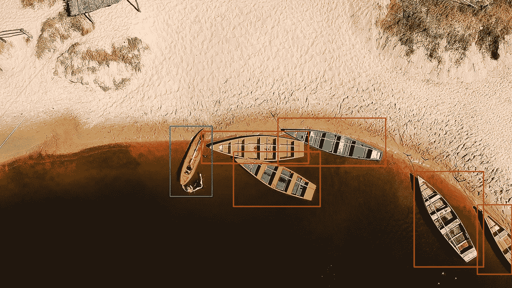
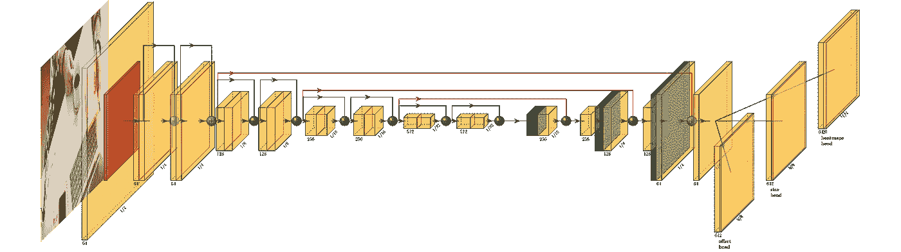
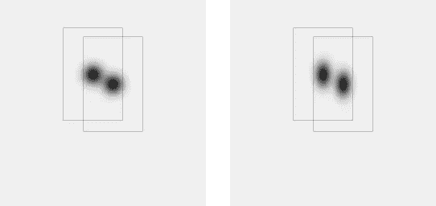
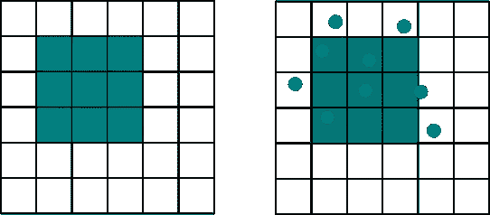

# 物体检测的新方法

> 原文：<https://towardsdatascience.com/new-approaches-to-object-detection-f5cbc925e00e?source=collection_archive---------12----------------------->

## **center net(Objects as Points)简介，TTFNet 及其在 TensorFlow 2.2+中的实现。**

来源:pexels.com

我将从简单介绍不同的物体检测方法开始。在介绍了传统方法和新方法之后，您可以阅读 CenterNet 和 TTFNet 的最重要部分。两个模型中的许多想法是相似的，因此将一起介绍它们。我们实现了一个由两个网络启发的包。如果你有兴趣，请查看我们的 [GitHub](https://github.com/Ximilar-com/xcenternet) 。

需要深度学习和卷积神经网络(CNN)的基础知识。

# 传统方法

在计算机科学中，当我们遇到一个无解的难题时，我们会试图将其转化为一个我们知道其解的问题或者一个更简单的问题。所谓的两阶段检测模型就是很好的例子。在这种情况下，更简单的问题是图像分类或标记。(将给定图像放入一个类别或给给定图像分配标签)简单地说，我们可以将图像分成多个区域，然后对这些区域进行分类，对吗？是的……但是要花很多时间。因此，你需要聪明一点。使用这种方法的算法的一个例子是 [R-CNN](https://arxiv.org/abs/1311.2524) (2014)。后来演变成[快速 R-CNN](https://arxiv.org/abs/1504.08083) (2015)甚至更快的 [R-CNN](https://arxiv.org/abs/1506.01497) (2016)。

尽管这些模型的性能相当好，但研究人员显然在问自己，这个过程是否可以变得简单，从而更有效。在一个阶段，没有区域提案。这个问题的一个可能答案是[YOLO——你只看一次](https://arxiv.org/abs/1506.02640) (2015)。现在是第四版 (2020)。或 [SSD —单次多盒探测器](https://medium.com/r?url=https%3A%2F%2Farxiv.org%2Fabs%2F1512.02325) (2015)。最后，还应提及 RetinaNet (2017 年)，特别是因为它曾被用于引入物体检测的焦点损失，这是现在经常使用的方法。

# 新方法

近年来，另一个想法越来越受欢迎。物体可以被转换成一组点。并且检测任务可以被认为是关键点估计问题。这种方法在 [CornerNet:将对象检测为成对关键点](https://arxiv.org/abs/1808.01244)中有所介绍。顾名思义，一个对象被表示为一对关键点，左上角和右下角。

在介绍 CenterNet 的 [Objects as Points](https://arxiv.org/abs/1904.07850) 论文中探讨了类似的想法。在那里，我们使用热图检测包围盒的中心点。使用回归直接预测诸如边界框大小的其他属性。

来源:pexels.com

这种方法的缺点是训练速度较慢。为了解决这个问题，提出了 TTFNet(训练时间友好网络)。它遵循相同的基本思想，因此我们决定在一个[包](https://github.com/Ximilar-com/xcenternet)中实现来自两个网络的思想。

# 神经网络布局

让我们开始吧！我将从头开始，向您介绍网络布局。然后，将讨论重要的单个部分，主要是热图和不同的损失函数。

我们可以使用专门为此类任务设计的网络。例如[沙漏网络](https://arxiv.org/abs/1603.06937)。或者，正如我们已经决定要做的，选择一个标准的图像分类 CNN，并根据我们的需要进行修改。我们选择测试 ResNet (18，50)和 EfficientNet (b0，b1，b2)。

在所有标准的迁移学习任务中，我们放弃了顶部的密集层。但是留在顶部的层甚至与我们需要的输出相差甚远。因此，一些上采样是必要的。除此之外，来自较低层的连接提高了性能。当我们在网络的末端有一个正确大小的层时，我们可以将它“分割”成所需数量的头。

使用 ResNet18 简化 CenterNet 的可视化，使用上采样和连接。(黄色:卷积层，红色:最大池化，蓝色:上采样。)

为了让网络更快，热图的一边正好是输入图像的 1/4。我们每节课都有一张热图。然后，CenterNet 中有另外两个头(用于基本的对象检测)，TTFNet 中有一个头。

对于**中心网**，有

*   一个尺寸头，包含一个边框的**宽度和**高度
*   偏移头，包含使用下采样热图时产生的中心的 x 和 y 偏移。

两者都只有两个过滤器——在热图的任何给定点都可能只有一个对象。如果您对一个对象的其他属性感兴趣，可以添加更多的头。

在 **TTFNet** 中，只有一个带有**四个**滤镜的额外云台来计算物体的尺寸——**到侧面**的距离。

## 热图

那么，热图是什么样子的呢？它是一个填充了从 0.0 到 1.0 的值的矩阵。这种地图上的峰表明某个物体的存在。

下面，你会看到一些生成的训练热图。只有一个点正好是 1.0。在这一点上，概率正在慢慢消失。

CenterNet(左)和 TTFNet(右)的热图。

## 可变形卷积

网络的上采样部分可以通过多种方式实现。我们已经向您展示了级联、上采样和标准卷积层的简单方法。为了提高性能，使用了可变形卷积。

毫无疑问，卷积神经网络给深度学习带来了一场伟大的革命。它们使我们能够提取从完全连接的层中很难得到的特征。再加上另一项布局改进，我们的网络可能会变得非常深入。尽管如此，基本思想还是一样的。特别地，过滤器的形状总是矩形的。可变形回旋正试图对此进行改进。它们学习到标准网格的偏移，并用这个“变形的”内核执行卷积。

标准与可变形卷积值的选择。船方不负担装货费用

不幸的是，可变形卷积层尚未在 TensorFlow 和 [TensorFlow 插件](https://www.tensorflow.org/addons) (TFA)中实现。我们正在使用[TFA](https://github.com/smallsunsun1/addons/tree/feature/deformable_ops)的一个分支，支持可变形 Conv2d，希望它能很快被合并。(参见拉动请求 [1129](https://github.com/tensorflow/addons/pull/1129) 。)

# 损失函数

现在，当我们有了网络布局和输出的样子，只有一个关键的东西不见了。损失函数。

## 焦点损失

热图有一个问题——它们非常稀疏。大多数情况下，没有检测到(零)，只是偶尔我们会看到一个物体(一个物体，周围的值递减)。在这种情况下，标准的度量标准不太适用。幸运的是，有一个解决方案——一个[焦损失](https://arxiv.org/abs/1708.02002)。CenteNet 和 TTFNet 都使用它。

## 基于并集交集的损失(IoU)

为了优化边界框的大小，中心网使用 L1 损失。它是真实边界框坐标和预测边界框坐标之差的简单总和。这似乎是合理的，但另一方面，我们并不经常使用它进行评估。我们使用 IoU 指标——并集上的交集。因此，当我们对改进这个指标感兴趣时，为什么不把它也用于优化呢？我们可以从 1 中减去借据的价值，把它变成亏损。还是没有？

可惜，如果没有交集，欠条就是零。因此，在这种情况下，损失总是 1。提出了两种基于 IoU 的损失函数。[TTF net 中使用的联合损耗上的广义交集](https://giou.stanford.edu/)解决了这个问题。 [Distance-IoU Loss](https://arxiv.org/abs/1911.08287) 还关注于在函数中添加一个距离信息，换句话说，我们离边界框的中心有多远。

# 最后的想法

你可以在 [GitHub](https://github.com/Ximilar-com/xcenternet) 上找到我们的实现。我要感谢 [*Michal Lukac*](https://github.com/Cospel) 与我合作这个项目，感谢 [*Ximilar*](https://www.ximilar.com/) 允许我们开源它。如果你想尝试没有任何编码的模型，请查看[这篇关于](https://www.ximilar.com/how-to-train-an-object-detection-model-with-one-click/) [Ximilar App](https://app.ximilar.com) 中物体检测的博文。