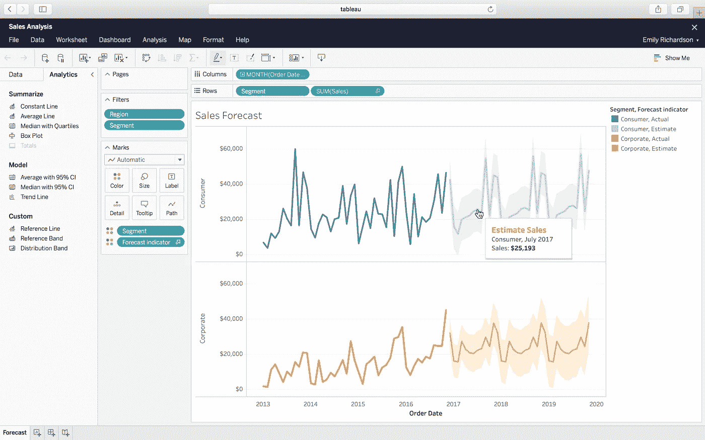

# 如何打入数据科学

> 原文：<https://towardsdatascience.com/new-data-science-f4eeee38d8f6?source=collection_archive---------17----------------------->

## 今年，我完成了一个训练营，并立即找到了一份深度学习的工作。如果我必须回去自学所有的东西，以下是我将学习的内容。

照片由[凯罗尔·斯特法斯基](https://unsplash.com/photos/rpMRy2L68ds)在 [Unsplash](https://unsplash.com/photos/rpMRy2L68ds) 上拍摄

**更新—加入脸书小组:**

 [## 闯入数据科学

### 一个分享数据科学和机器学习资源的组织。一月-概览二月-统计三月…

www.facebook.com](https://www.facebook.com/groups/breakingintodatascience) 

当谈到在线学习数据科学时，这些简历代表了我在过去三年培训 [Python](#2d65) 、[分析](#04d5)和[生产](#2f18)机器学习模型中遇到的最好的、大部分免费的资源。一个数据科学家应该是一个伟大的程序员，一个体面的分析师，一个相当好的工程师。[你还需要对统计学有坚实的理解——为此，有 ESL](https://web.stanford.edu/~hastie/Papers/ESLII.pdf) 。

要了解其他一切，让我们开始吧。

***免责声明:*** *本帖不以任何方式赞助，也不代表除本人以外任何人的观点。如果这些建议对你不起作用，就这么说吧。*

Python 已经迅速成长为机器学习的通用语言。它超过了 R，为科学计算提供了丰富的软件包。数据科学家必须是熟练的 Python 程序员。

除了拥有良好的编码能力，期望数据科学家拥有一些核心分析技能也是合理的，包括数据可视化。我提供了一些关于流行的第三方工具 Tableau 的技巧，用于拖放分析。数据科学家应该能够自如地交流他们的见解，有时会使用可视化工具。

最后，要做到真正的全栈，数据科学家应该熟悉从原型到生产模型的所有步骤。我喜欢运营指南中的这句话:“将模型投入生产是模型旅程的开始，而不是结束。”数据科学家应该知道生产一个模型需要什么。

# 🐍学习 Python

## 为编码开发肌肉记忆

Codecademy 是我告诉人们在进入数据科学之前学习 Python、命令行和 Git 的第一个地方。该平台的简单界面可以帮助你练习编码，直到让计算机做你想做的事情不再是困难的部分——这释放了大脑空间，以专注于与实际数据科学相关的挑战。不免费，但值得！)

 [## 学习 Python 3 | Codecademy

### 学习世界上最流行的编程语言的最新和最棒的版本！

www.codecademy.com](https://www.codecademy.com/learn/learn-python-3) 

## 涵盖数据科学的要点

Flatiron School 是我进行数据科学训练营的神奇机构，它提供完全免费的在线迷你课程。很有帮助。

 [## 学习编码、数据科学和网络安全分析

### 一点也不。虽然取得进展，在我们的免费课程是最好的方式，以加强您的申请，我们的全日制…

flatironschool.com](https://flatironschool.com/free-courses/data-science-bootcamp-prep) 

## 适应机器学习

凯蒂(无与伦比的，现在不幸倒闭的，[线性离题播客](http://lineardigressions.com/))和塞巴斯蒂安(T4 胜利自动驾驶汽车)提供了一个真正友好的机器学习概述。

 [## 机器学习课程介绍| Udacity

### 机器学习是当今数据分析领域最令人兴奋的职业的头等舱门票。作为数据源…

www.udacity.com](https://www.udacity.com/course/intro-to-machine-learning--ud120) 

## 发展计算机科学基础

埃里克·格里姆森有点像你那严厉而聪明的叔叔——他正从十几台不再工作的笔记本电脑中收集部件来建造一台量子计算机。他的经典课程是学习 CS 最佳实践同时加深您的 Python 知识的好方法。

 [## 计算机科学和使用 Python 编程简介

### 麻省理工学院 edX 6.00.1x

courses.edx.org](https://courses.edx.org/courses/course-v1:MITx+6.00.1x+2T2017_2/course/) 

## 尝试一个样本数据科学项目

以下是让你开始的几个想法:

 [## 演练:在 Python 中映射 GIS 数据

### 通过 GeoPandas DataFrames 和 Google Colab 提高您对地理空间信息的理解

towardsdatascience.com](/walkthrough-mapping-gis-data-in-python-92c77cd2b87a)  [## 开始使用 Spotify 的 API & Spotipy

### 《数据科学家快速入门指南》,指导如何浏览 Spotify 的 Web API 并使用 Spotipy Python 访问数据…

medium.com](https://medium.com/@maxtingle/getting-started-with-spotifys-api-spotipy-197c3dc6353b)  [## 12 小时 ML 挑战

### 如何使用 Streamlit 和 DevOps 工具构建和部署 ML 应用程序

towardsdatascience.com](/build-full-stack-ml-12-hours-50c310fedd51) 

## 通过对数据科学感到兴奋来更快地学习

选择你有激情的事情，深入钻研。首先，看看这个常规资源列表——博客、YouTube 频道和播客。您还可以在 [LinkedIn](http://www.linkedin.com/in/nicole-janeway-bills) 和 [Twitter](https://twitter.com/Nicole_Janeway) 上关注我，了解我最喜欢的学习资源的实时更新。

 [## 2020 年增强数据科学学习的资源

### 通过这个有用的期刊、视频和讲座的集合，推进你对机器学习的理解。

towardsdatascience.com](/supercharge-data-science-5bb7376d8572) 

# 🎨学习数据，即

Tableau 工作表，尺寸为蓝色，度量为绿色。最左侧的侧栏显示了用于基本汇总统计的现成分析工具。通过[画面](https://www.tableau.com/products/what-is-tableau)。

当你的数据需要打扮的时候， [Tableau](https://public.tableau.com/en-us/s/) 是一个防呆风格的服务。它提供了一个时尚的拖放式数据分析界面，通过本机集成从 CSV、JSON 文件、Google Sheets、SQL 数据库以及烘干机的后角(你不可避免地会忘记带袜子)中提取数据。

数据被自动分为维度(定性的)和度量(定量的)——并被假定为可以制作图表。当然，如果还有一些数据清理步骤要做，Tableau 也可以处理脏衣服。例如，它支持重新格式化数据类型和将数据从宽格式转换为高格式。

准备制作图表时，只需按住 ctrl 键并单击感兴趣的功能和“演示”框中的默认选项。这种交互的简单性使得即使是设计能力最差的数据科学家也能轻松地将数据整理成可展示的格式。Tableau 会把你的数据装进西装和领带里，然后发送到会议室。

遵循这些提示，让你的数据可视化能力从“好”变得“好”。

## 从制图员大师那里获得灵感

在我作为四大公司的商业分析师的整个时间里，这三个博客是我如何创建一个好看的、功能性的 Tableau 仪表板的指南。

 [## Tableau 博客

### Tableau 公共团队的定期派遣。

public.tableau.com](https://public.tableau.com/en-us/s/blog)  [## 来自数据专家的分析技巧和见解| Evolytics 博客

### Evolytics 分享操作方法文章、分析技巧、专家建议、行业见解和新闻。了解有关及时的更多信息…

evolytics.com](https://evolytics.com/blog/?blog-search=tableau)  [## Tableau 档案|网络

### 点菜吧！我们为您准备了又一个月的最新热门数据资源。在这篇博客综述中，…

interworks.com](https://interworks.com/blog/channel/tableau/) 

## 请记住这 4 条准则

#1 —床单是艺术家的画布，仪表板是画廊的墙壁。工作表用于创建艺术作品(*咳咳*，图表)，然后您将这些艺术作品连同任何格式元素一起放置到仪表板上([使用带有容器的平铺布局](https://interworks.com/blog/tspaulding/2013/08/07/understanding-layout-containers-tableau/) —稍后将详细介绍)。

# 2-为了节省时间，为尺寸和测量设置默认属性。这将为颜色、小数点位数、排序顺序等提供统一的方法。并防止您在每次使用给定字段时不得不摆弄这些设置。

# 3——按照这些思路，使用总体的[格式工作簿](https://help.tableau.com/current/pro/desktop/en-us/formatting_workbook.htm)和[格式仪表板](https://help.tableau.com/current/pro/desktop/en-us/dashboards_organize_floatingandtiled.htm)选项，而不是一次性的格式调整。

# 4——避免将浮动对象放入仪表盘。一旦你有两个或三个以上的图表要处理，拖动图表就变得令人头疼。你可以让你的图例成为浮动的物体，但是要远离这个“长切口”

取而代之的是使用[平铺布局](https://interworks.com/blog/tspaulding/2013/08/07/understanding-layout-containers-tableau/)，如果你改变了你的仪表板的尺寸，它会强制对象对齐并自动调整大小。从长远来看更快更简单。

## 开始使用您的第一个仪表板

总之，Tableau 平台比手指画更容易使用，所以如果你准备好开始使用， [Tableau Public](https://public.tableau.com/en-us/s/) 是一个免费版本，它将允许你创建可公开访问的可视化效果——就像这个[我在网上搜集了一些来自华盛顿 DC 分区办公室](/data-science-of-evictions-874a41f3cc36#975a)的有问题的豁免开发项目的信息后整理出来的——并将它们共享到云上。

准备向高管们展示财务状况。由 [Lisa Fotios](https://www.pexels.com/photo/both-hands-stained-with-paints-1161542/) 在[像素](https://www.pexels.com/photo/both-hands-stained-with-paints-1161542/)上拍摄的照片。

在调查了来自当地社区的数据后，另一个很好的示例项目是提取您的支票账户数据，并假装您正在将其提交给 CEO 进行分析。

*阅读有关数据科学家和数据分析师之间的区别的更多信息:*

 [## 数据分析师、数据科学家和机器学习工程师有什么区别？

### 以田径运动会为例，探究这些常见职位之间的区别。

towardsdatascience.com](/data-analyst-vs-data-scientist-2534fc1057c3) 

现在，如果你*不那么秘密地*热爱数据 viz，并且需要找到更多的时间投入到你的模型的生产中(🙋‍♀️)，让我们继续…

# 🦁学习开发

你的机器学习模型的好坏取决于它在现实世界中对数据的预测和分类。通过至少获得对 DevOps(负责集成开发和 IT 的领域)的基本理解，给你的模型一个战斗的机会。

## 重新思考数据科学是什么或不是什么

在这篇精彩的文章中，[深度学习的英雄](/meet-the-heroes-of-deep-learning-648c9083ef10#a135) Andrej Karpathy 认为，机器学习模型是软件中的新热点——数据不是遵循如果-那么规则，而是它们的代码库。

 [## 软件 2.0

### 我有时看到人们将神经网络称为“你的机器学习工具箱中的另一个工具”。他们有一些…

medium.com](https://medium.com/@karpathy/software-2-0-a64152b37c35) 

## 了解这在企业中是如何工作的

这部巧妙的小说虚构了[**devo PS 手册**](https://itrevolution.com/book/the-devops-handbook/) *并且具有惊人的可读性。(*不是免费的——但是如果你买了一份，给你的同事，希望他们会对生产你的模型充满热情*)。*

* [## 吉恩·金(凤凰计划的作者)的独角兽计划

### 这是一个关于反叛的开发者和商业领袖与时间赛跑的故事，在一个…

itrevolution.com](https://itrevolution.com/the-unicorn-project/) 

## 向外界介绍你的机器学习模型

查看这篇关于如何使用 [Streamlit](https://www.streamlit.io/) 进行部署和数据探索的文章。如果我没有提到 [Docker](https://docs.docker.com/get-started/overview/) 和 [Kubernetes](https://kubernetes.io/docs/concepts/overview/what-is-kubernetes/) 作为生产化的企业级工具，那我就失职了。

 [## 最有用的 ML 工具 2020

### 每个懒惰的全栈数据科学家都应该使用的 5 套工具

towardsdatascience.com](/the-most-useful-ml-tools-2020-e41b54061c58) 

**如果你喜欢阅读这篇文章**，请在[媒体](https://medium.com/@nicolejaneway)、 [LinkedIn](http://www.linkedin.com/in/nicole-janeway-bills) 、 [YouTube](https://www.youtube.com/channel/UCO6JE24WY82TKabcGI8mA0Q) 和 [Twitter](https://twitter.com/Nicole_Janeway) 上关注我，了解更多提升你的数据科学技能的想法。

当“ [**资源在 2020 年**](https://page.co/ahje9p) 的最后几个月为您的数据科学增压”发布时，注册即可获得通知。

# 🤸‍♀️其他有用的话题

 [## 像我五岁一样解释计算机科学

### 了解互联网，编程，机器学习和其他计算机科学的基础知识，通过清晰和…

medium.com](https://medium.com/coderbyte/eli5-computer-science-f8dfd7910311)  [## 如何不费吹灰之力通过 AWS 云从业者认证

### 预测:多云，第一次尝试有 100%的机会通过。

medium.com](https://medium.com/@nicolejaneway/how-to-ace-the-aws-cloud-practitioner-certification-with-minimal-effort-39f10f43146)  [## 数据仓库综合指南

### 了解数据仓库作为分析就绪数据集的主存储库的角色。

towardsdatascience.com](/data-warehouse-68ec63eecf78)*