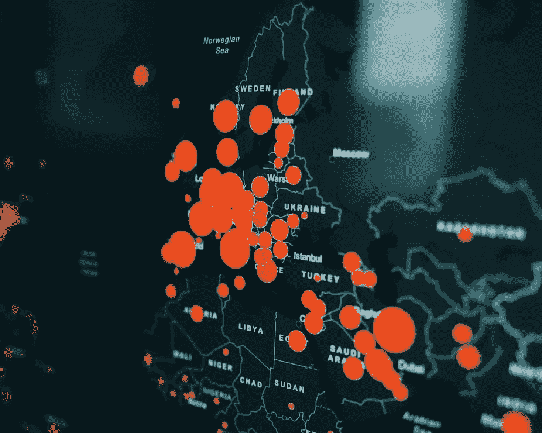
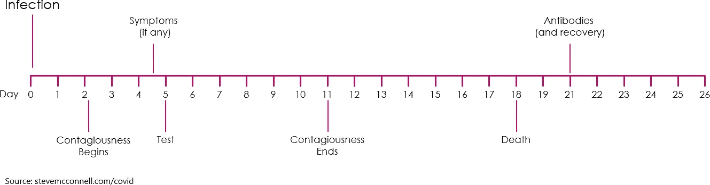
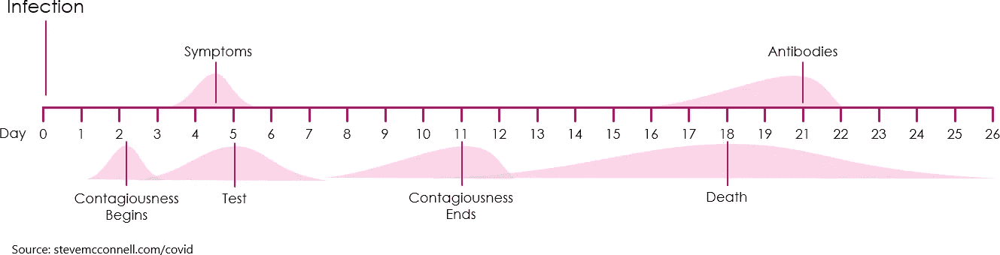
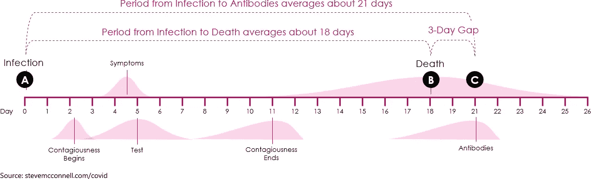
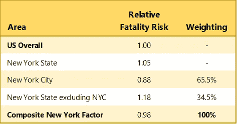
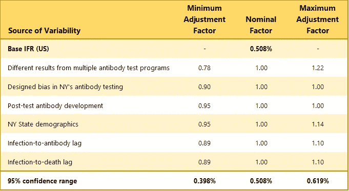
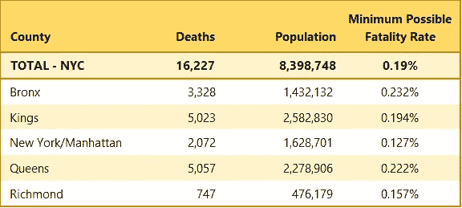
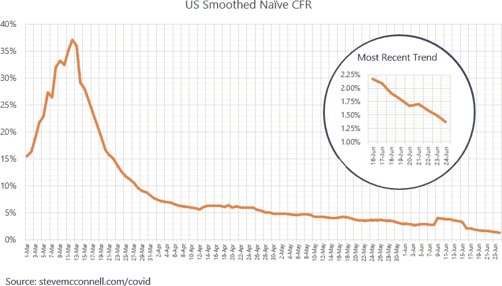

# 新数据显示新冠肺炎死亡率较低

> 原文：<https://towardsdatascience.com/new-data-shows-a-lower-covid-19-fatality-rate-1d69361a50af?source=collection_archive---------36----------------------->

## 新的数据和分析提供了更多的准确性——它显示的死亡率是原始报告的十分之一

1 月和 2 月新冠肺炎的经验表明，该疾病的总死亡率在 3.5%至 5%之间。如此高的死亡风险是可怕的，整个世界都跑去躲避。

三月， [*纽约时报*](https://www.nytimes.com/2020/03/16/us/coronavirus-fatality-rate-white-house.html) 描述了一份报告，称新冠肺炎可能在美国杀死多达 220 万人。这份早期报告启动了我们当前的许多政策。

自 3 月以来，我们已经积累了大量关于该病毒的经验和更多的数据。早期的推测现在可以被明智的分析所取代。

在本文中，我将解释多个更新的数据来源如何显示新冠肺炎的总体死亡率大约是最初声称的十分之一——在 0.4%到 0.6%之间，可能接近 0.5%。

> 如果你研究图 4 中简单的 CFR 曲线，很明显为什么一些早期报道的死亡率如此之高。根据具体报告的时间，一个人可以察觉到几乎任何高达 35%的死亡率。

照片来自[粘土堤](https://unsplash.com/@claybanks)上[的 Unsplash](https://unsplash.com/)

## 第一步:了解疾病的一般进展

我们现在对新冠肺炎发展的时间线的了解比 3 月份时更多。了解疾病的时间线使我们能够分析数据并得出更准确的结论。

用数学术语来说，这种疾病的一般发展过程如图 1 所示。首先，一个人被感染了。2.3 天后，此人具有传染性。4.5 天后，患者出现症状。5 天后，这个人将接受测试。在第 11 天，他们仍然生病，但不再传染。如果他们会死，他们会在 18 天后死去。否则，它们会在第 21 天恢复并产生抗体。

图 1-新冠肺炎的一般级数，基于纯数学平均时间值。

当然，每个时间段都有范围、概率和置信限。都没有我刚才描述的那么具体。真正的进展看起来更像图 2 所示，其中粉红色阴影区域代表时间线的概率。

图 2——新冠肺炎的总体发展，显示了时间段范围。平均值都是基于数据。症状和传染性的范围基于数据；其他范围是概念上的，并且是为了解释的目的而显示的。

传染性始于感染后 1 至 3 天。症状在 4-5 天左右开始。测试平均在 5 天后进行。有时在症状出现之前就进行(例如，如果一个人知道自己接触了感染者)。有时直到病人住院后才进行测试。有些人死得很快，有些人活得更久。有迹象表明传染性和抗体发展是非正态分布(它们不是钟形曲线)。

在这些范围内存在可变性的事实不会改变我们使用疾病进展数据得出结论的能力。如图 3 所示，我们知道，出于统计目的，在“A”点感染的人，要么在“B”点 18 天后死亡，要么在“C”点 21 天后康复并产生抗体。

图 3

知道了这个时间线，我们就有了计算总死亡率的基础——如果我们能找到 A 点、B 点和 c 点的数据。

## 根据纽约州的抗体检测计算死亡风险

由于在纽约州的一个周末进行了广泛的抗体测试，我们有了“C”点的可靠数据，即截至 2020 年 4 月 19 日，纽约州 13.9%的人口产生了抗体。我们知道这些人平均至少在 21 天前，即 3 月 29 日被感染。

为了使这个数字有用，我们需要把它与 3 月 29 日感染但后来死亡的人数放在一起。

根据图 3，我们需要查看 3 月 29 日之后 18 天的死亡人数，以便对抗体和死亡人数进行比较。18 天后是 4 月 16 日。纽约州报告的死亡人数为 12，192 人。

> 问题不在于是否存在可变性。问题是，“这种可变性对死亡率的计算有多大影响？”

这告诉我们，在 2020 年 3 月 29 日或之前感染新冠肺炎病毒的 271.6 万纽约州居民中，0.449%的人死亡。因此，对于纽约州的人口，新冠肺炎的总死亡率约为 0.449%(在“平均置信水平”)。这有时被称为 *IFR* ，或*感染致死率*，但该术语在许多已发表的文章中使用不一致，因此在本文中我使用术语*致死率*。

这种分析的精度水平并不能证明显示三位小数的结果是正确的，但是，为了那些想了解计算结果的人，我在这篇文章中使用了这种精度水平。

在最初的抗体测试项目后，纽约州继续进行抗体测试，并公布了另外两组测试结果。使用与上述相同的计算，这些测试结果意味着死亡率为 0.520%和 0.686%。

在这些后来的测试中，关于测试周期和人口抽样方法的细节较少，这使得死亡率比第一组测试结果更不确定。我没有完全排除后面的这些结果，而是计算了一个加权名义值，其中第一组结果的权重比第二组结果的权重大。这产生了 0.500%的名义死亡率。(我在文章末尾的注释部分提供了关于这个计算的注释。)

如果排除这些结果，名义利率仍为 0.449%，两个数字之间 11%的差异将贯穿本文的其余计算。

## 计算美国总体感染死亡率

事实证明，新冠肺炎对年龄高度敏感——它对老年人的致命性明显高于年轻人。纽约州的人口平均年龄略高于美国人口。根据该病毒特定年龄的死亡率，以及纽约州与美国整体的人口统计数据，纽约州的死亡率应该是美国整体的 1.05 倍。

然而，在纽约州，病毒一直集中在纽约市，纽约市的平均人口比美国整体人口年轻得多。再次基于特定年龄的死亡率和人口统计数据，纽约市的死亡率应该是美国整体死亡率的 0.88 倍。

为了调和这些对立的观点，我首先对纽约市的年龄进行了加权，然后根据每个地区死于新冠肺炎的人数对纽约州其他地区的年龄进行了加权。(我认为死亡比 PCR/病毒检测更能代表这两个地区的疾病流行程度，因为 PCR/病毒检测随着时间的推移一直不一致。)根据这一权重，纽约州的总人口比美国人口略年轻 0.98 倍。

详情如表 1 所示。

表 1

为了调整纽约与美国整体人口统计数据的差异，我将纽约州的死亡率除以 0.98(实际上是 0.984)，得出美国的死亡率为 0.508%。

这一死亡率明显低于疫情早期报道的 3.5-5%的死亡率。

> 根据上周五个区的死亡人数和纽约市的*总人口*，即使 100%的人被感染，死亡率也不会低于 0.19%。

## 死亡率的可变性

如果你在想，“所有这些都有相当多的假设，一些数据点肯定有一些与之相关的可变性”，那么你是对的。

但问题不在于是否存在可变性。问题是，“*这种可变性对死亡率的计算有多大的影响？”我考虑了七个可能的可变性领域。*

**纽约州多重抗体检测**。正如我先前所述，纽约报告了三组抗体检测结果。这些结果的差异表明，总死亡率可能从 0.78 倍的标称值变化到 1.22 倍的标称值。

**抗体检测中的偏倚**。抗体检测的公开讨论集中在检测个体的准确性上。测试大组的精度考虑是不同的。只要我们知道测试的“敏感性”和“特异性”，我们就可以用数学方法解释测试中的不准确性。在纽约州的测试中，[官员说](https://www.nytimes.com/2020/04/23/nyregion/coronavirus-antibodies-test-ny.html)测试已经被校准，“为了避免产生假阴性——漏掉一些可能有抗体的人。”这表明他们的测试可能低估了感染人数。我对这个因素使用了 0.9 倍标称值到 1.0 倍标称值的可变性。

**额外的抗体开发**。发现人们需要 21 天来产生抗体的研究特别发现，不是 100%的人在 21 天后产生抗体，而是 95%的人产生了抗体。在名义死亡率中，我没有考虑抗体阳性人数比检测阳性人数多 5%的情况。根据是否包括在内，美国的死亡率可以从名义值的 0.95 倍调整到 1.0 倍。

**纽约州人口统计**。我可以只使用纽约市或纽约州的人口统计数据。我可以用 PCR 检测来衡量而不是死亡。基于我如何调整纽约州的人口统计数据与美国整体人口统计数据的差异，美国的总体死亡率可以通过 0.95 至 1.14 倍的名义系数进行调整。

**感染到抗体滞后。**如果 21 天的研究平均值不正确，则会更改相关的感染日期。考虑到 3 月 27 日至 3 月 31 日的感染日期，美国的死亡率可以通过 0.89 至 1.10 倍的系数进行调整。

**感染致死滞后。**如果普通人的死亡时间长于或短于 18 天，那么相关的感染日期也会改变。计算方法与抗体滞后的可变性相同。它产生从 3 月 27 日到 3 月 31 日的相同日期范围，以及对美国死亡率 0.89x 到 1.10x 的相同调整范围。

**死因**。关于新冠肺炎死亡人数是被高估了还是低估了，已经有了很多讨论。有很多强烈的感觉，但很少有数据。我没有考虑到这个因素的调整。

表 2 总结了这些可变性来源及其对死亡率计算的影响。

表 2

当结合起来时，这些可变性的来源产生 0.398%到 0.619%的 95%置信范围。

正如我前面提到的，包含三个小数位是为了让对计算感兴趣的人知道。分析和数据的潜在准确性实际上只证明了 0.4%到 0.6%的粗略范围。

对于那些对统计数据感兴趣的人，我在*注释*部分添加了额外的注释。

## 纽约市人口和死亡的死亡率下限

大多数关于病死率的错误推测都过高，但也有少数过低，包括一些断言，病死率可能接近流感，即 0.1%左右。

可能的死亡率下限来自对纽约市死亡人数的分析。根据上周五个区的死亡人数和纽约市的*总人口*，即使 100%的人被感染，死亡率也不会低于 0.19%。如果只有 50%被感染，病死率不可能低于 0.38%。

表 3 提供了纽约市五个区和整个纽约市的死亡人数、人口和最低可能死亡率的具体情况。

表 3

## 最近美国阳性检测和死亡数据的死亡率上限

美国最近的测试和死亡数据为估计可能的死亡率上限提供了基础。

*初始 CFR* 的计算方法是将某一天的死亡人数除以 13 天前的阳性检测人数。这 13 天来自图 1-3 所示的时间表。

*初始 CFR* 中的 *CFR* 代表病死率。之所以称之为*天真* CFR，是因为我们并不真正知道有多少真实病例存在，以便计算真实的病死率。我们使用阳性测试的数量作为病例数量的代表*但是这个代表并不十分准确。因此，我们将结果计算称为*朴素* CFR。*

在疫情的最初几个月，测试是有限的。只有病情最严重的人才被允许接受检测，因此阳性检测的数量被人为地压低，死亡率被人为地抬高。事实上，3 月份的初始 CFR 高达 35%，如图 4 所示。这种明显的高死亡率并不是由于疾病本身的致命性，而是由于当时进行的测试数量有限。

图 4。图表右侧的增加是由于新泽西增加了 1800 例被认为是来自新冠肺炎的死亡病例，全部发生在 6 月 25 日，而不是将死亡人数分配到实际发生的日期。

随着测试变得更加全面，初始 CFR 稳步下降。从图中可以看到，天真的 CFR 现在已经降到了 1.5%。如果我们目前对所有感染进行 100%的检测，这意味着死亡率的上限为 1.5%。

然而，我认为没有人相信目前的检测可以捕获多达 100%的感染，所以真正的死亡率很可能低于 1.5%。如果你认为我们目前正在检测一半的感染，那么病死率将是初始 CFR 的一半，即 0.75%。如果你认为我们目前正在测试三分之一的感染，那么病死率将是初始 CFR 的三分之一，即 0.5%。

0.5%的致死率与纽约抗体研究计算的致死率一致，我们目前正在测试三分之一感染的想法似乎是合理的。

包括表 2 中显示的可变性使我得出结论:美国新冠肺炎的总死亡率在 0.4%和 0.6%之间，可能接近 0.5%。

## 底线:更好的数据和提高的准确性的好处

如果你研究一下简单的 CFR 曲线，你就会明白为什么一些早期报道的死亡率如此之高。根据具体报告的时间，一个人可以察觉到几乎任何高达 35%的死亡率。

新冠肺炎致死率的底线是它比流感致命 3-4 倍。这是一种严重的疾病，但是我们现在知道它远没有致命到杀死 220 万人的地步,《纽约时报》三月份报道。我们现在可以计算出，要达到这个死亡人数，需要有 4.4 亿人受到感染。这比美国人口还多 1 亿。

至少有一件事我们不用担心。

*这是关于新冠肺炎死亡率的 5 集系列报道的第 1 集:*

*   [*第一部分*](/new-data-shows-a-lower-covid-19-fatality-rate-1d69361a50af) *:为美国建立一个全面的基础 IFR*
*   [*第二部分*](/the-uncanny-consistency-of-covid-19-age-based-fatality-data-e2abe37b570) *:基于年龄的 IFRs*
*   *第 3 部分:基于人口统计的各州和各国 IFRs 的差异*
*   *第 4 部分:有和无共病的 IFRs*
*   *第 5 部分:按年龄和共病状况分列的 IFRs*

# 我的背景

20 年来，我一直专注于理解软件开发的数据分析，包括质量、生产率和评估。我从处理噪音数据、坏数据、不确定性和预测中学到的技术都适用于新冠肺炎。

# 感谢

感谢[詹姆斯·D·科顿](https://www.linkedin.com/in/james-d-cotton-36032715/)、博士、[布莱恩·唐纳森](https://www.linkedin.com/in/briandonaldsoncalgary/)和[布拉德·波特](https://www.linkedin.com/in/brad-porter-1a989/)对本文早期草稿的极其有用的评论。

# 更多详情请访问新冠肺炎信息网站

更多美国和州级数据，请查看我的新冠肺炎信息网站。

# 笔记

## 关于参考文献的注释

新冠肺炎传染的时机[这里](https://www.nature.com/articles/s41591-020-0869-5)。

纽约抗体检测时间表第一组抗体检测[此处](https://www.democratandchronicle.com/story/news/politics/albany/2020/04/23/coronavirus-new-york-millions-residents-may-have-been-infected-antibody-test/3011848001/)。

纽约州三套抗体检测总结[这里](https://www.amny.com/coronavirus/latest-antibody-study-report-shows-up-to-20-of-nyc-residents-had-covid-19/)。

测试[的时间延迟](https://medium.com/@tomaspueyo/coronavirus-how-to-do-testing-and-contact-tracing-bde85b64072e)。

从感染到出现症状的时间间隔[这里](https://www.health.harvard.edu/diseases-and-conditions/coronavirus-resource-center#q4)。

产生抗体的时滞[这里](https://directorsblog.nih.gov/2020/05/07/study-finds-nearly-everyone-who-recovers-from-covid-19-makes-coronavirus-antibodies)。

每日各州死亡人数记录[此处](https://covidtracking.com/data/)。

纽约州各县的死亡人数[在这里](https://covid19tracker.health.ny.gov/views/NYS-COVID19-Tracker/NYSDOHCOVID-19Tracker-Fatalities?%3Aembed=yes&%3Atoolbar=no&%3Atabs=n)，各县的感染人数[在这里](https://covid19tracker.health.ny.gov/views/NYS-COVID19-Tracker/NYSDOHCOVID-19Tracker-TableView?%3Aembed=yes&%3Atoolbar=no&%3Atabs=n)。

## 关于置信区间计算的注记

我没有为每个可变性来源创建概率分布。

在考虑纽约州抗体测试结果的范围时，我根据六组结果计算了 95%的置信范围(第一组 4 次，第二组 1 次，第三组 1 次)。这产生了 0.393%至 0.608%的 95%置信区间。这些数字除以 0.984，从纽约州数字转换为美国数字。

对于表 2 所示的总体置信度范围，我通过取每个范围下限的最小调整因子与每个范围上限的最大调整因子的乘积来近似 6 ∂范围。这种方法得出调整系数为 0.504 至 1.659 的 6 ∂范围。我将这些乘数应用于 0.508%的标称(平均)值，这产生了 0.257%至 0.844%的死亡率的 6 ∂范围。将该范围除以 6 得到 0.098%的估计∂。对于置信区间的计算，我使用 0.508%作为平均值，使用值 3 作为样本数，基于 3 组抗体测试结果。使用样本大小为 1 将产生 0.317%至 0.700%的 95%置信范围。