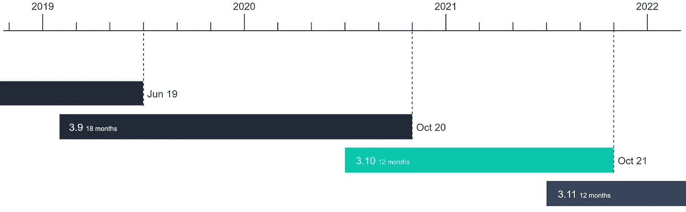
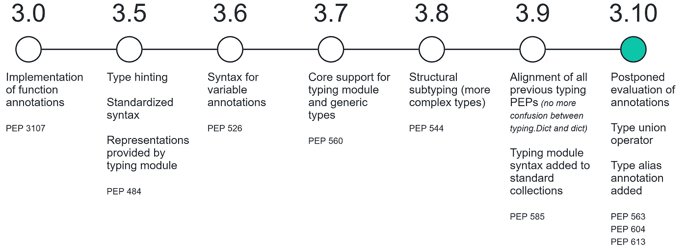
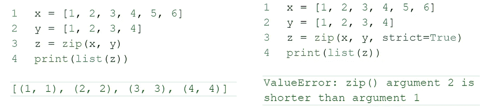
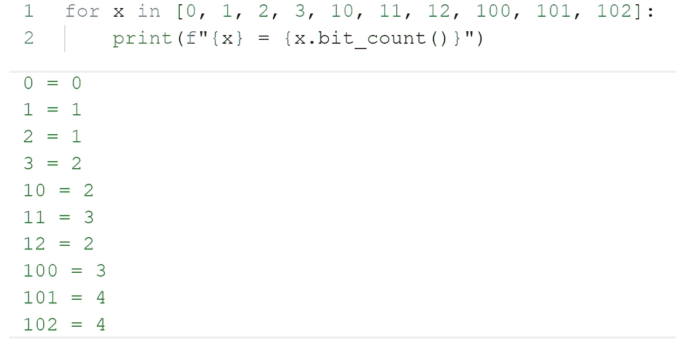
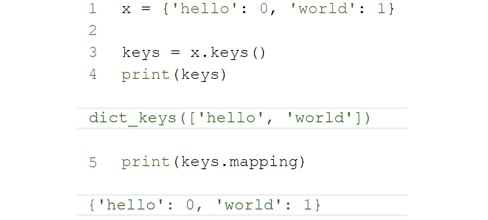

# Python 3.10 中的新功能

> 原文：<https://towardsdatascience.com/new-features-in-python-3-10-66ac05e62fc7?source=collection_archive---------3----------------------->

## 看看 Python 最新版本中包含的最佳特性


照片由[本·斯威特](https://unsplash.com/@benjaminsweet?utm_source=medium&utm_medium=referral)在 [Unsplash](https://unsplash.com?utm_source=medium&utm_medium=referral) 上拍摄

Python 3.10 的第二个 alpha 版本于 11 月初发布，通过它，我们可以一窥 Python 的未来。

一些令人兴奋的举措正在实施，这些举措可能会将未来的 Python 生态系统改变为更明确、更可读的代码——同时保持我们都知道和喜爱的易用性。



由于新的年度发布时间表[ [PEP 602](https://www.python.org/dev/peps/pep-0602/) ]，我们现在可以看到更短的开发窗口，这意味着我们可以在 2021 年 10 月预期的许多功能已经以某种形式出现，我们将涵盖迄今为止的所有新功能:

```
**Further Extensions to Type Annotations**
  - Postponed Evaluation of Annotations
  - Type Union Operator
  - TypeAlias Annotation**Why Typing is Important****New Methods and Behaviors
 ** - Equal Length Flag for zip()
  - Bit Count for Integers
  - Mapping for Dictionary Views
```

如果您更喜欢视频，我们在这里涵盖了本文中的所有内容:

**所有文章图片均由作者制作，除非另有说明。*

# 类型注释的进一步扩展

版本 3.9 引入了对 Python 中的类型提示和注释的大检修和清理。这看起来像是一个持续的趋势，在 3.10 中会进一步增加输入功能。



从 Python 3.0 到现在类型注释的变化时间表。

## 1.注释的延期评估

类型注释的计算总是在函数定义时执行，这意味着类型注释是以自顶向下的方式逐行计算的。

虽然这看起来合乎逻辑，但这样做有两个问题:

*   引用尚未定义的类型的类型提示(前向引用)不起作用，必须表示为字符串。我们将需要编写`"int"`而不是`int`(尽管这只适用于*自定义*，而不是*内置/预定义*类型)。
*   它降低了模块导入的速度，因为那时会执行类型提示。

因此，相反，注释将存储在`__annotations__`中，对它们的评估可以一起执行——允许前向引用并首先执行模块导入(减少初始化时间)。

## 2.类型联合运算符

3.10 引入了带有|操作符的条件逻辑。在注释数据类型时，我们可以将|用作 OR。例如，我们有一个预期为`int`或`float`的变量，我们把它写成`int | float`，就像这样:

```
def f(x: **int | float**) -> float:
    return x * 3.142f(1)  # pass
f(1.5)  # pass
f('str')  # linter will show annotation error
```

在 3.10 之前，等效的操作将使用`typing.Union`方法编写，就像`Union[int, float]`一样。

## 3.TypeAlias 批注

回到前向引用问题，避免前向引用的一个常见解决方案是将它们写成字符串。

然而，将类型写成字符串会在将这些类型赋给变量时产生问题——因为 Python 会假设我们的字符串文字类型注释只是一个字符串。

在我们通常使用类型注释的地方使用该类型注释变量将会返回一个错误。例如:

```
MyType = "ClassName"  # ClassName is our type annotation
def foo() -> MyType:
    ...
```

这里，我们试图使用`MyType`作为类型的*别名*，但是，`MyType`将被读取为字符串值——而不是类型别名。

只要在代码的后面定义了`ClassName`，这就是有效的。目前，这将抛出注释错误。

为了解决这个问题，增加了一个方法来显式地将`MyType`标识为类型别名:

```
**from typing_extensions import TypeAlias**MyType: **TypeAlias** = "ClassName"
def foo() -> MyType:
    ...**OR**MyType: **TypeAlias** = ClassName *# if we have defined ClassName already*
def foo() -> MyType:
    ...
```

# 为什么打字很重要

虽然这肯定不是一个巨大的、改变游戏规则的举动，但是看到 Python 开发者加倍努力增强类型化特性是非常酷的。

Python 的优势来自于它的易用性和没有陡峭的学习曲线。其中一个原因是我们的代码中不需要显式定义类型。

这可能看起来违反直觉，但是给开发人员*选项*来定义类型可以极大地增强代码库的可读性和可维护性。例如，从变形金刚库的[源代码](https://github.com/huggingface/transformers/blob/master/src/transformers/pipelines.py)中提取这些内容:

即使没有上下文，我们也可以阅读这些代码，并立即掌握我们应该期望将哪些数据提供给这些函数、类和方法，以及我们应该期望返回哪些数据类型。

在复杂的代码库(甚至是简单的代码库)中，类型注释可以极大地提高可读性。同时，不是每个人都想(或需要)使用它们——所以一个可选的、无异常的功能达到了完美的平衡。

这些变化表明了对 Python 的类型注释特性的承诺。我们最喜欢的库(和我们自己的代码)更加清晰，这可能会对 Python 生态系统产生有趣的长期影响。

# 新的方法和行为

除了新的类型变化，我们还对其他核心 Python 功能进行了一些更新和新特性。

## 邮政编码的等长标志

第一个是 PEP 618，它为`zip()`函数添加了一个可选的`strict`标志。如果我们设置了`strict=True`，如果`zip`的两个输入长度不相等，就会出现错误。



如果没有 **strict=True** 标志(左)，则不会产生错误，并且较长的列表会被截断以创建压缩生成器。当 **strict=True** 时，产生一个错误。

新的`strict`参数允许我们控制`zip`的行为，而不是盲目地截断不匹配的数据——这将使许多开发人员在未来某个时候不再头疼。

## 整数的位数

也被称为*总体计数*，这种新方法允许我们计算一个整数的二进制表示**中一的数量。我们写的都是`int.**bit_count()**`。**



我们只是返回代表每个整数的二进制值中的正位数:

```
0   = 00000000
1   = 00000001
2   = 00000010
3   = 00000011
10  = 00001010
11  = 00001011
12  = 00001100
100 = 01100100
101 = 01100101
102 = 01100110
```

## 字典视图的映射

三个字典方法`dict.keys()`、`dict.values()`和`dict.items()`都返回一个字典的不同*视图*。现在，每个视图对象都添加了一个`mapping`属性。



这个新属性是一个包装原始字典的`types.MappingProxyType`对象——如果我们在视图上调用它，我们将返回原始字典。

这就是目前的全部内容——虽然我们进入 3.10 的开发时间表才几个月，但是已经有很多有趣的变化了！

Python 的发展还在继续，看起来随着时间的推移，会有更多有趣的特性加入到这种语言中。

我希望你喜欢这篇文章。如果你想要更多，我已经开始在 [YouTube 这里](https://www.youtube.com/channel/UCv83tO5cePwHMt1952IVVHw)发布编程教程。或者如果你有任何问题、想法或建议——请通过推特或在下面的评论中告诉我。

感谢阅读！

如果您还在使用 Python 3.9，我在这里介绍了完整版本中的所有内容:

[](/python-3-9-9c2ce1332eb4) [## Python 3.9

### 有什么新的，下一步是什么？

towardsdatascience.com](/python-3-9-9c2ce1332eb4) 

## [🤖《变形金刚》课程 NLP 的 70%折扣](https://bit.ly/nlp-transformers)