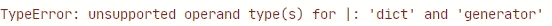
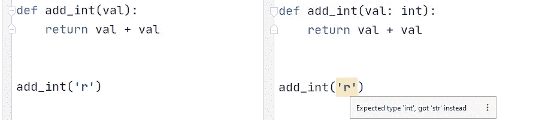
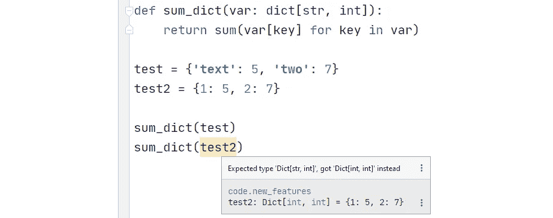

# Python 3.9 中的新功能

> 原文：<https://towardsdatascience.com/new-features-in-python39-2529765429fe?source=collection_archive---------1----------------------->

## 看看 Python 最新版本中包含的最佳特性


[Pablo Guerrero](https://unsplash.com/@pablothewarrior?utm_source=medium&utm_medium=referral) 在 [Unsplash](https://unsplash.com?utm_source=medium&utm_medium=referral) 上拍摄的照片

又到那个时候了，Python 的新版本迫在眉睫。现在是测试版(3.9.0b3)，我们很快就会看到 Python 3.9 的完整版本。

一些最新的特性令人难以置信地兴奋，在发布后看到它们被使用将是令人惊奇的。我们将讨论以下内容:

*   **字典联合运算符**
*   **类型提示**
*   两种新的弦乐方法
*   新的 Python 解析器——这非常酷

让我们先来看看这些新特性以及如何使用它们。

*(* [*意大利文*](https://medium.com/code-italia/novit%C3%A0-in-python-3-9-61fddf6bfef7) *)*

# 字典联盟

我最喜欢的新特性之一，语法简洁。如果我们有两个字典`a`和`b`需要合并，我们现在使用*联合操作符*。

我们有**合并**操作员`|`:

```
a = {1: **'a'**, 2: **'b'**, 3: **'c'**}
b = {4: **'d'**, 5: **'e'**}c = **a | b**
print(c)
```

`**[Out]:** {1: 'a', 2: 'b', 3: 'c', 4: 'd', 5: 'e'}`

和**更新**操作符`|=`，它更新原始字典:

```
a = {1: 'a', 2: 'b', 3: 'c'}
b = {4: 'd', 5: 'e'}**a |= b**
print(a)
```

`**[Out]:** {1: 'a', 2: 'b', 3: 'c', 4: 'd', 5: 'e'}`

如果我们的字典共享一个**公共键**，将使用第二个字典中的键-值对:

```
a = {1: 'a', 2: 'b', 3: 'c', **6: 'in both'**}
b = {4: 'd', 5: 'e', **6: 'but different'**}print(a | b)
```

`**[Out]:** {1: 'a', 2: 'b', 3: 'c', **6: 'but different'**, 4: 'd', 5: 'e'}`

## 用 Iterables 更新字典

`|=`操作符的另一个很酷的行为是**能够使用一个**可迭代**对象用新的键值对更新**字典——比如一个列表或生成器:

```
a = {'a': 'one', 'b': 'two'}
**b = ((i, i**2) for i in range(3))**a |= **b**
print(a)
```

`**[Out]:** {'a': 'one', 'b': 'two', **0: 0, 1: 1, 2: 4**}`

如果我们用标准的 union 操作符`|`进行同样的尝试，我们将得到一个`TypeError`，因为它只允许`dict`类型之间的联合。



# 类型提示

Python 是动态类型的，这意味着我们不需要在代码中指定数据类型。

这没什么，但有时会令人困惑，突然之间 Python 的灵活性变得比其他任何东西都更令人讨厌。

从 3.5 开始，我们可以指定类型，但这相当麻烦。这次更新确实改变了这一点，让我们举个例子:



无类型提示(左)使用 3.9 的 v 类型提示(右)

在我们的`add_int`函数中，我们显然想给自己加上相同的数字(出于某种神秘的未定义的原因)。但是我们的编辑器不知道这一点，使用`+`将两个字符串加在一起是完全可以的——所以不会给出警告。

我们现在可以做的是将预期的输入类型指定为`int`。利用这一点，我们的编辑立即发现了问题。

我们还可以非常具体地了解所包含的类型，例如:



类型提示可以在任何地方使用——多亏了新的语法，它现在看起来更简洁了:


我们将 sum_dict 的参数指定为 dict，返回值指定为 int。在测试定义期间，我们也确定它的类型。

# 字符串方法

不像其他新功能那样吸引人，但仍然值得一提，因为它特别有用。添加了两个用于删除前缀和后缀的新字符串方法:

```
"Hello world".remove**prefix**("He")
```

`**[Out]:** "llo world"`

```
Hello world".remove**suffix**("ld")
```

`**[Out]:** "Hello wor"`

# 新解析器

这是一个看不到的变化，但有可能成为 Python 未来发展中最重要的变化之一。

Python 目前主要使用基于 LL(1)的语法，该语法又可以被 LL(1)解析器解析，该解析器从上到下、从左到右解析代码，并且只对一个标记进行前瞻。

现在，我几乎不知道这是如何工作的——但我可以给你一些当前 Python 中由于使用这种方法而出现的问题:

*   Python 包含非 LL(1)语法；正因为如此，当前语法的某些部分使用了变通方法，造成了不必要的复杂性。
*   LL(1)在 Python 语法中造成了限制(没有可能的变通办法)。[这个问题](https://bugs.python.org/issue12782)强调了下面的代码根本无法使用当前的解析器实现(引发一个 *SyntaxError* ):

```
with (open("a_really_long_foo") as foo,
      open("a_really_long_bar") as bar):
    pass
```

*   LL(1)在解析器中用左递归中断。这意味着特定的递归语法会导致解析树中的无限循环。[Python 的创造者](https://medium.com/u/1ecea0006127?source=post_page-----2529765429fe--------------------------------)[吉多·范·罗苏姆](https://medium.com/@gvanrossum_83706/left-recursive-peg-grammars-65dab3c580e1)在这里对此进行了解释。

所有这些因素(以及更多我无法理解的因素)都对 Python 产生了重大影响；它们限制了语言的发展。

基于 **PEG，**的新解析器将让 Python 开发者拥有更大的灵活性——从 [Python 3.10 开始](https://docs.python.org/3.9/whatsnew/3.9.html#pep-617-new-parser)我们将开始注意到这一点。

这是我们对即将到来的 Python 3.9 所能期待的一切。如果你真的等不及了，最新的测试版 3.9.0b3 — [在这里](https://www.python.org/downloads/release/python-390b3/)可以找到。

如果您有任何问题或建议，请随时通过 [Twitter](https://twitter.com/jamescalam) 或在下面的评论中联系我们。

感谢阅读！

如果您喜欢这篇文章，并且想了解 Python 中一些鲜为人知的特性，您可能会对我以前的文章感兴趣:

[](/lesser-known-python-features-f87af511887) [## 鲜为人知的 Python 特性

### 一些鲜为人知和被低估的 Python 特性的示例

towardsdatascience.com](/lesser-known-python-features-f87af511887)