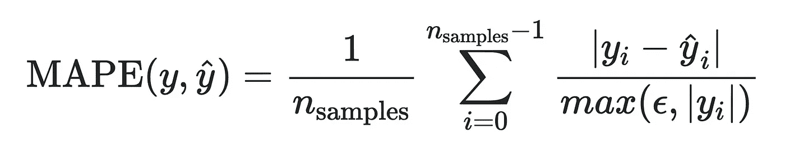

# scikit 中的新功能-了解

> 原文：<https://towardsdatascience.com/new-features-in-scikit-learn-f0ceb7e9d2ad?source=collection_archive---------26----------------------->


照片由 [Jungwoo Hong](https://unsplash.com/@oowgnuj?utm_source=medium&utm_medium=referral) 在 [Unsplash](https://unsplash.com?utm_source=medium&utm_medium=referral) 上拍摄

## 0.23 版最新发展概述

> 如果你对数据科学感兴趣并使用 python，那么 **scikit-learn** 可能是你联系人列表中的快速拨号。您可能需要更新此联系人。

两个月前，scikit-learn 发布了[**0.23 版本**](https://scikit-learn.org/stable/whats_new/v0.23.html#changes-0-23) **，**引入了许多令人兴奋的特性和改进。该版本将至少兼容 **Python 3.6** 。这篇文章将引导你了解**一些有趣的新增内容**。稍后，我还会先睹为快地介绍目前正在开发的[下一个版本 0.24](https://scikit-learn.org/dev/whats_new/v0.24.html) 中即将推出的一些特性。

# 主要特点

## 1)新的回归模型

Scikit-learn 引入了以下三个新的回归变量:

**a)泊松回归变量
b)伽马回归变量
c)特威迪回归变量**

```
from sklearn.linear_model import PoissonRegressor
from sklearn.linear_model import GammaRegressor
from sklearn.linear_model import TweedieRegressor
```

这三种模型都被归类为广义线性模型(GLMs ),支持非正态损失函数。它们在建模误差遵循非正态分布的分布**、**的情况下很有用，例如泊松或伽马分布**、**或**总是正的**，正如**[**Kida**](/generalized-linear-models-9cbf848bb8ab)所很好地解释的那样。**

**选择哪种分布在很大程度上取决于用例，例如目标变量的正性质，分布的尾部如何，等等。潜在应用的几个例子是风险建模、气候事件预测和保险定价。**

## **2)稳定和快速的 k 均值估计器**

**众所周知的算法将样本分成预定义数量的具有相等方差的聚类，该算法现在应该被优化，并且对于大样本具有比 0.23 之前版本更好的可扩展性。**

## **3)改进的基于直方图的梯度提升估计器**

**改进是双重的:首先，回归器和分类器，即`HistGradientBoostingClassifier`和`HistGradientBoostingRegressor`，**都支持模型训练期间的样本权重**，如这里的[所示](https://scikit-learn.org/stable/modules/ensemble.html#sw-hgbdt)。**

**其次，如果已知*先验*，现在可以指定 [**单调约束**](https://scikit-learn.org/stable/modules/ensemble.html#monotonic-constraints) 的性质，即特性可以对响应/目标变量具有的约束。例如，在预测房价时，较大的卧室面积可能会对价格产生积极影响(约束值= 1)，而距离市中心的距离可能会对价格产生消极影响(约束值= -1)。值为 0 将表示不受约束的要素。**

## **4)改进的套索和弹性网**

**两个著名的线性回归器**现在支持模型训练期间的样本权重**。在功能上，这导致了一个新的参数`sample_weight`，它在`fit()`函数中接受一个数组或一个列表，代表数据集中每个样本的权重。**

## **5)管道和估算器的交互式 HTML 可视化**

**如果你正在 Jupyter 笔记本上建模，你现在可以**交互地可视化**你的模型管道和估算器的概要**工作流程。这需要调用`display='diagram'`选项。此功能的交互性质允许您悬停在某个估计器上，并扩展它以获得更多细节。看看这个很酷的官方演示。****

# **其他有趣的功能**

## **1)将内置数据集作为数据帧加载**

**Scikit-learn 提供了几个内置数据集，例如`load_iris`、`load_digits`、`load_breast_cancer`、`load_diabetes`和`load_wine`、`load_linnerud`、`fetch_california_housing.`现在您可以使用关键字`as_frame=True`将这七个数据集加载为 **pandas DataFrames** 。**

**早些时候，这些嵌入的数据集被加载为`asklearn.utils.Bunch`类型。**

```
from sklearn.datasets import load_iris

df = load_iris(as_frame=True)# 0.25 onwards, type(df) should return pandas.core.frame.DataFrame
```

## **2)在一次热编码期间丢弃所选类别**

**标准例程`preprocessing.OneHotEncoder`对分类特征进行一次热编码，现在允许丢弃每个二元特征的第一个类别(只有两个类别)。这是用标签`drop='if_binary'`实现的。具有 1 个或 2 个以上类别的功能将不受此标志的影响。最新版本还有一个更高效的`OneHotEncoder`实现。**

## **3)高斯斑点的中心**

**在生成各向同性高斯簇(斑点)时，你现在可以通过`return_centers=True`参数访问每个簇的中心。**

```
from sklearn.datasets import make_blobsX, y, centers = make_blobs(n_samples=20, centers=3, n_features=2,
                  random_state=0, return_centers=True)
```

# **即将到来的 v-0.24 中即将到来的变化**

**很快，目前正在开发的下一个[版本 0.24](https://scikit-learn.org/dev/whats_new/v0.24.html) 就要发布了。以下是一些你可以期待的有趣特性。**

## **1)估算值的逆变换**

**来自`sklearn.impute`的`SimpleImputer`允许对数据集中的缺失数据进行插补。很快，**就可以将估算的数据转换回**原来的状态。首先，需要在调用`SimpleImputer()`时设置一个标志`add_indicator=True`，然后在这个很酷的功能上使用函数`inverse_transform.`阅读更多信息[。](https://scikit-learn.org/dev/modules/generated/sklearn.impute.SimpleImputer.html#sklearn.impute.SimpleImputer)**

## **2)平均绝对百分比误差(MAPE)**

**这将是**回归问题**的**可用的**新评估指标。这种度量对目标变量的全局缩放不敏感。在数据数量级差异较大的情况下，通过计算误差相对于真实值的相对百分比，它可以作为误差的公平衡量标准，例如，如下面的代码片段所示。下面例子中的`mean_absolute_error`将是 100001.8。**

****

**平均绝对百分比误差。ϵ是一个任意小的正数，例如 1e-6。变量 y 和 y_hat 代表真实值和预测值。**

```
# Implementation in upcoming version 0.24from sklearn.metrics import mean_absolute_percentage_errorimport numpy as npy_true = np.array([1, 10, 1e6])
y_pred = np.array([0.9, 15, 1.2e6])mape = mean_absolute_percentage_error(y_true, y_pred)
>>> 0.2666....#============ My implementation below ============eps = 1e-6dev = [np.abs(x-y)/max([eps, np.abs(x)]) for x, y in zip(y_true,
                                                          y_pred)]mape = sum(dev)/len(dev)
>>> 0.2666....
```

## **3)`**confusion matrix plot**`中的可选颜色条**

**在绘制混淆矩阵时，颜色条现在是可选的。如果不需要的话，这就不需要一个替代解决方案来隐藏色条。**

```
plot_confusion_matrix(estimator, X, y, colorbar=False)
```

**这让我想到了这篇文章的结尾。在你更新了你的 scikit-learn 并想用 python 可视化数据之后，你可以关注我最近的文章**Matplotlib 3 的新特性** [这里](/whats-new-in-matplotlib-3-1b3b03f18ddc)。**

****机器学习快乐！****