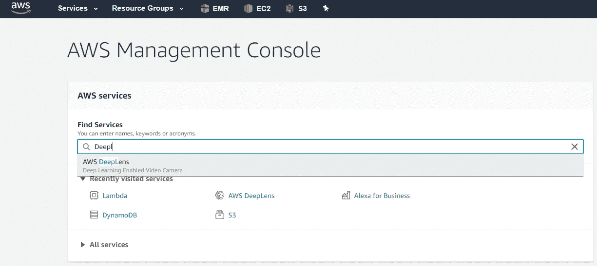
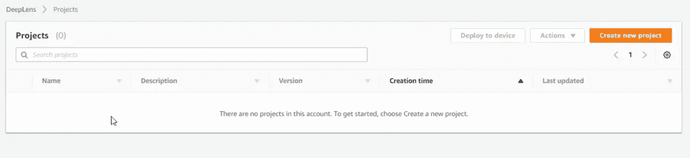

# 新一代计算机视觉:AWS DeepLens

> 原文：<https://towardsdatascience.com/new-generation-computer-vision-aws-deeplens-45052e39b4bc?source=collection_archive---------54----------------------->

## 如何使用 AWS DeepLens 部署对象检测模型

**(** [**来源**](https://pixabay.com/photos/eye-information-technology-digital-3374462/) **)**

[AWS DeepLens](https://aws.amazon.com/deeplens/?nc1=h_ls) 可以被描述为一种可配置的摄像机，使用户能够在更短的时间内找到练习实时流媒体处理技术的机会。

AWS DeepLens 可能部署三种不同类型的建模。在这篇文章中，我们将研究预先训练好的物体检测模型。

 [## 新一代计算机视觉:AWS DeepLens

### AWS DeepLens 是一个可编程的摄像机，使开发人员能够开始实践深度学习…

www.commencis.com](https://www.commencis.com/thoughts/new-generation-computer-vision-aws-deeplens/) 

1.  **预训练模型**

该项目使用户能够将初始训练的模型部署到他们的设备上。可以通过以下路径选择 ***项目>创建项目***

预训练模型导入项目页面(图片由作者提供)

**2。亚马逊 SageMaker 训练模型**

使用此模型类型，您可以在 AWS SageMaker 中创建和训练您的模型，并提供以下信息，然后单击导入按钮:“*作业 ID”、“模型名称”、“模型框架”。*

亚马逊 SageMaker 训练模型选择页面(图片由作者提供)

为了能够使用这种模型类型将您的模型部署到您的设备中，[***AWS Sagemaker***](https://aws.amazon.com/sagemaker/)是打开一个 [***SageMaker 笔记本实例***](https://docs.aws.amazon.com/sagemaker/latest/dg/gs-setup-working-env.html) 作为代码编辑器所必需的服务。

如果您是 AWS 服务的新手，以前从未使用过 AWS SageMaker，AWS 会为您提供一个 [***AWS 自由层***](https://aws.amazon.com/free) 。通过使用这个帐户，您可以在头两个月开始使用 AWS SageMaker。

**3。外部培训模型**

通过选择这种类型的模型，预计您已经在 AWS 环境之外训练了您的模型，并将您的模型上传到 AWS S3 存储桶中。为了能够将您的模型上传到 DeepLens，您需要填写以下字段，然后单击导入按钮:*“模型工件路径”、“模型名称”、“模型框架”。*

外部培训模型选择页面(图片由作者提供)

# AWS 深度镜头

在开始使用任何服务之前，必须在[链接](https://docs.aws.amazon.com/deeplens/latest/dg/deeplens-required-iam-roles.html)中设置必要的权限，以便能够正确使用它们。将使用的第一个服务是 AWS DeepLens。为了能够使用此服务，您的地区将从以下地区中选择:

> 欧洲(法兰克福)欧盟-中部-1
> 美国东部(北弗吉尼亚州)美国东部-1
> 亚太地区(东京)AP-东北-1

在设置开发环境策略和区域之后，通过使用 AWS 管理控制台，在“Find Services”标题下，您将能够通过使用 search 按钮键入服务的名称来快速找到任何服务，如下所示。

AWS 管理控制台(图片由作者提供)

此页面包括关于服务的基本信息。更多详细的技术细节，可以访问“*更多资源*选项卡下的*[*文档*](https://docs.aws.amazon.com/deeplens/latest/dg/what-is-deeplens.html)*。**

****

**AWS Deeplens 介绍页(图片由作者提供)**

## **设备注册**

**产品拆箱后，第一步是将您的设备正确注册到 AWS DeepLens 服务中。**

****

**注册设备介绍屏幕(图片由作者提供)**

**将设备连接到 PC 后，点击 ***【注册设备】*** 按钮，然后选择您的硬件版本，点击如下图所示的 ***开始*** 按钮。**

****

**[设备硬件版本选择](https://docs.aws.amazon.com/deeplens/latest/dg/deeplens-start-registering-device-using-console-v1_1.html)(图片由作者提供)**

**首先，应使用适配器将设备连接到电源，并打开电源按钮。当设备打开时，电源 led 将变为蓝色。**

**将 USB 电缆插入设备的“ ***注册*** ”端口，即可将 PC 与设备连接。**

****

**[DeepLens 注册 USB](https://docs.aws.amazon.com/deeplens/latest/dg/deeplens-hardware.html) 口(图片由作者提供)**

**当您能够成功注册 AWS DeepLens 时，您将能够通过“ ***已注册*** ”状态在页面左侧的资源>设备选项卡下看到您的设备。**

****

**设备选项卡(图片由作者提供)**

## **部署预先训练的模型**

**在“ ***项目*** ”部分下，需要点击位于右上方的“ ***新建项目*** 按钮才能够看到项目类型。**

****

**创建新项目(图片由作者提供)**

**在这一步中，需要选择一个预先填充的项目模板。选择“ ***使用项目模板*** ”作为项目类型，并从列表中选择“ ***对象检测*** ”，向下滚动到屏幕，单击“ ***创建*** ”。**

****

**选择项目模板(图片由作者提供)**

**在 ***指定项目详细信息*** 页面中，接受项目名称和描述提要中的默认值。**

****

**指定项目细节部分(图片由作者提供)**

**在同一页面的底部，您将看到项目内容选择设置。对于 ***型号*** 和 ***功能，*** 接受默认值并点击 ***【创建】*** 继续。**

****

**项目内容部分(图片由作者提供)**

**在此步骤中，您将把对象检测项目部署到您的设备上。您当前创建的项目将成功列在“ ***项目*** ”部分。查看完相应的项目后，点击单选按钮，并在右上方选择****【部署到设备】*** 。***

****

**项目页面(图片由作者提供)**

**在 ***【目标设备】*** 页面上，您需要选择您的设备并点击 ***【查看】*** 按钮。**

****

**目标设备页面(图片由作者提供)**

**将有一个额外的页面，其中有您的部署细节，包括关于 ***【类型】【λ】****和* ***【型号】的信息。*** 仔细检查后，选择 ***【部署】*** 按钮继续。**

****

**审查和部署模型(图片由作者提供)**

**当点击“部署”时，您的模型将通过向 AWS DeepLens 显示其下载百分比上传到您的设备。**

****

**正在向设备部署(图片由作者提供)**

**部署后，在“ ***设备*** ”选项卡上，在您的项目部署后，单击 ***【查看输出】*** 选择您的浏览器进行相应的流认证导入。**

****

**流媒体认证的浏览器选择(图片由作者提供)**

## **模型输出**

**有两种不同的方式来查看我们的模型输出。下面列出了这些，并在单独的主题中进行了解释。**

*   **JSON 格式的 MQTT 主题值输出**
*   **项目流**

1.  ****AWS 物联网核心— MQTT 话题值****

**成功导入证书后，浏览器会通过弹出屏幕要求您选择合适的证书版本。**

**当您想要 JSON 格式的输出时，您可以 ***【复制】*** 唯一生成的主题，并点击***【AWS 物联网控制台】*** 打开 [***AWS 物联网核心***](https://aws.amazon.com/iot-core/?nc=sn&loc=1) 服务。**

****

**JSON 格式的输出(图片由作者提供)**

**复制后的主题格式如下***" $ AWS/things/deep lens _***`***<uuid>***`***/infer "*，**粘贴到 ***【订阅主题】*** 下，点击 ***【发布到主题】*** 按钮。**

****

**AWS 物联网核心— MQTT 客户端(图片由作者提供)**

**点击 ***发布到主题*** 后，JSON 格式的输出开始发布。如果您想停止发布，可以选择右上方的 ***【暂停】*** 。**

****

**AWS 物联网核心—主题发布后(图片由作者提供)**

****2。项目流****

**在为我们的浏览器导入证书后，我们可以单击“ ***【视频流】*** 部分下的“ ***【查看视频流】*** 来打开一个新的选项卡，其 IP 地址为“ *192.168.1.47:4000”。***

****

**视频流部分(图片由作者提供)**

**当在指定的 IP 地址上启用流时，我们可以看到两个不同的选项卡。第一个选项卡称为“ ***”项目流“*** ，这是应用了我们的对象检测模型的流。在这个流中，我们看到对象周围的蓝色框架，在框架的顶部，检测到对象的名称及其可能性百分比。因为模型是在有限数量的对象中训练的，所以不能识别帧中的所有对象。如果我们想要检测比预训练的对象检测模型更多的对象，我们需要通过[***导入外部自定义模型***](https://docs.aws.amazon.com/deeplens/latest/dg/deeplens-import-external-trained.html) 来导入我们的自定义模型。**

****

**项目流输出(图片由作者提供)**

**第二个流叫做 ***“直播流”。*** 当我们选择此选项卡时，我们可以查看普通摄像机流，它显示帧的速度比“项目流”快，因为它没有在对象上应用任何模型。**

****

**直播流输出(图片由作者提供)**

**非常感谢您的提问和评论！**

## ****参考文献:****

1.  **自动气象站深度镜头**
2.  **[AWS 物联网核心](https://aws.amazon.com/iot-core/?nc=sn&loc=1)**
3.  **[AWS Lambda](https://docs.aws.amazon.com/lambda/index.html)**
4.  **[AWS SageMaker](https://aws.amazon.com/sagemaker/)**
5.  **[AWS SageMaker 定价](https://aws.amazon.com/sagemaker/pricing/)**
6.  **[亚马逊网络服务 YouTube 频道](https://www.youtube.com/user/AmazonWebServices/videos)**