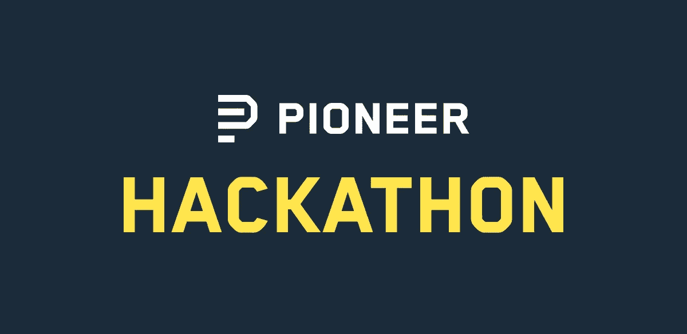

# 面向新常态的新黑客马拉松

> 原文：<https://towardsdatascience.com/new-hackathon-for-the-new-normal-fad366e62cbd?source=collection_archive---------54----------------------->

如果没有别的，我们已经通过疫情了解了我们的互联网的力量以及还有多少工具有待开发。作为开发人员，我们正处于一个激动人心的位置，为我们的新常态设定标准，并为下一个前沿领域铺平道路。本周末，[我们](https://pioneer.app/)将举办我们的第一次先锋黑客马拉松，试图为那些与世隔绝的人提供社区，并提供一点奖励激励的、富有成效的乐趣来对抗全球幽居热。

帮助将真实世界上传到互联网。让数十亿呆在家里的人在网上工作变得更有趣。在 Zoom 通话中叠加心率。提高视频会议质量。建立一个串联的竞争对手，一个朋友而不是同事。舞台是你的。

我们将于本周六上午 11 点开始。在 24 小时内，您将有机会体验我们定期在网上举办的许多活动:专家 ama、反馈会议和餐饮。我们也在尝试一些新的形式:有奖迷你黑客、剪刀石头布锦标赛、《我的世界》@午夜和实时项目投票。

由专家、你的黑客伙伴和我们选出的最佳项目，将有机会在评委面前展示他们的作品，并向全世界直播。评委包括 Zeit 首席执行官 [Guillermo Rauch](https://twitter.com/rauchg) ，Repl.it 首席执行官 [Amjad Masad](https://twitter.com/amasad) ，前可汗学院研发负责人和 iOS 构建者 [Andy Matuschak](https://twitter.com/andy_matuschak) 和 Tandem 首席执行官 [Rajiv Ayyangar](https://twitter.com/rajivayyangar) 等。

前三名项目有一个$5k 现金奖金池和超过$150，000 的开发者积分。每个参与的人都可以免费获得三个月的 Repl.it。最重要的是，你将有机会见到来自世界各地的黑客——目前有 50 多个国家的代表。

物理会议中心有明显的能量，当独自在家时，滚动浏览项目提要时，这种能量很容易丢失。我们的目标是把这种能量带到网络上，在一个 24 小时在线黑客宫殿里。

在这里报名:[https://pioneer.app/hackathon](https://pioneer.app/hackathon)。

杰克逊&先锋队