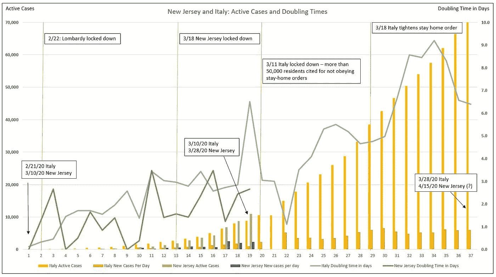

# 新泽西正在成为新冠肺炎感染的新伦巴第

> 原文：<https://towardsdatascience.com/new-jersey-is-on-the-path-to-be-the-new-lombardy-for-covid-19-infections-bdd2d44948d2?source=collection_archive---------34----------------------->

美国的新泽西州和意大利的伦巴第地区在美国报告数据的前 18 天的人口密度、总人口和活跃新冠肺炎病例方面非常相似。新泽西州大约有 890 万人口，密度约为每平方英里 1213 人。伦巴第大约有 1000 万人口，每平方英里 1100 人。意大利总人口密度为每平方英里 533 人，总人口约 6040 万。这对新冠肺炎的传播意义重大，因为[人们普遍认为](https://www.nytimes.com/2020/03/23/nyregion/coronavirus-nyc-crowds-density.html)在人口更密集的中心发生的人与人之间更密切、更频繁的互动会导致病毒更快速的社区传播。还推测新泽西和意大利在实施广泛测试之前已经建立了社区传播。从第 1 天到第 18 天，当新泽西州的活跃案件的增长与意大利的增长重叠时，新泽西州的可能轨迹出现了一幅格外严峻的画面。

新泽西和意大利每天的活动和新病例增加了一倍，并实施了抑制措施。数据来源:【https://github.com/CSSEGISandData/COVID-19 

上图以暗黄色条显示了意大利的活跃病例(在意大利疫情爆发的早期主要集中在伦巴第)，橙色条显示了该国每天的新增病例。新泽西州的活动案例用绿色条显示，每天的新案例用蓝色条显示。所有案例数据都对应于左边的 y 轴。来自这两个地区的数据从每个地点的明显“开始”起相互重叠，并以天而不是离散的日期向前发展，因为检测到的开始发生在每个地点的不同时间。意大利数据的第一天是 2 月 21 日，新泽西数据的第一天是 3/10。以天为单位的翻倍率(或病例以当前增长率翻倍所需的时间)每天计算一次，意大利用灰色绘制，新泽西用绿色绘制，对应于代表天数的右侧 y 轴数字。垂直黄线表示伦巴第和整个意大利实施缓和措施的日期。绿色竖线表示新泽西州关闭所有非必要业务的日期，并命令居民待在家中。值得注意的是，相比意大利，新泽西将更多的商业开放视为“必需”,而且自 3 月 20 日起，意大利居民受到了更严格的限制。

在疾病发展的最初几天，新泽西州的倍增时间一直低于意大利——这意味着新泽西州的病例倍增时间更短。从 3 月 26 日的一份报告中可以清楚地看到，伦巴第仍然受到严重影响，病例[在一天之内跃升了 2500 例](https://www.aljazeera.com/news/2020/03/coronavirus-cases-jump-2500-day-italy-lombardy-200326133744771.html)，该地区仍然严重影响着意大利的总体数字——所以这种比较可能仍然成立。

***编者按:*** [*走向数据科学*](http://towardsdatascience.com/) *是一份以数据科学和机器学习研究为主的中型刊物。我们不是健康专家或流行病学家，本文的观点不应被解释为专业建议。想了解更多关于疫情冠状病毒的信息，可以点击* [*这里*](https://www.who.int/emergencies/diseases/novel-coronavirus-2019/situation-reports) *。*