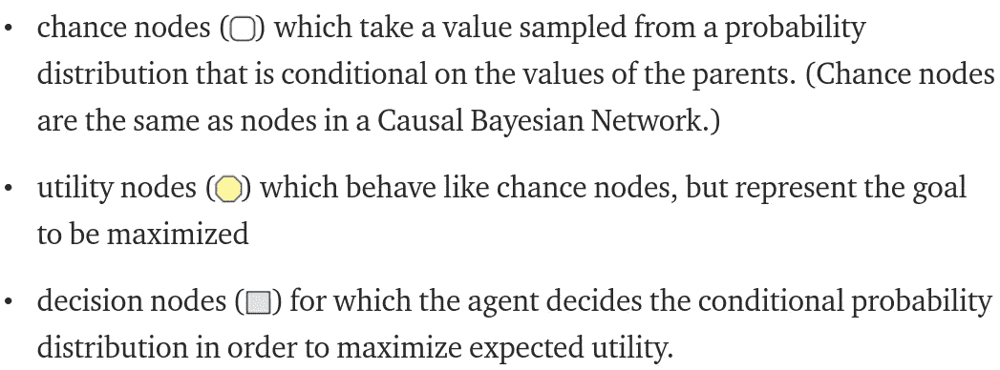
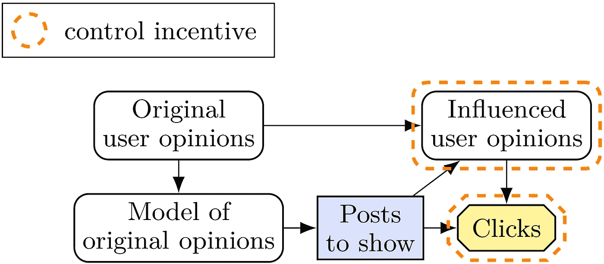
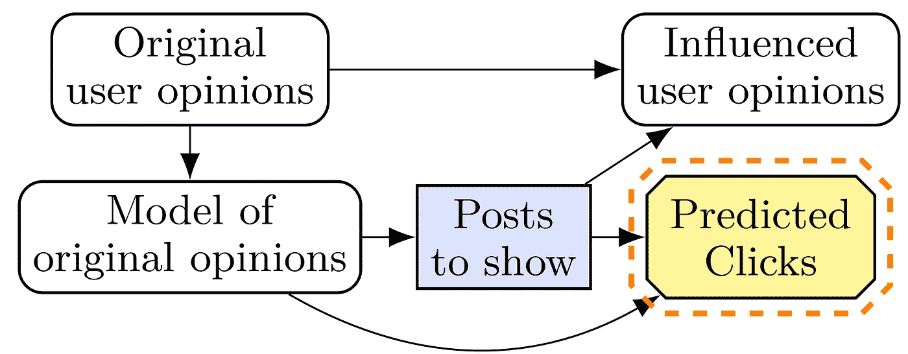
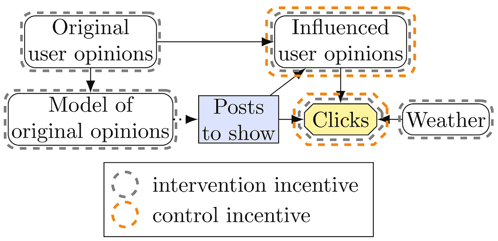

# 新报:塑造行为的激励

> 原文：<https://towardsdatascience.com/new-paper-the-incentives-that-shape-behaviour-d6d8bb77d2e4?source=collection_archive---------17----------------------->

## [人工智能校准和安全](https://towardsdatascience.com/tagged/ai-alignment-and-safety)

## 因果模型如何描述代理人的动机。

[*瑞安·凯里*](https://www.fhi.ox.ac.uk/team/ryan-carey/) *和埃里克·朗罗伊，介绍* [塑造行为](https://arxiv.org/abs/2001.07118)的激励机制。

机器学习算法通常非常有效，但很难确定它们的安全性和公平性。通常，机器学习系统的属性是通过测试来建立的。然而，即使系统在测试环境中表现安全，在部署时也可能表现得不安全或不公平。或者，可以通过分析[输入扰动](https://ieeexplore.ieee.org/stamp/stamp.jsp?tp=&arnumber=8418593)、[个体决策](https://arxiv.org/abs/1602.04938)或[网络激活](https://distill.pub/2018/building-blocks/)来研究模型的属性，但这通常很困难、耗时，并且对专业知识要求很高。

我们的替代方法不是检查或测试单个模型，而是观察给定的培训环境是否会刺激不安全或不公平的决策。

这种方法并不是全新的——激励是一个直观且切题的讨论对象。例如，参见下面 Stuart Russell 对竞争推荐系统的激励的讨论。(其他例子包括哈德菲尔德-门内尔等人的[注释 1](http://papers.nips.cc/paper/6420-cooperative-inverse-reinforcement-learning)和史蒂夫·奥莫亨德罗的[基本人工智能驱动。](http://citeseerx.ist.psu.edu/viewdoc/download?doi=10.1.1.393.8356&rep=rep1&type=pdf))

图片来自 [Pixabay](https://pixabay.com/cs/illustrations/soci%C3%A1ln%C3%AD-soci%C3%A1ln%C3%AD-s%C3%ADt%C4%9B-1206614/)

> 放入[社交媒体推荐]机器的目的是什么？给人们提供他们想点击的东西，因为这是我们赚钱的方式。你如何最大化点击率——你只是给人们发送他们喜欢点击的东西，对吗？就这么简单。事实上，这不是算法在做的事情…这不是强化学习的工作方式。强化学习通过改变世界的状态来最大化回报。在这种情况下，世界的状态是你的大脑……[所以]它以一种更可预测的方式改变你，这样它就可以给你发送它知道你会点击的东西。”—斯图尔特·罗素

改变用户行为的压力可以被视为一种不受欢迎的激励。像这样的基于激励的论点是强有力的，因为它们独立于系统架构而应用。然而[大多数](https://www.fhi.ox.ac.uk/wp-content/uploads/2010-1_body.pdf) [以前的](http://auai.org/uai2016/proceedings/papers/68.pdf) [关于激励的工作](https://arxiv.org/abs/1705.08417)都集中在具体的问题上，这使得它很难应用到新的问题和情况中。在我们最近的工作中，我们已经开始开发一个通用的*激励的因果理论*，它允许我们在一个统一的框架中陈述和制定多种公平和安全问题的解决方案。

在我们的理论中，一个*激励*，粗略地说，是一个代理人为了最好地实现其目标而必须做的事情。我们考虑两种类型的激励:当代理必须控制其环境的某个组件以最大化其效用时，存在*控制激励*(例如上面的社交媒体推荐示例中的“用户意见”)。当智能体的决定必须对其环境的某个组成部分做出因果反应时，就会出现*反应激励*，例如，移动机器人在崎岖地形上导航时应该注意障碍物的位置。

# 控制激励

## **示例**

为了使激励分析形式化，我们可以使用*因果影响图*。因果影响图通过将决策问题分解成图形来表示，其中每个变量都依赖于其父变量的值(如果有箭头 X- > Y，则 X 是 Y 的父变量)。它由三种类型的节点组成:

例如，斯图尔特·罗素的社交媒体操纵例子可以用下面的影响图来表示。

控制对用户意见的激励

在这个模型中，推荐算法选择一系列帖子显示给用户，以最大化用户点击的帖子数量。如果我们把用户对每个帖子的回复看作是一个独立的事件，那么用户欣赏的内容就会收到更多的点击。然而，这些职位也有间接影响。如果用户浏览了许多两极分化的文章，那么他们可能会采纳其中的一些观点，并且在点击内容方面变得更加可预测。这可以允许该算法在该系列中后面的帖子上实现更高的点击率，并且意味着对受影响的用户意见有控制激励。

为了减轻 Stuart Russell 的担忧(同时保留系统的功能)，我们希望去除对用户意见的控制激励，同时保留对*点击*的激励。我们可以重新设计这个系统，这样就不会因为真实点击率而获得奖励，而是因为基于原始用户意见模型的帖子的*预测点击*而获得奖励。以这种方式训练的代理人会认为用户意见的任何修改都与改进其性能无关。

为了在实践中工作，点击预测本身必须不包括用户意见修改的影响。我们可以通过使用假设帖子之间独立的预测模型来实现这一点，或者通过只向每个用户显示一个帖子来学习。这说明了在考虑激励时的一个重要考虑:只有当没有一个变量(如预测的点击)作为另一个变量的“代理”时，一个变量(如点击)缺乏激励才有实际意义。否则，即使对点击没有控制激励，对预测点击的控制激励也可能系统地诱导与对点击的控制激励所诱导的相同类型的决策。在未来的工作中，我们计划分析代理变量会产生什么样的隐性激励。

对用户意见没有控制激励

这个例子符合控制激励与安全和性能相关的循环模式:一些控制激励对于良好的性能是必要的，但是错误的控制激励可能导致系统不安全。例如，AlphaGo 工作得很好，因为它有保护其石头(性能)但不保护其服务器(安全)的控制激励。确保控制激励符合用户的偏好是安全激励设计的核心问题。

**定义控制激励**

既然我们有了控制激励的基本直觉，我们可以考虑如何定义它们。假设有某个变量 X(比如用户的政治观点)。我们可以考虑如果 AI 系统表现不同，X 可以获得的*值*。如果将 X 设置为任何可达到的值 X(如“左翼”、“中间派”或“右翼”)会改变绩效，那么我们说 X 上有一个*控制激励*。根据这个定义，从决策到效用的因果路径上的任何变量都可能出现控制激励。

[Everitt 等人](https://arxiv.org/abs/1902.09980)定义了*干预激励*的相关概念。如果可以通过直接设置其值来获得效用，则变量面临干预激励。(这相当于控制的[值不为零。干预激励对代理人行为的预测不如控制激励，因为它们没有考虑代理人能够用其决策影响什么——因此我们的论文的标题是“塑造行为的激励”。](https://www.microsoft.com/en-us/research/publication/pearl-causality-value-control/)

让我们回到我们的例子来强调这两种激励之间的区别。所有导致效用的变量都有干预激励，但只有那些也在行动下游的变量才有控制激励。

# 回应激励

最佳决策必须响应哪些事件？

这个问题对人工智能的安全和公平都有重要的影响。为了人工智能的安全，如果变量是一个关机命令，人工智能系统的行为最好能对这个变量作出反应。这样的反应激励不足以保证安全，但这是一个好的开始。相反，如果缺乏这种激励，那么最优政策很容易变得不安全。同样理想的是，对人类的一般命令有一个响应激励，对价值学习系统有一个对人类价值的响应激励。

这对公平也有重要影响。如果种族或性取向等敏感变量有反应激励，那么这表明训练算法的激励是[反事实的不公平](https://arxiv.org/abs/1703.06856)。我们在论文中指出，如果在一个敏感的属性上有一个反应激励，那么所有的最优政策相对于该属性都是反事实不公平的。我们的论文采取了一些步骤来定义不公平激励:主要关注如何在给定的图表中排除不公平激励的存在。

因此，响应激励的可取性取决于变化的变量。对于一些变量，我们希望人工智能系统对它们做出响应，以便安全地运行。对于其他变量，如果一个人工智能系统对此做出反应，那么我们认为该系统是不公平的。

# 应用、限制和后续步骤

这个理论已经通过它的应用证明了它的价值。除了讨论的安全和公平问题，还被应用于分析 AI [拳击方案](https://arxiv.org/abs/1905.12186)和[奖励篡改问题](https://arxiv.org/abs/1908.04734) ( [博文](https://medium.com/@deepmindsafetyresearch/designing-agent-incentives-to-avoid-reward-tampering-4380c1bb6cd))。正如公平的例子所示，这个理论并不一定要求代理人进行因果推理或有因果模型，只是我们，设计者，可以对代理人的行为进行因果推理。

从长远来看，我们的愿望是，当研究人员预计到可能的安全或公平问题时，他们会使用这一理论来对他们的人工智能系统进行激励分析。在应用我们的图形标准来自动辨别存在哪些激励之前，这通常涉及绘制各种代理组件如何能够配合在一起的因果图，并形成关于应该(或不应该)存在哪些激励的判断。在非常乐观的情况下，激励分析将成为建立人工智能系统可信度的标准工具，类似于统计方法如何用于描述人工智能性能。但在短期内，我们预计使用这些方法需要一些工作，因此我们很乐意在需要的地方提供建议。

这个理论还没有完成，因为它目前仅限于单代理设置。我们正在努力将其扩展到多决策的情况，最终，我们希望它能够处理多个代理。该文件可从以下网址获得:

r .凯里、E .朗罗伊、T .埃弗里特和 S .莱格。塑造行为的激励机制 (2020)，SafeAI@AAAI。