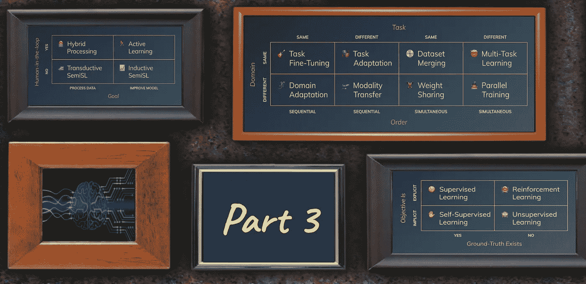
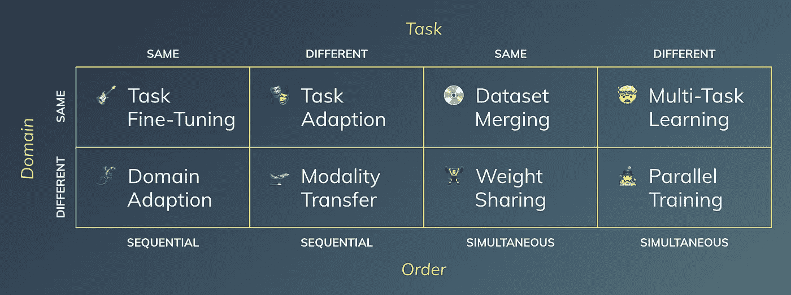

# 迁移学习的新视角

> 原文：<https://towardsdatascience.com/new-perspectives-on-transfer-learning-285035f01589?source=collection_archive---------74----------------------->

## [构建机器学习概念](https://towardsdatascience.com/tagged/structuring-ml-concepts)

## 映射关于域、任务和顺序的问题

> 在专栏“[构建机器学习概念](https://towardsdatascience.com/tagged/structuring-ml-concepts)”中，我试图从机器学习(ML)空间中提取概念，并将它们投射到新的、可能不寻常的框架中，以提供新的视角。该内容面向数据科学社区的人们，以及对 ML 领域感兴趣的精通技术的个人。

由作者创建。包括由 [Vectra AI](https://assets-global.website-files.com/5bc662b786ecfc12c8d29e0b/5d018a9ba972742ad9698ed9_deep%20learning.jpg) 和 [taviphoto](https://www.istockphoto.com/de/portfolio/taviphoto) 通过 [iStock](https://www.istockphoto.com/de/foto/grunge-wand-mit-alten-bilderrahmen-gm466850191-33802914) 制作的图形。

# 介绍

“[构建机器学习概念](https://towardsdatascience.com/tagged/structuring-ml-concepts)的最后一期[致力于引入混合处理，并将其与主动学习和直推式&归纳半监督学习一起映射到一个新的框架中。](/processing-unlabeled-data-in-machine-learning-2552e3fdf7c1)

引发我写这篇文章的原因是，如今迁移学习无处不在，并向许多方向发展。它有各种各样的形状和颜色，但是方法论缺乏一个更高层次的框架。让我们详述一下。

# 框架:迁移学习的八种途径

转移学习(TL)可能是深度学习中最重要的发展之一，使其适用于现实世界的应用。许多人可能还记得“ImageNet 时刻”,当时 AlexNet 击败了 ImageNet T21 竞赛，并使神经网络成为计算机视觉挑战的标准。然而，有一个问题——你需要大量的数据来完成这项工作，而这些数据通常是不可用的。

随着 TL 的引入，这个问题得到了解决。这使我们能够在 ImageNet 上预先训练一个[卷积神经网络](https://en.wikipedia.org/wiki/Convolutional_neural_network) (CNN)，冻结第一层，只在一个较小的数据集上重新训练它的头部，使 CNN 进入行业大规模采用。

2018 年，[自然语言处理](https://en.wikipedia.org/wiki/Natural_language_processing) (NLP)的这个“ImageNet 时刻”终于到来了。我们第一次从重复使用静态单词嵌入转向共享完整的语言模型，这显示了捕捉一系列语言信息的非凡能力。在这一发展中，塞巴斯蒂安·鲁德发表了[他的论文](https://ruder.io/thesis/)关于 NLP 的神经 TL，该论文已经绘制了 TL 中四个不同概念的树形分解图。

## 映射维度

这让我思考:使用一两个数据集的洞察力来学习一项或多项任务有哪些不同的方式。这些是我能想到的维度:

1.  任务:我们是在预训练和微调阶段尝试教我们的网络相同的任务，还是利用第一个任务的知识将其用于不同的第二个任务？(例如，预训练“动物分类器”并将模型微调为“狗品种分类器”与使用“动物分类”网络的主干来训练“绒毛耳朵对象检测器”)
2.  **域:**我们的数据集来自同一个域还是不同的域？(例如，两个数据集都是“在野外”拍摄的彩色图像，而一个数据集是灰度 x 射线图像)
3.  **顺序:**我们是同时学习任务还是依次学习？(例如，我们共同计算所有任务的损失，并将其用于训练，而不是完成第一次训练，移植网络的权重，然后开始第二次训练)

我也考虑过增加“重要性”来包含辅助任务，但是我们不要把事情弄得太复杂。因此，我最终得到了与 Ruder 用于 NLP 的维度相似的维度。让我们绘制出所有八种组合，由三个二元维度产生。

## 轻量级定义

我将对这些术语做出一些自以为是的决定，这些决定没有广泛的文献支持——请耐心等待。

*   **任务微调:**当我们预训练一个模型，然后用相同的任务将其微调到相同域中的另一个数据集时，这适用于我们的问题(例如，使用预训练的 ImageNet 分类模型(INCM)，然后将其微调到狗品种分类器)。
*   **领域适应:**我们正在进行相同的任务，但是正在将我们的模型转移到由手头的另一个数据集给出的新领域中(例如，采用预先训练的 INCM，并在基于 x 射线对健康和患病患者进行分类时对其进行微调)。
*   **任务适应:**利用预训练模型的知识(即，其中间输出作为嵌入)来训练它执行不同的任务(例如，使用 INCM 的主干作为特征提取器，并添加第二个网络来执行对象检测)。
*   **模态转换:**即使领域和任务不同，使用在图像等方面预先训练的网络可能是有意义的。至少，该网络已经掌握了该模式(例如，使用 INCM 主干网在 x 射线中对乳腺癌进行目标检测)。
*   **数据集合并:**如果你想在相同的任务上同时训练来自相同领域的两个数据集，请随意合并它们(例如，将从 Instagram 抓取的图像添加到 ImageNet 数据集，以训练更好的分类器)。
*   **权重共享:**即使您正在同时训练两个问题，共享一些中间权重也是有意义的(例如，使用 OCR 生成的文本和 PDF 文档的原始图像来馈入一个联合的中间表示，以对页面的上下文进行分类，以及它是否是一个新文档的开始)。
*   **多任务学习:**最受欢迎的实例之一是[特斯拉的大型视觉网络](https://slideslive.com/38917690/multitask-learning-in-the-wilderness)，其中一个共享的主干网同时接受多项任务的联合训练(例如，使用特斯拉中摄像机的相同镜头并行运行对象检测和道路标记分割)。
*   **并行训练:**最后，如果你有两个不同的问题(域和任务)并且你想同时训练它们，就并行进行(例如，为同一个客户端执行内容审核和电子邮件分类)。

# 扩展的 2x2x2 矩阵

2x2x2 矩阵、映射任务、域和顺序。由作者创建。

使用维度**任务**、**域**和**顺序**，我们最终得到这个 2x2x2 矩阵，映射出之前介绍的概念。对于 2D 可视化，我在 x 轴上放置了两个维度，并将二进制条目加倍，最终得到 8 个不同的单元(例如，左上角的单元将是**相同域**、**相同任务**和**顺序顺序**)。

# 关闭

在这篇文章中，我们使用了任务、领域和顺序的维度来构建我们执行 TL 的方式。我喜欢沉迷于我的咨询过去，将它们扩展到一个更大的矩阵，让我思考全新的场景，同时试图填充空白的领域。这导致了一些相当明显的情况(例如，“数据集合并”和“并行训练”)，一直到一些已知的还没有普遍使用的名称的过程(例如，“任务微调”)。

如果你有任何其他非传统的映射，对此事的想法，或者对我们在 [Luminovo](https://luminovo.ai/) 的工作感兴趣，我很乐意收到你的来信。你可以在 [Linkedin](https://www.linkedin.com/in/sebastian-schaal/) 上发表评论或联系我。

敬请关注下一篇文章。