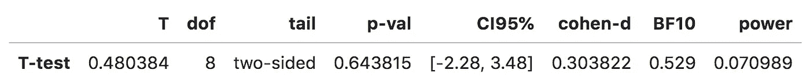
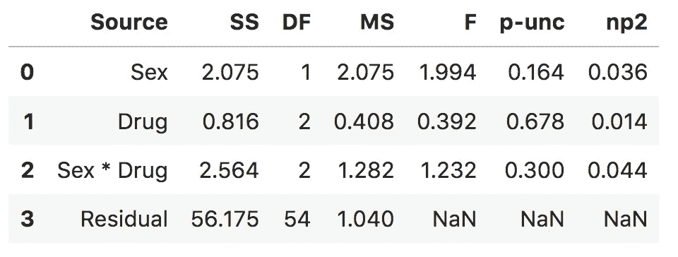
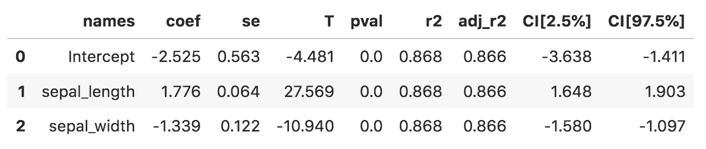

# 用于统计测试的新 Python 库—比 statsmodels 更简单，比 scipy.stats 更丰富

> 原文：<https://towardsdatascience.com/new-python-library-for-statistical-tests-simpler-than-statsmodels-richer-than-scipy-stats-ff380d4673c0?source=collection_archive---------30----------------------->

## PYTHON 中的统计模型

## 统计建模变得更加简单


[Pingouin](https://pingouin-stats.org/) 统计建模 Python 库

Python 的 [statsmodels](https://www.statsmodels.org/stable/index.html) 和 [scipy](https://docs.scipy.org/doc/scipy/reference/stats.html) 库令人难以置信。但是，当涉及到执行简单但最广泛使用的统计测试时，如 t 测试、方差分析(ANOVA)和回归，这两个库似乎同时做了太多和太少。

Statsmodels 功能强大，但是它的输出对初学者来说是多余的，难以解析。然而，Scipy.stats 更容易使用，但是提供的输出有些欠缺(例如，只有测试统计和概率值)。

有没有介于两者之间的东西——为最常见的统计测试提供简单而详尽的输出的库？

# Pinguoin 前来救援


于 2018 年 4 月发布，目前正在进行[积极开发](https://github.com/raphaelvallat/pingouin)

是一个相对较新的库，旨在为许多常见的统计测试提供简单而详尽的输出。

# 安装并导入 pingouin

如果你不想安装，打开我的共享 Deepnote Python 笔记本[](https://beta.deepnote.com/project/d1350ad6-bcb4-4c3d-857b-c29d01b8a803#%2Fpingouin.ipynb)**，在你阅读这篇文章的时候一个单元一个单元地运行它。否则，pingouin 可通过 pip 和 conda 获得，因此选择您喜欢的安装方法。**

```
pip install pingouin
conda install -c conda-forge pingouin
```

**这篇文章将只涉及 **t 检验、方差分析、回归，以及 pingouin 如何与** [**熊猫**、](https://pandas.pydata.org/)集成，但是 pingouin 可以做的不止这些(例如，中介)，所以查看它的[文档](https://pingouin-stats.org/index.html#)。**

# **“学生”t 检验**

**很容易进行 t 检验并得到最小但重要的结果，这些结果被方便地存储在熊猫数据帧中。**

```
import pingouin as pgx = [1, 2, 3, 4, 5]
y = [0, 1, 2, 3, 6]model = pg.ttest(x, y)  # output is a pandas dataframe
print(model)
```

****

**熊猫数据帧中 t-test 的清晰但全面的输出(运行代码[此处](https://beta.deepnote.com/project/d1350ad6-bcb4-4c3d-857b-c29d01b8a803#%2Fpingouin.ipynb)**

**真正令人难以置信的是，结果不仅包括 T 统计量(T)和 p 值(p-val)，还包括其他统计量，所有这些都在熊猫数据框架的一行中:自由度(dof)、95%置信区间(CI95%)、科恩的 d 效应大小度量(cohen-d)、反映假设证据强度的贝叶斯因子(BF10)和统计功效(power)。**

# **方差分析(ANOVA)**

**执行[方差分析](https://pingouin-stats.org/generated/pingouin.anova.html#pingouin.anova)同样简单。我们将使用 pingouin 中的内置数据集，并改编一个来自官方文档的示例，在该示例中，我们可以看到胆固醇是否可以通过性别(男性或女性)和药物(A、B、C)来预测。**

**当我们使用 pingouin 时，我们也可以使用与 pandas 数据帧相关联的`anova`方法。也支持相当多的其他方法。或者也可以使用等价的`pg.anova`函数来代替 pandas 方法。**

```
dt = pg.read_dataset('anova3')# pandas method anova
dt.anova(dv="Cholesterol", between=["Sex", "Drug"]).round(3)# pingouin function anova
pg.anova(dv="Cholesterol", between=["Sex", "Drug"], data=dt)
```

****

**熊猫数据帧中 ANOVA 的清晰而全面的输出(运行代码[此处](https://beta.deepnote.com/project/d1350ad6-bcb4-4c3d-857b-c29d01b8a803#%2Fpingouin.ipynb))**

**同样，输出是在熊猫数据帧中。Pingouin 几乎使得用 Python 来适应简单的统计模型变得太容易了，并且产生的输出清晰但非常全面——甚至可能比强大的统计计算语言 r 提供的输出更好。**

# **回归**

**Pingouin 还执行线性和逻辑回归。这里，我们导入了 [seaborn](https://seaborn.pydata.org/) 库，这样我们就可以使用内置的 iris 数据集。我们使用萼片长度和萼片宽度来预测花瓣长度。**

```
import seaborn as sns
iris = sns.load_dataset("iris")X = iris[['sepal_length', 'sepal_width']]  # predictors/features
y = iris['petal_length']  # outcome/target
pg.linear_regression(X, y)
```

****

**熊猫数据框架中线性回归的清晰而全面的输出(运行代码[此处](https://beta.deepnote.com/project/d1350ad6-bcb4-4c3d-857b-c29d01b8a803#%2Fpingouin.ipynb))**

**给 Pingouin 一个机会，我很好奇你对它的想法，以及你是否认为你会使用它。另外，如果你喜欢这篇文章，可以看看我的其他几篇关于 Python 和 pandas 数据科学的文章。**

**[](/reshape-pandas-dataframe-with-pivot-table-in-python-tutorial-and-visualization-2248c2012a31) [## 用 Python 中的 pivot_table 重塑熊猫数据框—教程和可视化

### 使用 pd.pivot_table 将 long 转换为 wide

towardsdatascience.com](/reshape-pandas-dataframe-with-pivot-table-in-python-tutorial-and-visualization-2248c2012a31) [](/two-simple-ways-to-loop-more-effectively-in-python-886526008a70) [## 在 Python 中更有效地循环的两种简单方法

### 使用枚举和压缩编写更好的 Python 循环

towardsdatascience.com](/two-simple-ways-to-loop-more-effectively-in-python-886526008a70) [](/real-or-spurious-correlations-attractive-people-you-date-are-nastier-fa44a30a9452) [## 真实或虚假的关联:你约会的有魅力的人更令人讨厌

### 使用 Python 模拟数据、测试直觉并提高数据科学技能

towardsdatascience.com](/real-or-spurious-correlations-attractive-people-you-date-are-nastier-fa44a30a9452) 

*更多帖子，* [*订阅我的邮件列表*](https://hauselin.ck.page/587b46fb05) *。***