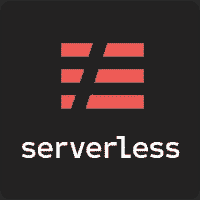
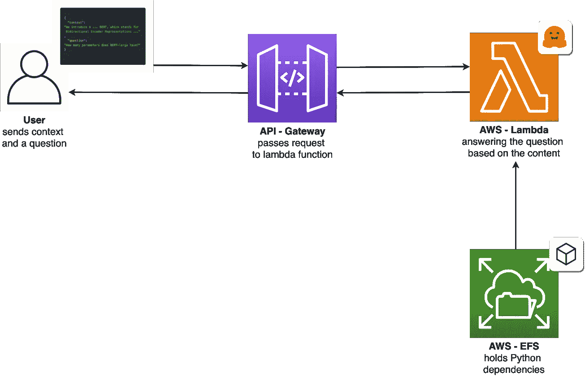
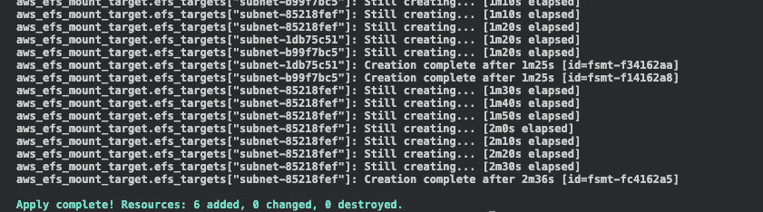
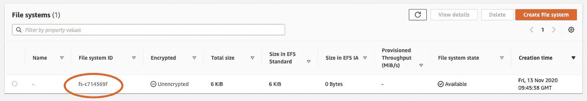
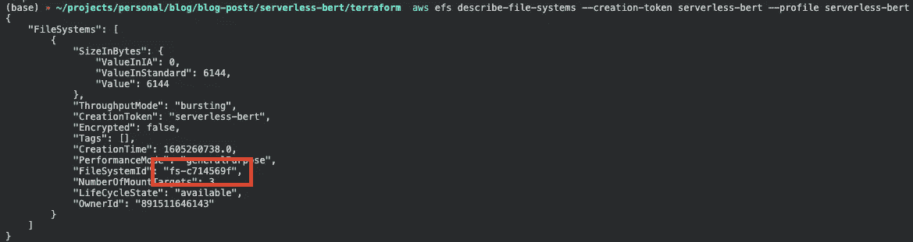
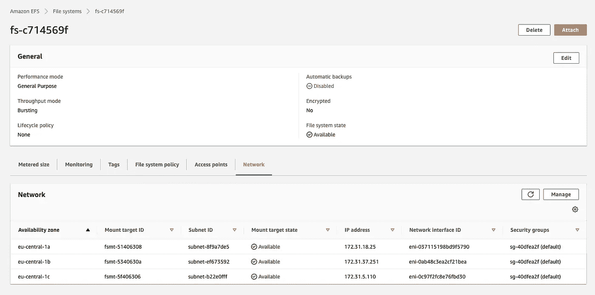
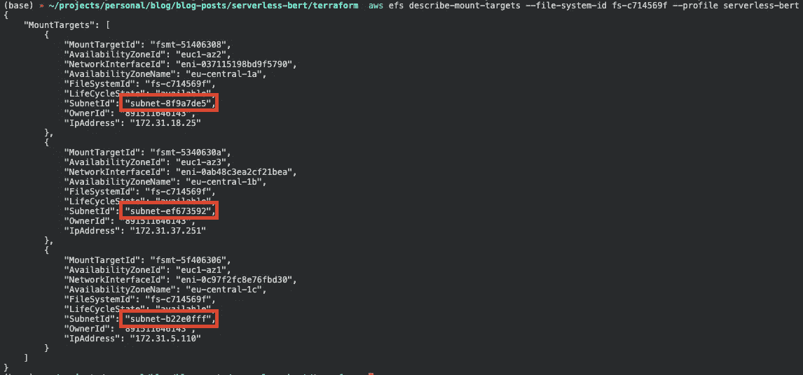
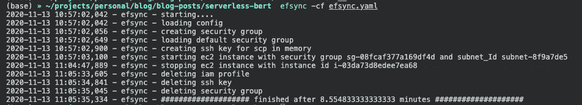
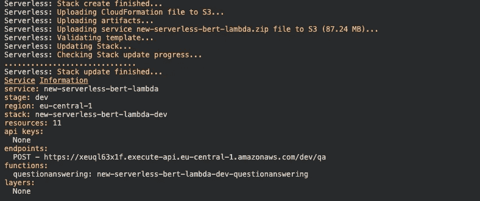
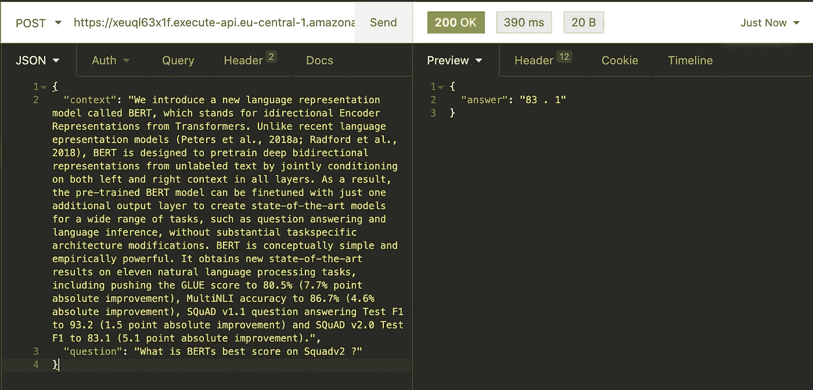

# 带有 Huggingface、AWS Lambda 和 AWS EFS 的新型无服务器 Bert

> 原文：<https://towardsdatascience.com/new-serverless-bert-with-huggingface-aws-lambda-and-aws-efs-5d8954ce654?source=collection_archive---------31----------------------->

## 使用无服务器框架、AWS Lambda、AWS EFS、efsync、Terraform、HuggingFace 的变形金刚库，构建一个无服务器问答 API

Jean-Philippe Delberghe 在 [Unsplash](https://unsplash.com/?utm_source=unsplash&utm_medium=referral&utm_content=creditCopyText) 上拍摄的照片

*原载于 2020 年 11 月 15 日*[*https://www . philschmid . de*](https://www.philschmid.de/new-serverless-bert-with-huggingface-aws-lambda)*。*

# 介绍

4 个月前，我写了文章[“使用 HuggingFace 和 AWS Lambda 的无服务器 BERT”](https://www.philschmid.de/serverless-bert-with-huggingface-and-aws-lambda)，演示了如何通过 AWS Lambda 和 HuggingFace 的 Transformers 库以无服务器方式使用 BERT。

在这篇文章中，我已经预测过 [*“伯特和他的朋友罗伯塔、GPT-2、艾伯特和 T5 将在未来几年推动商业和商业理念，并将像互联网曾经做的那样改变/颠覆商业领域。”*](https://www.philschmid.de/serverless-bert-with-huggingface-and-aws-lambda)

从那以后，BERT 在谷歌搜索中的使用从 10%的英文查询增加到几乎 100%的英文查询。但不是这样。谷歌现在用 BERT 为谷歌搜索提供超过 70 种语言的能力。

[https://youtu.be/ZL5x3ovujiM?t=484](https://youtu.be/ZL5x3ovujiM?t=484)

在本文中，我们将解决我上一篇文章中的所有缺点，比如模型加载时间、依赖大小和使用。

我们将构建和上次一样的“无服务器的 BERT 驱动的问答 API”。但是，我们没有使用压缩技术来将 Python 依赖关系融入 AWS Lambda 函数，而是使用了一个名为 [efsync](https://github.com/philschmid/efsync) 的工具。我构建了 efsync 来自动将依赖项上传到 AWS EFS 文件系统，然后将它们挂载到我们的 AWS Lambda 函数中。这允许我们将我们的机器学习模型包含到我们的函数中，而不需要从 S3 加载它。

## TL；DR；

我们将使用[无服务器框架](https://www.serverless.com/)、 [AWS Lambda](https://docs.aws.amazon.com/lambda/latest/dg/welcome.html) 、 [AWS EFS](https://aws.amazon.com/en/efs/) 、 [efsync](https://github.com/philschmid/efsync) 、 [Terraform](https://www.terraform.io/) 、HuggingFace 的 [transformers](https://github.com/huggingface/transformers) 库以及在 [SQuADv2](https://rajpurkar.github.io/SQuAD-explorer/explore/v2.0/dev/) 上微调的 Google 的`mobileBert`模型来构建一个无服务器问答 API。

你可以在这个 [Github 库](https://github.com/philschmid/new-serverless-bert-aws-lambda)中找到它的完整代码。

# 库和框架

## 无服务器框架

[无服务器框架](https://www.serverless.com/)

[无服务器框架](https://www.serverless.com/)帮助我们开发和部署 AWS Lambda 功能。它是一个 CLI，开箱即可提供结构、自动化和最佳实践。

## 自动气象站λ

[AWS Lambda 标志](https://aws.amazon.com/de/lambda/features/)

AWS Lambda 是一种无服务器的计算服务，让你无需管理服务器就能运行代码。它只在需要的时候执行你的代码，并且自动伸缩，从每天几个请求到每秒几千个请求。

## 亚马逊弹性文件系统(EFS)

[亚马逊 EFS](https://aws.amazon.com/de/efs/) 是一项完全托管的服务，可以轻松设置、扩展和优化亚马逊云中的文件存储。自 2020 年 6 月起，您可以将 AWS EFS 安装到 AWS Lambda 函数

## Efsync

[Efsync](https://github.com/philschmid/efsync) 是一个 CLI/SDK 工具，可以自动将文件和依赖项同步到 AWS EFS。它使您能够将 AWS Lambda 运行时的依赖项直接安装到 EFS 文件系统中，并在 AWS Lambda 函数中使用它们。

## 将（行星）地球化（以适合人类居住）

[Terraform 标志](https://www.terraform.io/logos.html)

[Terraform](https://www.terraform.io/) 是一款基础设施即代码(IaC)工具，用于安全高效地构建云原生基础设施。Terraform 使您能够使用 HCL (HashiCorp 配置语言)来描述您的云原生基础架构。

## 拥抱脸的变形金刚库

[HugginFace 标志](https://huggingface.co/)

[变形金刚库](https://github.com/huggingface/transformers)为自然语言理解(NLU)和自然语言生成(NLG)提供最先进的机器学习架构，如 BERT、GPT-2、罗伯塔、XLM、DistilBert、XLNet、T5。它还提供了 100 多种不同语言的数千个预训练模型。

# 建筑

由菲利普·施密德创造

# 辅导的

在我们开始之前，确保您已经配置并设置了[无服务器框架](https://serverless.com/)和[平台](https://www.terraform.io/)。此外，您需要访问 AWS 帐户来创建 EFS 文件系统、API 网关和 AWS Lambda 函数。

在教程中，我们将使用来自 Google 的预训练`BERT`模型构建一个问答 API。

我们将向 lambda 函数发送一个上下文(一小段)和一个问题，lambda 函数将使用问题的答案进行响应。

**我们要做什么:**

*   使用`terraform`创建所需的基础设施。
*   使用`efsync`上传我们的 Python 依赖到 AWS EFS。
*   用无服务器框架创建一个 Python Lambda 函数。
*   将`BERT`模型添加到我们的函数中，并创建一个推理管道。
*   配置`serverless.yaml`，添加 EFS，设置一个 API 网关进行推理。
*   部署和测试功能。

您将需要一个名为`serverless-bert`的新 IAM 用户，并使用`aws configure --profile serverless-bert`在 AWS CLI 中对其进行配置。这个 IAM 用户在完整教程中使用。如果你不知道怎么做，看看这个[链接](https://docs.aws.amazon.com/cli/latest/userguide/cli-configure-files.html)。

***注意:*** *我不建议使用* `*AdministratorAccess*`为生产使用创建 IAM 用户

在我们开始之前，我想说的是我们不会对每一步都进行详细说明。如果你想更多地了解如何在 AWS Lambda 中使用深度学习，我建议你看看我的其他文章:

*   [从零到英雄的缩放机学习](https://www.philschmid.de/scaling-machine-learning-from-zero-to-hero)
*   [如何使用 GitHub 操作和无服务器为 AWS Lambda 设置 CI/CD 管道](https://www.philschmid.de/how-to-set-up-a-ci-cd-pipeline-for-aws-lambda-with-github-actions-and-serverless)
*   [带 HuggingFace 和 AWS Lambda 的无服务器 BERT](https://www.philschmid.de/serverless-bert-with-huggingface-and-aws-lambda)
*   [efsync 我的第一个开源 MLOps 工具包](https://www.philschmid.de/efsync-my-first-open-source-mlops-toolkit)

您可以在这个 [Github 库](https://github.com/philschmid/new-serverless-bert-aws-lambda)中找到完整的代码。

# 使用`terraform`创建所需的基础设施

首先，我们使用 terraform 定义和创建所需的基础设施。如果你还没有设置，你可以看看这个教程。

作为基础设施，我们需要一个 AWS EFS 文件系统、一个访问点和一个挂载目标，以便能够在 AWS Lambda 函数中使用它。我们也可以创建一个 VPC，但出于本教程的目的，我们将使用默认的 VPC 和他的子网。

接下来，我们创建一个目录`serverless-bert/`，其中包含本教程的所有代码，还有一个包含我们的`main.tf`文件的子文件夹`terraform/`。

之后，我们用我们首选的 IDE 打开`main.tf`,并添加 terraform 资源。我为他们所有人提供了一个基本模板。如果您想定制它们或添加额外的资源，请查看[文档](https://registry.terraform.io/providers/hashicorp/aws/latest/docs)了解所有可能性。

要更改 EFS 的名字，您可以编辑`aws_efs_filesystem`资源中的值`creation_token`。否则，EFS 的名字将是“无服务器-伯特”。此外，我们在最后为`efs_access_point_id`创建了一个 SSM 参数，以便稍后在我们的`serverless.yaml`中使用。

为了使用 terraform，我们首先运行`terraform init`来初始化我们的项目和提供者(AWS)。请注意，我们必须在`terraform/`目录中。

之后，我们用`terraform plan`检查我们的 IaC 定义

完成后，我们用`terraform apply`创建我们的基础设施

# 使用`efsync`将我们的 Python 依赖关系上传到 AWS EFS

下一步是在 AWS EFS 文件系统上添加和安装我们的依赖项。因此我们使用一个叫做`efsync`的工具。我创建了 [efsync](https://github.com/philschmid/efsync) 来将 AWS Lambda 运行时的依赖项直接安装到您的 EFS 文件系统中，并在 AWS Lambda 函数中使用它们。

运行`pip3 install efsync`安装 efsync

安装完成后，我们在根目录`serverless-bert/`中创建一个`requirements.txt`，并向其中添加我们的依赖项。

Efsync 提供不同的[配置](https://github.com/philschmid/efsync#sdk)。这次我们使用带有`yaml`配置的 CLI。为此，我们在根目录中创建一个`efsync.yaml`文件。

这里我们必须调整`efs_filesystem_id`和`subnet_Id`的值。通过在管理控制台中查找或使用这两个 CLI 命令来获取这些值。

注意，如果您之前更改了`creation_token`，您必须在此处进行调整。

您可以为`efsync.yaml`配置选择一个`subnet_Ids`。如果你想了解更多的配置选项，你可以在这里阅读更多的。

在配置完我们的`efsync.yaml`之后，我们运行`efsync -cf efsync.yaml`在我们的 AWS EFS 文件系统上安装我们的 Python 依赖项。这大约需要 5-10 分钟。

# 使用无服务器框架创建 Python Lambda 函数

第三，我们通过使用带有`aws-python3`模板的无服务器 CLI 创建 AWS Lambda 函数。

这个 CLI 命令将创建一个包含`handler.py`、`.gitignore`和`serverless.yaml`文件的新目录。`handler.py`包含一些基本的样板代码。

# 将`BERT` 模型添加到我们的函数中，并创建一个推理管道

因为我们没有将 Python 依赖项包含到 AWS Lambda 函数中，所以我们有大约 250MB 的存储空间用于模型文件。对于那些不太熟悉 AWS Lambda 及其局限性的人，你可以查看这个[链接](https://www.notion.so/add-the-mobileBERTmodel-from-to-our-function-and-create-an-inference-pipeline-b5530c56acb7437c8ef1a395c4436b7d)。

如果您想使用大于 250MB 的模型，您可以使用 efsync 将它们上传到 EFS，然后从那里加载它们。更多 [*此处阅读*](https://www.philschmid.de/efsync-my-first-open-source-mlops-toolkit) *。*

要将我们的`BERT`模型添加到我们的函数中，我们必须从 HuggingFace 的[模型中枢加载它。为此，我创建了一个 python 脚本。在执行这个脚本之前，我们必须将`transformers`库安装到我们的本地环境中，并在我们的`function/`目录中创建一个`model`目录。](https://huggingface.co/models)

在我们安装了`transformers`之后，我们在`function/`目录下创建了`get_model.py`文件，并包含了下面的脚本。

为了执行这个脚本，我们在`function/`目录中运行`python3 get_model.py`。

***提示*** *:将* `*model*` *目录添加到 gitignore 中。*

下一步是调整我们的`handler.py`，包括我们的`serverless_pipeline()`。

首先，我们将所有需要的导入和我们的 EFS 文件系统添加到`PYTHONPATH`中，这样我们就可以从那里导入我们的依赖项。因此我们使用`sys.path.append(os.environ['EFS_PIP_PATH'])`。我们将在稍后的`serverless.yaml`中定义`EFS_PIP_PATH`。

我们创建了`serverless_pipeline()`函数，它初始化我们的模型和标记器，并返回一个`predict`函数，我们可以在`handler`中使用它。

# 配置`serverless.yaml`，添加 EFS，设置推理的 API 网关。

我为这个例子提供了完整的`serverless.yaml`,但是我们检查了我们的 EFS 文件系统所需的所有细节，并省略了所有的标准配置。如果你想了解更多关于`serverless.yaml`的知识，建议你去看看[从零到英雄的缩放机学习](https://www.philschmid.de/scaling-machine-learning-from-zero-to-hero)。在本文中，我介绍了每种配置，并解释了它们的用法。

我们需要用下面的命令安装`serverless-pseudo-parameters`插件。

我们使用`serverless-pseudo-parameters`插件让我们的`AWS::AccountID`在`serverless.yaml`中被引用。在`custom`下或我们的`functions`部分中引用了所有自定义变量。

**自定义:**

*   `efsAccessPoint`应该是你的 EFS 接入点的价值。这里，我们使用我们的`terraform`模板先前创建的 SSM 参数。
*   `LocalMountPath`是 EFS 在 AWS Lambda 函数中的安装路径。
*   `efs_pip_path`是我们使用`efsync`安装 Python 依赖项的路径。

**功能:**

*   `securityGroupIds`可以是 AWS 帐户中的任何安全组。我们使用`default`安全组 id。这个应该是这样的`sg-1018g448`。

*   `subnetsId`应该与 EFS 文件系统具有相同的 id。它们应该是这样的`subnet-8f9a7de5`。

# 部署和测试功能

为了部署功能，我们运行`serverless deploy --aws-profile serverless-bert`。

这个过程完成后，我们应该看到类似这样的东西。

为了测试我们的 Lambda 函数，我们可以使用失眠症、邮差或任何其他 REST 客户端。只需在请求体中添加一个带有`context`和`question`的 JSON。让我们用 colab 笔记本中的例子来尝试一下。

我们的`serverless_pipeline()`用`83.1`正确回答了我们的问题。此外，您可以看到完整的第一个请求花费了 2900 毫秒或 29 秒。其中 15 秒用来初始化我们函数中的模型。

第二个请求只用了 390 毫秒。

最棒的是，如果有几个传入请求，我们的 BERT 模型会自动扩展！它可以扩展到数千个并行请求，而不用担心任何问题。

# 结论

我们已经成功地实现了一个无服务器问答 API。对于实现，我们以无服务器的方式使用 IaC 工具和“最先进的”NLP 模型。从开发人员的角度来看，我们降低了复杂性，但包含了许多 DevOps/MLOps 步骤。我认为有必要包括 DevOps/MLOps，如果你想在生产中运行可扩展的无服务器机器学习，它可以处理你的部署和供应。

你可以在这里找到 [GitHub 库](https://github.com/philschmid/new-serverless-bert-aws-lambda)和完整的代码[。](https://github.com/philschmid/new-serverless-bert-aws-lambda)

感谢阅读。如果你有任何问题，随时联系我或评论这篇文章。你也可以在 [Twitter](https://twitter.com/_philschmid) 或者 [LinkedIn](https://www.linkedin.com/in/philipp-schmid-a6a2bb196/) 上和我联系。