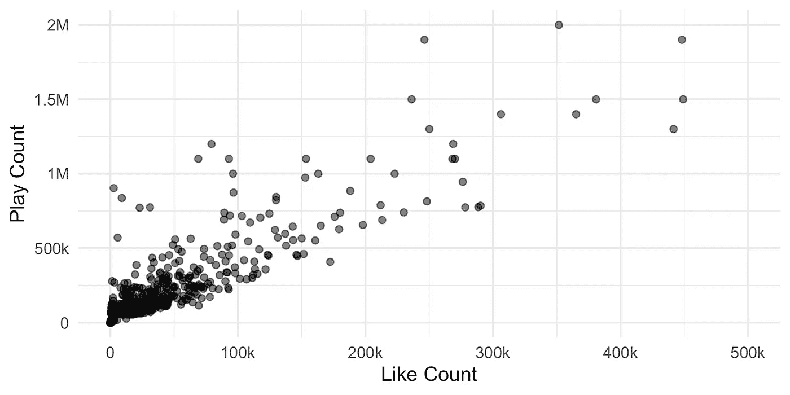
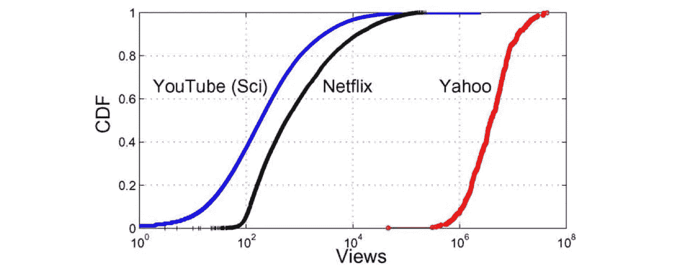
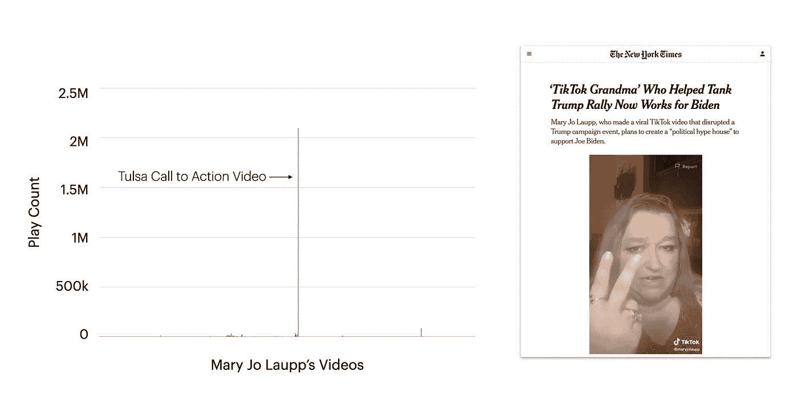
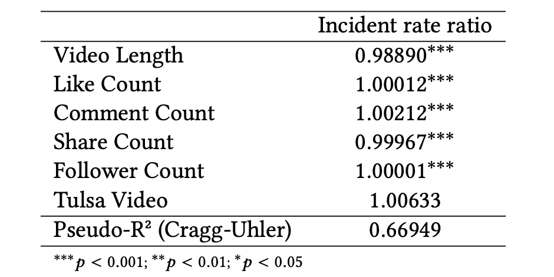

# 抖音算法和 Trump 的塔尔萨拉力赛的新研究

> 原文：<https://towardsdatascience.com/new-study-on-tiktoks-algorithms-and-trump-s-tulsa-rally-508ffb2a5ac5?source=collection_archive---------47----------------------->

## 这一事件说明了抖音的算法是如何让大众政治沟通变得更容易实现的，但这仍然不是民主乌托邦。

今年夏天，我分析了大约 8 万个抖音视频中的数据，这些视频与特朗普在塔尔萨竞选连任集会上的恶作剧有关。我的主要兴趣是理解抖音的算法是如何在这场恶作剧中发挥作用的。这篇文章总结了我的研讨会[研究论文](https://jackbandy.com/files/facctrec2020_tiktok_collective_action_sept4.pdf)的发现，该论文在 [RecSys 2020 研讨会上提出了负责任的建议](https://facctrec.github.io/facctrec2020/)。

## 背景

为什么川普政府想要禁止抖音？几周前，这款应用似乎离死亡只有几天了。但我们中的许多人仍然在问:特朗普到底为什么要禁止它？亚洲记者埃沃特[综合了三种主要解释](https://www.refinery29.com/en-us/2020/08/9945024/why-is-trump-banning-tiktok-theories):

*   美国和中国之间的紧张关系
*   抖音青少年和 K-pop 斯坦坦克他的塔尔萨集会
*   抖音的政治权力

所有这三个因素很可能影响了禁令，可能还有更多我们永远不知道的。但鉴于特朗普政府在 2020 年 7 月才开始采取行动，完整的时间表表明，塔尔萨的恶作剧可能是某种催化剂:

*   2017 年:特朗普上任
*   2018:字节跳动将 Musical.ly 融入抖音([来源](https://www.reuters.com/article/us-usa-tiktok-timeline-idUSKCN2510IU))
*   2019 年:抖音全球下载量突破 10 亿([来源](https://www.reuters.com/article/us-usa-tiktok-timeline-idUSKCN2510IU))
*   2020 年 6 月 14 日:特朗普的连任竞选活动吹嘘即将在塔尔萨举行的集会创纪录的出席人数(80 万+)

在恶作剧的前几天，前竞选经理布拉德·帕斯科吹捧破纪录的注册

*   2020 年 6 月 20 日:只有 6200 人参加的拉力赛在一个有 19000 个座位的竞技场举行

 [## 由于出席人数低于预期，特朗普取消了在塔尔萨集会上的户外演讲

### 特朗普总统在塔尔萨周六晚上的集会上取消了对竞技场外拥挤人群的演讲计划…

www.businessinsider.com](https://www.businessinsider.com/trump-canceled-outdoor-speech-at-tulsa-rally-over-low-turnout-2020-6) 

*   2020 年 6 月 20 日:[报道称](https://www.npr.org/2020/06/22/881559701/tiktok-prank-may-account-for-trump-rallys-low-attendance-rate)抖音青少年和 K-pop 歌手集体注册参加塔尔萨集会，用人为夸大的注册号码来恶作剧

国会议员亚历山大·奥卡西奥·科尔特斯回应布拉德·帕斯科，强调了韩国流行音乐斯坦斯和抖音用户的恶作剧

*   2020 年 7 月 7 日:川普建议禁止抖音([来源](https://www.reuters.com/article/us-usa-tiktok-timeline-idUSKCN2510IU)

当我读到这些事件时，我想知道抖音的“为了你”推荐算法是否在促进恶作剧中发挥了作用。因为与脸书、推特和其他主要依赖朋友、关注者或其他用户决定的网络的平台不同，抖音的应用程序采取更主动的方式向你展示媒体。一位记者这样总结这个算法:

> "为什么不开始向人们展示一些东西，看看他们会怎么做？"([约翰·赫尔曼](https://www.nytimes.com/2019/03/10/style/what-is-tik-tok.html))

第一次打开抖音应用程序时，你从一个简短的类别列表中选择兴趣(例如，烹饪、舞蹈、动物、运动等。).紧接着，抖音的推荐算法“为你”筛选出无限的视频源，[使用广泛的信号](https://newsroom.tiktok.com/en-us/how-tiktok-recommends-videos-for-you)来推断你的兴趣，并进一步个性化推荐。在很大程度上，抖音的推荐算法似乎决定了创作者视频的命运。

这让我想知道抖音的算法是如何决定塔尔萨集会恶作剧宣传视频的命运的，我和我的顾问尼克·迪亚克普洛斯(Nick Diakopoulos)就此进行了一项小型研究。由于无法直接获得抖音的数据，我们在寻找答案方面受到了一定的限制，但我们仍然能够解决三个主要的研究问题:

1.  塔尔萨的视频和其他视频相比，**的总体受欢迎程度**如何？
2.  **个人用户**如何体验塔尔萨视频的受欢迎程度？
3.  基于**统计模型**，在控制其他因素的情况下，塔尔萨视频的受欢迎程度是否得到了独特的提升？

## 资料组

我们使用大卫·蒂瑟创建的[非官方 API 收集数据集。从记者 Jenna Amatulli](https://github.com/davidteather/TikTok-Api) 收集的[视频种子开始，我们使用种子视频的标签和配乐来滚雪球般地收集样本。我们最终得到了 600 多个号召行动的塔尔萨视频，鼓励用户注册参加集会的门票作为恶作剧。然后，我们从遇到的所有用户那里收集了多达 300 个最近的视频，以此作为比较的基准。总数据集约为 80，000 个视频。](https://twitter.com/ohheyjenna/status/ 1274558069876367361)

数据集有几个值得注意的限制。首先，在抖音的界面中，所有计数都是四舍五入的，因此，例如，4，300，021 次播放被报告为“430 万次播放”第二，所有的剧都是平等报道的。“为了你”页面中的一个播放，直接分享视频的一个播放，以及第四次观看视频的人的一个播放——它们都被计算在同一个桶中。尽管如此，这些数据足够丰富，足以提供一些有力的见解。

# 结果

## 1.总体模式

我们首先观察了视频受欢迎程度的总体模式，发现视频的受欢迎程度逐例增加。本质上，我们发现了参与度反馈循环的证据，其中喜欢和评论导致更多的播放:

正如大多数抖音创作者会告诉你的，点赞越多的视频往往会获得更多的播放。

值得注意的是，我们发现创作者的观众规模并不能可靠地保证他们的视频播放。换句话说，如果一个创作者有 20 万名粉丝，就没有办法持续预测他们的新视频会吸引多少次播放——这取决于具体情况，例如视频计数和评论计数。这对许多抖音用户来说很直观，但我们的数据为这一现象提供了一些经验证据:

在我们的数据中，一些追随者很少的创作者发布了受欢迎的视频，而有很多追随者的创作者并没有持续获得大量播放。

这一阶段的分析还表明，塔尔萨的视频(促进注册)比其他视频更有可能受欢迎。例如，70%的塔尔萨视频的播放量不到 1000 次，而 85%的其他视频的播放量不到 1000 次。此外，塔尔萨相关视频的播放量中值为 292 次，而数据集其余部分的视频播放量中值为 155 次。在下图中，播放次数越多，代表 Tulsa 视频的线条明显向右移动:

塔尔萨视频的受欢迎程度分布略高，例如，只有 70%的塔尔萨视频获得 1，000 次或更少的播放，而 85%的其他视频获得 1，000 次或更少的播放。

总体受欢迎程度的“S 曲线”表明了高度的不平等。本·韦斯特(Ben West)研究了抖音的不平等，并在一份 2 万份视频样本中发现基尼系数为 0.93(“抖音几乎完全不平等”)。我们样本中的基尼系数为 0.94，证实了抖音作为一个平台的高度不平等。值得注意的是，这种模式并不是抖音独有的，事实上[之前的工作](https://ieeexplore.ieee.org/abstract/document/4801529)表明“S 曲线”在用户生成的视频平台中相当普遍:

S 曲线流行模式在以前的工作中已经发现，如查等人(2009)的“[分析大规模用户生成内容系统](https://ieeexplore.ieee.org/abstract/document/4801529)的视频流行特征”中的图表所示。

## 2.用户特定的模式

在分析的第二阶段，我们放大了特定用户，以查看他们在塔尔萨的视频表现如何。Mary Jo Laupp 的视频是我们数据集中最受欢迎的 Tulsa 视频，似乎受益于算法放大。在收集数据时(集会后几天)，Laupp 的视频播放次数远远超过 200 万次，尽管她只有大约 18，000 名粉丝，她的第二大热门视频播放次数不到 10 万次。在她所有视频的图表中，塔尔萨的视频遥遥领先于其他所有视频:

Mary Jo Laupp 的视频是我们数据集中最受欢迎的塔尔萨视频，播放量超过 200 万次。由于她当时只有大约 18000 名粉丝，我们可以有把握地推断，抖音的算法放大了视频。

正如我们在论文中报道的那样，我们发现了一些类似的案例，尽管大多数没有像玛丽·乔·劳普那样经历急剧的增长。尽管如此，对于数据集中 76%的用户来说，他们的塔尔萨视频比他们的中值视频获得了更多的播放，这证明了塔尔萨视频的总体受欢迎程度有所提高。

## 3.统计建模

最后，我们使用统计建模来确定塔尔萨视频是否经历了系统性的受欢迎程度的增加。同样，我们的数据集不能说明一切，但我们能够控制视频长度和参与度统计等因素(即计数、评论计数、分享计数)，伪 R 表明这些因素解释了数据中约 67%的变化。

> 塔尔萨视频获得了更高的参与度，从而带来了更高的播放量

根据我们的统计模型，塔尔萨的视频并没有经历系统的普及。相反，由于更高的参与度，它们获得了更高的播放次数，与我们数据集中的其他流行视频一样。换句话说，**我们没有发现抖音的算法对塔尔萨视频**给予特殊对待的证据。

统计模型发现，塔尔萨视频的播放量没有出现系统性增长。

在[的论文](https://jackbandy.com/files/facctrec2020_tiktok_collective_action_sept4.pdf)中有更多的统计细节(例如相关性测试和 Wilcoxon 符号等级测试)，这些数据都指向同一个结论:塔尔萨视频吸引了更多的用户参与，从而导致更多的播放，但它们并没有从抖音的算法中获得特殊待遇。

## 限制

即使在这样的博文中，也要注意到科学研究的局限性。我们不得不使用抖音的全面统计数据，在收集数据时，我们可能错过了一些相关的视频。给定我们的研究问题，最大的限制是我们使用总播放计数来估计算法为你页面的受欢迎程度。换句话说，我们无法区分“来自‘为你’页面的剧本”和“来自其他地方的剧本”这是媒体曝光研究中的一个标准限制，但也是一个值得注意的重要限制。

同样值得注意的是，抖音的[透明度努力](https://www.tiktok.com/transparency)可以提供关于算法推荐的视频的更多信息。例如，他们可以发布该算法推荐了 50 万次或更多次的视频列表，这将有助于提供一些问责制。

## 那又怎样？

对我来说，从我们的分析中最大的收获是**抖音用户可以帮助决定哪些视频变得流行**。在许多情况下，抖音的创作者不需要大量的追随者来接触大量的观众，他们只需要一个引人入胜的视频。这个原理相当简单，并在其他平台上使用，但抖音似乎已经破解了代码，并微调了他们的算法，不再强调朋友/追随者的作用。

在某些方面，这使得抖音成为一个非常民主的平台，因为用户可以通过简单的喜欢、评论、分享或完成一个视频来为哪些视频变得流行进行投票。事实上，创作者经常要求观众“喜欢并分享这个视频”，“保持高比例”，或者(我个人最喜欢的)“给这个视频加油。”抖音应该如何处理这种行为？Instagram 采取了惩罚性的方式。就我个人而言，我希望抖音认识到这种行为不是“游戏系统”，而是基本上为人们在应用程序中看到的视频投票。

关于投票和民主的问题，还值得考虑的是，抖音不允许政治广告。在我看来，这使得抖音对威权领导人构成了威胁，尤其是考虑到视频流行的民主、草根式投票。但是，与此同时，抖音本身在某些方面是集权和独裁的。平台[定期删除数百万视频](https://techcrunch.com/2020/09/22/tiktok-says-it-removed-104m-videos-in-h1-2020-proposes-harmful-content-coalition-with-other-social-apps/)，其强大的算法产生了明显的不平等——我们数据集中前 1%的视频占所有播放的 76%。此外，尽管[在透明度方面做出了努力](https://www.tiktok.com/transparency)，但该平台的不透明性在其向创作者付费的新方法中得到了强调，用户称这种方法“T6”充满了问题

简而言之，抖音不仅仅是一个分享视频的有趣应用程序——它具有现实世界的社会、政治和经济后果，需要进一步关注。有时，后果很有趣，比如特朗普在塔尔萨集会上的恶作剧，或者在内森·阿波达卡(Nathan Apodaca)在一个标志性的抖音喝了越橘汁后，Ocean Spray 的品牌彻底改造:

 [## 病毒海洋喷雾抖音视频如何一夜之间改变了一个 90 岁的公司

### 在商业中，时机就是一切。汤姆·海斯，我们在这里说你接任 90 岁的首席执行官的时机…

finance.yahoo.com](https://finance.yahoo.com/news/how-the-viral-ocean-spray-tik-tok-video-transformed-a-90-yearold-company-overnight-173804141.html) 

但有时后果并不像对特朗普的恶作剧或讽刺性的蔓越莓汁品牌那样有趣。我们知道像抖音这样的算法可以放大危险的虚假声明、极端主义信息和其他有问题的媒体，例如抖音在 7 月份放大的反犹太迷因。

不管后果是有趣还是令人担忧，越来越明显的是，抖音教对我们的社会产生了重大影响。鉴于这种影响，我们应该继续让抖音为它放大的信息和它制造的不平等负责。这款应用可能会对威权领导人构成威胁，但它离民主乌托邦还很远。

*如果你对我在本帖中总结的* [*研究有任何问题或意见，请联系我！*](https://jackbandy.com/files/facctrec2020_tiktok_collective_action_sept4.pdf)

凯特琳·皮特尔、布鲁克·艾琳·达菲和艾米丽·洪德写了一篇关于 Instagram pods 的令人着迷的 [*研究论文*](http://journals.sagepub.com/doi/10.1177/2056305119879995) *。维多利亚·奥米拉还写了一篇关于现象的***的精彩论文。两者都极大地帮助了我的研究。**