# 新 TF2 对象检测 API

> 原文：<https://towardsdatascience.com/new-tf2-object-detection-api-5c6ea8362a8c?source=collection_archive---------16----------------------->

## ML 提示和技巧/ TF2 OD API

## 欢迎新动物进入动物园——模型评估


(图片由作者提供)

> Tensorflow 对象检测 API (TF OD API)刚刚变得更好。最近，Google 发布了新版本的 TF OD API，现在支持 Tensorflow 2.x，这是我们一直在等待的巨大改进！

# 介绍

**物体检测(OD)技术的最新进展是由行业广泛采用该技术推动的。**汽车制造商使用物体检测来帮助车辆在道路上自主导航，医生使用它来改善他们的诊断过程，农民使用它来检测各种作物疾病……**和** **还有许多其他的使用案例(有待发现)，在这些案例中，OD 可以提供巨大的价值。**

**Tensorflow** 是一个深度学习框架，为自然语言处理(NLP)、语音合成、语义分割和**对象检测**中的许多最先进的(SOTA)模型提供支持。TF OD API 是一个**开源的对象检测模型集合**，由深度学习爱好者和该领域的不同专家使用。

现在，当我们介绍了基本术语后，**让我们看看新的 TF OD API 提供了什么！**

# 新的 TF OD API

新的 TF2 OD API 引入了**急切执行**，使得对象检测模型的调试更加容易；它还包括 TF2 模型动物园支持的新 SOTA 模型。对于 Tensorflow 1.x .用户来说，好消息是新的 OD API 是向后兼容的，所以如果你喜欢，你仍然可以使用 TF1，尽管强烈建议切换到 TF2！

除了之前 TF1 模型动物园有的 SSD (MobileNet/ResNet)、更快的 R-CNN (ResNet/Inception ResNet)、Mask R-CNN 模型外，TF2 模型动物园还推出[**CenterNet**](https://arxiv.org/abs/1904.08189)**、**[**ExtremeNet**](https://arxiv.org/abs/1901.08043)**、**[**efficent det**](https://arxiv.org/abs/1911.09070)等**新 SOTA 模型。**

[TF2 OD API 模型动物园](https://github.com/tensorflow/models/blob/master/research/object_detection/g3doc/tf2_detection_zoo.md)中的模型在 [COCO 2017](https://cocodataset.org/#home) 数据集上进行了预训练。如果你对这个数据集中已经包含的类别感兴趣，预先训练的模型可以用于**开箱即用的推理**，或者在新数据集上训练时用于**初始化你的模型**。使用 TF OD API 模型而不是自己实现 SOTA 模型**可以让您有更多的时间关注数据**，这是实现 OD 模型高性能的另一个关键因素。然而，即使您决定自己构建模型， **TF OD API 模型提供了一个很好的性能基准**！

您可以根据自己的需求(速度与精度)从一长串不同的型号中进行选择:

[TF2 OD API 模型动物园](https://github.com/tensorflow/models/blob/master/research/object_detection/g3doc/tf2_detection_zoo.md)中包含的模型。

在上表中，您可以看到**表**中仅给出了平均 COCO mAP 指标。尽管对于模型的性能来说，这可能是一个相当好的方向，但是如果您对模型在不同大小的对象或不同类型的对象上的表现感兴趣，那么**附加统计信息**可能会很有用。例如，如果你对开发你的**高级驾驶辅助系统** ( **ADAS** )感兴趣，你不会真的关心探测器探测香蕉的能力是否差！

在这篇博客中，我们将重点解释如何对 TF2 模型动物园中现成的不同预训练[**efficient det**](https://arxiv.org/abs/1911.09070)**检查站进行**详细评估。****

# 效率检测— SOTA OD 模型

[EfficientDet](https://arxiv.org/abs/1911.09070) 是一个与 RetinaNet 模型非常相似的单次检测器，有几处改进: [**EfficientNet 主干**](https://arxiv.org/pdf/1905.11946.pdf) **、加权双向特征金字塔网络(BiFPN)和复合缩放方法**。

BiFPN 是非常流行的 FPN 的改进版本。它学习表示不同输入特征重要性的权重，同时重复应用自上而下和自下而上的多尺度特征融合。

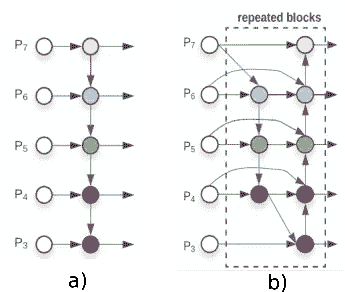

**特征网络设计** : a) FPN 引入自上而下的路径融合多尺度特征，b) BiFPN 在现有自上而下的路径上增加自下而上的路径，创建双向 FPN。来源:https://arxiv.org/pdf/1911.09070.pdf

提高目标检测模型精度的常用方法是增加输入图像的大小或使用更大的主干网络。**复合缩放不是在单个维度或有限的缩放维度上操作，而是联合放大主干、特征网络和盒/类预测网络的分辨率/深度/宽度。**

**TF2 OD API Model Zoo**中包含了具有不同缩放因子的 EfficientDet 模型，缩放因子在模型名称中用{ *X}* 表示，而输入图像分辨率用*{ RES }*X {*RES }*efficient det D {*X }*{*RES }*X {*RES }*表示。

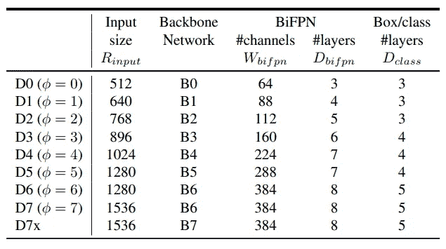

**用于高效检测的复合缩放配置**。来源:[https://arxiv.org/pdf/1911.09070.pdf](https://arxiv.org/pdf/1911.09070.pdf)

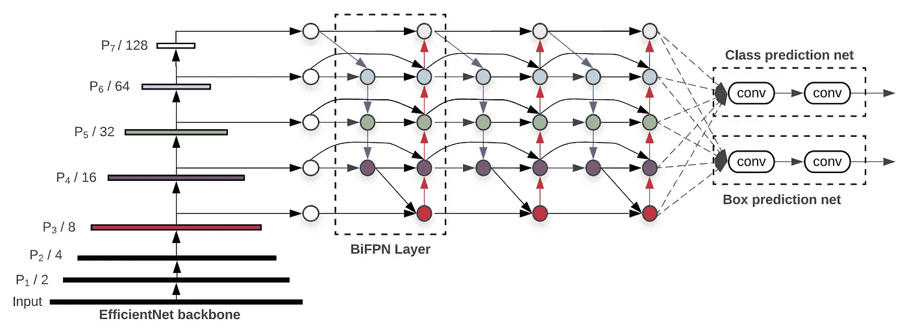

**EfficientDet 架构**采用 EfficientNet 作为主干网络，BiFPN 作为特征网络，以及共享类/箱预测网络。来源:[https://arxiv.org/pdf/1911.09070.pdf](https://arxiv.org/pdf/1911.09070.pdf)

# 预训练 EfficientDet 模型的评估

我们希望进行详细的精度比较，以研究复合扩展配置对网络本身性能的影响。出于这个原因，我们创建了一个 [Google Colab 笔记本](https://colab.research.google.com/drive/1h9fJm6D6VhGpJqpCxOklEWmtH-luLtCM?usp=sharing)，在其中我们解释了如何对模型进行评估，以及如何有效地比较评估结果。我们对**详细的评估统计感兴趣，包括每个类和不同对象大小的统计**。

不幸的是，TF OD API 不支持这种现成的统计数据。这就是为什么我们创建了 TF OD repo 的一个分支[，并更新了相关脚本，以按照本期](https://github.com/qraleq/models/tree/master/research/object_detection)[中给出的说明引入该功能。](https://github.com/tensorflow/models/issues/4778#issuecomment-430262110)

在笔记本中，我们提供了**如何设置**[**tensor flow 2**](https://colab.research.google.com/drive/1h9fJm6D6VhGpJqpCxOklEWmtH-luLtCM#scrollTo=a3oHKsyCB9Jc&line=1&uniqifier=1)**和**[**TF2 OD API**](https://colab.research.google.com/drive/1h9fJm6D6VhGpJqpCxOklEWmtH-luLtCM#scrollTo=U7wVe_nICeWa&line=9&uniqifier=1)的说明。我们还包括**脚本，可以轻松下载 EfficientDet 检查点**，以及额外的**脚本，可以帮助您获取 COCO 2017 Val 数据集，并创建 *tfrecord* 文件**，供 TF OD API 在评估阶段使用。

最后，我们修改 EfficientDet 检查点的`pipeline.config`文件，为后续评估 **8 EfficientDet 检查点**做好准备。TF OD API 使用它们来配置培训和评估过程。培训管道的模式可在`object_detection/protos/pipeline.proto`中找到。在高层次上，配置文件分为 5 个部分:

1.  `model`的配置。这定义了将被训练的模型的类型(即，元架构、特征提取器……)。
2.  `train_config`，决定用什么参数来训练模型参数(即 SGD 参数、输入预处理、特征提取器初始化值……)。
3.  `eval_config`，它决定将报告什么样的**组指标进行评估。**
4.  `train_input_config`，它定义了模型应该在哪个数据集上进行训练。
5.  `eval_input_config`，其中**定义了模型将在**上评估的数据集。通常，这应该不同于训练输入数据集。

```
model {
(... Add model config here...)
}train_config : {
(... Add train_config here...)
}train_input_reader: {
(... Add train_input configuration here...)
}eval_config: {
}eval_input_reader: {
(... Add eval_input configuration here...)
}
```

我们只对配置文件的`eval_config`和`eval_input_config`部分感兴趣。仔细查看 Google Colab 中的[单元格](https://colab.research.google.com/drive/1h9fJm6D6VhGpJqpCxOklEWmtH-luLtCM#scrollTo=20taX9u9rBq0&line=1&uniqifier=1)，了解我们如何设置评估参数的更多详细信息。TF OD API 中另外两个没有启用的标志是`include_metrics_per_category`和`all_metrics_per_category`。在应用了 Colab 笔记本中给出的补丁后，当设置为`true`时，这两个选项将启用我们感兴趣的**详细统计(按类别和大小)**！

# Allegro Trains —高效的实验管理

为了能够有效地比较模型评估，我们使用一个名为 [**的**开源实验管理工具来训练****](https://allegro.ai/trains-open-source/?utm_source=i_blog&utm_medium=referral&utm_campaign=trains_c) **。很容易将它集成到您的代码中，并且它支持开箱即用的不同功能。它可以作为[张量板](https://www.tensorflow.org/tensorboard)的替代品，用于可视化实验结果。**


来源:[https://allegro . ai/WP-content/uploads/2019/11/allegro-logo-1 . jpg](https://allegro.ai/wp-content/uploads/2019/11/allegro-logo-1.jpg)

OD API 中的主脚本是`object_detection/model_main_tf2.py`。它处理训练和评估阶段。我们创建了一个[小脚本](https://colab.research.google.com/drive/1h9fJm6D6VhGpJqpCxOklEWmtH-luLtCM#scrollTo=VWvp0CrjyASm&line=2&uniqifier=1)，它在一个循环中调用`model_main_tf2.py`来评估所有 EfficientDet 检查点。

为了将 [Allegro Trains](https://allegro.ai/trains-open-source/?utm_source=i_blog&utm_medium=referral&utm_campaign=trains_c) 实验管理集成到评估脚本中，我们必须添加 2 (+1)行代码。在`model_main_tf2.py`脚本中，我们添加了以下几行:

```
from trains import Tasktask = Task.init(project_name="*NAME_OF_THE_PROJECT*", task_name="*NAME_OF_THE_TASK*")# OPTIONAL - logs the pipeline.config into the Trains dashboard
task.connect_configuration(FLAGS.pipeline_config_path)
```

火车会自动开始为你记录许多事情。你可以在这里找到全面的特性列表[。](https://allegro.ai/docs/concepts_arch/concepts_arch/)

# 比较不同的效率检测模型

**在这个** [**链接**](https://demoapp.trains.allegro.ai/projects/8d752f81080b46cb9bf6ebcaf35bc8d2/experiments?columns=selected&columns=type&columns=name&columns=tags&columns=status&columns=project.name&columns=users&columns=started&columns=last_update&columns=last_iteration&order=-name) **上，可以找到 TF2 OD API** 收录的 8 款 EfficientDet 车型的评测结果。我们将实验命名为`efficientdet_d{X}_coco17_tpu-32`，其中`{x}`表示 EfficientDet 模型的复合比例因子。如果您运行示例 Colab 笔记本，您将得到相同的结果，并且您的实验将显示在[演示训练服务器](https://demoapp.trains.allegro.ai/)上。

**在本节中，我们将向您展示如何有效地比较不同的模型，并验证它们在评估数据集上的性能。**我们使用 **COCO 2017 Val 数据集**，因为它是 TF OD API 中评估对象检测模型的标准数据集。

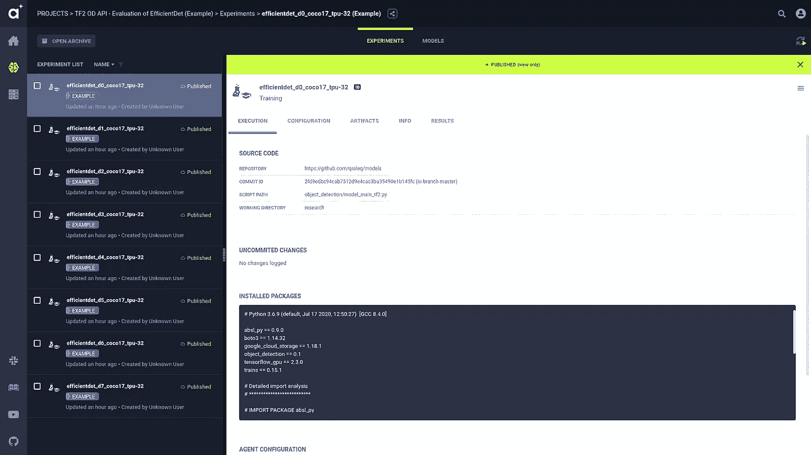

Trains 自动捕获代码、超参数和度量(图片由作者提供)。

**我们感兴趣的是** [**COCO 对象检测模型评价指标**](https://cocodataset.org/#detection-eval) **。**按下[这里的](https://demoapp.trains.allegro.ai/projects/8d752f81080b46cb9bf6ebcaf35bc8d2/experiments/950e39d811aa413d81aa0f2c8cbf0e5a/info-output/metrics/scalar?columns=selected&columns=type&columns=name&columns=tags&columns=status&columns=project.name&columns=users&columns=started&columns=last_update&columns=last_iteration&order=-name)查看实验结果。该页面包含我们感兴趣的所有指标的图表。

我们可以先看一下`DetectionBoxes_Precision`图，它包含数据集中所有类别的**平均精度度量。地图度量的值对应于 [TF2 动物园模型](https://github.com/tensorflow/models/blob/master/research/object_detection/g3doc/tf2_detection_zoo.md)的表格中报告的地图度量。**

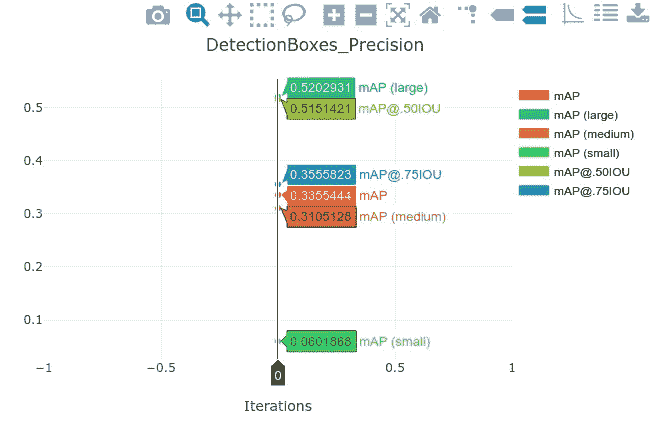

COCO 2017 评估数据集中所有类别的 detection boxes _ Precision metrics(图片由作者提供)。

多亏了我们对`pycocotools`应用的补丁，我们还可以得到每个类别的**地图度量**。由于 COCO 数据集中有 90 个类别，我们想知道每个类别对平均准确度的贡献。通过这种方式，我们可以对被评估模型的性能有更加**的深入了解。**例如，您可能只对某个类别中的小对象的模型表现感兴趣。从汇总的统计数据来看，不可能获得这样的洞察力，而建议的补丁可以做到这一点！

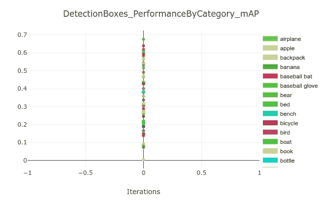

EfficientDet D0 模型的每个类别映射指标(图片由作者提供)。

**我们还使用 Allegro Trains 的功能来比较多个实验。实验对比显示了模型之间的所有差异。**我们首先可以获得相关统计数据的详细标量和绘图比较。在我们的示例中，我们将比较 EfficientDet D0、D1 和 D2 模型的性能。**显然，复合缩放对模型的性能有积极影响。**

拥有每个类别的统计数据的额外好处之一是，您可以**分析复合比例因子对某个感兴趣类别的准确性的影响。**例如，如果您对检测监控视频中的公交车感兴趣，您可以**分析显示公交车类别的地图性能与 EfficientDet 模型的复合比例因子的图表。**这有助于决定使用哪种模型，以及性能和计算复杂性之间的最佳平衡点在哪里！

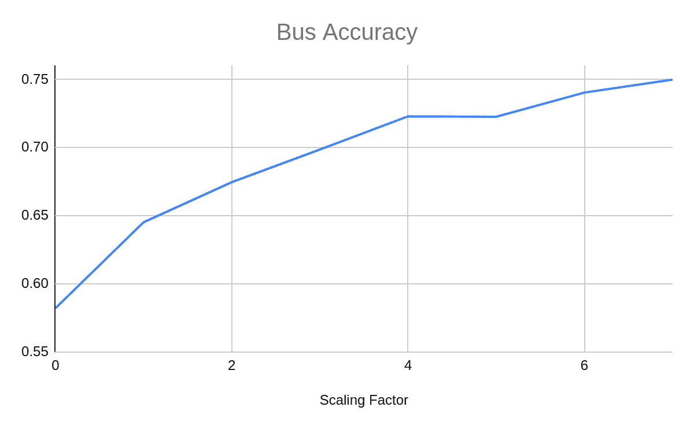

“bus”**类别的映射指标与 EfficientDet 模型的复合比例因子(图片由作者提供)。**

**您还可以**比较的一件有趣的事情是模型配置文件** `pipeline.config.`您可以看到 EfficientDet 模型之间的基本差异在于输入图像的尺寸和滤波器的数量/深度，如前所述。**

**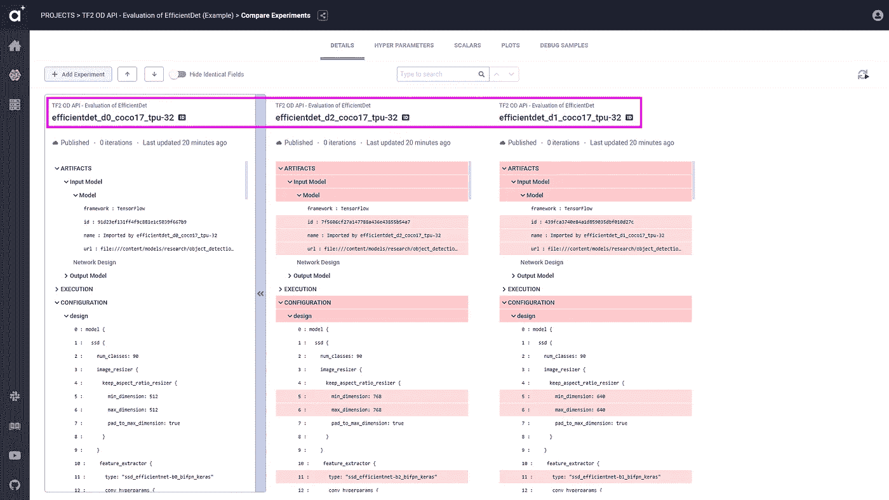**

**(图片由作者提供)**

**下一个图包含 3 个 EfficientDet 模型的 mAP 值。有一个**明显的好处是增加输入图像的分辨率，以及增加模型**中的滤镜数量。虽然 D0 模型实现了 33.55%的平均动脉压，但 D2 模型优于它，它实现了 41.79%的平均动脉压。您还可以尝试执行每个类的比较、其他 EfficientDet 模型的比较，或者您对应用程序感兴趣的任何事情。**

**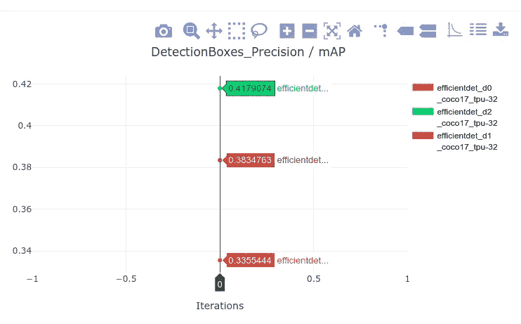**

**EfficientDet D0、D1 和 D2 车型的地图对比(图片由作者提供)。**

# **TF OD API 是如何用于提高工地安全的？**

**Forsight 是一家早期创业公司，我们的使命是将建筑工地变成工人的安全环境。 [Forsight](https://forsight.ai/) 利用计算机视觉和机器学习，处理实时闭路电视镜头，帮助安全工程师监控个人防护设备(PPE)的正确使用，以保持现场安全。**

**我们的施工现场监控管道建立在 TF OD API 之上，其功能包括 **PPE 检测和监控、社交距离跟踪、虚拟地理围栏监控、禁止停车区监控和火灾探测**。在 Forsight，我们还使用 Trains 来跟踪我们的实验，在团队成员之间分享它们，并记录一切，以便我们可以重现它。**

**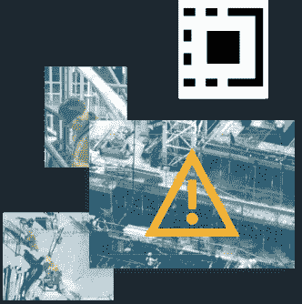**

**(图片由作者提供)**

**随着新冠肺炎疫情的继续，世界各地的建筑项目都在积极寻找在保证工人安全的同时重启或继续项目的方法。计算机视觉和机器学习可以帮助建筑经理确保他们的建筑工地是安全的。我们建立了一个实时监控渠道，跟踪员工之间的社交距离。**

**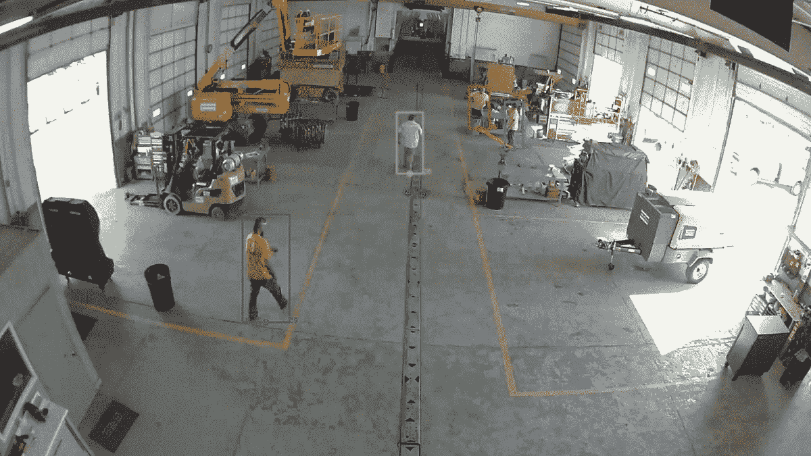**

**使用 TF OD API 进行社交距离监控(图片由作者提供)。**

**除了新的无形的 COVID 威胁之外，所有建筑工人每天都面临一些古老的危险，特别是**“致命四大危险”:坠落、被物体击中、夹在物体之间以及触电危险。确保工人穿戴个人防护装备对建筑工地的整体安全至关重要。TF OD API 是构建自主 PPE 监控管道的一个很好的起点。**我们的下一篇博客将讨论如何使用新的 TF OD API 训练一个基本的头盔探测器。******

****

**使用 TF OD API 的个人防护装备(PPE)监测(图片由作者提供)。**

**建筑工地的某些区域比其他区域更危险。创建虚拟地理围栏区域并使用 CCTV 摄像机对其进行监控，为施工经理增加了巨大的价值，因为他们可以专注于其他任务，同时了解工地上发生的任何地理围栏违规事件。此外，地理围栏可以很容易地扩展到监控机器和重型设备的访问。**

****

**使用 OD API 进行地理围栏监测(图片由作者提供)。**

# **结论**

**在这篇博客中，我们讨论了使用新的 TF2 OD API 的**好处。我们已经展示了如何**有效地评估 TF2 OD API 模型动物园**中现成的预训练 OD 模型。我们还展示了如何使用 **Allegro Trains 作为高效的实验管理解决方案，实现强大的洞察力和统计**。最后，我们展示了一些**建筑环境中物体检测的真实应用**。****

> **这个博客是提供关于使用 TF2 OD API 的指导和建议的博客系列中的第**个博客。在下一篇博客中，我们将展示**如何训练一个定制的对象检测器，使您能够检测穿着 PPE 的工人**。请关注我们，获取更多实践教程！此外，如果您有任何问题或意见，请随时联系我们！****

**[1]“现代卷积物体探测器的速度/精度权衡”
黄 J、拉特霍德 V、孙 C、朱 M、科拉迪卡拉 A、法蒂 A、菲舍尔 I、沃伊娜 Z、
宋 Y、S、墨菲 K、2017**

**[2] TensorFlow 对象检测 API，[https://github . com/tensor flow/models/tree/master/research/Object _ Detection](https://github.com/tensorflow/models/tree/master/research/object_detection)**

**[3]“Efficient det:可扩展和高效的对象检测”谭明兴，庞若明，郭诉乐，**

**[4]“efficient net:卷积神经网络模型缩放的再思考”谭明星和郭诉乐，2019，**