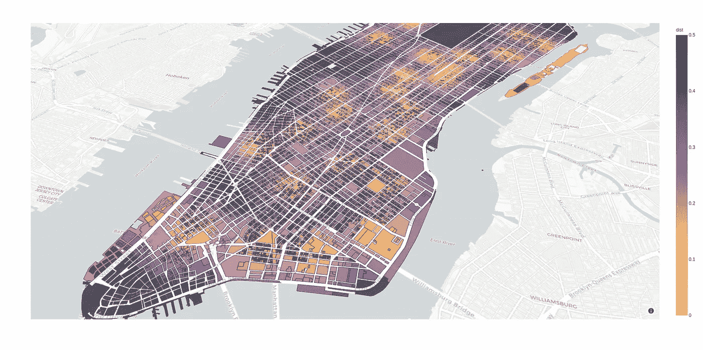
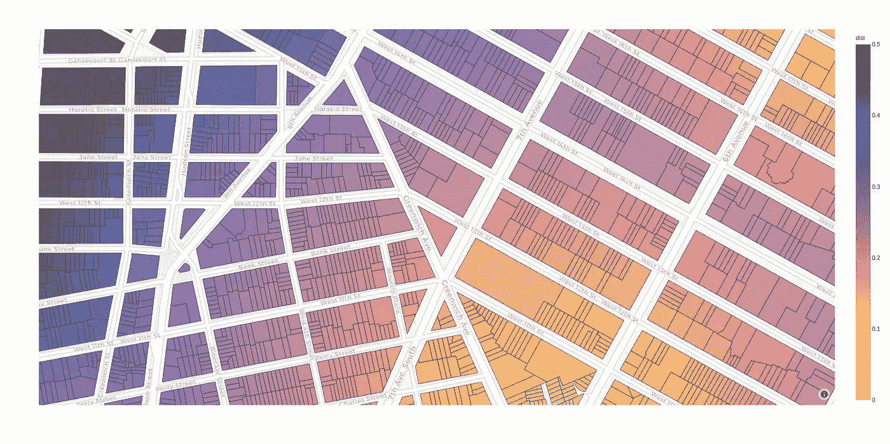
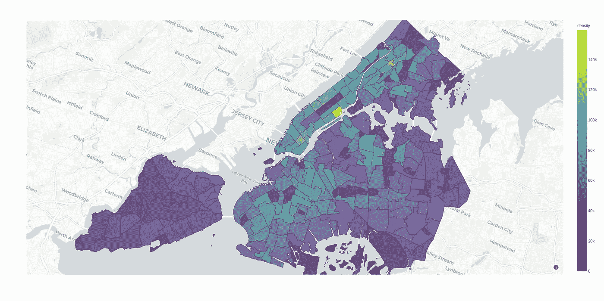

# 数据可视化新手？从纽约市开始

> 原文：<https://towardsdatascience.com/new-to-data-visualization-start-with-new-york-city-107785f836ab?source=collection_archive---------11----------------------->

## [视频教程](https://towardsdatascience.com/tagged/video-tutorial)

## 我是如何利用纽约的大量公开数据以及 Plotly 和 Pandas 来发展我的数据可视化技能的

本文附有视频，并演示了第一个示例的代码。

# 介绍

像许多其他人一样，由于冠状病毒，我已经在家工作了几个星期。部分受 [Terence Shin](https://medium.com/u/360a9d4d19ab?source=post_page-----107785f836ab--------------------------------) 关于隔离期间尝试数据科学项目的[文章](/14-data-science-projects-to-do-during-your-14-day-quarantine-8bd60d1e55e1)的启发，我决定利用一些空闲时间来提高我的数据科学技能。我是一名高中计算机科学教师，鉴于数据科学在当今世界日益突出，将数据科学技能添加到我可以教给学生的内容组合中对我来说很重要。我学到的一件事是，如果你想自学数据可视化，纽约市是一个很好的起点，我将在本文中解释为什么。在这个过程中，我将提供一些小型的纽约主题项目的例子，您可以试着更加熟悉如何用 Python 处理和可视化数据。



曼哈顿的 choropleth 地图，其中每个地块根据其到最近的公共图书馆的距离进行着色。

# 原因 1:数据，数据，数据

纽约市提供了大量高粒度的公共数据(在某些情况下可以精确到单个建筑)。你可以很容易地找到关于评估财产价值、按邮政编码划分的收入等级、公共设施位置等信息。此外，有很好的定制下载程序可以得到你需要的数据。

纽约市开放数据网站是搜索公开可用数据集和下载文件的一个很好的起点。

> 纽约开放数据门户:[https://opendata.cityofnewyork.us/](https://opendata.cityofnewyork.us/)

纽约市政府发布了一个名为 [PLUTO](https://www1.nyc.gov/site/planning/data-maps/open-data/dwn-pluto-mappluto.page) 的数据集，其中包含了该市每一个地段的税务相关信息。使用这个庞大的数据集，您可以获得关于城市中任何给定地块的各种信息，例如建筑面积的平方英尺数、楼层数、用于税收目的的评估财产价值、所有者的姓名等等。此外， [MapPLUTO](https://www1.nyc.gov/site/planning/data-maps/open-data/dwn-pluto-mappluto.page) 数据集将这些数据与地理数据合并，为城市中的每个地块提供多边形。访问这些数据的一个很好的工具是 Chris Whong 的自定义 PLUTO downloader，它可以让您准确地选择您想要下载的城市区域，以及您想要的 PLUTO 数据的列。

> Chris Whong 的纽约冥王星自定义数据下载器:【https://chriswhong.github.io/plutoplus/ 

纽约市首都规划平台是另一个优秀的自定义下载平台，您可以在其中查看所有公共设施，如公园、学校、医院、青年中心、停车场等。一旦您细化了您的选择，您可以下载数据作为一个 CSV 文件。

> 纽约市首都规划平台:[https://Capital Planning . NYC . gov/map/facilities # 10/40.7128/-74.0807](https://capitalplanning.nyc.gov/map/facilities#10/40.7128/-74.0807)

# 原因 2:可识别性

作为一个标志性的全球城市，纽约既是商业圣地，又是旅游热点，还是无数电影和电视剧的背景，它的品牌知名度很高。大多数人可能对纽约的地理有一些基本的了解，如中央公园、五个区、纽约的一些街区(如上东区、哈莱姆区等)。).


照片由[杰梅因·Ee](https://unsplash.com/@eejermaine?utm_source=medium&utm_medium=referral)在 [Unsplash](https://unsplash.com?utm_source=medium&utm_medium=referral) 上拍摄

这种可识别性可以帮助您在预处理数据时理解数据，或者在您点击 run 时对结果进行检查。但是，即使你对这个城市不熟悉，其他观看你作品的人也很有可能会很熟悉。这使得涉及纽约市数据的项目非常适合个人作品集、博客或其他您希望与其他人分享以展示您的技能的媒体。

# 原因 3:多样性和密度

纽约既人口稠密又非常多样化。这些因素有助于使与纽约市相关的可视化更加有趣；可以在单个邻域的水平上进行非常有意义和数据丰富的可视化。它的多样性提供了许多分析和可视化数据的维度，尤其是以视觉或地图的形式，包括以下示例:

*   社会经济地位与地理的关系
*   种族/民族和地理之间的关系
*   语言和地理的关系


由[伊恩·杜利](https://unsplash.com/@sadswim?utm_source=medium&utm_medium=referral)在 [Unsplash](https://unsplash.com?utm_source=medium&utm_medium=referral) 上拍摄

# 范例项目#1:根据到最近图书馆的距离绘制曼哈顿地图

## 目标

这个项目的目标是可视化每个地块到最近图书馆的距离。但是，使用非常类似的过程，您还可以可视化到许多不同感兴趣要素的距离，例如地铁站、公园、学校或医院。choropleth 地图提供了一种极好的方式来直观显示大量地理数据。使用这种方法，很容易识别城市中潜在的“阅读沙漠”或“绿色空间沙漠”。

## 数据

我使用了 [MapPLUTO 数据集](https://www1.nyc.gov/site/planning/data-maps/open-data/dwn-pluto-mappluto.page)来加载曼哈顿所有地块的信息，包括它们的纬度和经度。我还使用纽约市首都规划平台下载了曼哈顿所有图书馆的数据，包括它们的名称和纬度/经度。然后，我将这些数据作为熊猫数据帧加载到我的 Python 程序中。

## 计算到最近图书馆的距离

我第一次尝试计算每个批次的最近库是一种幼稚的蛮力方法，如下面的代码片段所示。由于大量的冗余计算，这被证明太慢了。

```
df['dist'] = df['coord'].apply(lambda x: min([geopy.distance.distance(x, y).km for y in libs['coord']]))
```

我的重大突破是想起了大学的一次讲座，教授提到了一种叫做 K-D 树的东西。这是一种为快速找到给定点的最近邻而优化的数据结构。这个的一个实现包含在`sklearn.neighbors`库中。因为我们处理的是(纬度，经度)坐标对，所以我们应该使用带有“哈弗辛”距离度量的`BallTree`。使用这个库来计算最近的库将运行时间加快了几个数量级。



到最近图书馆的距离是在单个批次的水平上计算的，给出了图书馆访问的细粒度视图。

## 我学到了什么

1.  **明智地使用 choropleth 地图。**它们在某些情况下可能很棒，但在其他情况下可能会误导人。例如，美国 2016 年总统选举结果的县级 choropleth 地图会给人以该国绝大多数人投票给红色的印象，但这是误导性的，因为人口密度更高的地区倾向于投票给蓝色。
2.  **算法效率至关重要。**尤其是在处理大型数据集时，要注意你是否在执行许多冗余的计算。做一些研究，看看是否有工具可以更好地完成你的部分任务，这样你就不会重复发明轮子。

## 代码

在[https://github.com/thomashikaru/nycvisualization](https://github.com/thomashikaru/nycvisualization)访问数据文件和代码。

# 范例项目#2:根据人口密度绘制纽约市社区地图

## 目标

这个项目的目标是可视化纽约市不同社区的人口密度。稍加变化，同样的方法可用于可视化种族、收入或其他特征的分布。

## 数据

除了将城市划分为单独的地段或邮政编码之外，还可以将城市划分为相邻的制表区域。这些对应于纽约熟悉的街区，如上西区、唐人街或公园坡。找到包含每个邻域人口的数据文件相对容易，使用纽约开放数据工具下载包含邻域边界多边形的 GeoJSON 文件也相对容易。

## 从人口转换到密度

用总人口数来给地图着色可能会产生误导，因为社区的大小差别很大。相反，我们可以根据人口密度给地图上色。这需要计算每个邻域的面积，而这并不直接包含在数据中。使用`area`库，我们可以计算每个 GeoJSON 多边形的面积，然后使用这些值计算密度(人口除以面积)。



Choropleth 地图根据人口密度显示纽约市的邻近地区。

## 我学到了什么

1.  **(再次)明智地使用 choropleth 地图。**每个邻域的大小变化很大，有些随意。可视化每个邻域的密度比绝对人口更有意义。
2.  将不同来源的数据结合起来。每个邻域的人口数据存储在一个 CSV 文件中(我将该文件读入 Pandas DataFrame)，而每个邻域的多边形存储在 GeoJSON 文件中。我浏览了 GeoJSON 文件，制作了一个字典，将每个社区代码映射到它的区域，然后使用了熊猫。Series.map()函数将数据帧中的邻域与相应的区域进行匹配，以计算密度值。

## 代码

在 https://github.com/thomashikaru/nycvisualization 的[访问数据文件和代码。](https://github.com/thomashikaru/nycvisualization)

# 摘要

如果您是数据科学或数据可视化的新手，可以考虑选择纽约市作为起点，这样可以花更少的时间寻找数据，花更多的时间获取新技能。利用现有的大量数据和优秀的定制下载程序。

尝试上面提到的项目之一，熟悉有用的数据科学工具如 Pandas 和 Plotly，以及常用的数据格式如 GeoJSON 和 CSV。

我希望你学到了新东西。祝你在学习旅途中好运！

## 参考

[1] T. Shin， [14 天隔离期间要做的 14 个数据科学项目](/14-data-science-projects-to-do-during-your-14-day-quarantine-8bd60d1e55e1) (2020)，中等。

[2] N. Piepenbreier，[用 Python 漂亮地可视化新冠肺炎数据(不超过 5 分钟)](/visualizing-covid-19-data-beautifully-in-python-in-5-minutes-or-less-affc361b2c6a) (2020)，中等。

[3] E .马尔迪，[如何用 plottly](/how-to-create-interactive-map-plots-with-plotly-7b57e889239a)(2020)创建交互式地图地块，中。

[4] T. Shin，[如何用 Choropleth 图谱可视化疫情冠状病毒](/visualizing-the-coronavirus-pandemic-with-choropleth-maps-7f30fccaecf5) (2020)，中等。