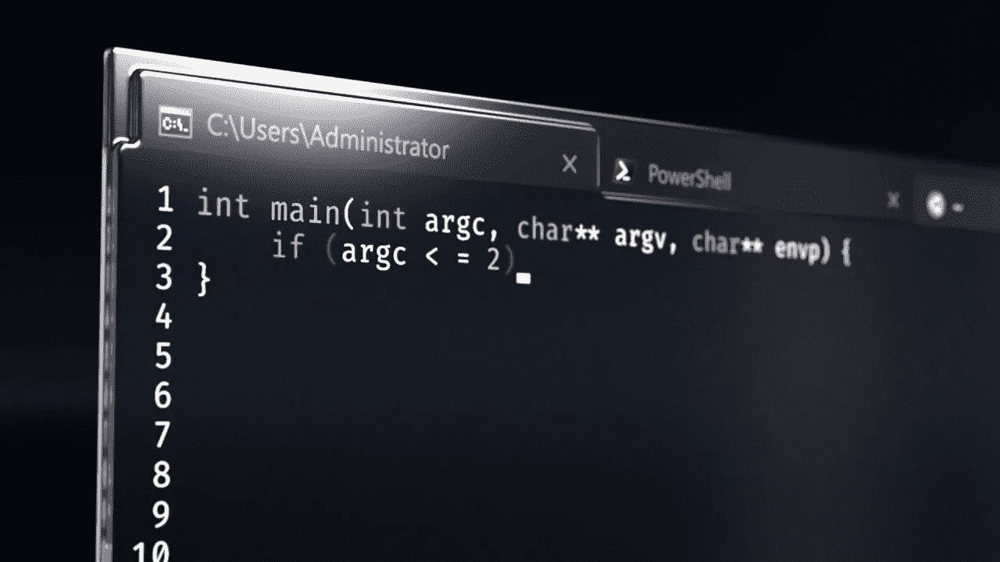
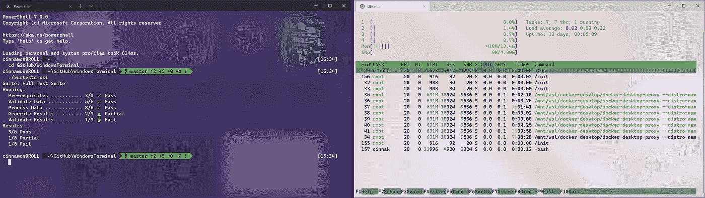
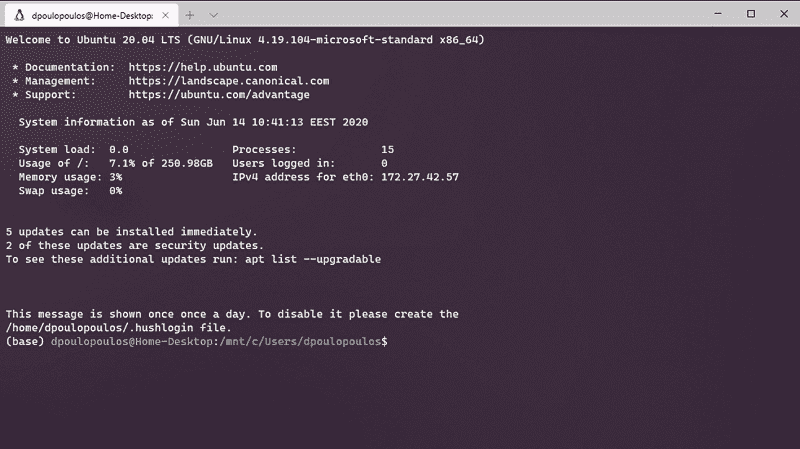
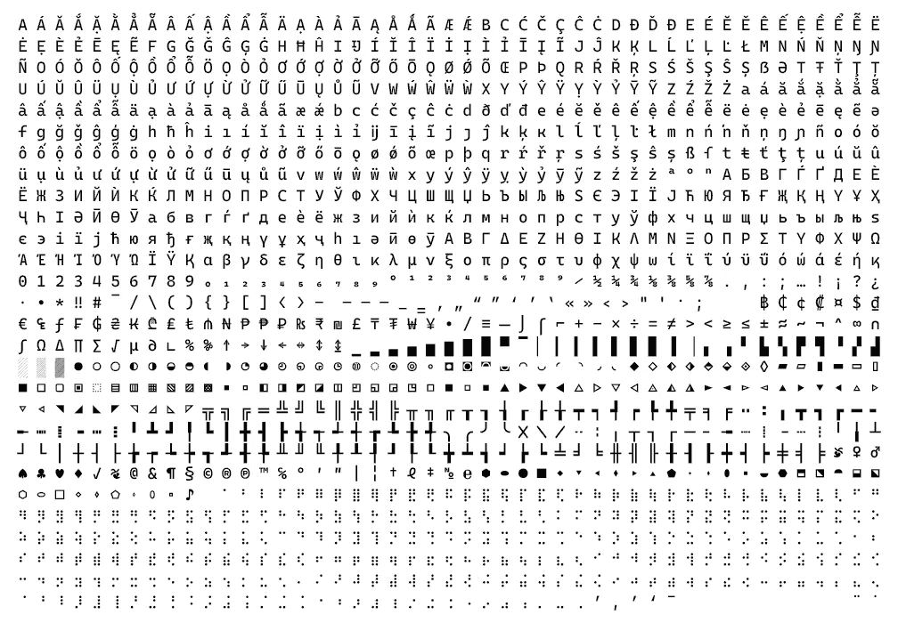
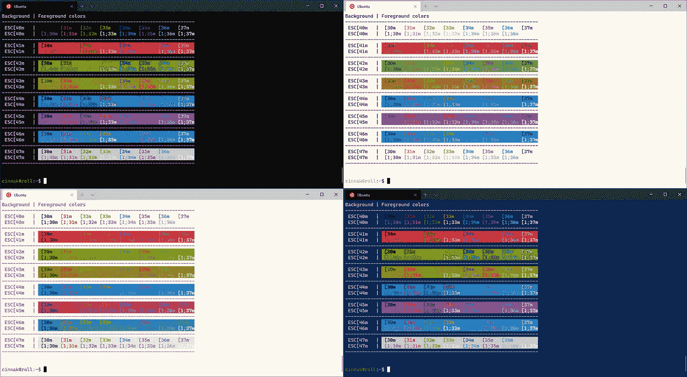
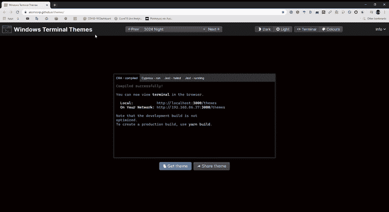

# 新的 Windows 终端:你不能要求更多

> 原文：<https://towardsdatascience.com/new-windows-terminal-the-best-you-can-have-9945294707e7?source=collection_archive---------2----------------------->

## 新的 Windows 终端在一个智能和高度可定制的包中结合了一切。



新的微软视窗终端

[GNOME 终端](https://help.gnome.org/users/gnome-terminal/stable/introduction.html.en)、[终结者](https://gnometerminator.blogspot.com/)、 [Cmder](https://cmder.net/) 、[Hyper](https://hyper.is/)……很多用户信誓旦旦的 shell 接口和终端模拟器。有些提供更好的功能，有些提供便利或扩展的可定制性。

> GNOME 终端，Terminator，Cmder，Hyper…很多用户信誓旦旦的 shell 接口和终端模拟器。但是神话和现实有交换思想的倾向。因此，每隔一段时间就会出现一种新的力量来统治他们。

依我拙见，《终结者》是天赐之物，直到最近还是我的司机。它提供了你能从终端模拟器中得到的一切，没有 Cmder 或 Hyper 的小故障。但是神话和现实有交换思想的趋势，因此，经常会出现一个新的国王来统治他们。

这一次，王者不知从哪里冒出来，而且是新的[微软 Windows 终端](https://github.com/microsoft/terminal)。我的意思是，**谁会想到微软会开发一个新的终端模拟器，它结合了你想要命令行工具做的任何事情，是开源的和高度可定制的？**在这个故事中，我们将深入了解新的微软终端，熟悉它的功能，并看看我们如何对它进行定制。

> [学习率](https://www.dimpo.me/newsletter)是我每周给那些对 AI 和 MLOps 世界好奇的人发的简讯。你会在每周五收到我关于最新人工智能新闻、研究、回购和书籍的更新和想法。在这里订阅！

# 新的 Windows 终端

Windows 终端是一个现代的、快速的、高效的、强大的和多产的终端应用程序。它结合了许多命令行工具和 Shell，如命令提示符、PowerShell 和 WSL(Linux 的 Windows 子系统)。因此，在一个应用程序中，我们可以为 Windows 用户提供命令提示符和 Powershell，为 Linux 终端高级用户提供 bash。



PowerShell 和 Ubuntu 并肩运行

Windows 终端的主要功能包括多个选项卡，其中有不同的命令行工具，分割区域，Unicode 和 UTF-8 字符支持，GPU 加速的文本渲染引擎，以及在主题和配置选项之间切换的简单方法。Windows 终端是一个开源项目，它将利用不断增长的贡献者社区继续扩展其功能。

# 装置

安装再简单不过了；只需前往[微软商店](https://www.microsoft.com/de-at/p/windows-terminal/9n0dx20hk701?rtc=1&activetab=pivot:overviewtab)并安装应用程序。Windows 终端也将继续通过商店接收自动更新；因此，您将始终拥有最新的稳定版本。

# 关键特征

新的 Windows 终端不会取代 PowerShell 或命令提示符。它们都在那里，您可以将它用作单独的控制台。但是它将它们结合在一个新的简洁的界面中。您还可以运行其他终端，就像我们将看到的那样，因此，让我们来看看主要功能。

*   **多标签:**终端最需要的特性是多种标签支持。使用新的 Windows 终端，您可以运行自己选择的不同命令行工具或应用程序(例如，命令提示符、PowerShell、WSL 上的 Ubuntu、通过 SSH 的 Raspberry Pi 等)。)



多标签支持

*   **活力文字:**新的 Windows 终端使用了 GPU 加速的文字渲染引擎。你可以在那里展示任何你想要的东西，无论是图标还是表情符号。由于一种叫做[卡斯卡迪亚码](https://github.com/microsoft/cascadia-code)的新字体，CJK 表意文字和编程连字也成为可能。



卡斯卡迪亚码字符

*   **可配置性:**新的 Windows 终端——本质上是一个大型 JSON 文档——的设置为您提供了对每个 shell 外观的大量控制。您可以为 PowerShell、命令提示符、Ubuntu 终端甚至 SSH 连接创建不同的配置文件，每个文件都有自己的字体样式和大小、颜色主题、背景模糊/透明级别等。要获得灵感，请前往 [Windows 终端主题](https://atomcorp.github.io/themes/)。



Windows 终端主题

# bash on Windows 上的 Ubuntu

Bash on Ubuntu on Windows 微软在 [//Build 2016](https://devblogs.microsoft.com/commandline/bash-on-ubuntu-on-windows-download-now-3/) 发布的巨大公告。自那时以来，我们走过了漫长的道路。WSL 2 现已正式发布，Windows 10 内部运行完整的 Linux 内核。

因此，作为一个例子，我们将定制在新的 Windows 终端中运行的 Ubuntu 终端。但是首先，如果您需要安装说明以及为什么要这样做，请阅读下面的文章:

[](/dual-boot-is-dead-windows-and-linux-are-now-one-27555902a128) [## 双重引导已死:Windows 和 Linux 现在合二为一了。

### 用 WSL 2 把你的 Windows 机器变成一个开发者工作站。

towardsdatascience.com](/dual-boot-is-dead-windows-and-linux-are-now-one-27555902a128) 

有了这个设置和准备，很容易使它看起来像标准的 Ubuntu 终端。前往 [Windows 终端主题](https://atomcorp.github.io/themes/)并搜索 Ubuntu 主题。



当您按下`Get theme`按钮时，一个配置对象被添加到您的剪贴板中。这个对象看起来像这样:

```
{
  "name": "Ubuntu",
  "black": "#2e3436",
  "red": "#cc0000",
  "green": "#4e9a06",
  "yellow": "#c4a000",
  "blue": "#3465a4",
  "purple": "#75507b",
  "cyan": "#06989a",
  "white": "#d3d7cf",
  "brightBlack": "#555753",
  "brightRed": "#ef2929",
  "brightGreen": "#8ae234",
  "brightYellow": "#fce94f",
  "brightBlue": "#729fcf",
  "brightPurple": "#ad7fa8",
  "brightCyan": "#34e2e2",
  "brightWhite": "#eeeeec",
  "background": "#300a24",
  "foreground": "#eeeeec"
}
```

这些是关于每种颜色在您的终端中应该是什么样子的说明。现在，打开终端设置，将这个对象粘贴到一个名为`schemes`的数组中。你会看到这个物体有一个名字:`Ubuntu`。将该名称复制并粘贴到配置文件列表中指定 Ubuntu 终端的对象中。因此，该对象现在应该如下所示:

```
{
  "guid": "{07b52e3e-de2c-5db4-bd2d-ba144ed6c273}",
  "hidden": false,
  "colorScheme": "Ubuntu",
  "acrylicOpacity": 0.75,
  "useAcrylic": true,
  "name": "Ubuntu-20.04",
  "source": "Windows.Terminal.Wsl"
}
```

作为额外的奖励，我已经相应地将`acrylicOpacity`和`useActylic`选项设置为`0.75`和`true`。这为窗口设置了一个很好的不透明度。此外，要在启动应用程序时将 Ubuntu 终端用作默认终端，请在设置的开头将`guid`代码复制到`defaultProfile`中:

```
"defaultProfile": "{07b52e3e-de2c-5db4-bd2d-ba144ed6c273}"
```

仅此而已。现在你有了运行在 Windows 10 内部的 Ubuntu，有了漂亮的终端应用，让你有家的感觉！

# 结论

在这个故事中，我们介绍了新的 Windows 终端，它是什么，如何获得它，它的主要功能是什么，以及如何让它遵循您自己的风格。你可以设置更多的选项:背景图片、按键绑定、自定义提示等。要摆弄这些选项和更多信息，请查阅官方文档，或者像这样的 GitHub 库。

> [学习率](https://www.dimpo.me/newsletter)是我每周给那些对 AI 和 MLOps 世界好奇的人发的简讯。你会在每周五收到我关于最新人工智能新闻、研究、回购和书籍的更新和想法。在这里订阅！

## 关于作者

我的名字叫[迪米特里斯·波罗普洛斯](https://www.linkedin.com/in/dpoulopoulos/)，我是一名为 [BigDataStack](https://bigdatastack.eu/) 工作的机器学习研究员。我也是希腊比雷埃夫斯大学的博士生。我曾为欧洲委员会、欧盟统计局、国际货币基金组织、欧洲中央银行、经合组织和宜家等主要客户设计和实施人工智能和软件解决方案。

如果你有兴趣阅读更多关于机器学习、深度学习、数据科学和数据运算的帖子，请在 twitter 上关注我的[媒体](https://medium.com/@dpoulopoulos)、 [LinkedIn](https://www.linkedin.com/in/dpoulopoulos/) 或 [@james2pl](https://twitter.com/james2pl) 。