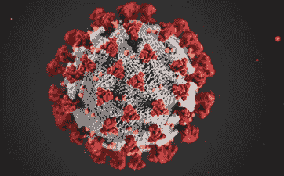
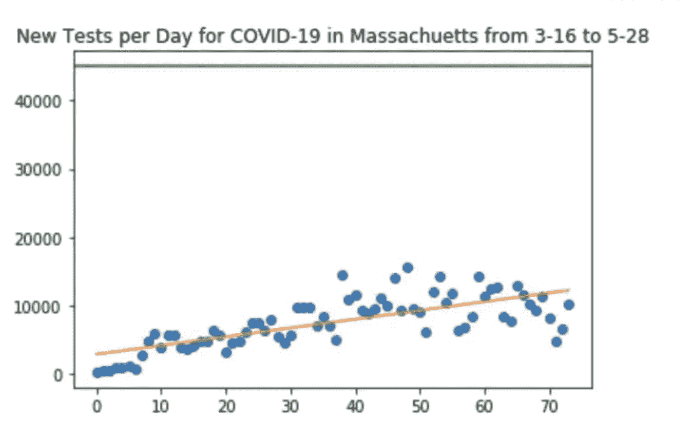
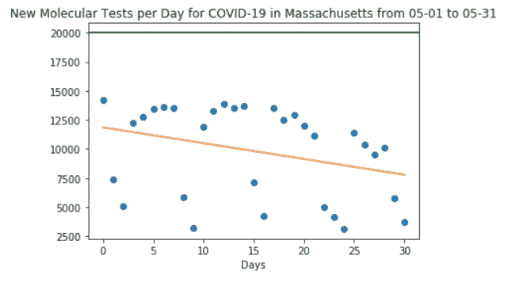
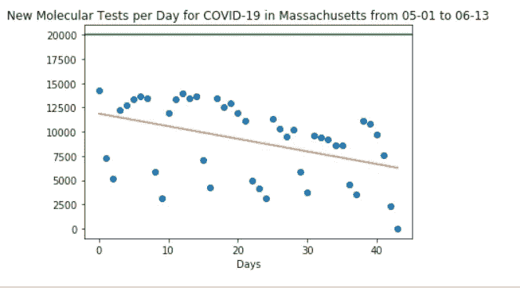
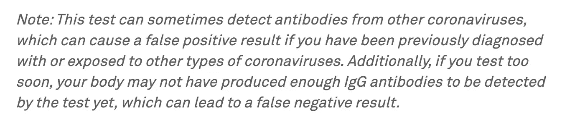
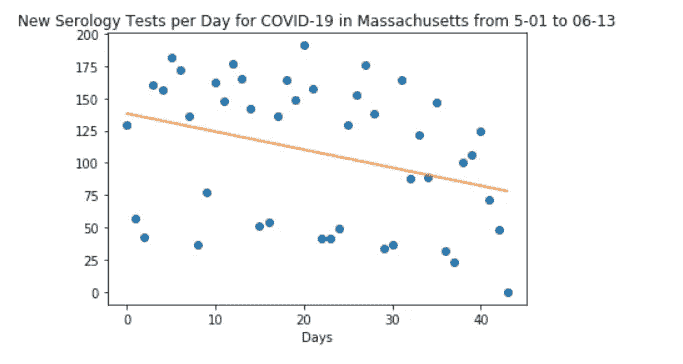
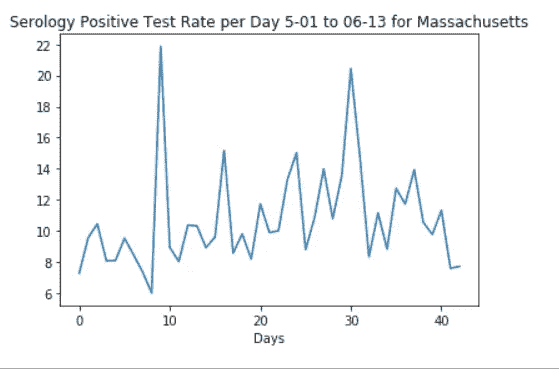
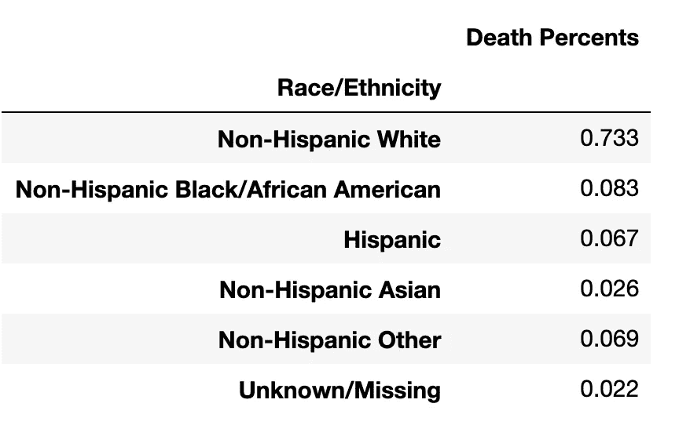
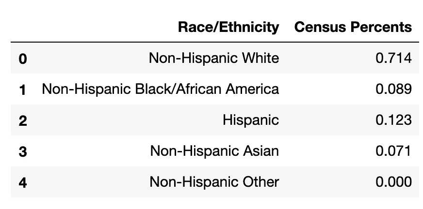
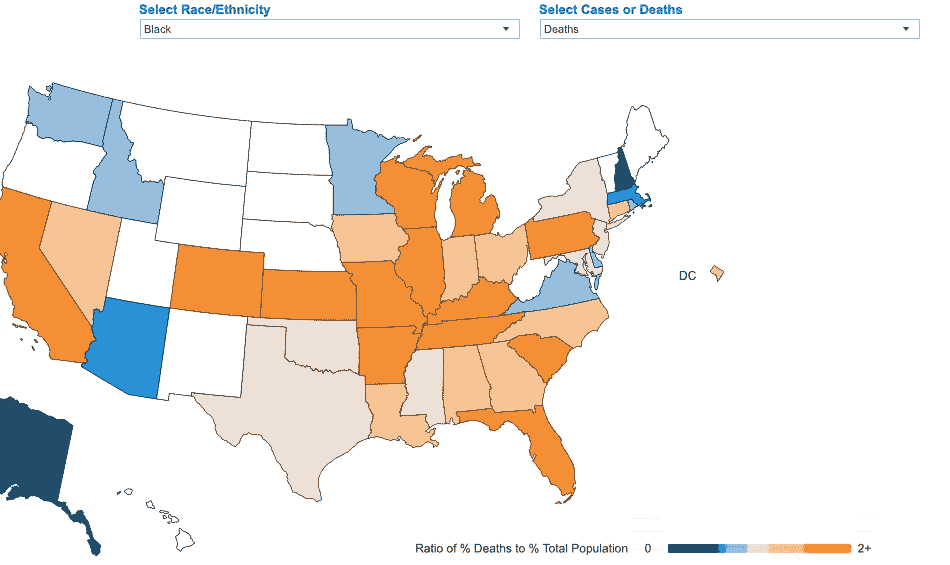

# COVID 数据中的新手冒险

> 原文：<https://towardsdatascience.com/newbie-adventures-in-covid-data-e54550704b1e?source=collection_archive---------55----------------------->



图片来自 CDC 开源

给许多有兴趣探索或掌握数据科学的人的建议是，找到一些让你感兴趣的数据，看看你能学到什么。当新冠肺炎重创马萨诸塞州，该州开始公布数据供下载时，这似乎是一个很好的起点。虽然大部分工作也可以在 Excel 中完成，但我使用 Python 来处理，以考虑到可重复性和潜在的数据增长。

注意，对于那些读过我写的更多商业媒体文章的人来说，这篇文章有点“编码”。欢迎来到人工智能产品管理思维的极客部分:你的客户有一个问题需要回答，这可能需要一些代码。然而，由于这个例子不需要复杂的机器学习，所以很容易理解。

作为一名自学成才的程序员，我承认可能有更好的方法来完成这项工作，并使用更多的 Python 函数进行设计，但这个故事更多的是关于旅程，而不是编码专业知识。

马萨诸塞州在这里发布其 COVID 数据:[https://www . mass . gov/info-details/新冠肺炎-更新-信息#每日更新-](https://www.mass.gov/info-details/covid-19-updates-and-information#daily-updates-)

如果您对您所在州的相同分析感兴趣，这可能允许下载半原始数据，我在最后提供了一些州的开放数据链接示例。您还可以从 CDC 或其他网站(如 COVID data tracker)获取数据。我发现关注和使用我所在州的数据让我更好地了解了如何做出最有可能影响我生活的决定。对我来说，有时候做工作是理解别人如何看待这个问题的最好方式。

注意:这需要一个简单的 Python 3 [Anaconda](https://docs.anaconda.com/anaconda/install/) 环境。

首先加载一个库:

```
import numpy as np
import pandas as pd
import zipfile
from zipfile import ZipFile
from download import download
import csv
from io import BytesIO
import requests
import os
import matplotlib.pyplot as plt
```

在马萨诸塞州，每天都有一个压缩数据集，文件名中包含日期。为了下载，我做了一个函数:

```
def get_zip(zip_file_url):
 url = requests.get(zip_file_url)
 zipfile = ZipFile(BytesIO(url.content))
 zip_names = zipfile.namelist()
 if len(zip_names) == 1:
 file_name = zip_names.pop()
 extracted_file = zipfile.open(file_name)
 return extracted_file
 return [zipfile.open(file_name) for file_name in zip_names]
```

我发现随着时间的推移，命名约定会发生一些变化，因为数据格式从五月更新到六月，所以我分解了链接的组件，这样就可以很容易地只更改每次运行的日期。

```
June_Date_Name = “june-7–2020"Website_name = [https://www.mass.gov/doc/covid-19-raw-data-](https://www.mass.gov/doc/covid-19-raw-data-)Download_String = “/download”
june_zip_file_url = Website_name + June_Date_Name + Download_String
```

所以接下来需要做的就是运行这个函数:

```
get_zip(june_zip_file_url)
```

如果这是一次生产运行，我会将数据缓存或加载到云中，但是当我在探索时，文件格式和 zip 文件结构每月都有变化，我会将文件下载并解压缩到磁盘。

```
file_path = (“Extracts-June”)path = download(june_zip_file_url, file_path, kind=”zip”,replace=True,verbose=True)
```

作为一个新手，我确信有一个更好的方法来获得所有的区别。csv 文件转换成数据帧，但是对于这项工作，我只是将它们列出来(并不是所有文件都用于启动)。进一步的改进只会把所有的。csv 文件并忽略。xlsx 文件及其包含的计算和所需数据的过滤器，但如果您正在关注一个问题，该问题是主要的。

```
June_County_data = pd.read_csv(June_Directory + “/County.csv”) 
June_Age = pd.read_csv(June_Directory + “/Age.csv”) 
June_Age_means = pd.read_csv(June_Directory +”/Age Means.csv”) 
June_Cases = pd.read_csv(June_Directory + “/Cases.csv”) 
June_DateofDeath = pd.read_csv(June_Directory +”/DateofDeath.csv”) 
June_Admissions = pd.read_csv(June_Directory +”/Hospitalization from Hospitals.csv”) 
June_LTC_Facilities = pd.read_csv(June_Directory +”/LTC Facilities.csv”) 
June_Race_Ethnicity = pd.read_csv(June_Directory +”/RaceEthnicity.csv”) 
June_Sex = pd.read_csv(June_Directory + “/Sex.csv”) 
June_Testing = pd.read_csv(June_Directory + “/TestingByDate.csv”)
```

由于我的兴趣，首先，主要是重新打开和测试的效果，我从 5 月开始关注(同样，更好的代码将通过日期而不是文件位置来指定数据，但这是关于冒险的。)

```
June_Testing_Format = June_Testing[[“Date”,”Molecular New”,”Molecular Positive New”,
 “Serology New”, “Serology Positive New”]]
May_on_Testing_Data = June_Testing_Format.iloc[100:] # Start on May 1
```

当我开始研究分子检测数据(检测你是否感染了病毒)时，马萨诸塞州州长提出了一个目标，即每天进行 45，000 次检测，目标阳性率为 5%。

当我在五月底运行代码时，这是图表:测试趋势上升…



5 月份，测试开始下降。



现在，在六月的第一周，每天的测试仍然在下降，但是在重新开放的第二阶段之前，阳性率似乎降到了 5%以下。我玩了 7 天均线，但是平的趋势线看起来更好。

```
May_on_Testing_Data[‘Days’] = np.arange(len(May_on_Testing_Data))
x = May_on_Testing_Data[“Days”]
y = May_on_Testing_Data[“Molecular New”]plt.plot(x, y, ‘o’)
m, b = np.polyfit(x, y, 1)
plt.plot(x, m*x + b)
plt.title(“New Molecular Tests per Day for COVID-19 in Massachusetts from 05–01 to 06–09”)
plt.axhline(y= 20000, xmin=0, xmax=1, color=”g”)
plt.xlabel (‘Days’)
plt.show()
```



6 月，该州增加了抗体血清学检测。在马萨诸塞州，你可以要求你的医生推荐这项测试或者直接报名。保险范围是可变的。我很好奇，想知道抗体测试进行得如何，测试水平有多高，以及即使考虑到 CDC 抗体测试的不确定性和测试提供商的警告，抗体呈阳性的趋势是否存在。请参见下面 Quest Diagnostics(马萨诸塞州领先的 COVID 测试公司)的示例。注意:普通感冒是一种冠状病毒。



到目前为止，似乎没有很多抗体测试。无论这是由于直接支付的费用(119 美元)，还是由于人们不被鼓励进行检测，还是由于新闻中关于假阳性的消息。



在波士顿，马萨诸塞州总医院[的最新研究](https://www.boston.gov/news/results-released-antibody-and-covid-19-testing-boston-residents)显示，在 750 名居民的代表性样本中，抗体阳性率为 9.9%。

从 5 月至今的总体血清学阳性率来看(自 5 月 1 日以来进行了 41，228 次检测，约占人口的 0.06%)，有些日子的峰值约为 10%，但由于样本可能包含很高比例的知道自己感染了病毒的人，因此得出人口中抗体水平正在上升的结论似乎还为时过早。



随着黑人的命也是命的抗议和媒体对可变存活率的关注，我开始想知道马萨诸塞州的数据是什么样的，所以我从种族/民族数据中提取了最后一部分数据，绘制了种族/民族的死亡百分比，并查看了这些数据。

```
Race_Data = June_Race_Ethnicity[-6:]Race_Data_Total = Race_Data[‘Deaths’].sum()
Race_Data [‘Death Percents’] = Race_Data [‘Deaths’] / Race_Data_Total
Race_Data [‘Death Percents’]= round(Race_Data [‘Death Percents’], 3)
Race_Data.head(10)
```



我真正需要了解的是，这是否代表了人群中的爆发。我能找到的最新数据是 2017 年的。认识到误差幅度，看起来黑人实际上比白人做得更好。

```
Race_Census_Data = {‘Race/Ethnicity’: [‘Non-Hispanic White’, ‘Non-Hispanic Black/African America’,
 “Hispanic”, “Non-Hispanic Asian”, “Non-Hispanic Other”, “Other”],

 ‘Census Percents’: [.714,.089,.123,.071,0,.031]
 }Race_Census = pd.DataFrame (Race_Census_Data, columns = [‘Race/Ethnicity’,
 ‘Census Percents’])
```



根据新闻，我对此感到惊讶，并四处查看这是否是一种异常现象。果然，[凯泽家庭基金会](https://www.kff.org/health-costs/issue-brief/state-data-and-policy-actions-to-address-coronavirus/)也采取了同样的观点，认为马萨诸塞州的病例与人口统计数据相当，黑人的死亡率略低于人口分布的预期。



Covid 立即行动的人口统计数据页面中的图片

所有这些让我再次对测试感到好奇。设定一个日期，看看我是否会加入血清学阳性，如果不会，至少增加另一个数据点。然后可能会回到线性回归之外的东西，使用 Tensorflow，在云和 GPU 中运行，以及所有这些复杂性。甚至可能测试 [COVID ACT NOW API](https://github.com/covid-projections/covid-data-model/blob/master/api/README.V1.md) 。

你将带着数据走向何方？你会确定一个模型，说我们中有足够多的人已经暴露，它是安全的兴高采烈地去海滩吗？你会更好地理解你的本地数据，并做出自己的“哇，这是趋势上升/下降决策/ [超过 5%](https://www.nytimes.com/2020/06/09/well/live/coronavirus-rules-pandemic-infection-prevention.html) 积极决策”吗？

你会将你的阳性结果趋势与国家出版物和其他外部分析进行比较吗？当范围从 4%到 10%时，您会质疑加权/平滑措施吗？

你会四处搜寻什么血清学测试看起来最有效的数据吗？

你会绕过所有的数据工作，直接注册警报或监控网站让你知道你住的地方什么时候有危险吗？

或者你会在秸秆市场上购买最好的[芜菁价格](https://animalcrossingworld.com/guides/new-horizons/turnip-stalk-market-how-to-buy-best-time-to-sell/)(我对内幕和[期货交易](https://turnipprophet.io/)的基本了解的推荐)？


冒险是你的追求！


系列中的下一个:[https://medium.com/me/stats/post/a54e5f51e1fa](https://medium.com/me/stats/post/a54e5f51e1fa)

**样本数据链接:(注意:有些州不提供数据可视化)。**

加州:[https://www . cdph . ca . gov/Programs/CID/DCDC/Pages/Immunization/ncov 2019 . aspx](https://www.cdph.ca.gov/Programs/CID/DCDC/Pages/Immunization/nCOV2019.aspx)

科罗拉多州:【https://data-cdphe.opendata.arcgis.com/search?tags=covid19】T2

康涅狄格州:【https://data.ct.gov/browse?】T4 类别=健康+和+人类+服务

明尼苏达州:[https://mn.gov/covid19/data/index.jsp](https://mn.gov/covid19/data/index.jsp)

纽约州:[https://www1 . NYC . gov/site/doh/covid/新冠肺炎-data . page #下载](https://www1.nyc.gov/site/doh/covid/covid-19-data.page#download)

华盛顿州[https://www.doh.wa.gov/Emergencies/Coronavirus](https://www.doh.wa.gov/Emergencies/Coronavirus)

美国疾病控制中心:[https://www.cdc.gov/nchs/covid19/index.htm](https://www.cdc.gov/nchs/covid19/index.htm)

covid Act Now[https://covidactnow.org/?s=44750](https://covidactnow.org/?s=44750)**(还提供了一个状态数据源列表和一个**[**API**](https://github.com/covid-projections/covid-data-model/blob/master/api/README.V1.md)**用于它们的数据)**

Github 链接:[https://github . com/AlisonDoucette/covid 19/blob/master/State % 20 of % 20MA % 20 covid % 20 data % 20 analysis % 20-% 20 trends . ipynb](https://github.com/AlisonDoucette/COVID19/blob/master/State%20of%20MA%20COVID%20DATA%20Analysis%20-%20Trends.ipynb)