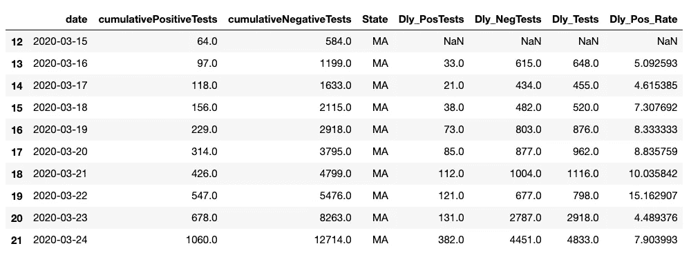
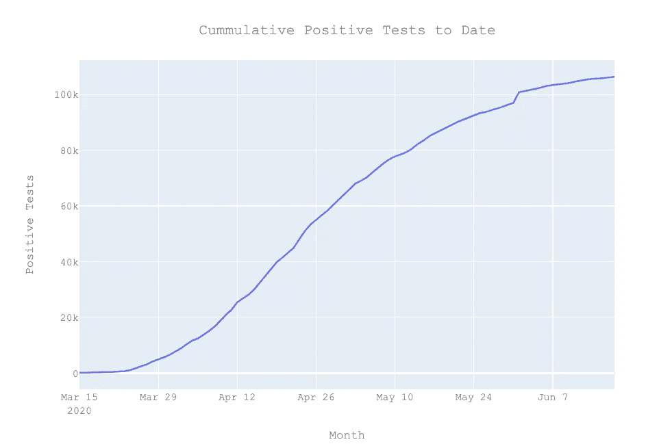
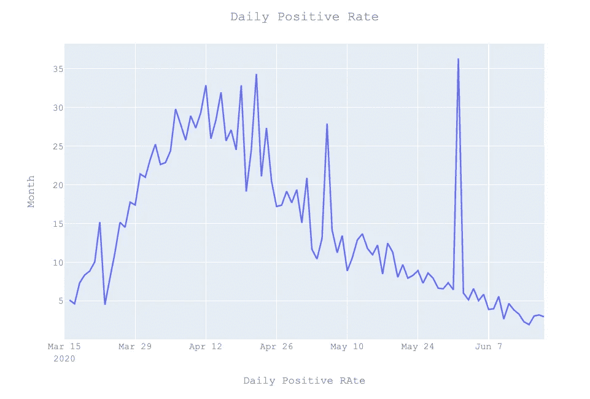
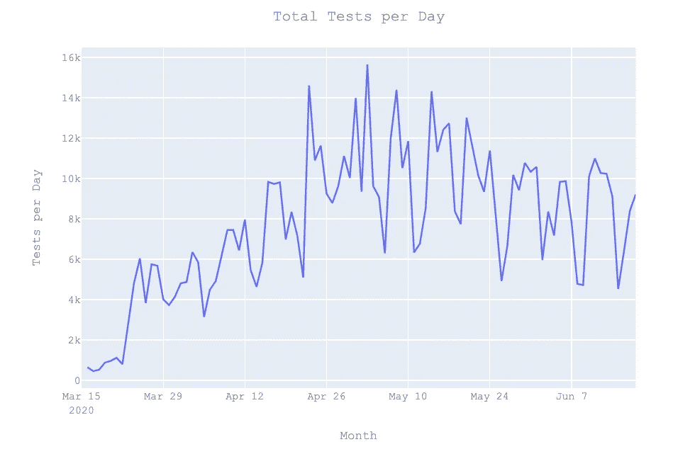
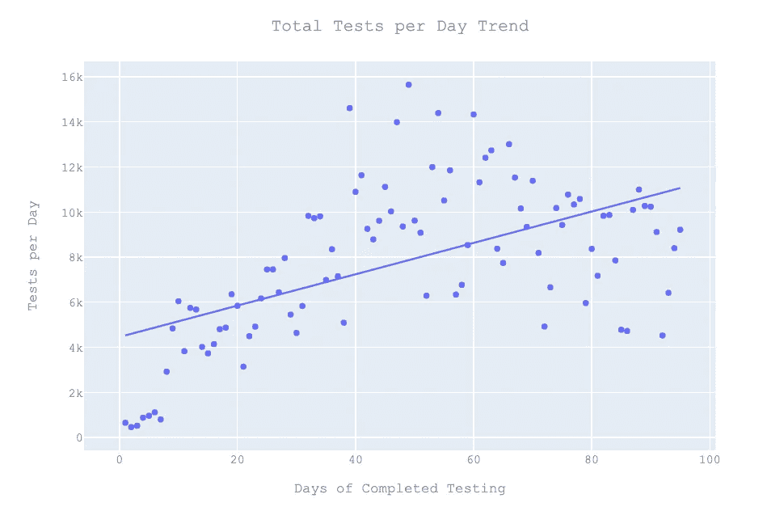
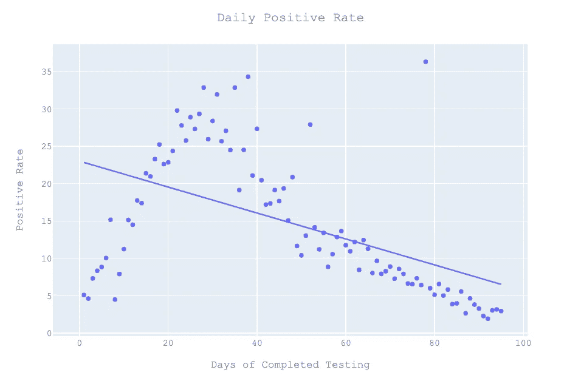
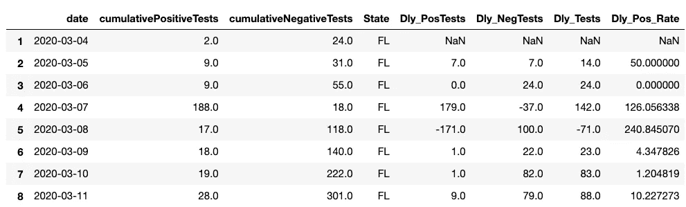
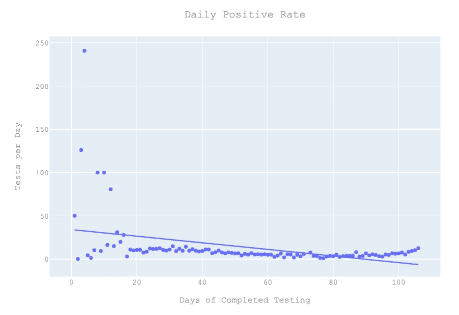
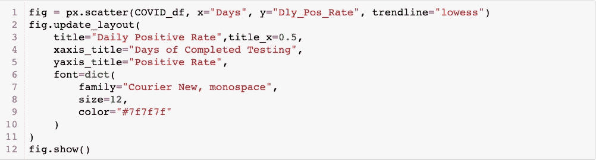
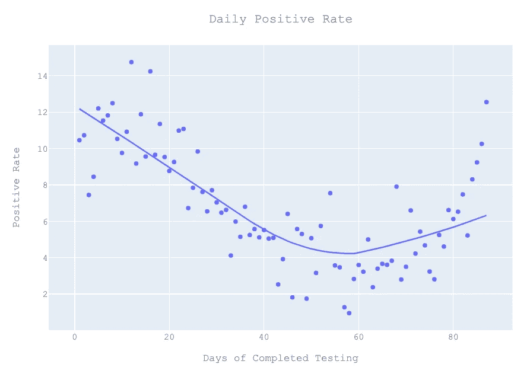

# COVID 数据中的新手冒险——将 API 用于聚合数据，将 Plotly 用于图表

> 原文：<https://towardsdatascience.com/newbie-adventures-in-covid-data-leveraging-apis-for-aggregated-data-and-plotly-for-charts-a54e5f51e1fa?source=collection_archive---------78----------------------->

## 来自 COVID ACT NOW APIs 的标准化数据允许对各州的每日阳性率进行比较


图片由 Alison Doucette 提供

在《COVID 数据历险记》的[第一集](/newbie-adventures-in-covid-data-e54550704b1e)中，我们开始探索使用 Python 基础知识(类似于 Excel 的函数)来查看新冠肺炎数据和马萨诸塞州的趋势。本周的挑战是利用由 [COVID ACT NOW](https://covidactnow.org/) 发布的 API 来探索所有给定了标准化数据集的州，并利用 Plotly 进行可视化。

如果你想继续学习，你可以在这里找到 COVID ACT NOW API [的文档。GitHub 存储库非常有用，因为它展示了如何调用 API 以及如何提取数据。虽然有可能提取。CSV 文件(在我们的第一次冒险中，我们从一个. zip 文件导入)这次我要求 JSON 作为格式。](https://github.com/covid-projections/covid-data-model/blob/master/api/README.V1.md)

对于那些对 PLOTLY 感兴趣的人，这里有一个到文档的链接。虽然有很多复杂的图表可用，但我只是复制了我用 Matplotlib 做的简单图表。

首先是一些图书馆。(由于这是在 Anaconda 中使用 Juypter 笔记本，在开始之前，我按照这里的说明[在终端中进行了 conda 安装。](https://dash.plotly.com/installation)

```
import numpy as np
import pandas as pd
import requests
from pandas import DataFrame
import matplotlib.pyplot as plt 
import plotly.graph_objects as go
import plotly.express as px
```

因为我知道我将为美国的不同州调用 API，所以我决定在组件中构建 URL，前缀是州代码(例如:MA 或 TX)作为一个单独的变量，后缀包括对 trends 和 JSON 格式的“时间系列”数据的请求。这将允许我在将来的某个时候比较不同的状态。

**注意:从 7 月 5 日起，API 的输出不再与记录的 JSON 相匹配，所以这段代码不再起作用。根据 GIThub 链接:“**从 6/5 开始，`cumulativePositiveTests`和`cumulativeNegativeTests`从`timeseries`行中移除。该数据在`actualsTimeseries`字段中仍然可用。

```
URL_prefix = “[https://data.covidactnow.org/latest/us/states/](https://data.covidactnow.org/latest/us/states/)"state_code = “MA”URL_suffix = “.OBSERVED_INTERVENTION.timeseries.json”Call_URL = URL_prefix + state_code + URL_suffix
```

然后是时候用请求调用 API，请求数据并打印出状态代码。

```
response = requests.get(Call_URL)
data = response.json()
print(“Status Code”,response.status_code)
```

一旦我有了数据，我们的目标就是为每日检测率以及 COVID 检测的阳性率绘制趋势图。API 的伟大之处在于每个州的数据格式都是标准化的。缺点是 API 不包含抗体测试的数据。

*正如本周《纽约时报》*[](https://www.nytimes.com/2020/06/18/health/coronavirus-antibodies.html)**指出的那样，缺乏抗体并不一定意味着你从未被感染，或者你缺乏免疫力，拥有抗体也不一定意味着它们不会随着时间的推移而消失，但观察这些数据很有趣。**

*一旦接收到数据，我只需要将数据划分到我想要的列中，包括包含阴性测试的第一行作为开始日期，并排除尚未进行测试的日期。*

```
*COVID_Series = (data[“timeseries”])
COVID_Run_Date = (data[“lastUpdatedDate”])
COVID_df = DataFrame(COVID_Series,columns=[‘date’,”cumulativePositiveTests”, “cumulativeNegativeTests”])
Start_Row = COVID_df[‘cumulativeNegativeTests’].notna().idxmax()
End_Row = COVID_df[‘cumulativeNegativeTests’].notna()[::-1].idxmax()
COVID_df = COVID_df.iloc[Start_Row:End_Row]*
```

*然后，我需要确定每天的新测试，并计算每天的阳性率。*

```
*COVID_df[‘date’] = pd.to_datetime(COVID_df[‘date’], format=’%Y-%m-%d’)
COVID_df['State'] = state_code
COVID_df[‘Dly_PosTests’] = COVID_df[‘cumulativePositiveTests’].diff()
COVID_df[‘Dly_NegTests’] = COVID_df[‘cumulativeNegativeTests’].diff()
COVID_df[‘Dly_Tests’] = COVID_df[‘Dly_PosTests’] + COVID_df[‘Dly_NegTests’]
COVID_df[‘Dly_Pos_Rate’] = (100* (COVID_df[‘Dly_PosTests’] / COVID_df[‘Dly_Tests’]))*
```

*这给了我一组数据来绘制图表:*

**

*我对阳性测试结果的增长很感兴趣。*

```
*fig = px.line(COVID_df, x=”date”, y=”cumulativePositiveTests”)
fig.update_layout(
 title=”Cumulative Positive Tests to Date”,title_x=0.5,
 xaxis_title=”Month”,
 yaxis_title=”Positive Tests”,
 font=dict(
 family=”Courier New, monospace”,
 size=12,
 color=”#7f7f7f”
 )
)
fig.show()*
```

**

*考虑到数据隐私问题，如果可能对第一反应者进行重复检测，则不可能绘制出已检测人群的百分比，但可以绘制出每日阳性率。*

**

*每天的测试总数可以给你一个关于测试模式的想法。*

**

*最后，我们可以看看用天数代替时间后的一些趋势:*

```
*COVID_df[‘Days’] = np.arange(len(COVID_df))fig = px.scatter(COVID_df, x=”Days”, y=”Dly_Tests”, trendline=”ols”)
fig.update_layout(
 title=”Total Tests per Day Trend”,title_x=0.5,
 xaxis_title=”Days of Completed Testing”,
 yaxis_title=”Tests per Day”,
 font=dict(
 family=”Courier New, monospace”,
 size=12,
 color=”#7f7f7f”
 )
)
fig.show()*
```

****

*利用 COVID ACT NOW APIs 提供美国各州的标准化数据。也就是说，数据有点混乱，需要更多的清理，因为数据输入错误可能会导致一些扭曲的值:(下面第 4 行是佛罗里达州的数据)。*

**

*结果图如下:*

**

*而不是更可能匹配真实情况的东西:(从第 14 行开始)并使用 [LOWESS](https://en.wikipedia.org/wiki/Local_regression) 趋势:*

****

*在这次冒险中，我们坚持一次只为一个州调用 COVID ACT NOW APIs，但是我们可以为所有的州调用它们，并开始比较各个州。我们可以使用移动平均线来平滑给定的周模式数据。我们可以建立一个用户界面，使整个过程更加用户友好。谁知道我们会去哪里？*

*当你和云雀一起起床时，你的每一天都是以冒险开始的！*

*接下来的系列文章:[https://medium . com/@ Alison . doucette/newbie-adventures-in-covid-data-maps-for-hotspots-and-positivity-rates-64 FBE f1 a 163](https://medium.com/@alison.doucette/newbie-adventures-in-covid-data-maps-for-hotspots-and-positivity-rates-64fbeff1a163)*

**

*图片由 Alison Doucette 提供*