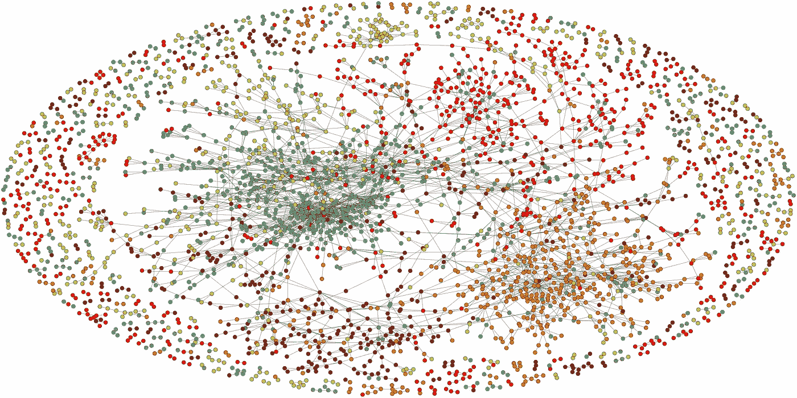
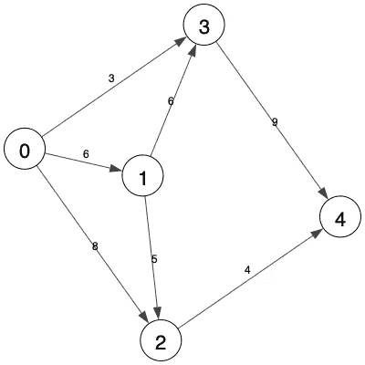
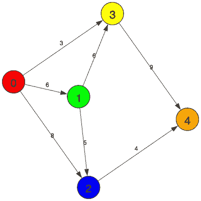
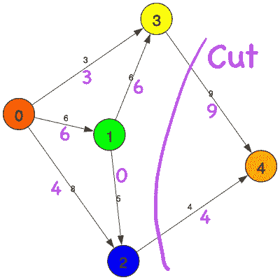

# Python-igraph 新手指南

> 原文：<https://towardsdatascience.com/newbies-guide-to-python-igraph-4e51689c35b4?source=collection_archive---------11----------------------->

## python-igraph 常用函数的简单指南，包含示例和代码

目前，随着不同模块的出现，处理图形/网络数据变得更加容易。对于 python 来说，其中两个这样的模块是 [**networkx**](https://networkx.github.io/) 和 [**igraph**](https://igraph.org/redirect.html) **。我使用 python-igraph 模块已经有一段时间了，我发现它在我的研究中非常有用。我在我最新发布的工具 [**GraphBin**](https://github.com/Vini2/GraphBin) 中使用了 python-graph。在本文中，我将向您介绍 python-igraph 的一些基本功能，这些功能只需一个调用就可以使实现变得更加容易。**



你可以阅读我的前一篇文章[用 python-igraph 可视化图形数据](/visualising-graph-data-with-python-igraph-b3cc81a495cf)，在那里我介绍了 Python-igraph 模块。

[](/visualising-graph-data-with-python-igraph-b3cc81a495cf) [## 用 Python-igraph 可视化图形数据

### 使用 CiteSeer 数据集介绍 python-igraph 模块

towardsdatascience.com](/visualising-graph-data-with-python-igraph-b3cc81a495cf) 

在本文中，我们将介绍执行以下任务的函数。

1.  创建图表
2.  将图表可视化
3.  获得关于图的顶点和边的信息
4.  获取顶点的相邻顶点
5.  从顶点开始的广度优先搜索(BFS)
6.  从顶点确定最短路径
7.  获得图的拉普拉斯矩阵
8.  确定源顶点和目标顶点之间的最大流量

# 1.创建图表



图一。示例图表

让我们从绘制如图 1 所示的示例图[开始。](https://en.wikipedia.org/wiki/Graph_(discrete_mathematics))

这是一个包含 5 个顶点的有向图[。我们可以创建如下的图表。](https://en.wikipedia.org/wiki/Graph_(discrete_mathematics)#Directed_graph)

```
# Create a directed graph
g = Graph(directed=True)# Add 5 vertices
g.add_vertices(5)
```

顶点将被标记为从 0 到 4 和 7 个加权边(0，2)、(0，1)、(0，3)、(1，2)、(1，3)、(2，4)和(3，4)。

```
# Add ids and labels to vertices
for i in range(len(g.vs)):
    g.vs[i]["id"]= i
    g.vs[i]["label"]= str(i)# Add edges
g.add_edges([(0,2),(0,1),(0,3),(1,2),(1,3),(2,4),(3,4)])# Add weights and edge labels
weights = [8,6,3,5,6,4,9]
g.es['weight'] = weights
g.es['label'] = weights
```

# 2.将图表可视化

现在我们已经创建了我们的图表，让我们使用 igraph 的绘图功能来可视化它。

```
visual_style = {}out_name = "graph.png"# Set bbox and margin
visual_style["bbox"] = (400,400)
visual_style["margin"] = 27# Set vertex colours
visual_style["vertex_color"] = 'white'# Set vertex size
visual_style["vertex_size"] = 45# Set vertex lable size
visual_style["vertex_label_size"] = 22# Don't curve the edges
visual_style["edge_curved"] = False# Set the layout
my_layout = g.layout_lgl()
visual_style["layout"] = my_layout# Plot the graph
plot(g, out_name, **visual_style)
```



图二。彩色图形

运行这段代码将得到如图 1 所示的图形。如果你想的话，你可以给顶点上色，如图 2 所示，通过添加`g.vs[“color”] = ["red", "green", "blue", "yellow", "orange"]`代替线`visual_style[“vertex_color”] = ‘white’`。你可以从我以前的文章[用 Python-igraph 可视化图形数据](/visualising-graph-data-with-python-igraph-b3cc81a495cf)中读到更多关于可视化图形和分析它们的内容。

# 3.获取图的顶点和边的信息

通过调用`vcount()`、`ecount()`、`is_directed()`、`maxdegree()`、`get_adjacency()`函数，可以获得图的一些基本信息，如顶点数、边数、图是否有向、最大度、图的邻接矩阵等。

```
print("Number of vertices in the graph:", g.vcount())
print("Number of edges in the graph", g.ecount())
print("Is the graph directed:", g.is_directed())
print("Maximum degree in the graph:", g.maxdegree())
print("Adjacency matrix:\n", g.get_adjacency())
```

输出如下所示。

```
Number of vertices in the graph: 5
Number of edges in the graph 7
Is the graph directed: True
Maximum degree in the graph: 3
Adjacency matrix:
 [[0, 1, 1, 1, 0]
 [0, 0, 1, 1, 0]
 [0, 0, 0, 0, 1]
 [0, 0, 0, 0, 1]
 [0, 0, 0, 0, 0]]
```

# 4.获取顶点的相邻顶点

您可以使用函数`neighbors(vid, mode=ALL)`获得给定顶点的相邻顶点。如果我们考虑顶点 0，相邻的顶点或邻居将是顶点 1、2 和 3。

```
print(g.neighbors(0, mode=ALL))
```

# 5.从顶点开始的广度优先搜索(BFS)

从顶点开始执行[广度优先搜索](https://en.wikipedia.org/wiki/Breadth-first_search)，可以使用函数`bfs(vid, mode=OUT)`。

```
print(g.bfs(0)[0])
```

返回的顶点 id 将是`[0, 1, 2, 3, 4]`。

# 6.从顶点确定最短路径

您可以使用函数`get_shortest_paths(vid)`获得从给定顶点开始的[最短路径](https://en.wikipedia.org/wiki/Shortest_path_problem)。你想指定目标顶点为`get_shortest_paths(vid, to=destination)`。

```
print(g.get_shortest_paths(0))
```

上面的线将导致从顶点 0 开始到所有顶点的所有最短路径，这将是`[[0], [0, 1], [0, 2], [0, 3], [0, 2, 4]]`。

```
print(g.get_shortest_paths(0, to=4))
```

上面这条线将返回从顶点 0 到顶点 4 的最短路径，即`[[0, 2, 4]]`。

# 7.获得图的拉普拉斯矩阵

您可以使用`laplacian()`函数获得图的[拉普拉斯矩阵](https://en.wikipedia.org/wiki/Laplacian_matrix)。

```
print("Laplacian matrix of a graph:\n",g.laplacian())
```

输出如下所示。

```
Laplacian matrix of a graph:
 [[3, -1, -1, -1, 0], [0, 2, -1, -1, 0], [0, 0, 1, 0, -1], [0, 0, 0, 1, -1], [0, 0, 0, 0, 0]]
```

# 8.确定源顶点和目标顶点之间的最大流量和最小切割

让我们假设在我们的例子中源顶点是顶点 0，目标顶点是顶点 4。我们可以使用函数`maxflow(source, target, weights)`确定源和目标之间的最大流量和最小切割(根据[最大流量最小切割定理](https://en.wikipedia.org/wiki/Max-flow_min-cut_theorem))。

```
maxflow = g.maxflow(0,4,weights)print(maxflow.value)
print(maxflow.flow)
print(maxflow.cut)
print(maxflow.partition)
```



图三。图中最大流量与对应于
流量的最小切割

上面的行将输出一个图形流对象，流的最大值为`13`，每个顶点的流值为`[4.0, 6.0, 3.0, 0.0, 6.0, 4.0, 9.0]`，边上的最小割 id 为`[5, 6]`，顶点之间的划分为`[[0, 1, 2, 3], [4]]`。

图 3 表示与最大流量和最小切割相关的值，切割用紫色标记。边上紫色的值是流量值。我们可以看到，顶点 0、1、2 和 3 在一个分割中，顶点 4 在另一个分割中，这两个分割由割形成。

你可以从我的文章 [10 图算法直观解释](https://medium.com/@vijinimallawaarachchi/10-graph-algorithms-visually-explained-e57faa1336f3)中读到更多关于图算法的内容。

[](https://medium.com/@vijinimallawaarachchi/10-graph-algorithms-visually-explained-e57faa1336f3) [## 直观解释的 10 种图形算法

### 10 种基本图形算法的快速介绍，包括示例和可视化

medium.com](https://medium.com/@vijinimallawaarachchi/10-graph-algorithms-visually-explained-e57faa1336f3) 

# 最后的想法

如果您遇到一个不知道如何使用的函数，您可以简单地打印它的 docstring，它将描述该函数的输入、输出以及它的作用。举个例子，

```
print(g.bfs.__doc__)
print(g.laplacian.__doc__)
print(g.maxflow.__doc__)
```

就个人而言，我发现 python-igraph 是我工作中非常有用的模块。您可以使用提供的函数轻松地表示图形和执行不同的分析任务。

我附上了 jupyter 笔记本，其中包含了我在本文中使用的所有示例和代码。请随意使用它，并希望您也能在工作中使用 igraph。

感谢您的阅读！

干杯！

# 参考

[1]https://igraph.org/python/doc/igraph-module.html[的 Python-igraph 手册](https://igraph.org/python/doc/igraph-module.html)

[2]示例图改编自[https://www.youtube.com/watch?v=u6FkNw16VJA](https://www.youtube.com/watch?v=u6FkNw16VJA)