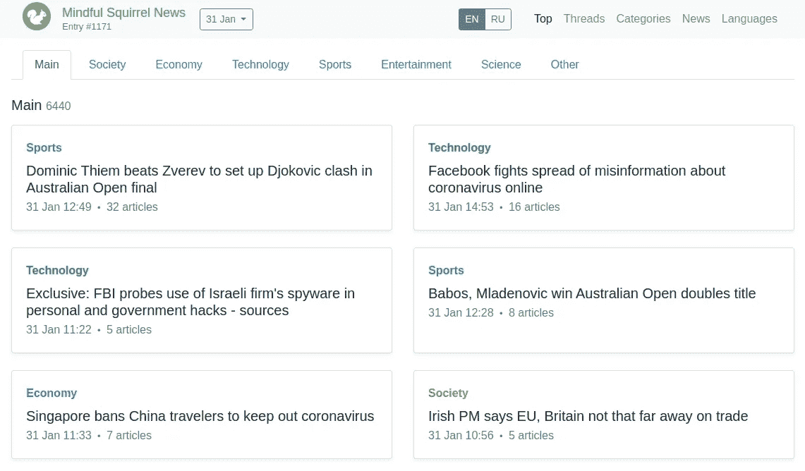
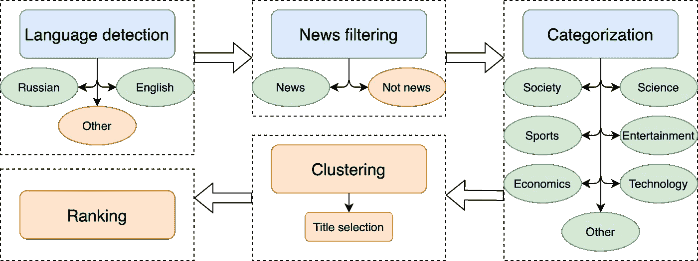
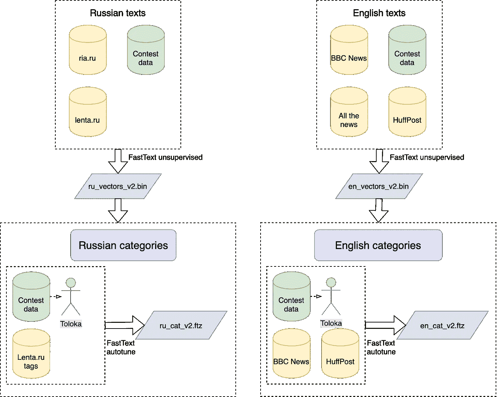
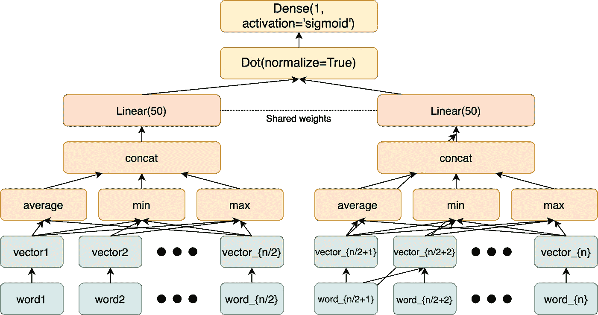
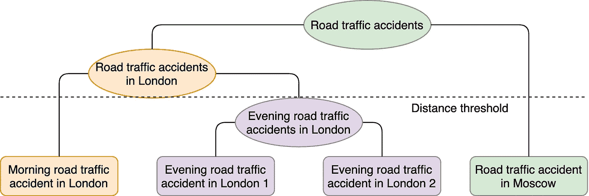
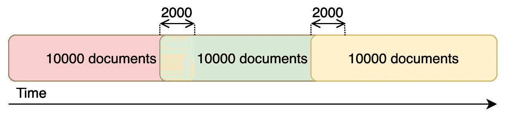

# 两周内的新闻聚合

> 原文：<https://towardsdatascience.com/news-aggregator-in-2-weeks-5b38783b95e3?source=collection_archive---------24----------------------->

## 一种简单快速的新闻分类和聚类方法

图片由 [Pezibear](https://pixabay.com/ru/users/Pezibear-526143/?utm_source=link-attribution&amp;utm_medium=referral&amp;utm_campaign=image&amp;utm_content=502778) 通过 [Pixabay](https://pixabay.com/ru/?utm_source=link-attribution&utm_medium=referral&utm_campaign=image&utm_content=502778) 拍摄

[数据聚类大赛](https://contest.com/data-clustering)是 Telegram 在 11 月举办的为期两周的数据科学竞赛。Telegram 团队希望参与者建立一个简单而有效的新闻聚合器，将来自不同出版商和网站的数以千计的文章整合到一个页面中，显示最新的新闻和头条新闻，就像[谷歌新闻](https://news.google.com)或[必应新闻](https://www.bing.com/news)所做的那样。

提交的公共测试屏幕。作者图片

尽管比赛[于 2019 年 12 月 2 日](https://t.me/contest/137)结束，主办方[还是在一周前](https://t.me/contest/158)宣布了结果。我们的团队[“用心松鼠”](https://contest.com/data-clustering/entry1171)在最终排行榜中排名第三。在本帖中，我们简要概述了我们的方法，并讨论了我们遇到的主要挑战。完整的解决方案可从 GitHub 上获得。所有培训脚本都在 Colab 中共享。

# 任务概述

竞赛包括五个子任务，预计将在原始数据上按顺序运行:

1.  语言识别(只需要英文和俄文文本)
2.  从其他文本中过滤新闻
3.  分为 7 个主题
4.  将与同一事件相关的文章聚类成线索
5.  对每个主题中的线索进行排名

竞赛任务。图片由作者提供，使用 [draw.io](http://draw.io) 创建

语言检测这一步似乎非常清楚，而其他任务却提出了一堆问题。没有给出“新闻”的严格定义；主题标准没有很好地定义；聚类粒度和排名标准也缺失。

竞赛规则[要求](https://contest.com/docs/data_clustering)最终提交的作品在 Debian 的一台机器上本地运行，该机器有 8 个内核和 16 GB 内存，不使用网络。此外，该应用程序必须能够在 60 秒内处理任何一批 1000 篇文章。限制的第一个版本还包括对超过 200 MB 磁盘空间的解决方案的惩罚。

# 解决办法

这些限制严重影响了适用仪器和算法的范围。第一个想法是采用 SOTA 模式，如[埃尔莫](https://allennlp.org/elmo)或[伯特](https://arxiv.org/abs/1810.04805)。但是，它们太大，不符合要求。因此，我们广泛依赖于一个快速文本库。这是脸书人工智能研究所在 2016 年创建的用于学习单词嵌入和训练文本分类模型的库。整个提交代码都是用 C++写的，唯一复杂的模型是用 Python 和 Keras 训练的。

## 语言检测

这项任务的解决方案很简单。我们利用了由 fastText 团队提供的[预训练模型。](https://fasttext.cc/docs/en/language-identification.html)

## 过滤和主题分类

我们将这两个任务合并成一个单一的多类分类问题。由于任何监督分类器都需要一定数量的训练数据，我们利用了 [Yandex。Toloka](https://toloka.yandex.ru/) 标注一小部分输入数据。Toloka 是俄罗斯的众包平台，就像[亚马逊机械土耳其人](https://www.mturk.com/)一样。我们花了 60 美元购买了俄文和英文的标签。我们使用机器翻译英语文本到俄语，以方便说俄语的工作人员。

我们还扩展了数据集，增加了俄语新闻数据集 [Lenta.ru](https://github.com/yutkin/Lenta.Ru-News-Dataset) 和英语新闻数据集 [BBC](https://www.kaggle.com/shineucc/bbc-news-dataset) 和 [HuffPost](https://www.kaggle.com/rmisra/news-category-dataset) 的公开数据。

分类数据集。图片由作者提供，使用 [draw.io](http://draw.io) 创建

利用所有标记的数据，我们训练了一个简单的快速文本分类器。默认的快速文本分类算法学习所提供数据上的单词嵌入，然后使用它们的平均值进行预测。在缺少标记数据的情况下，利用丰富的预训练单词表示通常会提高分类器的性能。我们在由 [RIA](https://github.com/RossiyaSegodnya/ria_news_dataset) 和[“所有新闻”](https://www.kaggle.com/snapcrack/all-the-news)语料库扩展的先前数据集上训练这样的无监督向量。

## 新闻聚类

新闻聚类的两个基本要素是丰富的文本嵌入和健壮的聚类算法。

对单词向量进行简单的平均不会产生好的结果，这迫使我们应用一些更复杂的东西。我们使用结合了点积、密集层和顶部的 sigmoid 的连体神经网络架构来训练最终的文本嵌入。该分支的体系结构由单词向量上的平均池、最小池和最大池串联而成的单一密集层组成。我们将每个文本分成两半，然后训练网络来预测这些部分是否属于同一篇文章。我们从同一出版商的其他文本中挖掘与正面例子时间接近的负面例子。作为一个目标函数，我们使用了对数损失函数，尽管我们应该使用[三重损失](https://en.wikipedia.org/wiki/Triplet_loss)。

用于构建文本嵌入的暹罗网络。图片由作者提供，使用 [draw.io](http://draw.io) 创建

该模型仍然尽可能简单，只有一个可训练矩阵。在实际的 C++应用中，我们没有使用任何神经网络框架，只使用了矩阵乘法的特征库。

我们利用了 [SLINK](https://sites.cs.ucsb.edu/~veronika/MAE/summary_SLINK_Sibson72.pdf) 凝聚聚类。该算法有一些缺点，其中最重要的是传递链接。第一个点可能与第二个点相关联，第二个点可能与第三个点相关联，因此，第一个点和第三个点属于同一群，尽管它们可能相距甚远。

凝聚集群。图片由作者提供，使用 [draw.io](http://draw.io) 创建

SLINK 的时间复杂度为 O(n ),这使得我们无法一次聚类所有的文档。为了克服这个问题，我们假设时间上遥远的文档不应该属于同一个集群。这个假设允许我们将整个时间线分成 10，000 个文档的块，其中有 2，000 个项目重叠。然后，我们在每个块中应用聚类，最后，通过重叠的文档链接连续的块。

按块聚类。图片由作者提供，使用 [draw.io](http://draw.io) 创建

## 线程命名和排序

我们在一个线程中的标题选择基于三个部分的乘积:新鲜度、与其他线程文档的相似性以及文档的源权重。

我们将新鲜度定义为文档日期和线程中最新鲜文档的日期之差的缩放后的 sigmoid。

使用与聚类中相同的文本向量来计算线程的文档之间的内部相似性。对于每个线程中的每个文档，我们计算了到线程中其他文档的平均距离。

对文档内部链接的 [PageRank](https://www.cs.princeton.edu/~chazelle/courses/BIB/pagerank.htm) 算法允许我们评估来源的重要性。

新鲜度、源权重和簇大小形成了线程排序的基础。所有发布日期的第 99 百分位被选为整个数据集的“当前时刻”,因为可能存在异常值。线程的年龄是从这个“当前时刻”计算的。

# 结论

挑战的最重要部分是建立一个满足严格硬件限制的系统。这些限制以及短暂的比赛持续时间迫使我们依赖简单的机器学习算法(如 fastText)，而不是复杂的 SOTA 模型。我们没有足够的时间进行所有我们想要的实验或完善最终的解决方案。尽管我们在比赛结束后做了一些修改，但仍有改进的空间。我们还构建了一个 CI 工作流，将每个版本的代码输出与规范结果相匹配，并发布[到 GitHub 页面](https://ilyagusev.github.io/tgcontest/en/main.html)。

最后，我们要感谢竞赛组织者给了我们一个挑战性的任务。这绝对是一个需要解决的大问题。

链接:

1.  GitHub 库:[用心松鼠的电报数据聚类竞赛解决方案](https://github.com/IlyaGusev/tgcontest)
2.  这篇俄语文章:[новостнойагиегатораадвенедедели](https://m.habr.com/ru/post/487324/)
3.  另一篇关于数据聚类大赛的文章:[从零开始构建新闻聚合器:新闻过滤、分类、按线索分组和排名](/building-a-news-aggregator-from-scratch-news-filtering-classification-grouping-in-threads-and-7b0bbf619b68)