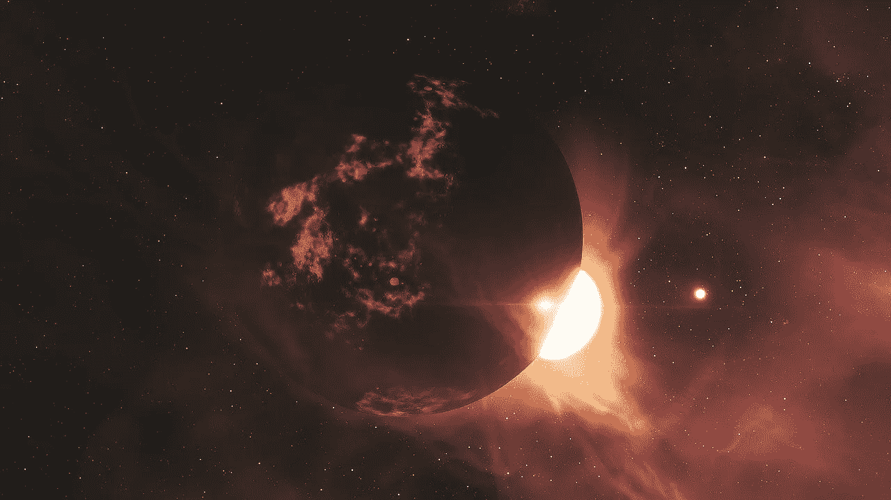

# 牛顿 vs 神经网络:人工智能如何腐蚀科学的基本价值观。

> 原文：<https://towardsdatascience.com/newton-vs-neural-networks-how-ai-is-corroding-the-fundamental-values-of-science-368c93e01906?source=collection_archive---------31----------------------->

## 科学就是寻找解释。随着数据的丰富，我们已经不再要求解释，并满足于仅仅是相关性。我们很高兴知道某事会发生，但不知道它为什么会发生。这从根本上破坏了科学探究的精神，我们可能永远无法恢复。

在过去的四百年里，[科学方法](https://plato.stanford.edu/entries/scientific-method/)引导了科学的发展。该方法包括仔细记录观察结果，制定一个有意义的假设，并严格检验该假设。基于这些测试的结果，假设被一次又一次地改进，直到它能解释观察结果。科学家被告知相关性并不意味着因果关系。对他们来说，知道有事发生是不够的；他们需要了解导致这种情况发生的潜在机制。

人工智能(AI)是一种非常不同的野兽。大多数人工智能系统使用一种称为机器学习的技术，通过向计算机提供与任务相关的大型数据集，来教会计算机如何执行任务。构建这种数据驱动的人工智能系统的开发人员被称为数据科学家。与真正的科学家不同，数据科学家满足于相关性，而不关心因果关系。他们蔑视科学方法的原则，嘲笑其严谨性。他们公然忽略了理论的必要性，只对经验模型感兴趣，这些模型在不理解他们预测什么的情况下给出预测。

地球、太阳和月亮的运动是三体的经典例子(图片来自 Pixabay)

三体问题是物理学中一个被充分研究的问题，由艾萨克·牛顿爵士在他不朽的论文*数学原理*中首次描述。假设给你空间中的三个大物体——比如太阳、月亮和地球——以及它们的初始位置和速度，你能在固定的时间间隔后确定它们的最终位置吗？为了解决这个问题，你需要计算每个物体对另外两个物体的引力的影响。这听起来可能很简单，但这个问题已经困扰了物理学家几个世纪。没有人能够推导出提供最终解的方程。计算机模拟用于使用运动定律费力地计算每个物体在每个时间步的运动。这些计算是*混沌*的，即对微小的变化非常敏感。由于这种混乱的性质和涉及的大量计算，模拟需要几周或几个月的时间来运行，可能会被卡住，有时根本不可行。

2019 年 10 月，[人工智能研究人员宣布](https://arxiv.org/abs/1910.07291)他们开发了一种神经网络，可以在几秒钟内找到三体的精确解。这比今天最好的模拟快了惊人的 1 亿倍。神经网络是最受欢迎的机器学习算法，它们构成了大多数人工智能解决方案的核心。让他们无比强大的是他们成为通用近似者的能力。给定足够的训练数据，他们可以学习近似描述输入和输出之间关系的任何方程。在上述案例中，研究人员在 10，000 个三体构型的数据集上训练了他们的神经网络。神经网络处理了这个数据集，并学习了描述初始配置和最终配置*之间关系的方程，而不知道任何运动规律*。

人工智能正在物理、化学、生物、金融、经济甚至社会科学领域迅速取得进展，它正在迅速取代传统的理论方法。1973 年，费希尔·布莱克、迈伦·斯克尔斯和罗伯特·默顿为股票期权定价开发了著名且极具影响力的[布莱克-斯科尔斯公式](https://www.britannica.com/topic/Black-Scholes-formula)，为此默顿和斯科尔斯获得了诺贝尔经济学奖。他们的方法受到了物理学家用来模拟流体中悬浮粒子运动的布朗运动[的启发。在过去十年中，理论驱动的布莱克-斯科尔斯模型实际上已经被数据驱动的神经网络淘汰，这些神经网络学习仅从过去的价格预测未来的价格，而对金融市场一无所知。](https://en.wikipedia.org/wiki/Brownian_motion)

在医疗保健领域，人工智能模型通常用于从医学图像中诊断结核病和各种癌症等疾病。再说一次，人工智能对放射学、医学或人体解剖学一无所知。

科学就是寻找解释。随着数据的丰富，我们已经不再要求解释，并满足于仅仅是相关性。我们很高兴知道某事会发生，但不知道它为什么会发生。这从根本上破坏了科学探究的精神，我们可能永远无法恢复。

科学思维是一种技能，我们作为一个社会，不是一夜之间发展起来的。我们花了几千年才发现它，然后又花了几个世纪才采纳并开始实践它。就像我们正在失去记忆、心算或在没有全球定位系统的情况下在街上导航的能力一样，我们还需要多久才能在这个快速增长的能力列表中加入科学思想呢？

*如果你喜欢这篇文章，可以在* [*Medium*](https://medium.com/@diningphilosopher) *上查看我的其他作品，在*[*LinkedIn*](https://www.linkedin.com/in/kulkarniviraj/)*或*[*Twitter*](https://twitter.com/VirajZero)*，查看我的* [*个人网页*](https://virajkulkarni.org/) *，或者发邮件给我*[*viraj@berkeley.edu*](mailto:%20viraj@berkeley.edu)