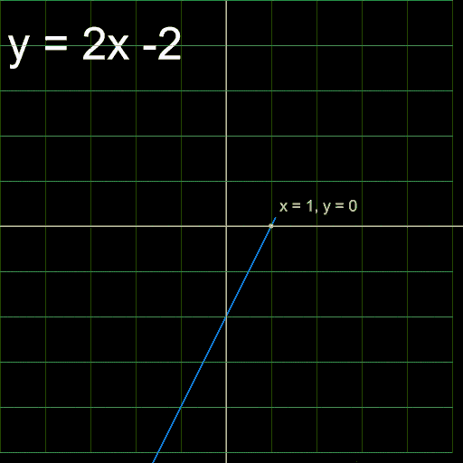
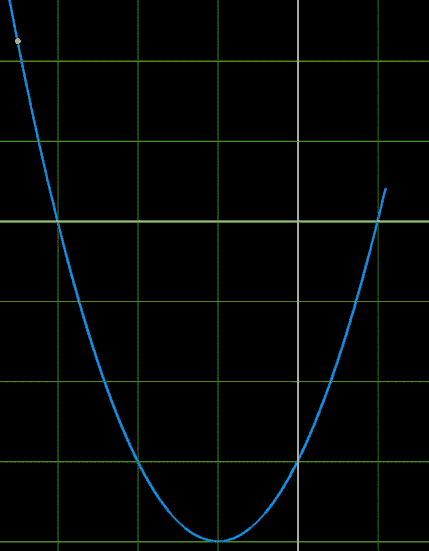
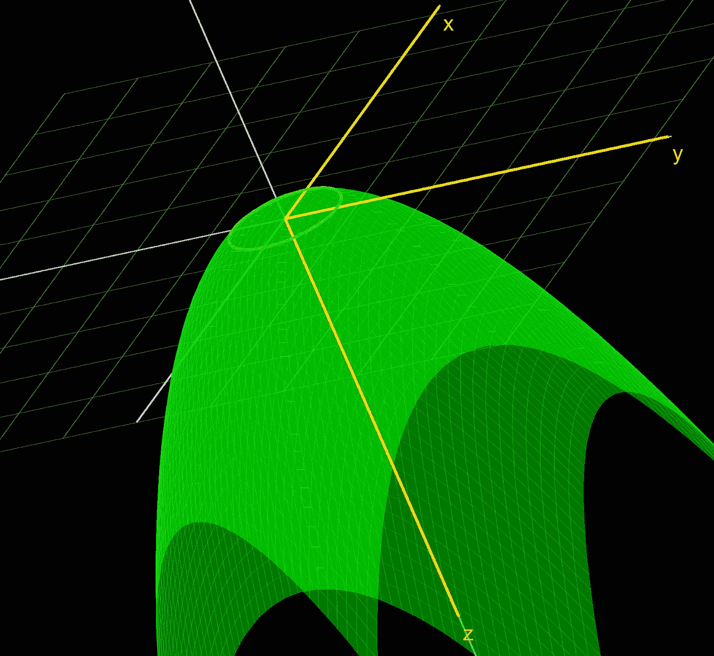
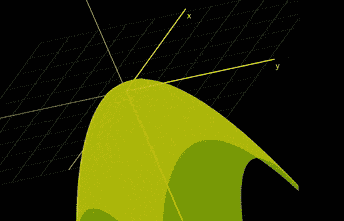
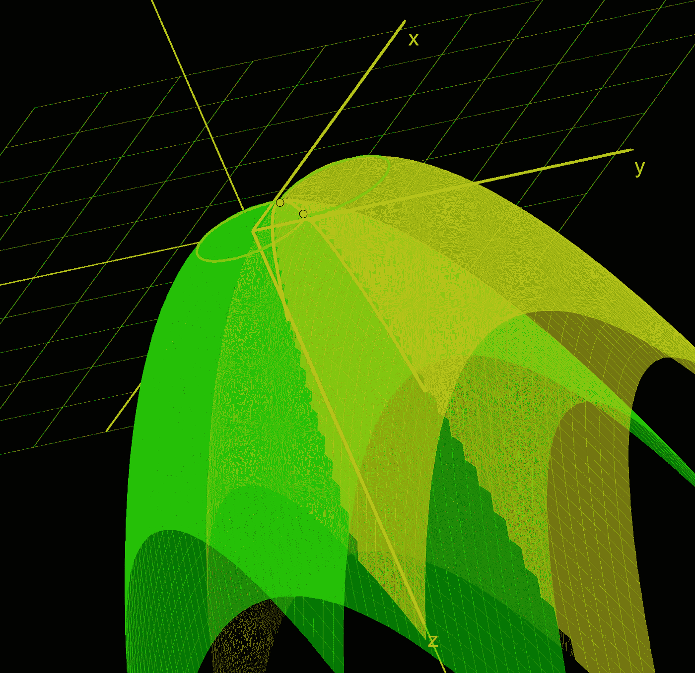
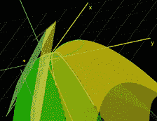

# 牛顿方法:视觉直觉。

> 原文：<https://towardsdatascience.com/newtons-method-the-visual-intuition-12a346f4d89?source=collection_archive---------30----------------------->

## 如果第一次你没有成功，试着再试一次。

# 牛顿和拉夫森

我们将在这个博客中讨论的方法也被称为牛顿-拉夫森方法。从名字上看，你可能会想象牛顿和拉夫森作为一个团队一起工作，像好朋友一样提出这个想法。但实际上，他们是独立发现的。这似乎是与牛顿共同的主题。还记得他是如何和莱布尼茨一起发现微积分的吗？为什么这个人在别人也有想法的时候有这么多想法？这实际上是很有可能的，因为，对于处于一个领域研究前沿的许多人来说，接下来的步骤通常不会太模糊。

和多个独立团队发现英特尔芯片的安全漏洞(Spectere 和 Meltdown)是一个道理。

不管怎样，历史已经足够了，让我们进入它是如何工作的。

# x 是什么？

代数的本质(源自阿拉伯语，Al-Jabr——把零件拼在一起)是求解未知量的方程。例如，找到 x，其中:

> 2x + 5 = 7 __(1)

很容易看出上面方程的解是 x=1。另一种方法是将所有东西放在一起，称表达式为 y，我们得到:y = 2x 2。然后，我们可以试着找到 y=0 的 x。

但是当 y 用 x 来表示变得越来越复杂时会发生什么呢？我们能找到满足 y=0 的 x 的所有(或至少一个)值吗？例如，下面的图 1 显示了 y 与 x 之间的一些更复杂的关系。但是，在所有情况下，x=1 时满足 y=0(尽管可能不是唯一的)。

图 1:在 x=1 时都有零点的不同函数。

如果线性函数是最简单的，那么下一个可能是二次函数(涉及 x)。现在，如果我们有一个二次方程，我们将如何着手解决它？嗯，我们可以简单地使用二次公式(当只有一个变量 x 时)。但是让我们假设我们不知道这个公式。我们只知道如何求解像方程(1)这样的线性系统。我们可以用解一个线性方程的知识来解一个非线性(这里是二次)方程吗？

> y=x __(2)

我们可以，但前提是我们要坚持不懈。让我们从任意一个点 x 开始，现在，计算我们的二次函数在这个 x 上的值，称之为 y，我们的工具是一个线性方程求解器，但我们有一个二次方程。所以，让我们把二次方程转换成一次方程。为此，只需用一个线性方程近似二次方程(使用[泰勒级数](https://en.wikipedia.org/wiki/Taylor_series))。当我们解这个线性方程时，我们会得到 x 的“答案”，但我们不能指望这个答案是“正确的”，因为我们“作弊了”——解了一个线性方程，而不是一个二次方程。既然疯狂的定义是做同样的事情却期待不同的结果，我们就不断重复这个过程。唯一的不同是，这一次我们使用线性方程的前一个解作为我们的起点。最终，这个过程将我们引向二次方程的解，如下图所示。

图 2:抛物线的牛顿拉夫森迭代使我们越来越接近抛物线与 x 轴相交的一个点。

# 加大尺寸

现在，你可能已经看到了和上面非常相似的东西。但是，这如何扩展到多维度呢？例如，代替一个变量 x，假设我们现在有两个变量 x 和 y。将等式(2)扩展到二维的最自然的方式是:

> z=x +y __(3)

这是它的情节:

图 3:抛物面，一种多维的二次方程。这里，x 和 y 是尺寸，z 轴代表抛物面的功能形式。

像以前一样，我们想求解 z=0。这发生在上图中的绿色圆圈处，也就是我们的抛物面方程与 x-y 平面相交的地方。但绿圈是无穷多个点，而不是一个、两个或三个。这很自然，因为我们将变量的数量增加到两个，但保持方程的数量不变。为了得到有限个解，我们需要有和变量一样多的方程，也就是两个。

对于我们的第二个方程，有许多候选项可供选择。为了简单起见，让我们复制现有的等式，并稍微移动一下。就这样，我们现在有了两个方程。

图 3:我们想演示求解多个方程。为了简单起见，我们只需将抛物面的现有方程复制，形成第二个方程。

此外，第二个方程也与 x-y 平面相交于一个圆，这两个圆相交于两个不同的点，这两个点是方程组的解。这是下图中的两个黄色点。

图 4:两个抛物线代表我们的两个二次方程相交于两点。

现在，我们如何使用之前的方法得到这些解中的一个？

我们将从 x-y 平面上的任意点开始(下图 5 中的粉红色点)。这可以投影到绿色抛物面上的绿点(这是我们的第一个二次方程)和黄色抛物面上的黄点(我们的第二个二次方程)。然后我们可以在绿色和黄色点画出绿色和黄色抛物面的最佳线性近似。因为线性方程是平面，这给了我们绿色和黄色的平面。这些平面将在紫色线处相交，然后在某点与 x-y 平面相交。这一点是两个线性方程组的解(两个抛物线的近似)。

图 5: NR 次迭代——我们重复求解通过逼近两个二次方程得到的线性方程组。这使我们越来越接近原二次系统的一个真实解。

这一点当然不是二次方程组的解，因为我们“作弊”，用线性方程组近似。但是我们从这个新的点开始重复整个过程。而这样反复做，就把我们带到了两个二次方程的其中一个解(两个黄点)。

如果我们想要第二种解决方案呢？那么，我们从一个不同的随机起点开始，重复这个过程，直到找到一个我们以前没有见过的解。

**注意:**你会在最优化的背景下看到牛顿拉夫森，而在这里，我们把它描述为一种解方程的方法。但是当我们注意到最优化通常涉及到寻找梯度(导数的向量)并将其设置为零时，它就变成了求解方程组的问题。

看看这个博客的视频版本: