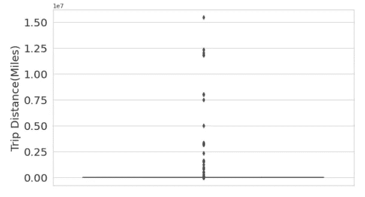
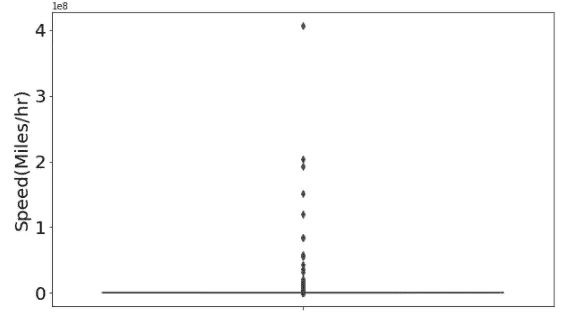
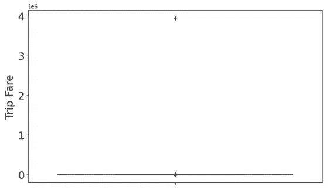
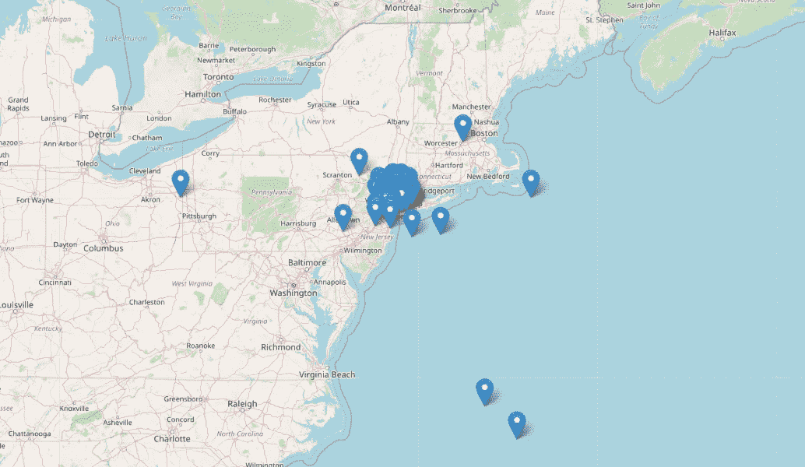
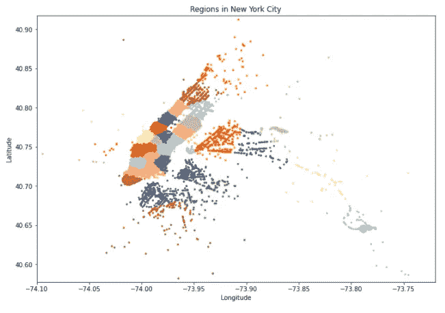
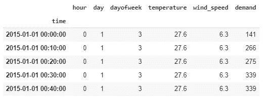
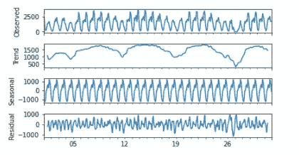
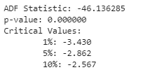
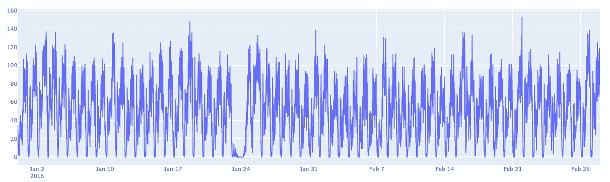
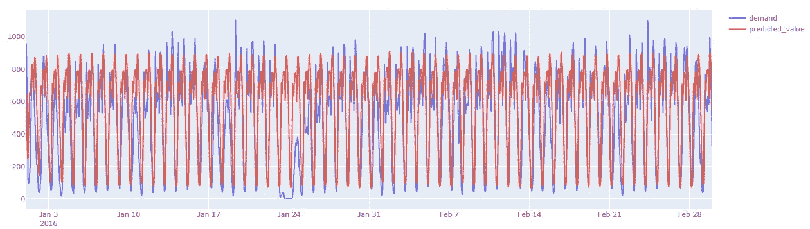

# 利用天气数据用 SARIMAX 预测纽约出租车需求

> 原文：<https://towardsdatascience.com/newyork-taxi-demand-forecasting-with-sarimax-using-weather-data-d46c041f3f9c?source=collection_archive---------12----------------------->

## 如何使用 SARIMAX 统计模型预测纽约市未来的出租车需求？


由[卢克·斯塔克波尔](https://unsplash.com/@withluke?utm_source=medium&utm_medium=referral)在 [Unsplash](https://unsplash.com?utm_source=medium&utm_medium=referral) 上拍摄的照片

axi 需求预测对于打车(和电子打车)公司来说已经变得极其重要，这是了解他们需求和优化车队管理的一种方式。

在这篇文章中，我们将介绍一种预测纽约某一地区出租车载客数量的方法。我们将执行时空时间序列分析，然后对包括天气数据在内的聚合数据应用众所周知的统计方法 SARIMAX。

# 数据描述:

## 出租车数据:

我们将使用纽约出租车需求公共数据，这些数据可从以下网址获得:[https://www1 . NYC . gov/site/TLC/about/TLC-trip-record-data . page](https://www1.nyc.gov/site/tlc/about/tlc-trip-record-data.page)

这里我们就用 2015 年 1 月到 2016 年 2 月的数据。

要从纽约数据集网站快速下载大量数据到你的 google drive 账户，你可以通过[这个链接](https://medium.com/@abdelkader_bouregag/download-large-data-sets-to-google-colab-in-few-seconds-for-your-data-science-project-6cfac68ad35)跟随我的教程。

## 天气数据:

对于天气数据，我们将使用来自视觉交叉提供者的数据:[https://visualcrossing.com/weather-data](https://visualcrossing.com/weather-data)

# 理论的味道:

时间序列预测是数据科学领域的研究热点之一。从统计方法到深度神经网络，已经测试了各种模型和方法。

当涉及到时间序列预测时，机器学习爱好者往往会直接跳到机器学习模型，避免使用统计方法，在许多情况下，统计方法在精度测量和所有预测范围内都表现出更好的性能，尤其是对于单变量时间序列，让我们首先了解一下如何对时间序列问题进行分类。Jason Brownlee 博士在他的书中介绍了一个框架来对时间序列问题进行分类，如下所示:

## 输入与输出:

输入:提供给模型的历史数据，以便进行单一预测。

输出:除了作为输入提供的数据之外，对未来时间步长的预测或预报。

## 内源与外源:

内生变量:受系统中其他变量影响的输入变量，也是输出变量所依赖的变量。

外生变量:不受系统中其他变量影响的输入变量，也是输出变量所依赖的变量

## 回归与分类:

预测一个数字量 vs 分类为两个或多个标签中的一个。

## 单变量与多变量:

一段时间内测量的一个或多个变量

## 单步与多步:

预测下一个时间步与预测多个未来时间步。

## 静态与动态:

拟合模型一次并用于进行预测 vs 在每次预测之前根据新获得的数据拟合模型

## 连续与不连续:

观测值一致与观测值不一致。

> 现在你对我们面临的时间序列问题有了一个概念，让我们介绍一下 SARIMAX 模型:

# **SARIMAX 有点解释:**

SARIMA 代表(季节性自回归综合移动平均)ARIMA 模型的一种变体，该模型用于单变量时间序列预测，支持序列的季节性成分。它支持自回归和移动平均组件。它有三个超参数来指定序列的季节性成分的自回归(AR)、差分(I)和移动平均(MA ),以及季节性周期的附加参数。

x 代表包含外生变量。

## 萨里玛(P，D，Q)

**p** :趋势自回归顺序。

**d** :趋势差序。

**q** :趋势移动平均订单。

*   **P** :季节性自回归顺序。
*   **D** :季节性差异订单。
*   **Q** :季节性移动平均订单。
*   **m** :单个季节周期的时间步数。

> 理论到此为止，现在让我们进入代码吧！

# **数据预处理:**

在任何机器学习项目中，数据清理/预处理都是非常重要的步骤，但这是一个很累的步骤，如果你对应用 SARIMAX 方法比对清理数据更感兴趣，你可以跳过这一部分，因为我将通过驱动器文件夹为你提供结构化和清理的数据，但理解数据是如何清理和结构化的很重要。

> PS:在“已清理数据文件夹链接”部分找到指向已清理数据文件夹的链接

```
data_Jan_2015 = dd.read_csv("/content/drive/My Drive/nyc-data/yellow_tripdata_2015-01.csv")data_Jan_2015.head()
```

我们在 dask dataframe 上导入 2015 年第一个月的数据，该数据包含许多特征，但我将仅展示我们清理数据所需的特征:

**tpep_pickup_datetime:** 提货的日期和时间

**tpep_dropoff_datetime:** 下车的日期和时间

**皮卡 _ 经度:**皮卡的经度

**皮卡 _ 纬度:**皮卡的纬度

**落客 _ 经度:**落客的经度

**落客 _ 纬度:**落客的纬度

**行程 _ 距离:**行程距离

首先，我们只选择需要的列，计算 trip_duration 和 speed，以便在数据清理过程中使用它。

准备好数据框后，我们将通过分析每列的四分位图来移除错误值:

## 行程距离四分位数:



出行距离四分位数

在打印四分位数和百分位数后，我们观察到第 99.9 个百分位数的出行距离为 22.58 英里，然而，第 100 个百分位数的值为 15420004.9 英里，这非常高。因此，我们将删除行程距离大于 23 英里的所有数据点。

在其他量化变量上做同样的过程(ِCheck 的 GitHub 回购代码)

## 速度四分位数:



速度四分位数

## 总票价:



总票价

## 取货/卸货清洁:



纽约的皮卡

通过可视化纽约外的一些接送，一些在海洋中，这些将从数据中删除。

## 使用 KMeans 对需求进行聚类:

在清除了纽约的需求之后，我们继续使用 Kmeans 算法对皮卡的需求进行聚类。我们把它分成 30 组。

```
#Clustering pickupscoord = new_data_Jan_2015[["pickup_latitude", "pickup_longitude"]].valuesregions = MiniBatchKMeans(n_clusters = 30, batch_size = 10000).fit(coord)cluster_column = regions.predict(new_data_Jan_2015[["pickup_latitude", "pickup_longitude"]])new_data_Jan_2015["pickup_cluster"] = cluster_column
```

接下来，我们将按地区对需求进行分组。

```
#Grouping the mounthly data by regionnew_data_Jan_2015.rename(columns={'tpep_pickup_datetime':'time','trip_distance':'demand',},inplace=True)new_data_Jan_2015['time'] = pd.to_datetime(new_data_Jan_2015['time'])grouped_new_data_Jan_2015 = new_data_Jan_2015[["pickup_cluster", "time", "demand"]].groupby(by = ["pickup_cluster", "time"]).count()
```

让我们想象一下这些区域:



最后，我们通过添加天气成分并以 1 小时为时间步长对需求进行重新采样来准备每个聚类的需求。

```
#Cluster example
cluster = grouped_new_data_Jan_2015.loc[0]
#Resampling Data in region j into one hour step
cluster = cluster.resample('1h').sum()
#Feature Engineering
cluster['Date time'] = cluster.index
cluster['Date time'] = pd.to_datetime(cluster['Date time'].dt.strftime('%Y-%m-%d %H'))
cluster['hour']=cluster['Date time'].dt.hour
cluster['day']=cluster['Date time'].dt.day
cluster['dayofweek']=cluster['Date time'].dt.dayofweek
#Merging with weather data
df_merge_col = pd.merge(cluster, weather_data, on='Date time')
cluster['temperature'] = df_merge_col.Temperature.values
cluster['wind_speed'] = df_merge_col['Wind Speed'].values
cluster = cluster[['hour','day','dayofweek','temperature','wind_speed',
'demand']]
```

群集(区域)将如下所示:



集群中的需求

这代表了一个地区的需求时间序列，我们将把它输入到我们的模型中以预测未来的需求。

每个区域将保存在一个单独的文件中。

我们将采取同样的步骤来准备其他月份的数据(预处理、清理、聚类、添加天气特征、将每个地区的需求保存在相应的文件中)

# 导入清理的数据:

我正在通过这个[驱动器文件夹](https://drive.google.com/drive/folders/1ZrJjrDjQIJbPgPhOZd2NqqlqYcvvB1fW?usp=sharing)提供清理后的数据，

在这里，您可以找到所有按区域清理和聚类的 NewYork 数据，我们将使用这些文件来训练和测试我们的模型。

现在我们将开始研究预测问题，我们提醒你这是一个时间序列预测问题，我们需要测试时间序列的平稳性以便能够应用 SARIMAX 模型。



季节性/趋势分解(一月一月)

从分解图中，我们可以发现一天(24 小时)的季节性

## 平稳性检验

```
#Stationarity test
import statsmodels.tsa.stattools as sts
dftest = sts.adfuller(train.iloc[:,:].demand)
print('ADF Statistic: %f' % dftest[0])
print('p-value: %f' % dftest[1])
print('Critical Values:')
for key, value in dftest[4].items():
  print('\t%s: %.3f' % (key, value))
```



平稳性测试结果

**增强迪基-富勒测验:**

零假设(H0):这表明时间序列有一个单位根，这意味着它是非平稳的。它有一些依赖于时间的结构。

替代假设(H1):它表明时间序列没有单位根，这意味着它是平稳的。它没有依赖于时间的结构。

p 值> 0.05:接受零假设(H0)，数据有单位根，非平稳。

p 值<= 0.05: Reject the null hypothesis (H0), the data does not have a unit root and is stationary.

> Here we have the p-value <= 0.05 which means that the data is stationarity.

# Reading cleaned data:

Now we confirmed that our process is stationary, we will read each regions demands and split the available data between train and test sets. We have data from January 2015 to February 2016.

# Train / Test split:

**列车数据:**2015 年 1 月至 2015 年 12 月

**测试数据:【2016 年 1 月和 2 月**

```
split_date = pd.Timestamp('2016-01-01')
train = cluster_cleaned.loc[:split_date]
test =  cluster_cleaned.loc[split_date:]
```



测试数据时间序列

可视化测试集，我们可以观察到 1 月 24 日左右数据的奇怪行为。这几点会影响模型的结果，所以我们会考虑到这一点。快速谷歌研究我们可以发现，这种行为是由于 2016 年 1 月 24 日那一周发生在美国和纽约市的怪异事件，特别是封闭道路影响了出租车需求。

来源:[https://www . NBC NewYork . com/news/local/NYC-new York-city-blizzard-biggest-ever-23-2016 年 1 月/831660/](https://www.nbcnewyork.com/news/local/nyc-new-york-city-blizzard-biggest-ever-january-23-2016/831660/)

# 使用 SARIMAX

现在我们的数据已经准备好，让我们开始吧，SARIMAX 有订单和季节性订单超参数需要调整，首先将对每个地区需求数据应用超参数调整，以使用 get_sarima_params 函数找到最佳模型设置:

接下来，我们使用此函数应用 sarimax 模型，请注意，在 get_sarima_params 中，我们在季节顺序 24 中指定了季节性，因为我们在时间序列中检测到了 24 小时的季节性。

不要忘记忽略 2016 年 1 月 23 日至 26 日之间的测试数据，因为纽约市的暴风雪导致了需求的错误行为。

让我们在第一个集群上测试该模型，并使用 MAE 和 RMSE 指标评估结果。


群集 1 上的梅& RMSE 训练和测试错误

# 可视化预测

现在我们将使用 Plotly 库来可视化测试集上的预测结果:



测试集上的预测可视化

我们可以看到，SARIMAX 模型在检测时间序列的季节性方面表现良好，而在检测变化(趋势)值方面表现不佳，这可以解释为某些问题中的异常检测。

我们还可以看到 1 月 23 日至 26 日期间，模型无法检测到奇怪的行为。

# 清理的数据文件链接:

在这个 [**drive 文件夹**](https://drive.google.com/drive/folders/1ZrJjrDjQIJbPgPhOZd2NqqlqYcvvB1fW?usp=sharing) 中找到，纽约出租车需求数据被清理并整理成 30 个簇，你可以将这个文件夹复制到你的 drive 中，导入到你的笔记本中，直接应用。黑客快乐！

# 笔记本代码:

[](https://github.com/k4der2rg/NewYork-Taxi-demand-prediction-with-SARIMAX) [## k4der 2r g/new York-Taxi-需求预测-带 SARIMAX

### 此时您不能执行该操作。您已使用另一个标签页或窗口登录。您已在另一个选项卡中注销，或者…

github.com](https://github.com/k4der2rg/NewYork-Taxi-demand-prediction-with-SARIMAX) 

# 结论:

我希望这个教程对你有用。你从打车和电子呼叫公司需要预测未来需求的动机开始。接下来是时间序列预测和 SARIMAX 模型背后的理论。然后你开始下载、探索和清理需求数据。这使我们能够更好地理解时空预测问题的行为和结构，并检验时间序列的季节性和平稳性。最后，我们实现了在纽约数据上应用 SARIMAX 模型的方法。

# 需要改进的领域:

要改善 SARIMAX 模型在数据上的结果，您可以尝试多种方法，例如:

*   将数据重新排列成更小的时间步长(比如 10 分钟)，以便模型更好地检测波动。
*   根据更多值调整 SARIMAX 模型。
*   将需求聚集到更多的区域。

## 参考

*   Python 时间序列预测简介 Jason Brownlee 博士
*   关于数据清理的一些步骤，我参考了这个 [repo](https://github.com/gauravtheP/Taxi-Demand-Prediction-New-York-City/blob/master/Taxi-Demand-Prediction-NYC.ipynb) 。