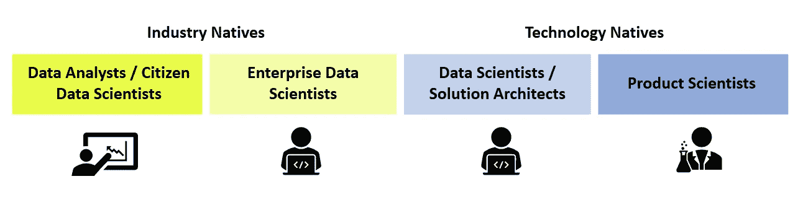

# 新一代企业数据科学家

> 原文：<https://towardsdatascience.com/next-gen-enterprise-data-scientists-d9ef729d80b9?source=collection_archive---------47----------------------->

## EY 和 IBM 是如何改变现状的

自 2016 年以来，我们都听说过由 [Gartner](https://www.gartner.com/en/documents/3534848) 使“公民数据科学家”成为主流的术语。如果你没有，那么你可能处在一个不断缩小的行业圈子里，这个圈子还没有被数字颠覆所颠覆。

公民数据科学家是能够使用或生成模型的人，这些模型利用了高级诊断分析或预测和规定功能。他们经常使用自动化工具，如 Alteryx 或 Power BI，通常可以生成比一般数据分析师稍微复杂一些的见解。

公民数据科学家是一种组织的数字化方式，通过提高现有员工的技能来挖掘通常可以在组织中找到的未使用的数据。安永(EY)通过向员工提供在 [Udemy](https://blog.udemy.com/how-ey-is-preparing-its-people-for-the-future-of-work/) 上免费学习大量技术课程的机会来做到这一点。

> 但这就够了吗？公民数据科学家能否发掘组织内部潜在的洞察力宝库，同时必须能够在日常运营和实践之间周旋，同时努力更加以数据为中心？

## 进入企业数据科学家。

# W 什么是企业数据科学家？

公民数据科学家和企业数据科学家的主要区别在于工作重点和范围。企业数据科学家通常来自组织或行业背景，已经完全转变为数据科学家的角色。他们曾经面向行业或客户的角色已经不复存在，使他们能够主要专注于数据科学和数据工程研究和任务。

> 企业数据科学家是一个成熟的数据科学家，但来自一个有着不同视角的组织或行业背景。

面对现实吧，一个数据科学家的工作并不容易。大量的时间花在研究和理解数据的本质上，然后测试和开发初始模型，然后进一步完善和重新完善。这还不是全部，还必须仔细实施该方法，记录流程和结果。

这样做了一遍又一遍。

毕竟，科学的脊梁是建立在细致的文献记录和复制结果的能力之上的。我们对昙花一现的奇迹不感兴趣。

这不是公民数据科学家拥有的奢侈品。他们的底线仍然是交付产品或服务，技术只是一个使能器。会有捷径和半生不熟的努力，但它肯定比没有任何技术支持的传统方式要好。

然而，企业数据科学家通过内部定位来填补这一空白，例如在组织的 R&D 或创新部门。在那里，他们可以与公民数据科学家合作，将他们最初的想法或原型开发成成熟的应用程序甚至软件。

> 我本人是作为一名企业数据科学家写这篇文章的。我之前是一个面向客户的角色，后来在内部转向专注于研究和开发供内部和商业使用的数据软件和平台。

# 不断增长的联盟

组织和企业不断增长的数据需求并没有被忽视。一些组织已经开始采取战略步骤，进一步加快工作的数字化。就在最近，EY 和 IBM 宣布了一项全球多年联盟，这无疑将使双方咨询业务的客户受益。

除了商业附加值，这种性质的合作为研究和开发提供了难得的机会，从长远来看，这可能会推动更大比例的价值。

EY 是一家跨国企业集团，业务遍及全球所有行业；而 IBM Watson Group 专注于商业和企业人工智能和自然语言。

Watson 拥有自己的服务套件，可以轻松实现日常数据科学活动。值得注意的是 **IBM Cloud Pak for Data** 采用完全集成的数据平台，允许存储资产、管理笔记本电脑和提供人工智能服务。最重要的是，这提供了一个环境，企业数据科学家可以直接与 IBM 的数据专家合作构建模型、应用程序和产品。

> 随着商业数据和智能的结合，我们可能会看到下一代智能“人工顾问”在行业中取得突破。这是成为企业数据科学家的大好时机！

# 角色和职能

## 连接点

在过去的几年里，作为 EY 公司的企业数据科学家，我与 IBM 密切合作。两个组织有两种传统上不同的商业模式，你可以想象在工作方式上会有很大的差异。

然而，我在这里要分享的是，这种体验在某种程度上是无缝的，因为每个团队的角色都是为联合交付技术产品而设置的。下图是我们在此类产品开发过程中典型的数据科学团队结构。

合作技术开发环境中各种角色的说明

行业本地的企业数据科学家(内部数据专家)应该与技术本地公司的外部数据科学同行保持第一接触点。能够执行简单数据处理和分析的数据分析师或公民数据科学家可以进一步帮助他们。与完全专注的企业数据科学家不同，公民数据科学家通常轮流担任角色，并提供从其特定领域获得的特定见解。

鉴于企业数据科学家对领域知识的理解和对数据架构的熟悉，他们负责为组织设计整体数据策略。这是传达给外部技术-本地数据科学家，建筑师和工程师，他们可以处理开发的纯技术方面。

## 结合工业和技术专业知识

因为企业数据科学家专注于行业/领域，所以他们通常对其领域中的数据如何表达以及在建模中使用它们的细微差别有最完整的理解。

> 作为一名在医疗保健领域拥有 10 年经验的从业者，并不意味着你是医疗保健数据方面的专家。相反的情况通常是正确的，有经验的领域从业者可能基于他们的经验怀有偏见，并且不能客观地查看数据。
> 
> 另一方面，非特定领域的数据科学家具备处理数据的统计专业知识和技能。然而，需要大量的时间将他们的专业知识调整到他们没有经验的新的复杂领域。

通过拥有内部的企业数据科学家，组织可以节省宝贵的时间和资源来弥合这一巨大差距。

## 可解释性的层次

最后，产业本地组织和技术本地组织之间的成功合作取决于达到的沟通水平。

> 任何经历过数字重组的组织都明白，技术素养是一个现实问题。

除非你从事技术工作，否则你不太可能理解数据处理。同样，技术原住民也很难理解需要几十年经验才能掌握的领域。

回到弥合差距的功能，企业数据科学家充当沟通者，或者作为可解释性的附加层。对产业本地人和技术本地人都有利。

从行业的角度来看，他们可以以对业务有意义的方式捕获和解释数据，从而推动更容易的采用。从技术的角度来看，他们理解架构和工程的局限性，并且能够将令人痛苦的不合理的要求保持在最低限度。

为了证明对企业数据科学家的需求，请考虑以下示例:

在会计领域，我们有外部审计师和内部会计师。组织永远不会雇佣一个对会计有所了解的人来担任内部职务；他们将雇用一名真正的会计师。

同样，在技术和数据占据中心舞台的未来，组织需要具备内部数据科学能力。

组织需要有自己的**企业数据科学家**。

*感谢阅读！*

***如果你觉得这篇文章有用就分享吧！如果你想看我以上任何一个实验的更多故事，请告诉我。***