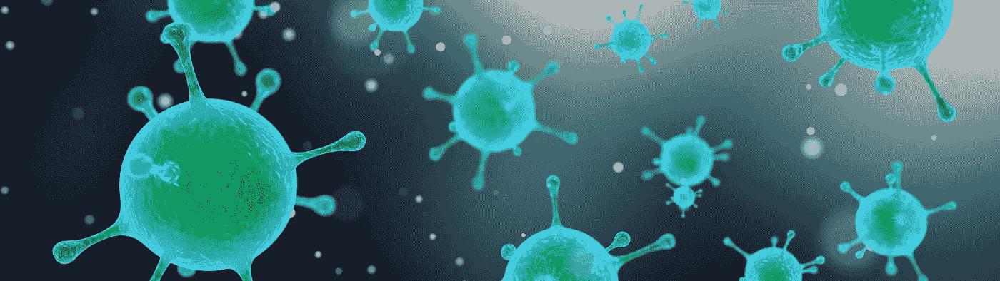
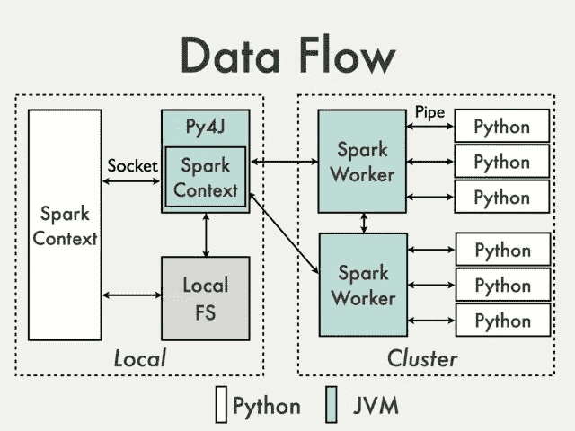
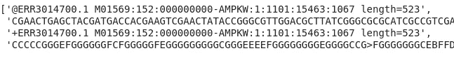
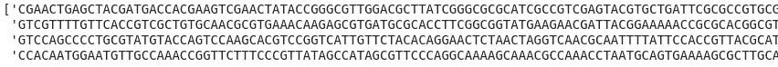
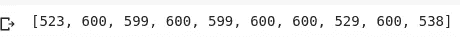
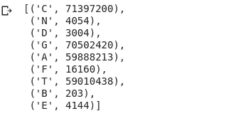

# 使用 PySpark 进行新一代测序数据分析

> 原文：<https://towardsdatascience.com/next-generation-sequencing-data-analysis-with-pyspark-888a1e0a079?source=collection_archive---------14----------------------->

## 了解如何使用 PySpark 在 Google Colab 中分析基因组数据



信用:pix abay/monar

> 有了 DNA，你必须能够分辨哪些基因是打开的，哪些是关闭的。目前的 DNA 测序无法做到这一点。下一代 DNA 测序需要能够做到这一点。如果有人发明了这个，那么我们就可以开始非常精确地确定疾病的治疗方法。——埃隆·马斯克

单细胞 RNA 测序(scRNA-seq)等下一代测序技术的快速发展要求对大数据进行高效的并行处理和分析。Hadoop 和 Spark 是存储和处理海量数据集的首选开源框架。Spark 最显著的优势是其迭代分析能力与内存计算架构相结合。打电话。弹性分布式数据集(RDD)上的 cache()有效地将其保存在内存中，并使其立即可用于计算；因此，后续的过滤、映射和归约任务变得即时。Spark 有自己的查询语言 Spark SQL，它的 MLlib 库非常适合机器学习任务。

scRNA-seq 可以做马斯克指出的事情——以细胞分辨率计算出哪些基因被打开/关闭。但这不是灵丹妙药——因为基因表达的调控并不停留在转录水平。mRNA 或信使 RNA——基因蛋白质编码区的代表——也包含决定核糖体蛋白质合成水平的序列。表达的蛋白质也可以经历一系列激活或抑制它的翻译后修饰。

# 设置笔记本

这些年来，我一直喜欢用 Google Colab 做我所有快速而肮脏的项目原型。使用 Colab，您可以跳过启动项目所需的所有初始步骤。无需设置虚拟环境、依赖关系等。此外，Colab 还配有免费的 GPU/TPU，可满足您所有的机器学习需求。

首先，去 Colab，按照上面的链接，启动一个*新的 Python 3 笔记本*。PySpark 需要 Java (Java 1.8)和 Scala，所以我们接下来会安装它们。

现在安装 PySpark。这里我们将安装 pyspark[sql],因为它将允许我们处理。gtf，。床，。砰然后。萨姆稍后归档。

```
!pip install pyspark[sql]
```

# 从 NCBI 序列读取档案(SRA)下载数据

已发表研究的序列数据可从 [SRA](https://www.ncbi.nlm.nih.gov/sra) 下载。在使用 sra 文件之前，您需要解压缩。使用 [SRA 工具包](https://trace.ncbi.nlm.nih.gov/Traces/sra/sra.cgi?view=software#header-global)中的 fastq-dump 工具。除了 SRA 文件，你可以直接下载。fastq、. fa.gz 或. fastq.gz 格式；现在可以用 PySpark 读取这些文件。

注意文件的大小。

# PySpark 的魔力

PySpark 的核心是弹性分布式数据集(RDD)；它代表了可以并行操作的不可变的数据分区集合。



信用:【https://cwiki.apache.org/】T4

首先初始化一个 spark 上下文。

```
import pyspark as spark
from pyspark import SparkConfsc = spark.SparkContext.getOrCreate(conf=set_conf())
```

为您的工作流传递一个最佳配置也是一个很好的实践。

# 数据分析

现在是时候读取我们的数据并将其转换到 RDD 了。

```
data = sc.textFile(path/to/fastq)
# in case you have a list of sequences
data = sc.parallelize(your_list)# lets take a look at the first read
# each read in fastq is represented by 4lines 
data.take(4)
```



让我们只从数据中提取序列。

```
sequences = data.filter(lambda x: x.isalpha())
sequences.count() # outputs the size of RDD - the number of reads
# => 1843156
```

看一下前四段。

```
sequences.take(4)
```



找出读数的长度怎么样？这只需要一行代码！

```
read_lengths = sequences.map(lambda seq: len(seq))
read_lengths.take(10)
```



接下来，计算读取的平均长度。

```
len_sum = read_lengths.reduce(lambda a, b: a+b)
len_sum//read_lengths.count()
# => 564
```

最后，我们来算一下基数。首先，我们将使用 *list()* 将序列分成单独的碱基，然后使用 *flatMap* 将列表合并成一个。然后，我们遍历各自的基并创建一个元组，将第一个元素作为基，将“1”作为其值。然后我们使用 *reduceByKey* 通过元组的第一个元素——key——来聚合值。

```
base_count = sequences.flatMap(lambda seq: list(seq))\
                       .map(lambda c: (c, 1)) \
                       .reduceByKey(lambda a, b: a+b)
base_count
```



我们这里只关心 A，T，G，C；剩下的都是神器。如你所见，这些序列富含 GC。

我在这里只触及了皮毛，您可以使用 PySpark 做许多很酷的事情。我会带着另一篇文章回来。

**你可以在** [**这个 colab 笔记本**](https://colab.research.google.com/drive/1OZdFuMRKg85gumJejdmGrgDH1NSz0yAT) 里找到代码示例。

> 我希望我已经介绍了足够的基础知识，可以帮助您开始学习。下次再聊。