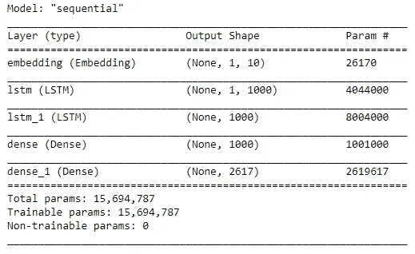
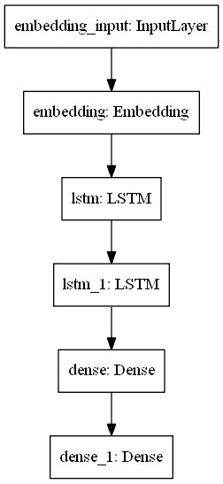
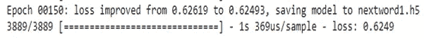
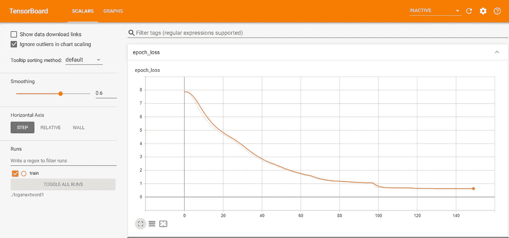

# 基于自然语言处理和深度学习的下一个单词预测

> 原文：<https://towardsdatascience.com/next-word-prediction-with-nlp-and-deep-learning-48b9fe0a17bf?source=collection_archive---------1----------------------->

## [虚拟助理项目](https://medium.com/tag/virtual-assistant-project)

## 使用 LSTM 设计单词预测系统

[来源:](https://unsplash.com/photos/BVyNlchWqzs)照片由阿玛多·洛雷罗在 unsplash 上拍摄

如果你的设备能够预测你打算输入的下一个单词是什么，这不是很酷吗？这类似于预测文本键盘在 What's App、Facebook Messenger、Instagram、电子邮件甚至谷歌搜索等应用上的工作方式。下面是一张理解这些预测性搜索的图片。

作者截图

当我们输入*天气如何*时，我们已经收到了一些预测。我们可以看到某些*接下来的单词*是天气预报。对特定用户发短信或打字的下一个单词的预测可能非常棒。通过了解用户的短信模式，可以节省大量时间。这也可以被我们的虚拟助手用来完成某些句子。总的来说，预测搜索系统和下一个单词预测是一个非常有趣的概念，我们将实施。

> ***注:*** *这是虚拟助手系列的 part-2。同一主题将有更多即将到来的部分，我们将介绍如何使用深度学习技术和 python 构建自己的虚拟助手。*

来源:乔恩·泰森在 unsplash 上拍摄的照片

# 简介:

本节将介绍构建的下一个单词预测模型将确切执行什么。该模型将考虑特定句子的最后一个单词，并预测下一个可能的单词。我们将使用自然语言处理、语言建模和深度学习的方法。我们将从分析数据开始，然后对数据进行预处理。然后，我们将对这些数据进行符号化，最终建立深度学习模型。深度学习模型将使用 LSTM 的来构建。完整的代码将在文章的最后提供，并带有一个到 GitHub 库的链接。

# 方法:

文本数据的数据集很容易找到，我们可以考虑古登堡计划，这是一项数字化和存档文化作品的志愿者工作，旨在“鼓励电子书的创作和发行”。从这里我们可以得到许多故事、文档和文本数据，这些都是我们问题陈述所必需的。数据集链接可以从[这里](https://www.gutenberg.org/)获得。我们将使用弗朗兹·卡夫卡的《变形记》一书中的文本。你可以从[这里](http://www.gutenberg.org/cache/epub/5200/pg5200.txt)下载数据集。然而，如果你有时间收集自己的电子邮件和短信数据，那么我强烈建议你这样做。这将对你的虚拟助理项目非常有帮助，在这个项目中，预测关键词将做出类似于你的短信风格或类似于你撰写电子邮件的风格的预测。

[来源:](https://unsplash.com/photos/POMpXtcVYHo)布雷特·乔丹在 unsplash 上拍摄的照片

# 预处理数据集:

第一步是从变形数据集中移除所有不必要的数据。我们将删除数据集的起点和终点。这是与我们无关的数据。起始行应该如下所示:

> 一天早上，当格雷戈尔·萨姆萨从烦恼的梦中醒来时，他发现

数据集的结束行应该是:

> 第一个站起来伸展她年轻的身体。

这一步完成后，将文件保存为变态 _ 干净. txt。我们将通过使用 utf-8 编码来访问变态 _ 干净. txt。我们清理过程的下一步包括替换所有不必要的额外新行、回车和 Unicode 字符。最后，我们将确保我们只有独特的话。我们将每个单词只考虑一次，并删除任何额外的重复。这将有助于模型训练更好地避免由于单词重复而造成的额外混淆。下面是文本数据预处理的完整代码。

**标记化:** **标记化**是指将较大的文本数据、短文或语料库分割成较小的片段。这些较小的片段可以是较小的文档或文本数据行的形式。它们也可以是一本单词词典。

Keras **标记器**允许我们对文本语料库进行矢量化，方法是将每个文本转换为整数序列(每个整数是字典中标记的索引)或向量，其中每个标记的系数可以是二进制的，基于单词计数，基于 tf-idf。要了解更多关于使用 Keras 的 Tokenizer 类和文本数据预处理的信息，请访问[此处](https://keras.io/api/preprocessing/text/)。

然后我们将文本转换成序列。这是一种将文本数据解释为数字的方式，以便我们可以对它们进行更好的分析。然后，我们将创建训练数据集。“X”将包含输入文本数据的训练数据。“y”将包含训练数据的输出。因此,“y”包含每个输入“X”的所有下一个单词预测。

我们将通过使用从 tokenizer.word_index 中提取的长度来计算 vocab_size，然后给它加 1。我们添加 1 是因为 0 是为填充保留的，我们想从 1 开始计数。最后，我们将把我们的预测数据“y”转换成 vocab 大小的分类数据。这个函数将一个类向量(整数)转换成二进制类矩阵。这将有助于我们的损失，这将是分类 _ 交叉熵。用于数据标记化、创建数据集以及将预测集转换为分类数据的其余代码如下:

> **注:**可在预处理中进行改进。您可以尝试不同的方法来改进预处理步骤，这将有助于在更少的时期内实现更好的损失和准确性。

[来源:](https://unsplash.com/photos/95YRwf6CNw8)照片由 Clement H 在 unsplash 上拍摄

# 创建模型:

我们将建立一个连续模型。然后我们将创建一个嵌入层，并指定输入维度和输出维度。将输入长度指定为 1 是很重要的，因为预测将只针对一个单词进行，我们将收到该特定单词的响应。然后，我们将添加一个 LSTM 层到我们的架构。我们会给它一个 1000 单位，并确保我们返回的序列为真。这是为了确保我们可以通过另一个 LSTM 层。对于下一个 LSTM 层，我们也将通过另一个 1000 单位，但我们不需要指定返回序列，因为它默认为假。我们将使用 relu 设置为激活的密集层函数，通过一个具有 1000 个节点单元的隐藏层来传递它。最后，我们让它通过一个具有指定 vocab 大小和 softmax 激活的输出层。softmax 激活确保我们接收到一堆与 vocab 大小相等的输出概率。我们的模型结构的完整代码如下所示。在我们看完模型代码之后，我们还将看一下模型概要和模型情节。

## 模型摘要:

## 模型图:

# 回访:

我们将为下一个单词预测模型使用的回调如下面的代码块所示:

我们将导入培训我们的模型所需的 3 个回调。3 个重要的回调是 ModelCheckpoint、ReduceLROnPlateau 和 Tensorboard。让我们看看每个回调函数执行什么任务。

1.  **ModelCheckpoint** —这个回调用于存储我们的模型在训练后的权重。通过指定 save_best_only=True，我们只保存模型的最佳权重。我们将使用损失指标来监控我们的培训。
2.  **ReduceLROnPlateau** —该回调用于在指定数量的时期后降低优化器的学习率。这里，我们将耐心指定为 3。如果准确度在 3 个时期后没有提高，那么我们的学习率相应地降低 0.2 倍。这里用于监控的指标也是损耗。
3.  **tensor board**—tensor board 回调用于绘制图形的可视化，即精度和损耗的图形绘制。这里，我们将只看下一个字预测的损失图。

我们将把基于度量损失的最佳模型保存到文件 nextword1.h5 中。在访问预测功能和尝试预测我们的下一个单词时，该文件将是至关重要的。我们将等待 3 个时期来改善损失。如果没有改善，那么我们将降低学习率。最后，如果需要，我们将使用 tensorboard 函数来可视化图形和直方图。

# 编译和调整:

下面是编译和拟合模型的代码块。

我们正在最后一步编译和装配我们的模型。这里，我们正在训练模型并将最佳权重保存到 nextword1.h5，这样我们就不必重复地重新训练模型，并且可以在需要时使用我们保存的模型。这里我只根据训练数据进行了训练。但是，您可以选择同时使用训练数据和验证数据进行训练。我们使用的损失是 categorical _ crossentropy，它计算标签和预测之间的交叉熵损失。我们将使用的优化器是 Adam，学习率为 0.001，我们将编译度量损失模型。我们的结果如下所示:

# 图表:

# 预测:

对于预测笔记本，我们将加载以 pickle 格式存储的记号化器文件。然后，我们将加载保存在目录中的下一个单词模型。我们将使用这个相同的标记器对我们应该进行预测的每个输入句子执行标记化。在这一步之后，我们可以通过使用保存的模型对输入句子进行预测。

我们将在运行预测时使用 try 和 except 语句。我们使用这个语句是因为万一在查找输入句子时出现错误，我们不希望程序退出循环。只要用户希望脚本运行，我们就希望运行脚本。当用户想要退出脚本时，用户必须手动选择这样做。只要用户愿意，程序就会运行。

让我们简单地看一下模型所做的预测。这是按如下方式完成的:

> 进入你们的行列:在沉闷的
> 天气
> 进入你们的行列:收集纺织品
> 样品
> 进入你们的行列:多么艰苦的
> 事业
> 进入你们的行列:停止脚本
> 结束节目.....

这可以通过使用预测脚本来测试，该脚本将在本文的下一节中提供。我将在下一节给出 GitHub 库的链接。正如我们所看到的，预测模型可以对大多数行进行最佳预测。“停止脚本”行将结束模型并退出程序。当我们输入行“停止脚本”时，整个程序将被终止。对于所有其他的句子，对输入行的最后一个单词进行预测。我们将考虑每行的最后一个单词，并尝试将其与下一个概率最高的单词匹配。

> **注意:**在某些情况下，程序可能不会返回预期的结果。这是显而易见的，因为每个单词只被考虑一次。这将导致特定句子的某些问题，您将不会收到想要的输出。为了提高模型的准确性，你可以考虑尝试二元模型或三元模型。在这种方法中，我们只使用了一元语法。此外，在预处理步骤中还可以完成一些额外的步骤。总的来说，有很大的改进余地。

# 观察:

> 我们能够为变形数据集开发高质量的下一个单词预测。我们能够在大约 150 个时期内显著减少损失。我们开发的下一个单词预测模型在所提供的数据集上相当准确。预测的总体质量是好的。然而，可以对模型进行某些预处理步骤和某些改变，以改进模型的预测。

就这样，我们到了文章的结尾。整个代码可以通过这个[链接](https://github.com/Bharath-K3/Next-Word-Prediction-with-NLP-and-Deep-Learning)访问。下一个单词预测模型现在已经完成，并且在数据集上表现得相当好。我建议你们所有人利用电子邮件或短信数据来预测下一个单词。这对你的虚拟助理项目会更好。请随意参考 [GitHub](https://github.com/Bharath-K3/Next-Word-Prediction-with-NLP-and-Deep-Learning) 库获取完整代码。我也强烈推荐 Machine Learning Mastery 网站，这是一个可以了解更多信息的神奇网站。这对这个项目有很大的帮助，你可以查看网站[这里](https://machinelearningmastery.com/)。非常感谢你阅读这篇文章，我希望你们都有美好的一天！