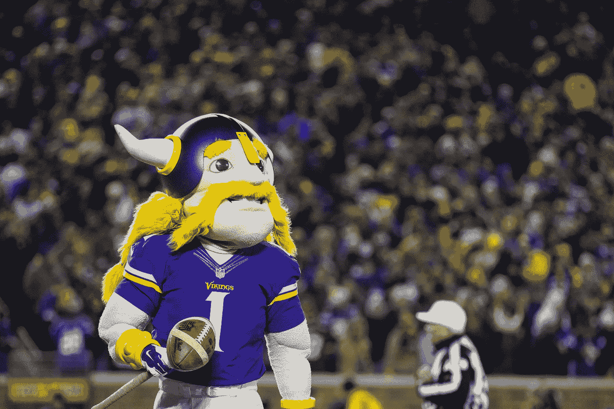
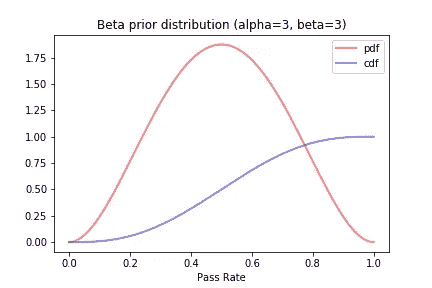
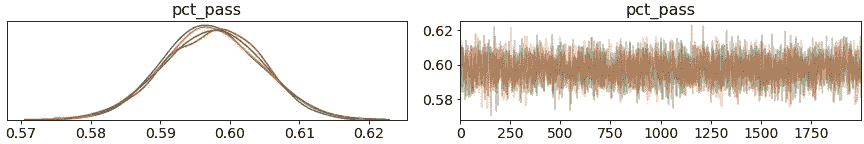
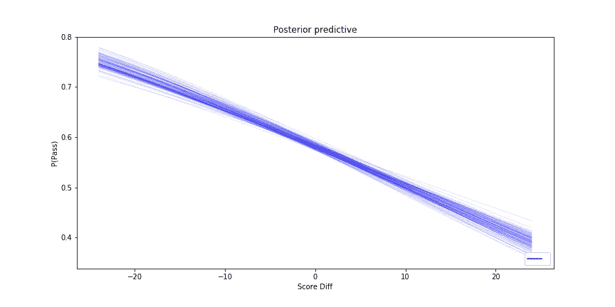
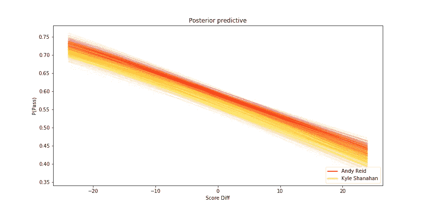
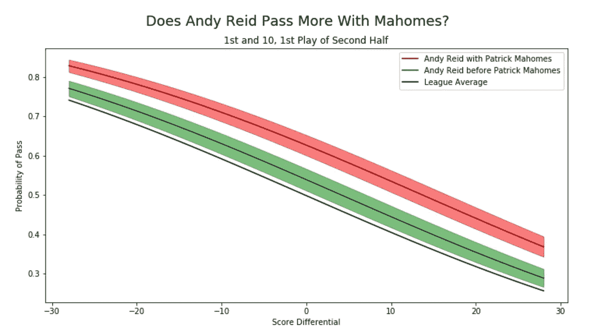
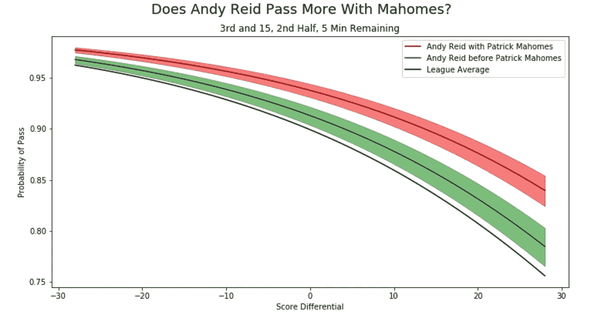
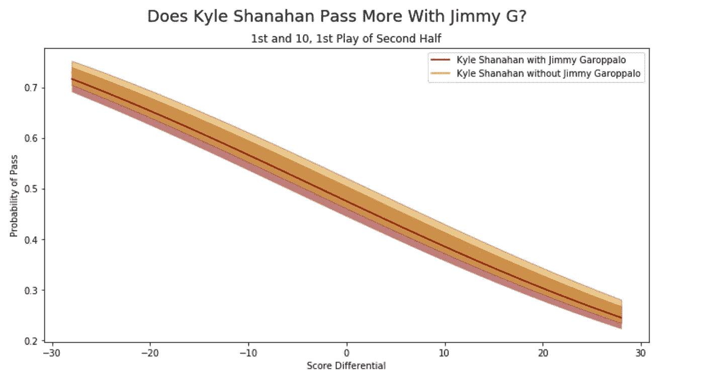
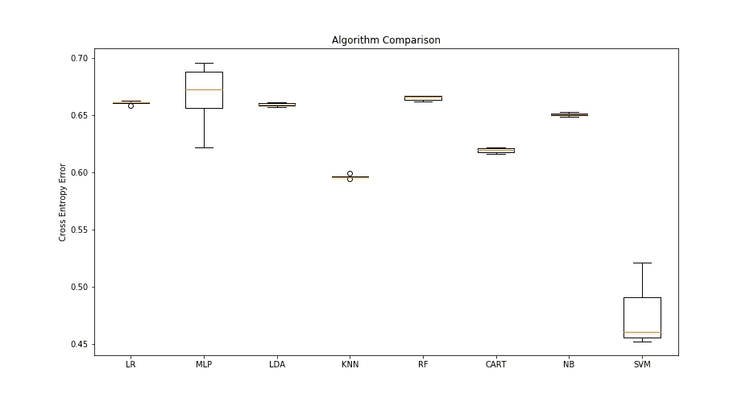

# NFL 球员呼吁与期望

> 原文：<https://towardsdatascience.com/nfl-play-calling-vs-expectation-61074fa77a60?source=collection_archive---------30----------------------->

蒂姆·米尔克在 [Unsplash](https://unsplash.com/s/photos/nfl-coach?utm_source=unsplash&utm_medium=referral&utm_content=creditCopyText) 上的照片

## 哪些教练和四分卫对传球/跑位影响最大？

# 介绍

美式足球的独特之处在于，教练的决策和准备对比赛有着相对强烈的影响。在足球、曲棍球、篮球和几乎任何其他运动项目中，运动员并不按照教练设计的脚本(也称为“比赛”)排好队。当然，这些运动中有设计好的打法——但它们远不是这项运动的核心。对于裁判来说，在曲棍球 2 v 1 休息时吹哨子并说，好吧，你有 40 秒的比赛时间来计算你想如何接近这个得分机会，这将是很奇怪的。

打电话决策自然是很有争议的。永恒的斗争之一是基于结果的事后分析，尤其是在高杠杆的情况下。说“好吧，你应该把球跑到那里”是人类的天性。例如，第四下，短码的情况往往可以决定整个比赛的结果。有关于是否[尝试完全转化](https://www.nytimes.com/2014/09/05/upshot/4th-down-when-to-go-for-it-and-why.html)的决定，也有关于如何转化的决定。如果球队最终失败，球迷们将不可避免地批评这两个决定。我确实认为，在过去的十年左右，随着梦幻足球、公开数据等的出现，球迷的知识显著增加了。所以很有可能他们在某些评论中是正确的。

这可能是最臭名昭著的“你应该运行它”的戏剧之一

打电话的决策经常受到批评，但球迷们迄今为止提供支持证据的能力有限。我们真的需要详细的数据来测试这种假设。每一个决定都有情境背景，一个人必须适应情境来评论这个行动号召。最著名的是，nflscrapR 数据集使这成为可能。这个图书馆通过使其易于访问而使详细资料大众化。

我在这篇文章中的目标并不是批评 NFL 的教练，而是分析他们对传球和跑位的影响。很有可能我最终会批评一小撮教练，但这不是我的使命。我确实认为应该尊重教练，因为他们已经达到了他们职业的顶峰，并且比我学习这项运动的时间更长。我也认为称他们不会犯错是错误的，因为最终，有太多的证据表明，一些人通过基本的决策来花费或获得他们的团队分数。在其他体育运动中也有类似的情况，公共数据分析显示传统信仰效率低下。最著名的大概是篮球中多投三分球的想法。

# 方法

最终，我感兴趣的是团队如何称之为游戏与期望。当球队落后时，他们往往会传球更多，因为传球变化更大，花费的时间更少。另一方面，如果一个团队经常领先，他们更有可能叫停比赛，因为他们更稳定，跑得更快。对于每一场比赛，我们可以找到一个联盟预期值，然后比较球队的表现。我从 CardinalsViz 在 Twitter 上的一条推文中获得了这个想法，我建议关注这条推文:

我将比较几种不同的方法，并展示每种方法的优缺点。这实际上是一个突出不同方法的很好的例子。我将从贝叶斯推理开始，然后转向更传统的机器学习方法。

## 什么是贝叶斯推理？

贝叶斯推理是一种测量未观测变量的方法。去看一场足球比赛，我们知道比赛结束的时间、距离和剩余时间。这些是独立的观察变量。如果我们想知道一个队通过的机会呢？一种解决方法是使用逻辑回归、决策树或机器学习方法。这些都很棒，但是它们有一个缺陷，就是它们是黑箱，而且只给出了点估计。贝叶斯推理以相似的准确性实现了相同的目标，但也量化了不确定性，并允许您进入过程的窗口。代价是这些概率规划推理方法需要一定水平的统计知识，增加了计算时间，并且难以扩展。缩放贝叶斯方法是一个非常活跃的研究领域。如果它们的规模更大，它们将成为许多领域的主导方法。

贝叶斯推理方法尤其适用于足球。另一个好处是，它们允许我们用少量数据更新先前的猜测。在一个 16 场比赛的赛季中，这是至关重要的。例如，我们有红人队临时主教练比尔·卡拉汉 11 场比赛的数据，所以我们应该比约翰·哈博更不确定他对比赛的影响，我们有他 10 个赛季的数据。

还有一个优点是，贝叶斯允许我们对教练的行为进行事先猜测。Kliff Kingsbury 承诺通过传球，或基本上是短码传球，彻底改革 NFL。比尔·卡拉汉在接手之前曾表示，他相信“建立跑步记录”会带来成功。对于这两位教练来说，我们的通过率会有很大不同。这看起来像是欺骗，但这是帮助模特的真实生活专家信息。经典方法没有直接的类比来整合专家信息。

或许同样重要的是，你可以告诉模型“我不知道这个家伙会如何表现”。第三位新教练扎克·泰勒，直到比赛开始我才知道。贝叶斯分析将允许我们对像他这样的人使用无知的先验。

这听起来像推销吗？如果是的话，我很抱歉，但我认为贝叶斯推理在许多领域都没有得到充分利用，所以我倾向于积极支持它。另一方面，这个问题实际上也很好地展示了它的弱点。

## 通过率模型

让我们从头开始，从头开始构建我们的模型。首先，我将从我们的 360，000 部戏中选取 5000 部戏，并找出一个基本通过率。为什么我要限制样本量？我之所以限制它，是因为我之前描述过的弱点——贝叶斯推理扩展性不好。对于那些实践机器学习方法的人来说，限制数据似乎很奇怪，因为数据越多几乎总是越好。

我也给通过率模型一个 beta (3，3)先验，说“我不认为真正的通过率会接近 100%或接近 0%”。如果你看过一两场足球比赛，这是显而易见的。我们真的不需要这么多数据的先验，但我想增加这一步，因为对于一些应用程序来说，良好的先验是必不可少的。在选择先验知识时，一个人可能犯的唯一大罪是对可能发生的事情赋予零概率。由于贝叶斯规则涉及乘以先验，所以在可能区域中具有零概率的先验将实际似然数据乘以零。Christopher Fonnesbeck 在 youtube 上有很多很棒的概率编程讲座，如果你想深入了解 prior choice 和其他相关模型，我建议你看几个。我也很乐意回答任何问题。

最后，这是我们简单通过率模型的代码:

这个 PyMC3 代码为我们提供了过去 10 年 NFL 球队通过率的可信区间:

注意，我只使用了第一次到第三次的数据。

右图显示了我们的 MCMC 样本链。我试图避免沉重的数学细节，所以我会掩饰它。我用 4 条链运行了 MCMC 算法，因此有 4 种颜色。如果右边的图看起来与上面的“毛毛虫”有任何不同，这意味着链没有收敛，您的结果有问题。

即使我们的样本很小，我们也可以确信 NFL 球队的真实通过率在 58%到 61%之间。你可能会说，“取平均值就行了！”。取平均值也是可行的，但是它不会给你任何不确定性区间。在预测结果和解释预期时，不确定性区间是必不可少的。当样本量很小时，它们也更重要——这在足球界经常发生。

最后，这个分析没有时间因素。一个潜在的改善方法是一个赛季接一个赛季的提高通过率。

## 基本逻辑回归模型

假设我们观察到球队落后时传球更多的行为。我们可以用分数差作为协变量来模拟通过率。添加一个预测变量会导致模型发生根本变化。我们不会像上面那样输出一个漂亮、干净的通过率分布，因为我们说通过率取决于分数差。

好消息是，这个新模型可以推广到你想要的任何特征，甚至是分类特征。当然，功能选择将变得很重要。使用更多的功能将是下一步。以下是我的逻辑回归模型代码，该模型使用了一个预测值，即分数差:

注意:我使用学生的 t 分布作为先验。它非常类似于正态分布，但是具有更宽的尾部(假设 nu 较低)。这在文学作品中很常见，但正常在这里也适用，因为我使用了广泛的无知先验。

现在，我们有了一个可以根据分数差异进行大幅调整的模型:

我想指出两件事。首先，随着更多数据接近零分差，我们的后验概率更加确定。在尾部附近，后验线呈扇形散开——我们对领先或落后 20 分的球队的数据更少。其次，分数差为零时的通过率与二项分布中的通过率相匹配。这是一个好兆头！如果有不匹配，我会担心某处出错。

## 添加分类变量

假设我们想要比较多个教练。在 PyMC3 中，很容易将分类变量添加到贝叶斯分析中。让我们比较一下即将到来的超级碗教练趋势:

鉴于相同的得分差距，安迪·雷德肯定比凯尔·沙纳汉更有可能通过。一个可能的原因是安迪·雷德有一个潜在的世代 QB 和沙纳汉有平均 QB 发挥。我们怎么能知道安迪·雷德是否因为他的四分卫而传球更多呢？通过更多的贝叶斯推断！

不过，我们很快就遇到了问题。为了准确捕捉预测变量，我们需要尽可能多的数据。然而，随着数据量的增加，MCMC 采样变得更加难以计算。其核心是，MCMC 试图“作弊”来解决积分——随着更多的数据和更多的特征，这些积分最终变得难以处理。实际上，这意味着我能够在大约 10，000 部戏剧上运行这些模型。过去 10 年的播放数据集有 360，000 次播放，因此这是不令人满意的。

# 标度贝叶斯推理

有多种方法来扩展这个模型，但没有一种是完美的。我会掩饰一些线索，但我不想陷入困境。正如我之前提到的，这是一个活跃的研究领域，有用的解决方案可以极大地促进多个学科的发展。首先，并非所有的 MCMC 算法都是相同的，因此并非所有算法的规模都相同。

那些来自机器学习背景的人可能会倾向于使用更多的 GPU 来解决这个问题。这是可能的，但 MCMC 采样要求链之间有一定的通信量。如果你正在寻找如何做到这一点，我建议探索 EP-MCMC 和近似 MCMC。

## 变分推理

变分推理结合了机器学习、梯度下降和贝叶斯推理背后的引擎。它使用一种算法来执行梯度下降，以调整和转换后验分布，直到它们最小化误差(误差通常计算为 Kullback-Leibler 散度)。这很好，因为它避免了计算边际似然积分和 MCMC 样本。不幸的是，正确执行 VI 可能需要大量精力来寻找正确的参数和避免局部极小值。即使是简单的线性回归也需要大量的参数化工作。产出不确定性中的误差也很难量化。

## 矢量化 MCMC

最初我打算列出这篇文章，因为我无法超越我上面所做的。相反，两天前，我在我的时间线上看到了这条非常及时的推文:

@903124S 发了一个关于逻辑回归的矢量化 MCMC 实现，这正是我需要的。这允许我将计算时间减少到一个合理的水平。因此，我能够描绘出安迪·雷德在他打更多普通四分球时的顶级四分球:

不出所料，我们可以相信帕特里克·马霍斯在中锋位置上时，安迪·雷德传球更多。我还输入其他变量，如停机时间、距离和剩余时间。这允许我们通过将不同的情况输入到模型中来调整情况:

请注意，y 轴与之前的可视化相比已经发生了变化。这显然是一种暂时的情况。

情境调整倾向是非常强大的，可能对那些为 NFL 比赛总数建模的人非常有用。一个很好的例子就是即将到来的超级碗 49 人队。他们在最近几个赛季遭受了许多伤病，这造成了一些奇怪的分裂。有了吉米·加罗波洛，他们在第一次到第三次进攻中有 53.6%的时间传球。有了他的替补四分卫，他们有 61.2%的机会通过。这清楚地表明，主教练凯尔·沙纳汉相信他的替补会比首发投得更多，对吗？如果没有其他信息，p 值等传统指标将显示完全的统计确定性，即凯尔·沙纳汉与吉米·加洛波洛的传球次数更多。相反，49 人队在他的许多快照上都领先。他的后援没有这种奢侈。通过贝叶斯推理，我们可以看到，无论四分卫是谁，凯尔·沙纳汉的传球量大致相同:

我在这里没有包括联盟平均水平，因为它几乎完全等于没有吉米 G 线。

# 问题

我们还有一些问题。我使用的贝叶斯逻辑回归模型只能处理以一致速率增长的单调特征。此数据集中的要素并不都具有这种质量。例如，在上半场结束前，球队很快就会传球，这是很常见的。我上面展示的模型不能正确区分上半场还剩两分钟和下半场开始。比赛中期的高通过率给它带来了麻烦，使它更难估计后面的情况。

支持向量机(SVM)和深度神经网络都能够处理这些线性但非单调的特征。这里我将重点介绍支持向量机，因为与其他众所周知的方法相比，它非常适合这个数据集，而且速度也非常快:

最右边的 SVM 明显优于其他常用方法。上面使用的逻辑回归是最左边的。

这些传统机器学习方法的快速性和准确性是很大的好处。当然缺点是无法用小样本对教练建模，无法给出不确定性的量化估计。一个 SVM 会给出一个通过率的点估计，不管是 3 号和 3 号的菜鸟主教练，还是 3 号和 15 号的 10 年主教练。当然，我们知道其中一种情况应该非常准确，而另一种情况应该非常不确定。

## SVM 应用

众所周知，西雅图的头蔻驰·皮特·卡洛尔致力于跑步(除了我之前嵌入的比赛视频)。今年，这种理念受到了审视，因为他没有伟大的跑位，却拥有联盟最好的四分卫之一。我的假设是，他因为过早的跑动而损失了球队的分数，而不是像安迪·雷德那样进攻。我还没有测试过这个，所以也许他没有。

是的，这里有缺陷和警告。教练会告诉你跑位会设置传球。聪明的足球人可能会说传球的回报在减少，尽管支持这一点的证据有限。很多人也用卡罗尔的输赢记录来为他的职业生涯辩护。

而且，皮特卡罗尔对足球的了解也比我多。最后，传球可以让时钟停止，所以一般来说，叫更多的传球会导致更多的传球——因此有一些我没有考虑的二阶效应。

记住所有这些警告，我发现皮特·卡罗尔在 2019 年比联盟平均教练多跑 10%的时间。这是极端的，这也是我选择这个例子的原因。在我测试的其他皮特·卡罗尔赛季中，差异并没有这么大。这也不太合理，因为今年他的跑位和传球效率的差异更大。

这意味着他本赛季比一个普通的联盟主教练在同样情况下多跑了大约 107 分。他的传球，使用 nflscrapR 的 EPA/play，比他在那段时间的跑位效率高出近 0.17 分。这意味着他让他的球队在整个赛季中因为没有达到联盟平均水平而损失了大约 19 分。

# 结论

对于比较各种机器学习方法的优缺点来说，这是一个很好的玩具问题。在这篇文章的研究中，我还偶然发现了最近开发的贝叶斯神经网络和贝叶斯支持向量机。它们承诺消除我在这里描述的模型的一些弱点。就像我之前说的，这是一个非常活跃的领域，我迫不及待地想以新的方式应用新的方法。

我赶在超级碗之前发表这篇文章，所以我的代码没有平时那么干净，评论也没有平时多。很快会有更新，但是我想享受这个游戏。这里的是我的 Kaggle-GPU 驱动的矢量化 MCMC 代码，这里的[是我在本地机器上使用的代码。](https://github.com/btatkinson/pass_exp)