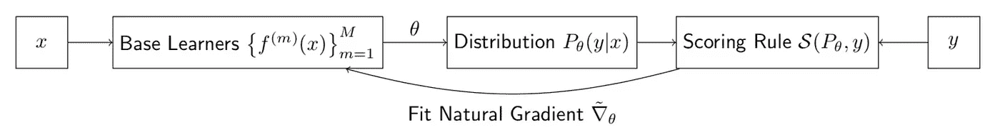
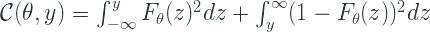
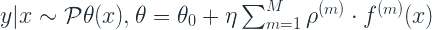
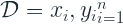
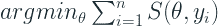
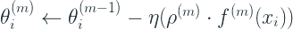
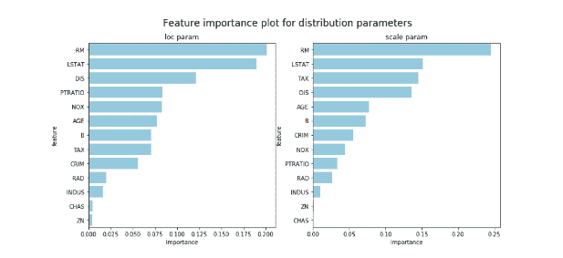
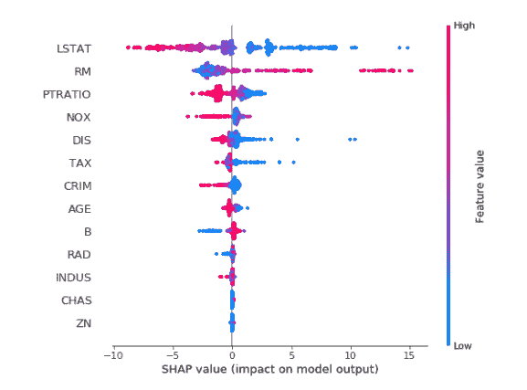
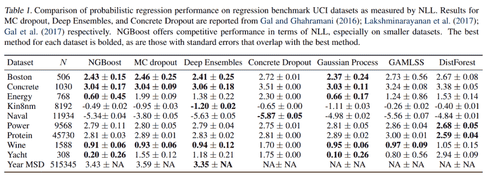
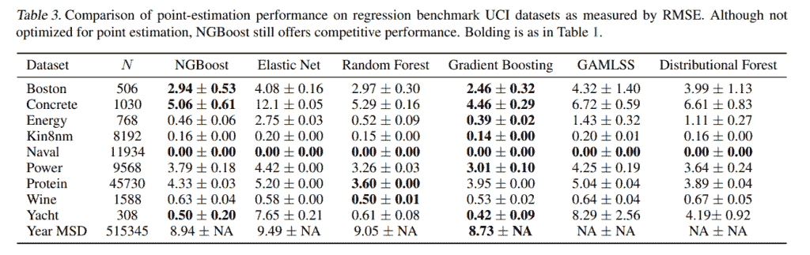

# NGBoost

> 原文：<https://towardsdatascience.com/ngboost-aca51711c8f5?source=collection_archive---------23----------------------->

## [梯度助推器](http://towardsdatascience.com/tagged/the-gradient-boosters)

## 梯度增强中的自然梯度

由[保罗·吉尔摩](https://unsplash.com/@paulgilmore_?utm_source=unsplash&utm_medium=referral&utm_content=creditCopyText)在 [Unsplash](https://unsplash.com/s/photos/mountains?utm_source=unsplash&utm_medium=referral&utm_content=creditCopyText) 上拍摄的照片

在表格数据领域，梯度助推器的统治几乎已经完成。在大多数真实世界以及竞赛中，几乎没有一个解决方案不具有来自梯度推进算法之一的至少一个模型。但是，随着机器学习社区的成熟，机器学习应用程序开始得到更多的使用，对不确定性输出的需求变得很重要。对于分类，梯度增强的输出形式已经可以让您了解模型预测的可信度。但是对于回归问题，情况并非如此。模型吐出一个数字，告诉我们这是它的预测。如何从点预测中获得不确定性估计？这个问题不仅仅是梯度推进算法的问题。但几乎适用于所有主要的 ML 算法。这是新成员 NGBoost 试图解决的问题。

> 如果你还没有读过本系列的前几部分，我强烈建议你去读一读，至少是第一部分，在那里我谈到了[梯度增强算法](https://deep-and-shallow.com/2020/02/02/the-gradient-boosters-i-the-math-heavy-primer-to-gradient-boosting-algorithm/)，因为我认为你已经知道了什么是梯度增强。我也强烈建议阅读 VI(A) *，这样你会对什么是***有更好的理解。**

# *自然梯度增强*

*NGBoost 的关键创新是在 boosting 算法中使用自然渐变而不是常规渐变。通过采用这种概率途径，它在协变量的条件下，模拟了结果空间上的全概率分布。*

*该文件将他们的方法模块化为三个部分*

1.  *基础学习者*
2.  *参数分布*
3.  *评分规则*

**

# *基础学习者*

*在任何增强技术中，都有一些基础学习者被组合在一起以得到一个完整的模型。NGBoost 不做任何假设，并声明基础学习者可以是任何简单的模型。该实现支持决策树和岭回归作为开箱即用的基础学习器。但是您可以轻松地用任何其他 sci-kit 学习风格模型来替换它们。*

# *参数分布*

*在这里，我们不是训练一个模型来预测作为点估计的结果，相反，我们预测的是一个完整的概率分布。每个分布都由几个参数来参数化。对于 eg，正态分布由其平均值和标准偏差来参数化。你不需要其他任何东西来定义一个正态分布。因此，如果我们训练模型来预测这些参数，而不是点估计，我们将有一个完整的概率分布作为预测。*

# *评分规则*

*任何机器学习系统都有一个学习目标，通常情况下，它的任务是最小化一些损失。在点预测中，用损失函数将预测与数据进行比较。评分规则类似于概率回归世界。评分规则将估计的概率分布与观察到的数据进行比较。*

*适当的评分规则 *S* 将预测的概率分布 *P* 和一个观察值 y *(结果)*作为输入，并给预测分配分数 *S(P，y)* ，使得结果的真实分布获得预期中的最佳分数。*

*最常用的适当评分规则是对数分数 *L* ，当最小化时，我们得到 MLE*

**

*这就是我们在很多地方看到的对数可能性。评分规则由θ参数化，因为这是我们作为机器学习模型的一部分所预测的。*

*另一个例子是 CRPS(连续排名概率得分)。对数分数或对数似然将均方误差推广到概率空间，而 CRPS 对平均绝对误差做了同样的事情。*

**

# *广义自然梯度*

*在这个系列的最后一部分，我们看到了什么是自然梯度。在那次讨论中，我们谈到了 KL 散度，因为传统上，自然梯度是根据 MLE 评分规则定义的。但本文提出了这一概念的推广，并提供了将这一概念推广到 CRPS 评分规则的方法。他们将 KL 散度推广为一般散度，并为 CRPS 评分规则提供了推导。*

# *把所有的放在一起*

*现在我们已经看到了主要组件，让我们看看所有这些组件是如何协同工作的。NGBoost 是一种用于概率预测的监督学习方法，它使用 boosting 来估计条件概率分布 *P(y|x)* 的参数。如前所述，我们需要提前选择三个模块化组件:*

1.  *基础学习者( *f**
2.  *参数概率分布( *P 由θ* 参数化)*
3.  *合适的评分规则( *S**

*对新输入 *x* 的预测 *y|x* 以条件分布 p 的形式进行，其参数θ通过对 *M 个*基本学习器输出和初始θ₀.的相加组合来获得让我们用 *f* ⁽ᵐ⁾[2].来表示 m 个基本学习者学习到的所有参数的组合函数并且对于所选择的概率分布中的每个参数，将有一组单独的基础学习者。例如，在正态分布中，μ有 *f* ⁽ᵐ⁾，log σ有 *f* ⁽ᵐ⁾。预测的输出也用一个特定阶段的比例因子(ρᵐ)和一个通用的学习速率η进行缩放:*

**

*这里需要注意的一点是，即使你的概率分布有 *n* 个参数，ρ仍然是一个标量。*

# *算法*

*让我们看看论文[2]中解释的算法。*

*让我们考虑一个数据集*

**

*助推迭代 *M* ，学习率η，带参数θ的概率分布，合适的评分规则 *S* ，基础学习器 *f**

1.  *初始化θ₀到边缘。这只是估计分布的参数，不考虑任何协变量；类似于初始化为均值。数学上，我们解这个方程:*

**

1.  *对于 M 中的每次迭代:*
2.  *针对数据集中的所有 *n* 个示例，计算评分规则 s 相对于前一阶段θᵢᵐ⁻的参数的自然梯度 gᵢᵐ。*
3.  *用于迭代 *f* ⁽ᵐ⁾的一组基本学习器适合于预测自然梯度 gᵢᵐ.的相应分量这个输出可以被认为是自然梯度在基础学习者类别的范围上的投影，因为我们正在训练基础学习者预测当前阶段的自然梯度。*
4.  *该投影梯度然后通过比例因子ρᵐ.进行缩放这是因为自然梯度依赖于局部近似(正如我们在前面的帖子中看到的)，这些局部近似在远离当前参数位置的地方不会保持良好。
    在实践中，我们使用线搜索来获得最佳的比例因子，使整体评分规则最小化。在实现中，他们发现在线搜索中将缩放因子减半效果很好。*
5.  *一旦估计了缩放参数，在通过学习速率进一步缩放之后，我们通过将负缩放投影梯度添加到前一级的输出来更新参数。*

**

# *履行*

*该算法在[https://github.com/stanfordmlgroup/ngboost](https://github.com/stanfordmlgroup/ngboost)具有现成可用的 Sci-kit 学习风格实现。让我们来看看调整模型的关键参数。*

# *超参数*

*   *Dist:该参数设置输出的分布。目前，该库支持用于回归的*正态、对数正态和指数*分布，用于分类的*k _ 分类和伯努利*。*默认:正常**
*   *评分:指定评分规则。目前，选项在 *LogScore 或 CRPScore* 之间。*默认值:LogScore**
*   *基础:这指定了基础学习者。这可以是任何 Sci-kit 学习估计器。*默认为三层决策树**
*   *n_estimators:提升迭代的次数。*默认值:500**
*   **learning_rate* :学习率。*默认值:0.01**
*   **minibatch_frac* :在每次提升迭代中使用的行的百分比子样本。这与其说是性能调优，不如说是性能黑客。当数据集很大时，这个参数可以大大加快速度。*

# *解释*

*尽管在使用来自机器学习模型的重要性之前需要相当多的谨慎，NGBoost 也提供了特性重要性。对于它估计的每个参数，它都有单独的一组重要性。*

**

*来源:NGBoost 文档[3]*

*但最精彩的部分不仅仅是这个，还有那辆 [SHAP](https://deep-and-shallow.com/2019/11/24/interpretability-cracking-open-the-black-box-part-iii/) ，也是现成的型号。您只需要使用 TreeExplainer 来获取值。(要了解更多关于 SHAP 和其他可解释技术的信息，请查看我的另一个博客系列——[可解释性:打开黑盒](https://deep-and-shallow.com/2020/06/27/the-gradient-boosters-vib-ngboost/Cracking%20open%20the%20black%20box))。*

**

*来源:NGBoost 文档[3]*

# *实验*

*本文还研究了该算法与其他流行算法相比的性能。有两种不同类型评估——概率评估和点估计*

# *概率回归*

*在来自 UCI 机器学习知识库的各种数据集上，NGBoost 与其他主要的概率回归算法进行了比较，如[蒙特卡洛丢失](http://proceedings.mlr.press/v48/gal16.pdf)、[深度集成](https://papers.nips.cc/paper/7219-simple-and-scalable-predictive-uncertainty-estimation-using-deep-ensembles.pdf)、[混凝土丢失](http://papers.neurips.cc/paper/6949-concrete-dropout.pdf)、高斯过程、[位置、规模和形状的广义加法模型(GAMLSS)](https://www.jstatsoft.org/article/view/v023i07) 、[分布式森林](https://arxiv.org/pdf/1804.02921.pdf)。*

**

# *点估计*

*他们还针对其他回归算法(如弹性网络、随机森林(Sci-kit Learn)、梯度推进(Sci-kit Learn))评估了点估计用例上的算法。*

**

# *结论*

*NGBoost 的性能与现有算法一样好，甚至更好，但它还有一个额外的优势，就是为我们提供了一个概率预测。并且公式和实现足够灵活和模块化，使其易于使用。*

*但是这里的一个缺点是算法的性能。时间复杂度随着我们必须估计的每个额外参数而线性增加。所有效率方面的改进/改变都已经成为 LightGBM 或 XGBoost 等流行的梯度提升包的一部分，但在当前的实现中并不存在。也许它会很快被移植过来，因为我看到回购正在积极发展，并将其视为他们的目标行动项目之一。但是在这之前，这是相当慢的，尤其是对于大数据。一种解决方法是使用 *minibatch_frac* 参数来加快自然梯度的计算。*

*现在我们已经看到了所有主要的梯度助推器，让我们挑选一个样本数据集，看看它们在本系列的下一部分如何表现。*

*[*中的其他文章*](http://towardsdatascience.com/tagged/the-gradient-boosters)*

*   *[老好的渐变增强](/the-good-old-gradient-boosting-f4614b0e62b0)*
*   *[正规化的贪婪森林](/regularized-greedy-forest-a17cd0c85f06)*
*   *XGBoost*
*   *[LightGBM](/lightgbm-800340f21415)*
*   *[CatBoost](/catboost-d1f1366aca34)*
*   *[自然坡度](/natural-gradient-ce454b3dcdfa)*
*   *NGBoost(你在这里)*

# *参考*

1.  *甘利顺一。自然梯度在学习中很有效。神经计算，第 10 卷，第 2 期，第 251–276 页。*
2.  *段，托尼。NGBoost: [用于概率预测的自然梯度推进](https://arxiv.org/pdf/1910.03225.pdf)，arXiv:1910.03225 v4【cs .2020 年 6 月 9 日*
3.  *NGBoost 文档，【https://stanfordmlgroup.github.io/ngboost *

**原载于 2020 年 6 月 27 日 http://deep-and-shallow.com**[*。*](https://deep-and-shallow.com/2020/06/27/the-gradient-boosters-vib-ngboost/)**