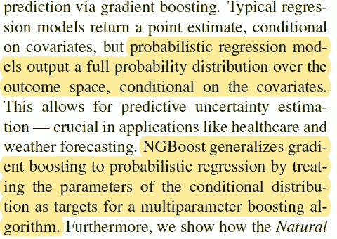
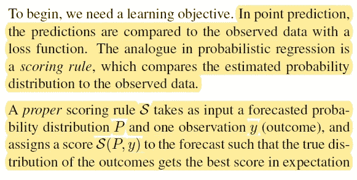
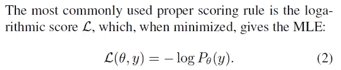
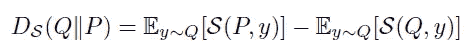
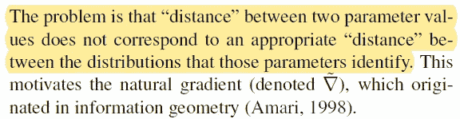
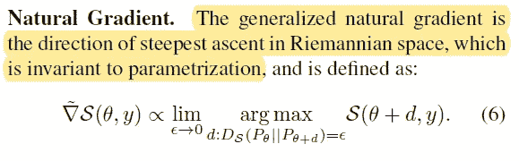
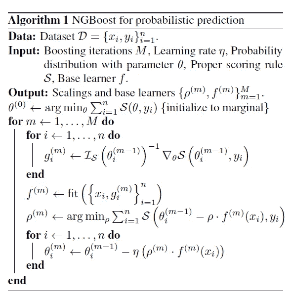
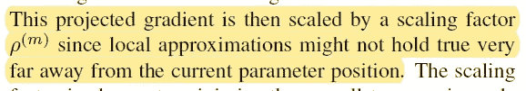
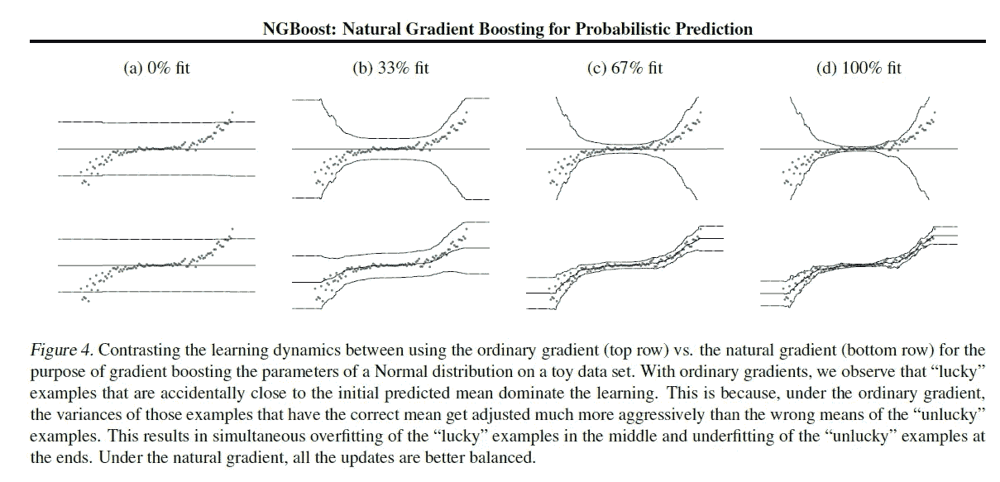
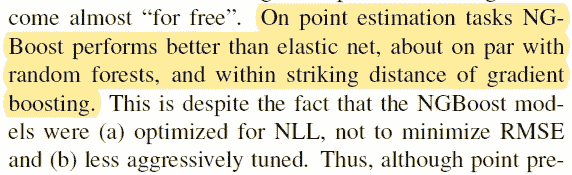

# NGBoost 算法:解决概率预测问题

> 原文：<https://towardsdatascience.com/ngboost-algorithm-solving-probabilistic-prediction-problems-fdbe1858ca61?source=collection_archive---------25----------------------->

## ICML 2020 年

## 预测目标变量的分布，而不仅仅是点估计

照片由[穆罕默德·阿里扎德](https://unsplash.com/@mohamadaz?utm_source=medium&utm_medium=referral)在 [Unsplash](https://unsplash.com?utm_source=medium&utm_medium=referral) 拍摄

在翻阅 [ICML 2020 录取论文](https://icml.cc/Conferences/2020/Schedule?type=Poster)时，我发现了一篇有趣的论文:

 [## NGBoost:用于概率预测的自然梯度推进

### 我们提出了自然梯度推进(NGBoost)，一种算法的一般概率预测梯度…

arxiv.org](https://arxiv.org/abs/1910.03225) 

你可能会问，我们还需要多少关于梯度推进的论文？但事实上，GBT 算法家族在表格数据上表现得非常好，一直在 Kaggle 排行榜上名列前茅。这项技术非常成功，现在已经扩展到表格数据以外的领域，例如，NLP。

# 问题陈述

我们在这里处理的问题是，几乎所有的回归算法都不返回给定预测值 P(y|X)的目标变量的分布，而是返回目标变量 E(y|X)的期望，即点估计。这与大多数返回类别概率的分类算法相反。例如，在 [scikit-learn](https://scikit-learn.org/) 中，分类器有方法`predict_proba()`，它返回类的概率。回归子缺少这种方法，只有回归概率。

为什么这是一个问题？假设你正试图预测下周的天气。如果您需要提供一个预测范围，即预测 15–20 度，而不是预测 17.25 度，该怎么办？如果你想知道气温不会降到冰点以下的概率？你能用一个模型做所有这些预测吗？是的，如果你的模型返回给定预测值的目标变量的条件概率分布。虽然这不是一个新问题，但大多数解决方案都是针对特定问题的，我们缺少开箱即用的通用算法。

NGBoost 算法解决了这一问题:

# 概率推理

NGBoost 如何找到目标变量分布？

因此，首先，这不是一个非参数模型(如果您对连续变量的非参数建模感兴趣，可以尝试离散化或分位数转换等技术)。你必须对条件目标变量分布做一个假设。例如，它可以是正态分布(但是μ和σ都取决于 X)，或者高斯混合(对于许多回归问题来说更现实的情况)，或者偏斜的正态分布。对于生存分析，它将是指数分布，对于预测正值，它是伽玛分布的变体，等等。一旦你选择了你的条件分布，问题就简化为学习给定输入变量的分布的参数向量 **θ** 。

# 我们在优化什么？

在处理常规回归问题时，我们通常会最小化均方误差。如果我们试图预测的是一个概率分布，我们如何选择一个损失函数？在这种情况下，我们使用一个*评分规则*:

对于许多问题，我们可以使用负对数似然作为评分函数

在这种情况下，我们试图得到的是给定用 **θ** 参数化的分布，目标值 y 的可能性有多大。参数 **θ** 最佳选择的评分规则是最小的评分规则。评分规则之间的差异称为离差，是概率分布之间“距离”的度量。如果 Q 是真实分布，P 是预测分布，则散度为:

如果我们使用 MLE，那么散度就变成了 kull back–lei bler 散度，广泛用于度量概率分布之间的差异。

# 自然梯度

NGBoost 中的“NG”代表“自然渐变”。(或者可能是因为它是论文合著者之一吴恩达的姓氏？)为什么非要引进呢？

一旦您开始使用基于梯度的方法来学习参数 **θ** ，您会很快意识到两个分布之间的距离不是由它们参数的差异定义的，因此参数的梯度方向不一定表示模型的最佳改进方向

自然梯度通过使用散度而不是参数差来纠正这个问题:

所以，我们不是在参数空间里画一个单位球在点周围，寻找最大改善的方向，而是画一个散度取相同值ε的曲面。自然梯度通过统计流形的黎曼度量与规则梯度相联系:

如果我们用 MLE，矩阵 I 就是[费希尔信息矩阵](https://en.wikipedia.org/wiki/Fisher_information)。

# 把所有东西放在一起

使用所介绍的技术，可以创建基于 GBT 的算法来预测条件分布的参数:

虽然这看起来像一个常规的 GBT 算法，但它有几个重要的区别:

1.  对于每个例子和迭代计算梯度，然后通过逆黎曼度量来改进，在 MLE 的情况下，这是逆信息矩阵。如果有几个分布参数，这不是一个大问题。
2.  使用不依赖于示例的缩放因子，这允许对拟合的弱学习器进行全局调整

与其他方法相比，该算法表现出良好的性能。比较自然梯度和规则梯度的实验结果非常有趣:

我们可以看到，使用自然梯度显著提高了学习，结果更正确地描述了条件方差。

有趣的是，该算法也擅长预测点估计，即使它是在不同的目标上训练的。

Github 知识库[https://github.com/stanfordmlgroup/ngboost](https://github.com/stanfordmlgroup/ngboost)有一个很好的例子，你可以在一个简单的数据集上使用它:

# 结论

预测连续变量的条件分布是困难的，预测点估计要容易得多。这与分类问题不同，在分类问题中，更多的算法能够预测类别概率。NGBoost 算法允许在给定预测值的情况下容易地获得目标变量的条件分布的参数预测。对于 NGBoost 可以处理的分发类型，几乎没有什么假设。事实上，如果正态分布不适合给定的问题，可以选择另一种分布(可能有更多的参数)来更好地适应模型。正如论文结论中所指出的，该算法有许多改进的可能性，探索理论问题和更复杂的问题。但是即使在这个阶段，NGBoost 也可以用于大多数实际问题的概率回归。