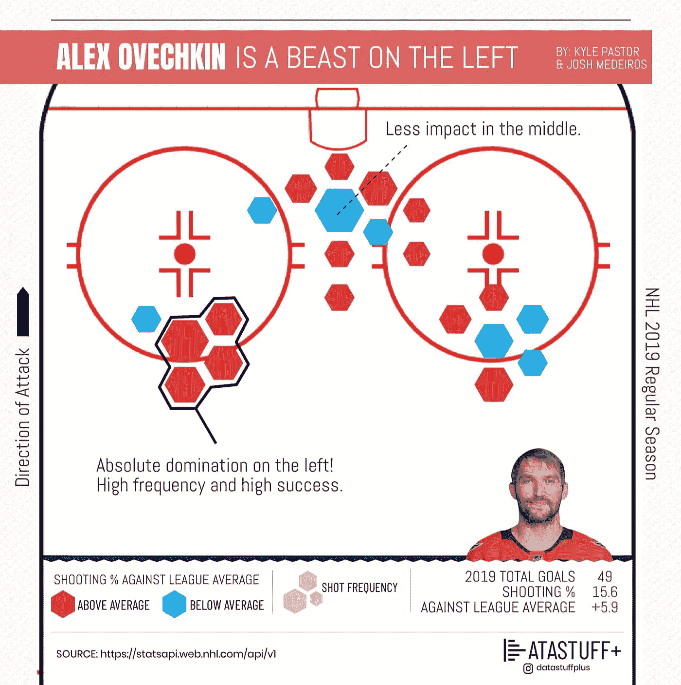
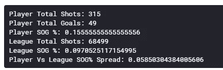
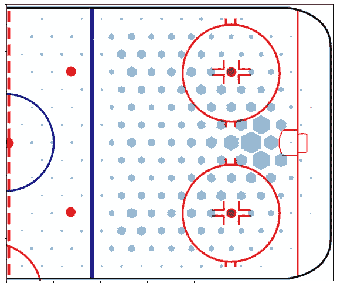
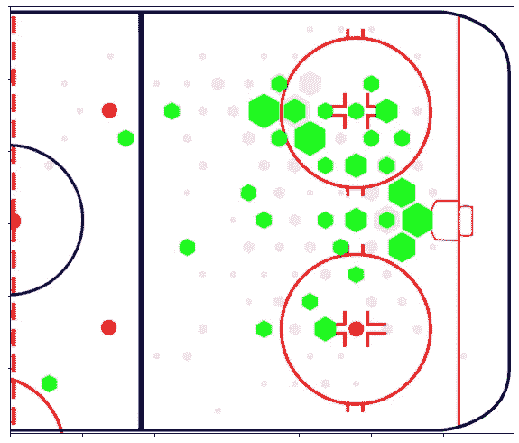
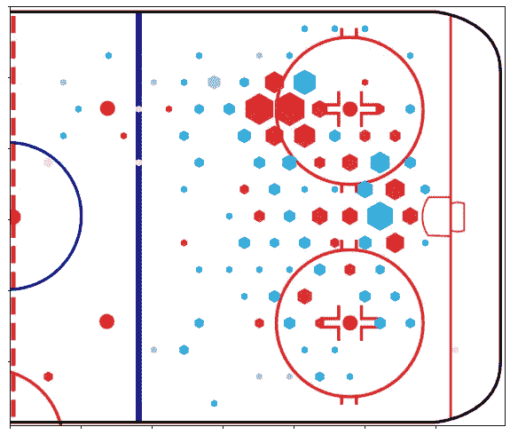
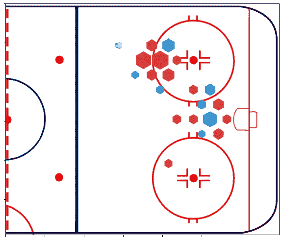

# 使用 Python 进行 NHL 分析

> 原文：<https://towardsdatascience.com/nhl-analytics-with-python-6390c5d3206d?source=collection_archive---------14----------------------->

## 我用数据理解 NHL 的冒险



这就是我们今天要做的！分析的最终结果显示，亚历克斯·奥韦奇金是左翼之王。

阿纳达。曲棍球。有些人可能会说，他们是一体的，然而我从来没有真正成为一个超级体育迷。在枫叶队进入季后赛的罕见情况下，我会穿上蓝色的衣服，和我的朋友一起去酒吧等待不可避免的失望，但是当他们开始谈论球员和他们在赛季中的表现时，我开始感觉有点疏远。因此，为了更好地理解这款游戏，我决定戴上数据分析帽，深入研究一些 NHL 球员的数据。

我做的第一件事是查看什么样的数据是可用的，哦，我没有失望！实际上有一个未记录的 NHL 数据 API，包含从球队日程和花名册到 ***的所有内容，包括在冰上拍摄的每一个镜头，包括地点，涉及的球员和发生的时间*** 。对于那些好奇的人，一个很棒的人创建了一个 GIT 页面，其中有 API 调用的摘要( [NHL API 文档](https://github.com/dword4/nhlapi))。有了这个，我就有了提取数据和开始做一些球员分析所需的一切。

# 正在提取 NHL API 数据

我所有的分析都是用 Python 完成的，为了更简单，我使用 Kaggle 作为我的编码平台。如果你还没有检查 Kaggle 出来，你真的应该。他们有一堆开放的数据集、竞赛以及分享和存储你的笔记本的方式(Jupyter)。我将在这里展示的所有代码都可以从我的 Kaggle 帐户上公开获得(参见底部的参考资料),所以请随意探索和使用它。由于数据集如此之深，我决定只提取 2019-2020 赛季的游戏事件数据进行分析。这让我可以访问到目前为止的所有比赛，包括所有冰上项目(击球、击球、对抗等。).

和往常一样，首先要做的是加载包和初始化变量。这里你会看到我使用**请求**从 API 获取数据，使用 **pickle** 保存数据以备后用。

```
import requests
import pickle**# Set up the API call variables**
game_data = []
year = '2019'
season_type = '02' 
max_game_ID = 1290
```

API 的格式允许我们传入赛季的年份，选择比赛类型，如预赛/常规赛/季后赛(本例中 02 是常规赛)，最后是 *max_game_ID* 。这是给定年份中游戏事件的最大数量。

是时候提取数据并将 json 格式的数据存储到一个列表中了。

```
**# Loop over the counter and format the API call**
for i in range(0,max_game_ID):
    r = requests.get(url='[http://statsapi.web.nhl.com/api/v1/game/'](http://statsapi.web.nhl.com/api/v1/game/')
        + year + season_type +str(i).zfill(4)+'/feed/live') data = r.json()
    game_data.append(data)
```

现在所有的甜蜜数据都存储在一个列表中，我们可以把它保存为一个 pickle 文件。我这样做的原因是，我可以把它上传到 Kaggle 上，并让任何想做一些分析的人都可以使用它。Pickle 文件还允许存储对象，并且加载速度非常快。

```
with open('./'+year+'FullDataset.pkl', 'wb') as f:
    pickle.dump(game_data, f, pickle.HIGHEST_PROTOCOL)
```

这样我们就有了一个名为 **2019FullDataset.pkl** 的新文件，我们将其保存为 Kaggle 上的数据集。您可以查看底部的参考资料，获取指向我的数据集的链接。

现在是有趣的事情！你可以做很多事情，但我想做的是观察任何球员在冰面上不同位置的*投篮效率，并将它们与整个联盟的平均成功率进行比较。*

# *分析球员投篮数据*

*利用 NHL 的数据，我想看看*在哪里*球员的投篮效率最高(进球/总投篮百分比)与联盟平均水平相比。首先，让我们导入所有必需的包。注意我使用 ***matplotlib*** 进行所有的绘图。我还安装了 ***枕头*** 来导入图像数据。*

```
*import numpy as np 
import pandas as pd 
import pickle    
import matplotlib
import matplotlib.pyplot as plt
color_map = plt.cm.winter
from matplotlib.patches import RegularPolygon
import math
from PIL import Image**# Needed for custom colour mapping!** from matplotlib.colors import ListedColormap,LinearSegmentedColormap
import matplotlib.colors as mcolors*
```

*对于我所有的绘图，我将使用 matplotlib 方法 ListedColormap 来使用自定义的颜色图。因为我想给正值涂上不同于负值的颜色，所以我做了两个颜色映射。*

```
*c = mcolors.ColorConverter().to_rgb()
positive_cm = ListedColormap([c(‘#e1e5e5’),c(‘#d63b36’)])
negative_cm = ListedColormap([c(‘#e1e5e5’),c(‘#28aee4’)])* 
```

*现在我们已经解决了这个问题，让我们加载 2019 年常规赛的 pickle 数据文件，其中包含了每场比赛的所有事件数据。注意，我们正在加载之前生成的 pickle 文件。*

```
*with open(‘../input/nhl-data/2019FullDataset.pkl’, ‘rb’) as f:
    game_data = pickle.load(f)*
```

# *计算平均投篮命中率%*

*加载数据后，我想首先计算出联盟在冰上每一点的平均命中率。使用字典中的*事件*和*坐标*对象输入数据。在我们的分析中，我们只想关注“射门”和“进球”类型的事件。*

*下面是一步一步的细分:*

*首先，我们创建一个字典来保存整个联盟的所有射门和进球数据坐标。*

```
***# Do some dictionary initialisation to hold our cleaned and condensed league data**
league_data = {};league_data[‘Shot’] = {};
league_data[‘Shot’][‘x’] = [];
league_data[‘Shot’][‘y’] = [];league_data[‘Goal’] = {};
league_data[‘Goal’][‘x’] = [];
league_data[‘Goal’][‘y’] = [];*
```

*我们只想保留射门和进球数据中的事件。*

```
*event_types = ['Shot','Goal']*
```

*最后，我们循环播放每一个游戏，并将相关信息提取到我们的字典中。*

```
***# First loop over the elements of game_data. Each one of these is an NHL game and contains all of the game event data.**
for data in game_data: **# It is possible that the game data is not assigned to the data
   set, so to handle this we look for the key ‘liveData’ which 
   contains all of the data we are looking for, otherwise we
   continue**
   if 'liveData' not in data:
        continue **# Drilling down into the dataset to extract the play by play
   information for the game**
   plays = data['liveData']['plays']['allPlays'] 

    for play in plays: **# For each play**
         for event in event_types: ** # For each event (Shot,Goal)** **# If the play contains one of the events**
            if play['result']['event'] in [event]:              **# If the event contains coordinates**
               if 'x' in play['coordinates']: **# Save the coordinates to the growing list**                  league_data[event]
                       ['x'].append(play['coordinates']['x'])
                    league_data[event]
                       ['y'].append(play['coordinates']['y'])*
```

*现在我们有了联赛数据，我们可以对给定的球员做同样的事情。唯一的区别是，在提取数据时，我们将筛选射手子事件类型。*

*在咨询了一些冰球迷后，我被告知亚历克斯·奥韦奇金是一个很好的测试案例。他活跃在一个非常独特的领域，我们应该能够基于此来验证事情。*

*球员数据提取与联赛数据提取非常相似，所以我在这里只注意变化:*

```
***# Initialise the player dictionary
full_name = 'Alex Ovechkin'**
player_data = {};player_data['Shot'] = {};
player_data['Shot']['x'] = [];
player_data['Shot']['y'] = [];player_data['Goal'] = {};
player_data['Goal']['x'] = [];
player_data['Goal']['y'] = [];*
```

*现在我们基本上做和以前一样的过程，但是寻找球员数据。*

```
***# Same code as before** ...for play in plays:
   **if 'players' in play:
      for player in play['players']:
         if player['player']['fullName'] in [full_name]  
            and player['playerType'] in ["Shooter","Scorer"]:**for event in event_types:

...*
```

*在上面加粗的部分，你可以看到我们正在过滤作为*射手*或*得分手*的玩家。每场比赛都包括谁参与其中，所以我们可以简单地看看奥韦奇金是否被列为射手或得分手。有了它，我们可以处理一些数字，做一些很酷的分析。*

# *计算基本统计数据*

*在我们绘制位置数据之前，我想计算一下与联盟平均水平相比，玩家的高水平数据。*

```
***# Get the total number of shots made by the player** player_total_shots = len(player_data['Shot']['x']) +
   len(player_data['Goal']['x'])**# Find the players goal score percentage**
player_goal_pct = len(player_data['Goal']['x'])/player_total_shots**# Find the total number of shots taken in the league** league_total_shots = len(league_data['Shot']['x']) +
   len(league_data['Goal']['x'])**# Get the league percentage**
league_goal_pct = len(league_data['Goal']['x'])/league_total_shots**# Calculate the spread of the SOG (Shots on Goal) %**
PL_e_spread = player_goal_pct-league_goal_pct*
```

**

*汇总统计数据*

*这是我们的第一个结果。我们可以把它与官方数据进行比较，结果是一致的。*

> *我们可以看到，奥韦奇金 5.85%的利差意味着他是一个高效的得分手。*

*但是在冰面上所有的点都是这样吗？他有强势的一面吗，或者有什么弱点吗？现在我们可以开始位置分析了。*

# *射击位置分析和标绘*

*我们首先要做的是建立一个宁滨网格。我想知道在冰上的什么地方拍摄，但我不想看到所有的个人镜头。通过进行空间平均，我们可以做出更有洞察力和更直观的表示。来自 API 的位置数据来自:*

*   *X: -100 至 100 米*
*   *Y: -42.5 至 42.5 米*

*对于我们的宁滨，我们使用来自 matplotlib 的十六进制图来提取原始的宁滨数据，并将使用绘制的矩形(同样是 matplotlib)来获得最终的视觉效果。*

*首先，我们定义我们的图形尺寸和网格大小:*

```
***# To keep the aspect ration correct we use a square figure size**
xbnds = np.array([-100.,100.0])
ybnds = np.array([-100,100])
extent = [xbnds[0],xbnds[1],ybnds[0],ybnds[1]]**# We are going to bin in 30 unit increments.  It is fun to play with this!** 
gridsize= 30;mincnt=0*
```

*接下来我们会发现联盟在冰上各个位置的效率。为此，我们调用 hexbin 方法并提取位置顶点和计数数据。*

*需要注意的一点是，由于记分员从不在自己的网上得分，我们必须确保反面位置总是代表进攻方。*

*这都是因为每一个周期玩家都会换边，而坐标系是固定的。*

```
***# First concatenate the arrays for x and y league data** league_x_all_shots = league_data['Shot']['x'] 
   + league_data['Goal']['x'];
league_y_all_shots = league_data['Shot']['y'] 
   + league_data['Goal']['y']**# Perform the coordinate flipping!** league_x_all_shots_normalized = [];
league_y_all_shots_normalized = []**# Enumerate the list so we can use the index for y also**
for i,s in enumerate(league_x_all_shots):
    if league_x_all_shots[i] <0:
        league_x_all_shots_normalized.append(-league_x_all_shots[i])
        league_y_all_shots_normalized.append(-league_y_all_shots[i])
    else:
        league_x_all_shots_normalized.append(league_x_all_shots[i])
        league_y_all_shots_normalized.append(league_y_all_shots[i])

**# Do the same treatment for the goals**
league_x_goal_normalized = [];
league_y_goal_normalized=[]
for i,s in enumerate(league_data['Goal']['x']):
    if league_data['Goal']['x'][i] <0:
       league_x_goal_normalized.append(-league_data['Goal']['x'][i])
       league_y_goal_normalized.append(-league_data['Goal']['y'][i])
    else:
       league_x_goal_normalized.append(league_data['Goal']['x'][i])
       league_y_goal_normalized.append(league_data['Goal']['y'][i])*
```

*酷毙了。现在是为了钱！调用 hexbin 图并提取计数和位置。这部分有点长，但只要跟着评论走，就应该很清楚了。*

```
***# First we will used the hexbin function to simply bucket our shot data into basically a 2D histogram**
league_hex_data = plt.hexbin(league_x_all_shots_normalized,
   league_y_all_shots_normalized,gridsize=gridsize,
   extent=extent,mincnt=mincnt,alpha=0.0)**# Now we extract the bin coordinates and counts**
league_verts = league_hex_data.get_offsets();
league_shot_frequency = league_hex_data.get_array();**# Do the same thing for the goal data**
league_goal_hex_data =  plt.hexbin(league_x_goal_normalized,
   league_y_goal_normalized,gridsize=gridsize,
   extent=extent,mincnt=mincnt,alpha=0.0)**# Since the grid is the same we can use a shared bin coordinate set from the above. So here we just get the counts**
league_goal_frequency = league_goal_hex_data.get_array();*
```

*现在我们有了拍摄数据的位置和数量，我们将尝试以一种有用的方式展示它。首先，我们加载半个 NHL 溜冰场的比例模型图像。然后，我们将确保缩放我们的坐标，以匹配图像的大小，从而获得照片在冰上的准确位置。*

```
***# Using matplotlib we create a new figure for plotting**
fig=plt.figure(figsize=(10,10))
ax = fig.add_subplot(111)**# Clean up the figure to be completely blank**
ax.set_facecolor("white")
fig.patch.set_facecolor("white")
fig.patch.set_alpha(0.0)**# Remove the labelling of axes**
ax.set_xticklabels(labels = [''], fontsize = 18,
   alpha = .7,minor=False)
ax.set_yticklabels(labels = [''], fontsize = 18,
   alpha = .7,minor=False)**# Using pillow to get the rink image and extract the image size**
I = Image.open('../input/nhl-images/half.png')
ax.imshow(I);width, height = I.size*
```

*此时，我们应该有一个曲棍球场的图像被绘制成 matplotlib 图像。接下来，我们要确定一些缩放因子和偏移，以对齐我们的图像和数据坐标系。*

```
***# Calculate the scaling factor and offset (trial and error)**
scalingx=width/100-0.6;
scalingy=height/100+0.5;
x_trans=33;
y_trans=height/2**# We will want to scale the size of our hex bins with the image so we calculate a "radius" scaling factor here**
S = 3.8*scalingx;*
```

*终于我们准备好了。Matplotlib 允许在给定的多边形形状中添加面片元素。所以我们将使用六边形元素在溜冰场图像上添加补丁。*

```
***# Loop over the locations and draw the hex**
for i,v in enumerate(league_verts): **# Ignore empty locations**
   if league_shot_frequency[i] < 1:continue

   **# Normalize the shot frequency data between 0-1** 
   scaled_league_shot_frequency =
      league_shot_frequency[i]/max(league_shot_frequency) **# Scale the hexagon size based on shot frequency**
   radius = S*math.sqrt(scaled_league_shot_frequency) **# Finally we will plot the hexagon including the scaling and
   translations we found earlier**
   hex = RegularPolygon((x_trans+v[0]*scalingx, 
      y_trans-v[1]*scalingy),numVertices=6, radius=radius,
      orientation=np.radians(0),alpha=0.5, edgecolor=None) ax.add_patch(hex)*
```

**

*成功！我们在联盟中有一个很好的**拍摄分布**。*

*你可以看到，平均而言，这些射门相当对称，而且大多发生在网前。你也可以在蓝线上看到一个大的下降，这也是有道理的。*

*现在让我们对球员数据做同样的事情。唯一的区别是所有的变量都用“球员”替换了“联赛”前缀。例如:*

```
***player**_x_all_shots = **player**_data['Shot']['x'] 
  + **player**_data['Goal']['x'];**player**_y_all_shots = **player**_data['Shot']['y'] 
  + **player**_data['Goal']['y']*
```

*现在，我们将不再只是绘制照片，而是用绿色的显示*的目标。**

**

*展示了奥韦奇金的射门和进球。*

*非常酷！我们可以看到他在圆圈上方的左侧非常活跃。在和我的冰球朋友商量后，我发现这真的是他的地盘！但是现在我们应该看看他在冰上的效率。这是他的地盘吗，因为他经常在那里投篮？*

> *为了做到这一点，我将使十六进制的大小，射击频率和颜色代表他的效率。*

```
***# Get some lists initialised** 
league_efficiency = []
player_efficiency = []
relative_efficiency = []**# Looping over the league shots (which are the same in length as player)**
for i in range(0,len(league_shot_frequency)): **# We will only look at positions on the ice where the player or
    league had more than two shots during the season**
    if league_shot_frequency[i]<2 or player_shot_frequency[i]<2:
        continue **# Calculate the efficiencies** 
league_efficiency.append(
   league_goal_frequency[i]/league_shot_frequency[i])

player_efficiency.append(
   player_goal_frequency[i]/player_shot_frequency[i])

**# And the relative efficiency**
relative_efficiency.append(
   (player_goal_frequency[i]/player_shot_frequency[i]-
   (league_goal_frequency[i]/league_shot_frequency[i]))**# Keep track of the max so we can scale the colour and radius of the hex plot after**
max_league_efficiency = max(league_efficiency)
max_player_efficiency = max(player_efficiency)
max_relative_efficiency = max(relative_efficiency)
min_relative_efficiency = min(relative_efficiency)*
```

*最后，我们为绘制在给定位置拍摄的相对效率的最后阶段做好了准备。*

```
***# Loop over the locations and draw the hex**
for i,v in enumerate(player_verts): **# Here we will only include locations where the player made at
    least on shot.  We will adjust this later for plotting.**
    if player_shot_frequency[i] < 1:continue

   ** # Scaling the frequencies**
    scaled_player_shot_frequency =
        player_shot_frequency[i]/max(player_shot_frequency) **# Calculate a radius of the hex**
    radius = S*math.sqrt(scaled_player_shot_frequency)

 **# Find the player efficiency and relative at this point on the
    ice.** player_efficiency =
        player_goal_frequency[i]/player_shot_frequency[i]
    league_efficiency =
        league_goal_frequency[i]/league_shot_frequency[i] **# This is what we were after the whole time!** 
    relative_efficiency = player_efficiency - league_efficiency

   **# Since there can be positive and negative efficiencies
   (relative) we colour the more efficient locations red and the
   less blue.** if relative_efficiency>0:
        colour = positive_cm(math.pow(relative_efficiency,0.1))
   else:
        colour = negative_cm(math.pow(-relative_efficiency,0.1))

   **# And finally we plot!   ** 
   hex = RegularPolygon((x_trans+v[0]*scalingx,
       y_trans-v[1]*scalingy),numVertices=6, radius=radius,
       orientation=np.radians(0),facecolor=colour,alpha=1,
       edgecolor=None)
   ax.add_patch(hex)*
```

**

*看起来不错，但是有点忙。*

*最后一步，我们可以增加要查看的数据点的阈值。让我们只看看他在赛季中拍摄超过 4 张照片的地点。*

**

*最终图像可用于后期处理和发布。*

*哇！现在看起来相当不错！我们可以清楚地看到奥韦奇金在左路是一个超级高效的球员，这也是他投篮最多的地方。与联盟平均水平相比，他是惊人的。*

*我们确实发现的一件事是，当谈到在网前投篮时，他低于平均水平(根据十六进制尺寸，这看起来很常见)。这可能是帮助他提高或用来对付他的东西！*

*最后，我把这个给了我的曲棍球朋友，经过回顾，他们基本上说:*

> *”丫显然嗯了一声。那完全是他的地盘！”*

*你知道吗？这是我能收到的最好的评论。*

# *参考和代码*

***图片***

> *本文中的所有图片都是我自己用 python + Photopea 制作的*

***数据抓取***

*[](https://www.kaggle.com/kapastor/nhl-analytics-data-collection) [## NHL 分析-数据收集

### 使用 Kaggle 笔记本探索和运行机器学习代码|使用来自非数据源的数据

www.kaggle.com](https://www.kaggle.com/kapastor/nhl-analytics-data-collection) 

**数据集**

[](https://www.kaggle.com/kapastor/nhl-data) [## NHL 数据

### 2015-2019 赛季常规 NHL 数据。包括所有游戏和事件。

www.kaggle.com](https://www.kaggle.com/kapastor/nhl-data) 

**数据分析**

[](https://www.kaggle.com/kapastor/nhl-analysis-shot-distribution) [## NHL 分析-镜头分布

### 使用 Kaggle 笔记本探索和运行机器学习代码|使用来自多个数据源的数据

www.kaggle.com](https://www.kaggle.com/kapastor/nhl-analysis-shot-distribution) 

**NHL API**

> [http://statsapi.web.nhl.com/api/v1/game/](http://statsapi.web.nhl.com/api/v1/game/')*