# 熊猫高级索引的本质

> 原文：<https://towardsdatascience.com/nitty-gritty-of-advanced-indexing-in-pandas-9850b2d50220?source=collection_archive---------56----------------------->

## 为什么多级索引并不像看起来那么令人生畏

由[奥兹古·奥兹登](https://unsplash.com/@ozgut?utm_source=medium&utm_medium=referral)在 [Unsplash](https://unsplash.com?utm_source=medium&utm_medium=referral) 拍摄的照片

我经常听到这句美丽的名言，

> “有时我们看不到眼前的东西”

任何事情都是如此——无论是错误的原因还是错误本身，拼写错误的变量名，没有设置`inplace = True`,想知道为什么我的数据帧没有改变，等等。不仅仅是错误或打字错误，甚至是功能。我们不认为基本功能是产品的组成部分。熊猫的*指数*是一个经常被忽视但在数据分析和处理中起着关键作用的东西。

索引、序列和数据帧是 Pandas 的核心数据结构。索引是数据帧中某个位置的标识符或地址。而操作一维和二维索引是最常见的做法。学习处理任意数量的维度有时会非常方便。幸运的是，Pandas [使](https://pandas.pydata.org/pandas-docs/stable/user_guide/advanced.html#hierarchical-indexing-multiindex)能够将高维数据使用和存储到一维数据结构(如序列)和二维数据结构(如数据帧)中。这就是众所周知的分级索引、高级索引或多级索引。

在这篇文章中，我将解释现实世界中多级索引的基本操作方法。

首先，我从 Kaggle 获得了这个数据集。数据集包含一些关于汽车的样本数据，如下图所示。

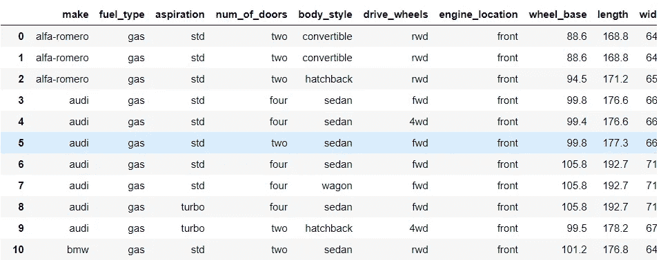

样本汽车数据

## 繁琐的道:

比方说，我想知道是否有丰田汽车的车身样式是轿车，燃料类型是柴油。

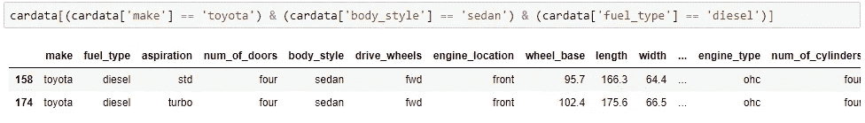

这是我们找到想要的结果的方法之一。如果我们想知道所有车身样式为旅行车的柴油汽车的品牌，并检查其价格是否在 20，000 美元以内，该怎么办？

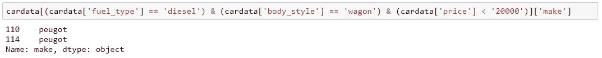

我们仍然获得了想要的输出，但是代码并不整洁。随着查询变得越来越复杂，代码变得越来越单调和冗长。

## 高级索引或分层索引:

分级索引可以帮助我们处理任意数量的维度。它可以帮助我们过滤、聚合、组织和操作数据，进行真正强大的数据分析。

## 1)操纵索引:

让我们从为数据帧设置索引开始。为了创建多索引数据帧，我们向属性`index`传递一个值列表，而不是一个字符串。我的数据集中有如此多的分类特征，但我将首先考虑`make`，因为我想知道不同汽车组的详细信息。另外，为了更好的组织，我会考虑`body_style`和`fuel_type`。

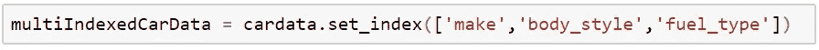

集合 _ 索引

让我们看一下索引，看看它们为我们带来了什么。

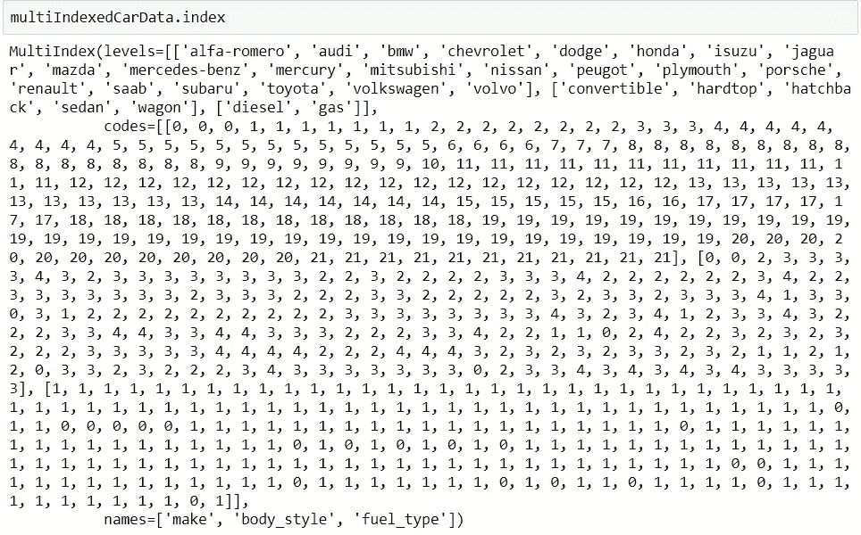

多级索引

多索引包含三个不同的属性，即级别、代码和名称。

*   `levels`属性指的是索引的标签名。索引从左开始排序。在这种情况下，`make`是最高的索引，其值为`level = 0`。也可以简称为`level = 'make'`
*   `codes`属性指的是编码级别的每个数据点的标签。
*   属性包含了级别的字符串名称。

行和列都可以有多级索引。我们可以通过简单地将`reset_index()`函数传递给 DataFrame 来重置索引。

使用多级索引时需要注意的是，在尝试执行任何切片操作之前，先对索引进行排序。切片操作会故意抛出如下所示的警告。

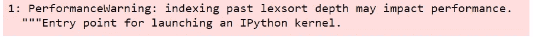

未排序的多索引数据框的警告

我们可以通过将`sort_index()`函数传递给多索引数据帧来避免这种情况。此外，Pandas 依赖于被排序的索引来进行最优的检索和搜索操作。我们可以使用返回布尔值的`index.is_lexsorted()`函数来检查索引是否已经排序。

其他有用的功能有

*   swap_level()
*   堆栈()
*   拆分()

`swap_level()`可用于交换数据帧内的级别。它采用两个参数`i`和`j`，这两个参数是作为字符串传递的级别名称。传递这个函数不会改变值的顺序。

`stack()`和`unstack()`功能带有一个附加参数，您可以选择堆叠或不堆叠的层级，其中堆叠的层级成为新的最低层级(最右边)。

你可以继续检查官方的熊猫文档来获得更多的索引修改。

## 2)访问数据:

让我们看看是否可以使用我们的多索引数据框架找到任何车身类型为轿车、燃料类型为柴油的丰田汽车。

*   使用`.loc`

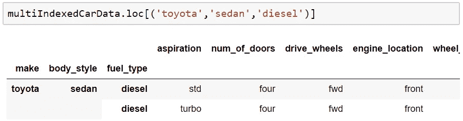

。通信线路（LinesofCommunication）

`.[loc](https://pandas.pydata.org/pandas-docs/stable/reference/api/pandas.DataFrame.loc.html)`主要用于基于标签的选择，其中标签名称在元组内传递。有时它与`pd.IndexSlice`结合在一起。例如，查找所有柴油汽车。

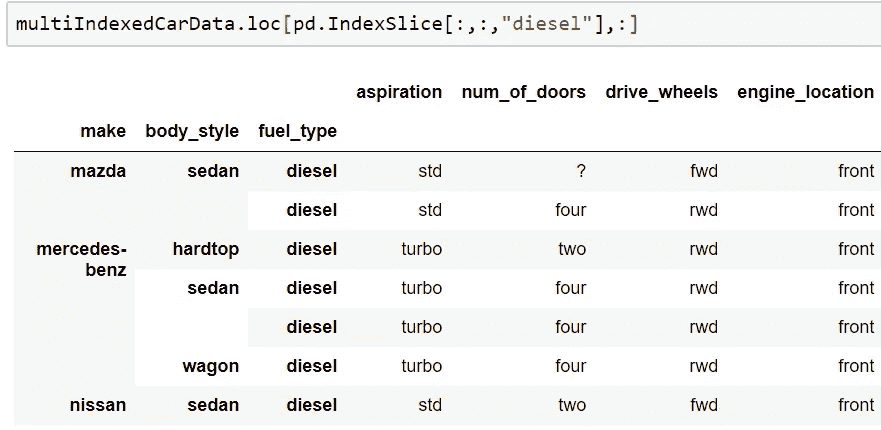

警察。索引切片。通信线路（LinesofCommunication）

注意，在`pd.IndexSlice`内部，第一个`:`选择所有`make`的车厢，第二个`:`选择所有`body_style`的车厢，而外部的`:`选择所有列。

*   使用`.xs`

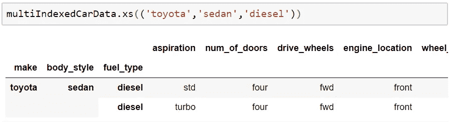

。特小号

`.[xs](https://pandas.pydata.org/pandas-docs/stable/reference/api/pandas.DataFrame.xs.html)`获取数据帧的特定横截面，其中轴参数默认为零`axis=0`，并获取一个`level`参数，该参数指示要使用的级别。

*   使用`.query`

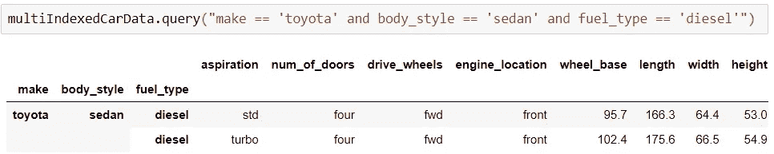

。询问

`.[query](https://pandas.pydata.org/pandas-docs/stable/reference/api/pandas.DataFrame.query.html)`使用布尔表达式进行过滤或切片。注意查询中使用的`and`和`or`超过了`&`和`|`。这是因为查询方法中的表达式是使用`[eval()](https://pandas.pydata.org/pandas-docs/stable/reference/api/pandas.eval.html#pandas.eval)`函数动态计算的。此外，默认情况下，该方法使用修改后的 Python 语法。

*   使用`get_level_values`

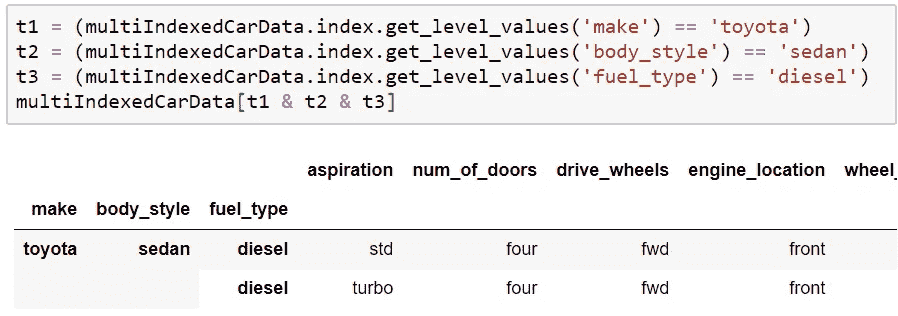

获取级别值

`[get_level_values](https://pandas.pydata.org/pandas-docs/stable/reference/api/pandas.Index.get_level_values.html)`对请求的级别使用标签值的向量。这里，级别值可以作为整数或字符串传递。

更一般地说，`loc`和`xs`用于基于标签的选择，而`query`和`get_level_values`有助于生成用于过滤的条件表达式。并非所有这些方法都同样有效，每种方法在不同的情况下效果最好。我们有责任选择最佳的检索方法！

## 3)汇总数据:

所有内置的数据聚合方法，如`mean()`、`min()`、`max()`、`sum()`都可以应用于分层数据框架。它与`level`参数一起传递，该参数影响计算聚合的数据部分。一个简单的例子是找出所有大众汽车的平均价格。

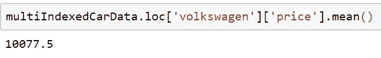

平均价格

使用熊猫索引一直是有趣和好奇的！请随意查看我的 GitHub repo [这里的](https://github.com/Padhma/Data-Science-Notebooks/tree/master/Data%20Analysis/Pandas/Advanced%20Indexing)包含了文章中提到的所有代码。

感谢你一路阅读到这里。如果你有任何问题、反馈或批评，请在评论区告诉我。祝你今天开心！玩的开心！