# 自然语言处理与图形密切相关

> 原文：<https://towardsdatascience.com/nlp-and-graphs-go-hand-in-hand-with-neo4j-and-apoc-e57f59f46845?source=collection_archive---------6----------------------->

## 了解如何使用 Neo4j 设置 NLP 管道并分析其结果

准备好，因为今天我们将角色扮演《黑客帝国》中的 [Neo。在他得到启示的时刻之后，Neo 意识到，尽管这个世界看起来非常混乱无序，但在所有这些混乱背后隐藏着一个结构化的绿色代码。我们将利用他在混乱中寻找隐藏结构的知识，并将其应用于文本。一旦我们戴上](https://miro.medium.com/max/1400/1*WZZ9OWp3QJjcswTITitJKw.jpeg) [Neo4j 眼镜](https://imgur.com/a/eR1t5Sk)，起初可能看起来只是无组织的混乱，很快就会变得非常结构化，充满洞察力。

# 议程

1.  设置 Neo4j 桌面
2.  图形导入
3.  文本分类
4.  命名实体识别
5.  情感分析
6.  二部网络的单部投影
7.  社区检测
8.  数据丰富

# 设置 Neo4j 桌面环境

这是我们第一次在博客中使用 [Neo4j 桌面](https://neo4j.com/developer/neo4j-desktop/)。可以在 [Neo4j 下载中心](https://neo4j.com/download-center/)获得。这是一个 GUI 应用程序，它使本地 Neo4j 数据库的管理更加舒适和方便，因为它提供了只需几次点击就可以启动数据库实例等功能。由于这也可能是您第一次与它交互，我准备了一个简短的指南，介绍如何设置 Neo4j 环境并做好一切准备。

成功安装 Neo4j 桌面后，您应该能够在显示器上看到图形界面。我们将通过点击**添加数据库**按钮来创建一个新的数据库实例。


选择**创建本地图形，**设置密码，按**创建**。我们现在已经成功地实例化了一个新的数据库。下一步是向数据库实例添加插件。单击数据库实例右上角的三个点，并选择**管理**。

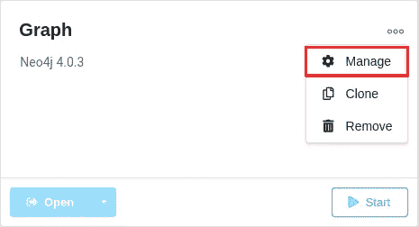

转到**插件**选项卡，安装您需要的插件。对于这篇博文，你将需要 [APOC](https://github.com/neo4j-contrib/neo4j-apoc-procedures) 和[图形数据科学](https://github.com/neo4j/graph-data-science)插件。

*附言:是的，GDS 图书馆现已推出 Neo4j 4.x 版本*

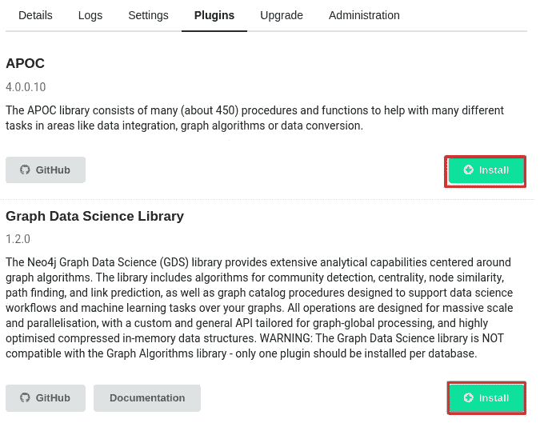

[APOC NLP 程序](https://neo4j.com/docs/labs/apoc/current/nlp/)存储在一个单独的文件中，因此，我们必须手动安装它们。我们可以安装任何自定义插件，只需将其复制到插件文件夹。打开如下所示的插件文件夹，将 [APOC NLP 依赖关系](https://github.com/neo4j-contrib/neo4j-apoc-procedures/releases)复制到那里。

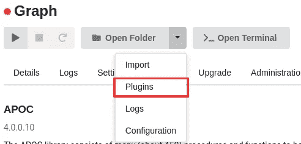

# APOC 静态值存储器

APOC 允许我们在[静态值存储器](https://neo4j.com/docs/labs/apoc/current/misc/static-values/)中存储敏感信息，比如 JDBC 凭证或 API 密钥。可以把它看作是 Neo4j 的环境文件，我们在其中定义了以后可以用 cypher 轻松访问的变量。我们将把 GCP 和 AWS 凭证存储在静态值存储中。第一步是获取 API 凭证:

*   [如何获得谷歌证书](https://developers.google.com/places/web-service/get-api-key)
*   [如何获取 AWS 凭证](https://docs.aws.amazon.com/general/latest/gr/aws-sec-cred-types.html#access-keys-and-secret-access-keys)

获得凭证后，我们继续在`$Neo4j/conf`文件夹中创建`apoc.conf`。将这三行存储在文件中。

```
apoc.static.aws.apiKey=$yourAwsApiKey
apoc.static.aws.apiSecret=$yourAwsApiSecret
apoc.static.gcp.apiKey=$yourGcpApiKey
```

我们现在可以启动 Neo4j 实例，并调查静态存储是否按照查询的预期工作。

```
RETURN apoc.static.getAll("aws") AS aws;
```

您应该会看到类似这样的内容:

美国焊接协会

```
{
  "apiKey": "$yourapiKey",
  "apiSecret": "$yourapiSecret"
}
```

如果到目前为止您已经成功地完成了所有步骤，那么您应该有一个添加了 APOC NLP 和 GDS 库的 Neo4j 实例在运行。如果您不想设置静态值存储，只需将您的云凭证直接复制并粘贴到查询中即可。

# 图形导入

我们将使用由 Kevin Toms 提供的新闻数据集。它包含大约 10000 篇新闻文章的内容。该数据集于 2019 年 1 月编制。不幸的是，作者没有提供关于数据集的来源和时间线的信息。在开始之前，我们必须下载数据集并将其复制到导入文件夹。您可以从 Neo4j 桌面访问导入文件夹，如下所示。

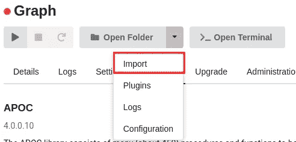

我们将每篇文章作为一个单独的节点导入，标题和内容作为节点的属性存储。

```
LOAD CSV WITH HEADERS FROM "file:///text_summarizer_data.csv" as row
CREATE (a:Article{title:row.title, content: row.content})
```

# 用谷歌进行文本分类

我们将从由谷歌的[自然语言 API](https://cloud.google.com/natural-language/docs) 支持的 [APOC 文本分类程序](https://neo4j.com/docs/labs/apoc/current/nlp/gcp/#nlp-gcp-classify)开始我们的分析。它将输入文本分为不同的内容类别。据我所知，它对新闻文章最有效，但对虚构文学不太有效。谷歌每月提供 30，000 个免费分类请求，所以这足够启动一个爱好项目了。

由于我们需要处理 10.000 篇文章，我们将使用`apoc.periodic.iterate` 过程来处理批处理过程。在[文档](https://neo4j.com/docs/labs/apoc/current/graph-updates/periodic-execution/#commit-batching)中了解更多信息。这个过程需要几分钟，所以在你等待的时候，请随意喝杯咖啡或者做你最喜欢的瑜伽姿势。

```
CALL apoc.periodic.iterate("
   // get all articles
   MATCH (node:Article) RETURN node
  ","
   // classify each article
   CALL apoc.nlp.gcp.classify.graph(node, {
       // we retrieve gcp api key from static value storage
       key: apoc.static.get('gcp.apiKey'),
       // node property that contains the text
       nodeProperty: 'content',
       write:true
    }) YIELD graph RETURN distinct 'done'",
    {batchSize:10})
```

当你啜饮美味的咖啡时，我们可以看看分类的结果。让我们从查看一些类别名称的例子开始，这样我们就知道我们在处理什么了。

```
MATCH (n:Category)
RETURN n.name as category
LIMIT 5
```

结果

类别名称的深度在一至三层之间。级别由斜杠字符(`/`)分隔。比如*"/新闻"*只包含一级，而*"/金融/保险"*包含两级类别。我们将提取每个分类名称的顶级类别，并将其存储回我们的图中。这将使我们能够更直接地根据顶级类别进行筛选和分组。新的图表模式将如下所示:

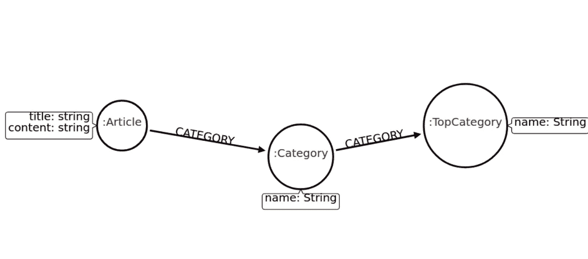

在 Neo4j 中处理[层次树时，我学到了一些规则，可以帮助我们简化和优化查询。其中之一是我们应该在整个树中只有一个单一的关系类型。这样，我们可以很容易地查询一个或两个层次的深度，正如我们将看到的。](https://tbgraph.wordpress.com/2017/04/01/neo4j-location-trees/)

让我们为顶级类别节点定义一个惟一的约束。

```
CREATE CONSTRAINT ON (t:TopCategory) ASSERT t.name IS UNIQUE;
```

我们可以通过拆分分类名称来提取和存储顶级类别。

```
MATCH (n:Category)
WITH n, split(n.name,'/')[1] as top_level
MERGE (t:TopCategory{name:top_level})
MERGE (n)-[:CATEGORY]->(t)
```

让我们通过顶级类别来查看文章的数量。您可以观察到，由于我们在类别树中只处理一种关系类型，所以遍历两个层次非常简单。

```
MATCH (t:TopCategory)
RETURN t.name as category, 
       size((t)<-[:CATEGORY*2..2]-()) as number_of_articles
ORDER BY number_of_articles DESC LIMIT 10
```

结果

需要注意的一点是，查询结果显示的文章比图表中实际显示的要多。这是因为有些文章有不止一个分类。我们将通过查看来自科学类别的两篇文章的内容来快速检查结果。

```
MATCH (t:TopCategory{name:"Science"})<-[:CATEGORY*2..2]-(article)
RETURN article.content as text LIMIT 2
```

结果

两篇文章似乎都非常关注科学和技术。我们并没有对结果进行深入的分析，但是我们会假设自然语言 API 很好地完成了对新闻文章进行分类的工作。

# 命名实体识别

本质上，NER 是一个识别文本中各种实体并将它们按类别(如人员、组织、位置等)分组的过程。我们寻找的实体类型完全取决于用例。有时我们想知道在给定的文章中提到了哪些人和组织，而其他时候我们可能更有兴趣知道提到了哪些基因和蛋白质。有很多预先训练好的模型可供你使用，如果没有一个适合你，你可以训练你自己的 NER 模型，但是这超出了这篇博文的范围。让我们看一个在上面的科学文章中找到的命名实体的例子。

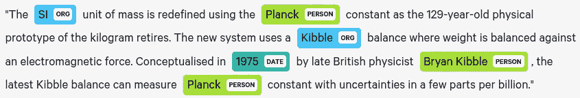

用[显示](https://explosion.ai/demos/displacy-ent?text=%22The%20SI%20unit%20of%20mass%20is%20redefined%20using%20the%20Planck%20constant%20as%20the%20129-year-old%20physical%20prototype%20of%20the%20kilogram%20retires.%20The%20new%20system%20uses%20a%20Kibble%20balance%20where%20weight%20is%20balanced%20against%20an%20electromagnetic%20force.%20Conceptualised%20in%201975%20by%20late%20British%20physicist%20Bryan%20Kibble%2C%20the%20latest%20Kibble%20balance%20can%20measure%20Planck%20constant%20with%20uncertainties%20in%20a%20few%20parts%20per%20billion.%22&model=en_core_web_sm&ents=person%2Corg%2Cgpe%2Cloc%2Cproduct%2Cnorp%2Cdate%2Cper%2Cmisc%2Cevent%2Cwork_of_art%2Clanguage%2Ctime%2Cpercent)可视化

我们可以观察到，该模型善于发现文本中的人物和组织，但并不完美。我们真的不能怪它给“Kibble”贴上组织的标签。该模型被训练来识别新闻文章中的人和组织，而不是真正被设计来阅读科学文章。AWS 和 GCP 都在其云 API 组合中提供了自己的 NER 模型。我们将在两个随机的故事中比较它们，并选择更适合我们的用例。

```
MATCH (node:Article)
WITH node LIMIT 2
RETURN node.content as text
```

结果

# NER 和 GCP

我们将从使用 Google 的自然语言 API 识别命名实体开始。有一个专用的 APOC 过程`apoc.nlp.gcp.entities.*`，这使得与 API 的交互非常容易。该程序有两种不同的模式:

*   串流:串流结果
*   图形:创建一个虚拟图形，并选择性地存储结果

我们将使用程序的**图形**模式。如上所述，图形模式创建了一个虚拟图形，我们可以用 Neo4j 浏览器来可视化它。通过设置参数`write:false`，我们不会将结果存储回 Neo4j。

```
MATCH (node:Article)
WITH node LIMIT 2
CALL apoc.nlp.gcp.entities.graph(node, {
    // Your api key
    key: apoc.static.get('gcp.apiKey'),
    // Property of the node that
    // contains the text
    nodeProperty: 'content',
    // do not store results in graph
    write:false
}) YIELD graph as g
RETURN g
```

结果

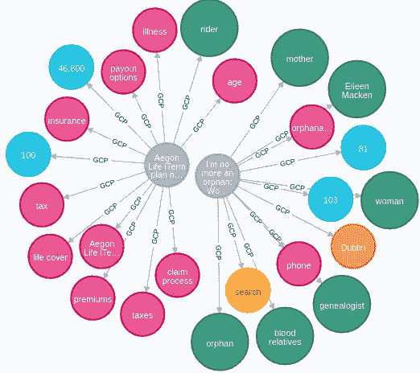

实体类型:

*   绿色:人
*   蓝色:数字
*   橙色:位置
*   红色:其他
*   黄色:事件

GCP 发现了五种不同类型的实体。如果我们看看实体类型的人，我们会注意到，在“艾琳·麦肯”之上，GCP 也把“母亲”和“女人”这样的词作为一个人。有趣的是，它将“搜索”识别为一个事件。在我看来，GCP 试图给尽可能多的词贴上标签，这可能是一件好事，也可能是一件坏事，取决于用例。

# 带 AWS 的 NER

与 GCP 类似，我们也有专门的 APOC 程序`apoc.nlp.aws.entities.*`用于 AWS NER 请求。

```
MATCH (n:Article)
WITH n LIMIT 2
CALL apoc.nlp.aws.entities.graph(n, {
    // AWS api key
    key: apoc.static.get('aws.apiKey'),
    // AWS api secret
    secret: apoc.static.get('aws.apiSecret'),
    // Property of the node
    // that contains the text
    nodeProperty: 'content',
    write:false
}) YIELD graph as g
RETURN g
```

结果

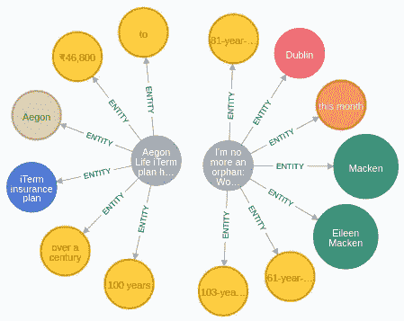

实体类型:

*   绿色:人
*   布朗:组织
*   橙色:日期
*   红色:位置
*   黄色:数量
*   蓝色:商业项目

乍一看，我们可以观察到 AWS 找到的实体比 GCP 少。它也不包括人实体下的“女人”和“母亲”这样的词。我的观点是，如果你试图做某种主题建模，那么 GCP 可能更适合，而对于创建知识图，AWS 可能更好。我们将使用 AWS 来分析和提取数据库中所有文章的实体。因为我们需要批处理我们的 NER 过程，我们将使用`apoc.periodic.iterate`过程。

```
CALL apoc.periodic.iterate("
    MATCH (n:Article)
    WITH collect(n) as total
    // Create a batch of 25 articles
    CALL apoc.coll.partition(total,25) 
    YIELD value as nodes
    RETURN nodes
    ","
    CALL apoc.nlp.aws.entities.graph(nodes, {
       key: apoc.static.get('aws.apiKey'),
       secret: apoc.static.get('aws.apiSecret'),
       nodeProperty: 'content',
       relationshipType: 'AWS_ENTITY',
       // store the results to Neo4j
       write:true
    }) YIELD graph
     RETURN distinct 'done'", {batchSize:1})
```

如果你抓紧时间，在 NER 结束之前，你还有时间做另一个伟大的瑜伽姿势。让我知道进展如何。好了，我们现在可以检查 NER 进程的结果了。我们将从调查文章中提到最多的人开始。

```
MATCH (n:PERSON) 
RETURN n.text as person, 
       size((n)<-[:AWS_ENTITY]-()) as mentions
ORDER BY mentions DESC LIMIT 10
```

结果

我们选择 AWS 是因为它不包括 person type 下的“orphan”或“genealogist”这样的词。我想没有一个模型是完美的，因为我们可以看到“项目经理”、“首席执行官”和“总裁”是作为人实体出现的。解决这个问题的一个方法是添加[共指解析](https://nlp.stanford.edu/projects/coref.shtml)作为 NER 管道的一个步骤，但是由于我们正在处理第三方 NLP 管道，我们没有这个闲心。现在让我们看看体育文章中提到最多的人。

```
MATCH (n:PERSON) 
RETURN n.text as person,  
    size((n)<-[:AWS_ENTITY]-()-[:CATEGORY*2..2]->({name:'Sports'})) as mentions
ORDER BY mentions DESC LIMIT 10
```

结果

所有十大提及的体育名人都是印度板球运动员。Virat Kohli 确实很突出，所以我猜他是队长。这种 NER 提取法的一个弱点是 Virat Kohli 和 Kohli 被视为两个独立的实体。这可以解释，他有时被提到全名，其他时候只提到姓。另一个有趣的用例是查看哪些位置和事件共享了最多的文章。

```
MATCH (a:Article)-[:AWS_ENTITY]->(event:EVENT),
      (a)-[:AWS_ENTITY]->(location:LOCATION)
RETURN location.text as location,
       event.text as event,
       count(*) as mentions
ORDER BY mentions DESC
LIMIT 10
```

结果

结果看起来相当不错。看起来像 CES 2019 在拉斯维加斯举行，联合印度在加尔各答举行集会，20 国集团在阿根廷举行论坛，世界经济论坛在达沃斯举行。除此之外，英国和欧盟还在讨论英国退出欧盟问题。

# 情感分析

AWS 还在其[理解](https://aws.amazon.com/comprehend/) API 包中提供[情绪分析](https://en.wikipedia.org/wiki/Sentiment_analysis)。它将文本分为四个不同的情感组:

*   积极的
*   中立的
*   否定的；消极的；负面的；负的
*   混合的

我们将对所有文章进行情感分析。我认为新闻应该或多或少是中性的，除了体育。有一个特殊的 APOC 程序`apoc.nlp.aws.sentiment.*`使用与 NER 处理程序相同的两种模式(流&图)处理 AWS 情绪 API 请求。

```
CALL apoc.periodic.iterate("
    MATCH (n:Article)
    WITH collect(n) as total
    CALL apoc.coll.partition(total,25) 
    YIELD value as nodes
    RETURN nodes
    ","
    CALL apoc.nlp.aws.sentiment.graph(nodes, {
       key: apoc.static.get('aws.apiKey'),
       secret: apoc.static.get('aws.apiSecret'),
       nodeProperty: 'content',
       write:true
    }) YIELD graph
     RETURN distinct 'done'", {batchSize:1})
```

我们将看看体育文章中被 AWS 理解为积极的人和事件的共同提及。

```
MATCH (a:Article)
WHERE a.sentiment = 'Positive' AND 
      (a)-[:CATEGORY*2..2]->({name:'Sports'})
MATCH (a)-[:AWS_ENTITY]->(person:PERSON),
      (a)-[:AWS_ENTITY]->(event:EVENT)
RETURN person.text as person,
       event.text as event,
       count(*) as mentions
ORDER BY mentions DESC LIMIT 10
```

结果

看起来网球运动员正在赢得网球比赛。由 Virat Kohli 担任队长的印度板球队赢得了 2011 年世界杯和墨尔本测试赛。从结果来看，我大概是这么想的。

# 图形数据科学图书馆

如果你读过我的博客文章，你就会知道我喜欢写关于[图形数据科学库](https://github.com/neo4j/graph-data-science)的文章。这个博客也不例外。首先，我们将借助[节点相似性算法](https://neo4j.com/docs/graph-data-science/current/algorithms/node-similarity/)将一个二分网络投影到一个一分网络。在下一步中，我们将使用 [Louvain 算法](https://neo4j.com/docs/graph-data-science/current/algorithms/louvain/)在投影的单分图中搜索社区。

# 二部网络的单部投影

二分网络只是一种奇特的说法，即图包含两组不同的节点，同样，一个一分网络只包含一组节点。在我们的例子中，我们将从一个包含文章和 NER 实体的双向网络开始。下一步，我们将借助 GDS 的[相似性算法，把它投射到一个单片式网络上。这里有一个图表，显示了幕后实际发生的事情。](https://neo4j.com/docs/graph-data-science/current/algorithms/similarity/)

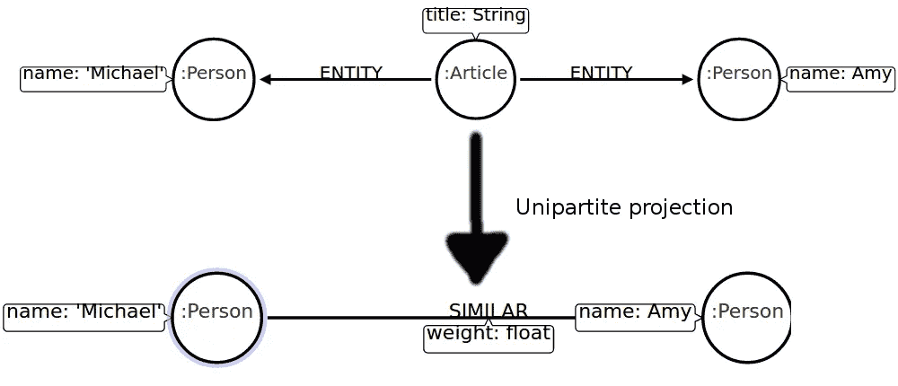

我们可以把单向投射看作是把间接关系转化为直接关系的过程。相似性算法之间的区别只是用于计算相似性得分或权重的度量。例如，节点相似性算法使用 [Jaccard 相似性分数](https://en.wikipedia.org/wiki/Jaccard_index)。它被定义为交集的大小除以并集的大小。如果我们愿意，我们也可以投射一个由文章而不是人组成的单部分网络，并检查相似的文章是如何基于其中提到的实体的。

在我们运行任何算法之前，让我们快速回顾一下 GDS 图书馆是如何工作的。


*这个形象是善意地借用了* [*官方文件*](https://neo4j.com/docs/graph-data-science/current/common-usage/)

图表分析管道由三个主要部分组成。在第一部分中，图形加载器从 Neo4j 中读取存储的图形，并将其作为内存中的投影图形加载。我们可以使用[本机投影](/exploring-the-graph-catalog-feature-of-neo4j-graph-data-science-plugin-on-a-lord-of-the-rings-d2de0d0a023)或 [cypher 投影](/how-to-use-cypher-projection-in-neo4j-graph-data-science-library-on-a-lord-of-the-rings-social-b3459138c4f1)来加载投影图。第二步，我们按顺序执行图算法。我们可以使用一个图算法的结果作为另一个图算法的输入。最后但同样重要的是，我们将结果存储或流回 Neo4j。

我们将使用 cypher 投影来加载内存中的图形。如果你需要快速复习一下它是如何工作的，我建议你看一下官方文档。在 node 语句中，我们将描述顶级新闻类别中的所有文章以及所有 person 实体。在关系陈述中，我们将描述新闻文章和人实体之间的所有链接。

```
CALL gds.graph.create.cypher("person_similarity",
 // match articles that are in the 'News' category
 "MATCH (a:Article) WHERE (a)-[:CATEGORY*2..2]->({name:'News'})
  RETURN id(a) as id, labels(a) as labels
  UNION
  // match all person entities
  MATCH (p:PERSON) RETURN id(p) as id, labels(p) as labels
  ","
  // match all links between news articles and person entities
  MATCH (a:Article)-[r:AWS_ENTITY]->(p:PERSON) 
  WHERE (a)-[:CATEGORY*2..2]->({name:'News'})
  RETURN id(p) as source, id(a) as target, type(r) as type")
```

下一步是在节点相似性算法的帮助下推断人实体之间的相似性网络。我们可以用以下三个参数来影响相似性网络的稀疏或密集程度:

*   DegreeCutoff:算法必须考虑的节点的最少链接数
*   similarityCutoff:仍被视为相似的一对节点之间的最小相似性得分
*   topK:对每个节点相似关系数量的限制

通常，我们很少或根本不知道图会有多稀疏。我们绝对不想以一个[完整的图](https://en.wikipedia.org/wiki/Complete_graph)结束。我们可以用算法的`stats`模式来评价相似度网络。这样，在对上述三个参数进行微调之前，我们不会存储或改变任何结果。

```
CALL gds.nodeSimilarity.stats('person_similarity')
YIELD nodesCompared, similarityDistribution
RETURN nodesCompared as nodes,
       apoc.math.round(similarityDistribution.min,2) as min, 
       apoc.math.round(similarityDistribution.p25,2) as p25, 
       apoc.math.round(similarityDistribution.p50,2) as p50,
       apoc.math.round(similarityDistribution.p75,2) as p75,
       apoc.math.round(similarityDistribution.p90,2) as p90,
       apoc.math.round(similarityDistribution.mean,2) as mean
```

结果

乍一看，节点似乎不是很相似。这很好。我们想推断一个稀疏网络，因为社区检测算法在非常密集的图上表现不佳。确定最佳的相似性参数值需要艺术和科学的结合，但是有了一些经验，你会变得很擅长。我们将把`similarityCutoff`设置为 0.6，同时将`degreeCutoff`和`topK`参数保留为默认值。使用`mutate`模式，我们将算法的结果存储回内存中的投影图。

```
CALL gds.nodeSimilarity.mutate('person_similarity', 
    {degreeCutoff:1, similarityCutoff:0.6, topK:10,
     mutateRelationshipType: 'SIMILAR', mutateProperty: 'score'})
```

# 社区检测

社区检测算法旨在帮助我们理解复杂网络的结构。最明显的应用是在社交网络中寻找朋友群体。我们认为社区是一组紧密相连的节点，类似于一群朋友是如何高度互联的。让我们看看一些社区结构的可视化，以获得更好的理解。

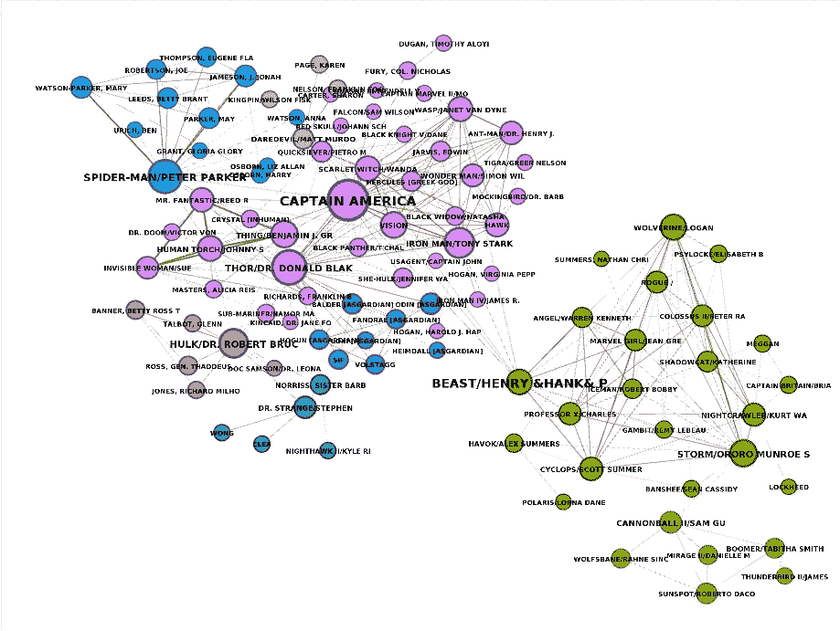

这是我几年前做的一个可视化，当时我正在分析漫威宇宙中的社区结构。节点的颜色表示组从属关系。我们可以观察到，社区由高度互连的节点组成，这些节点与其他集群的链接较少。在这篇博文中，我们将使用 [Louvain 算法](https://neo4j.com/docs/graph-data-science/current/algorithms/louvain/)来检查我们推断的相似性网络的社区结构。

```
CALL gds.louvain.stream('person_similarity', 
    {nodeLabels:['PERSON'], relationshipTypes:['SIMILAR']})
YIELD nodeId, communityId
RETURN communityId, 
        collect(gds.util.asNode(nodeId).text) as members
ORDER BY size(members) DESC LIMIT 5
```

结果

发现的社区相对较小。这是`similarityCutoff`参数值的直接结果。如果我们选择一个较低的阈值，更多的节点将被认为是相似的，我们可能会得到更大的社区。同样，如果我们增加数据集的规模，多处理几千篇文章，我们也会得到更大的社区。也就是说，是时候进入数据丰富的章节，为我们的实体添加一些上下文了。

# 数据丰富

我们在图表中发现了几个小社区。有些人相当有名，不难找到社区成员之间的共同点。例如，我知道哈里森·福特、哈莉·贝瑞和吉姆·帕森斯都是演员，所以我会假设其他人也是演员。我们可以去谷歌一下。一个更好的想法是，使用外部数据提供者，如 [Google Knowledge Graph](https://developers.google.com/knowledge-graph) 或 [WikiData](https://www.wikidata.org/wiki/Wikidata:Main_Page) ，有计划地丰富我们图表中的实体。这正是我们下一步要做的。

我们将只充实在前一个查询中返回的人员(前五个最大社区的成员)。为了避免多次运行社区检测，我们将首先把 Louvain 算法的结果存储回 Neo4j。

```
CALL gds.louvain.write('person_similarity', 
    {nodeLabels:['PERSON'], relationshipTypes:['SIMILAR'], 
     writeProperty:'louvain'})
```

# 谷歌知识图

很久以前我已经在我的一篇[博客文章](https://tbgraph.wordpress.com/2017/03/07/neo4j-apoc-triggers-and-web-apis/)中使用了谷歌知识图 API。我写作的原因之一是我有一个有用的 cypher 查询库，我可以从中复制粘贴并在以后的分析中使用。

我们将使用知识图 API 通过描述和详细描述属性来丰富最大社区的成员。

```
// get the members of the top five communities
MATCH (p:PERSON)
WITH p.louvain as communityId, collect(p) as members 
ORDER BY size(members) DESC LIMIT 5
UNWIND members as member
WITH member, apoc.text.urlencode(member.text) as name, 
     apoc.static.get('gcp.apiKey') as key
// send a request to KG API
CALL apoc.load.json("https://kgsearch.googleapis.com/v1/entities:search?query=" + 
     name + "&key=" + key + "&limit=1&indent=True")  YIELD value
WITH member, value['itemListElement'][0]['result'] as results
// store results back to Neo4j
SET member.kg_description = results.description,
    member.kg_detailed_description = results.detailedDescription.articleBody
```

现在让我们来看看最大的五个人群，包括他们的知识图表描述。

```
MATCH (p:PERSON)
RETURN p.louvain as communityId, 
       collect(p.text) as members,
       collect(DISTINCT p.kg_description) as description 
ORDER BY size(members) DESC LIMIT 5
```

结果

随着丰富描述的增加，我们对谁是社区成员有了更好的认识。我们可以观察到最大的集群由网球运动员组成。知识图表没有识别第二大组的任何成员。然而，它知道“乌鲁比亚”实际上是印度的一个城市，而不是一个人。

# 维基数据浓缩

我订阅每周一期的 twin4j 开发者简讯的主要原因是我可以从其他人那里复制粘贴密码查询。马克·李约瑟做了一个关于如何用密码查询维基数据的系列。他做了所有的艰苦工作，所以我们可以通过复制粘贴他的密码查询来享受他的劳动成果。他还开发了我们刚刚使用的 APOC NLP 程序，这是对 Mark 的称赞！

对于那些以前从未听说过 [Wikidata](https://www.wikidata.org/wiki/Wikidata:Main_Page) 的人来说，他们将自己描述为一个自由开放的知识库，可以被人类和机器阅读和编辑。检查了一下之后，我可以说它的信息非常丰富，绝对值得一看。我们将向最大社区的成员添加出生日期、职业和国籍信息。查看[维基数据查询服务](https://query.wikidata.org/)了解更多关于数据丰富选项的细节。

```
CALL apoc.periodic.iterate(
  // get all persons from the biggest five communities
  "MATCH (p:PERSON) 
   WITH p.louvain as communityId, 
          collect(p) as members 
          ORDER BY size(members) DESC LIMIT 5
   UNWIND members as member
   RETURN member
   ","
    // prepare a sparql query
    WITH 'SELECT *
    WHERE { ?person
                  rdfs:label \"' + member.text + '\"@en ;
                  wdt:P569 ?dateOfBirth ;                
                  wdt:P106 [ rdfs:label ?occupation ] ;
                  wdt:P27 [ rdfs:label ?countryName ] .
           filter(lang(?countryName) = \"en\" && lang(?occupation) = \"en\")
           }' AS sparql, member
    // make a request to wikidata
    CALL apoc.load.jsonParams(
      \"https://query.wikidata.org/sparql?query=\" + apoc.text.urlencode(sparql),
      { Accept: \"application/sparql-results+json\"},
      null
    )
    YIELD value CALL apoc.do.when(
      // if there are any results
      size(value.results.bindings) > 0,
      // store results
      'WITH value.results.bindings[0] AS result, member
       SET member.dateOfBirth = date(datetime(result.dateOfBirth.value)),
           member.wikidataImportDone = true
       // store nationality
       MERGE (c:Country {name: result.countryName.value })
       MERGE (member)-[:NATIONALITY]->(c)
       // store occupation
       MERGE (o:Occupation {name: result.occupation.value})
       MERGE (member)-[:HAS_OCCUPATION]->(o)
       RETURN member',
      // else if no results 
      'SET member.wikidataImportDone = true RETURN member',
      {value: value, member: member})
    YIELD value AS result
    RETURN count(*)",
  {batchSize: 20})
```

现在让我们来看看最大的社区，包括我们从维基数据获得的额外信息。

```
MATCH (p:PERSON) 
RETURN p.louvain as communityId,
       collect(p.text) as members,
       apoc.math.round(avg(duration.inMonths(p.dateOfBirth, date()).years),2) as average_age,
       collect(distinct [(p)-[:NATIONALITY]->(n) | n.name][0]) as nationalities,
       collect(distinct [(p)-[:HAS_OCCUPATION]->(o) | o.name][0]) as occupations
ORDER BY size(members) DESC LIMIT 5
```

结果

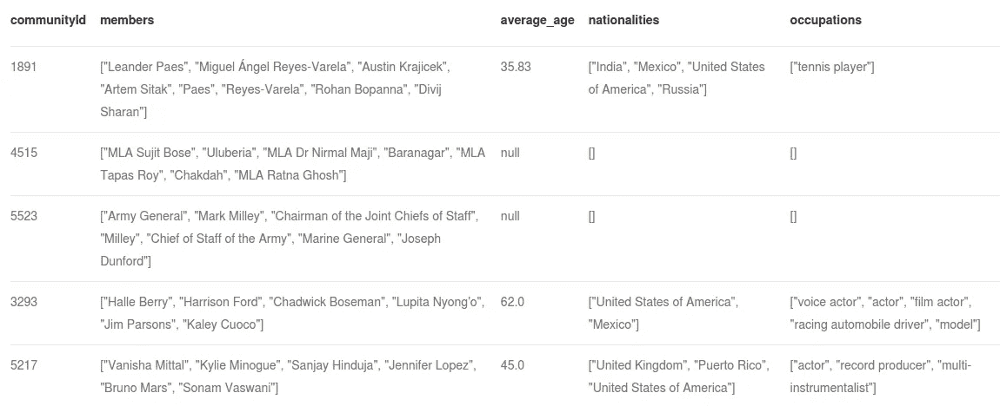

结果看起来令人印象深刻。我打赌你不知道至少有两个人叫吉姆·帕森斯。其中一个是演员，另一个是赛车手。我们只是触及了维基数据 API 提供的信息的表面。

# 结论

如果你还在这里，我向你致敬。这是我迄今为止最长的一篇博文。尽管有时感觉就像我在写一本迷你书或我那本不存在的书的一个章节，但我很高兴，因为我认为它真的很好，我在这个过程中学到了很多。我希望你也是。如果你喜欢它，并希望我写更长的帖子，请让我知道。同时，你可以下载 [Neo4j](https://neo4j.com/) 并开始开发你自己的 NLP 管道。别忘了订阅 [Twin4j 简讯](https://neo4j.com/tag/twin4j/)。

代码可在 [GitHub](https://github.com/tomasonjo/blogs/blob/master/apoc_nlp_procedures/APOC%20NLP%20procedures.ipynb) 上获得。