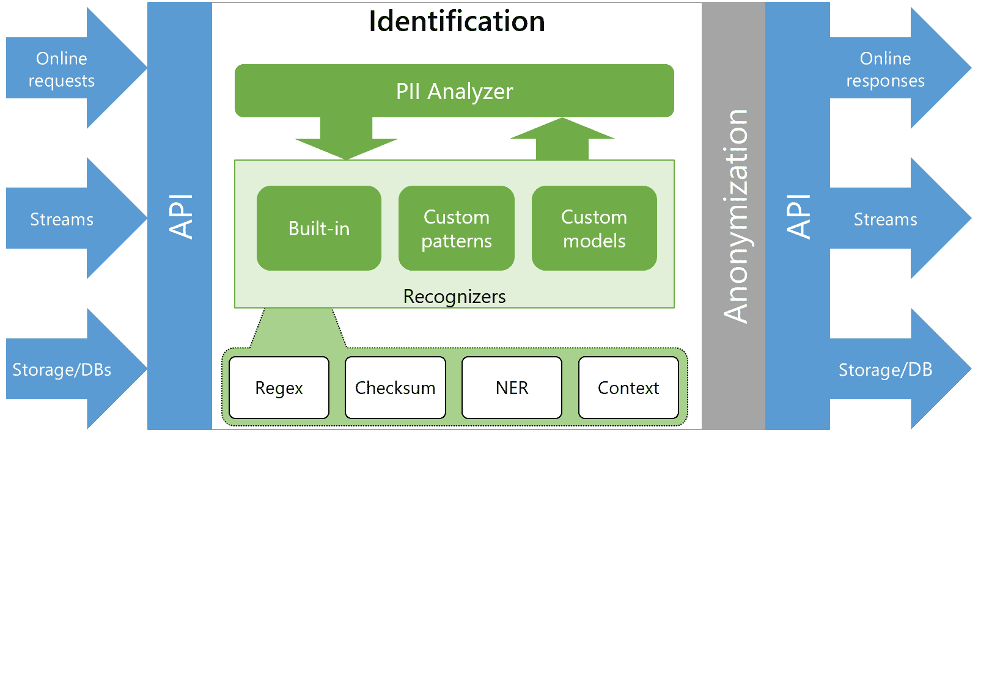
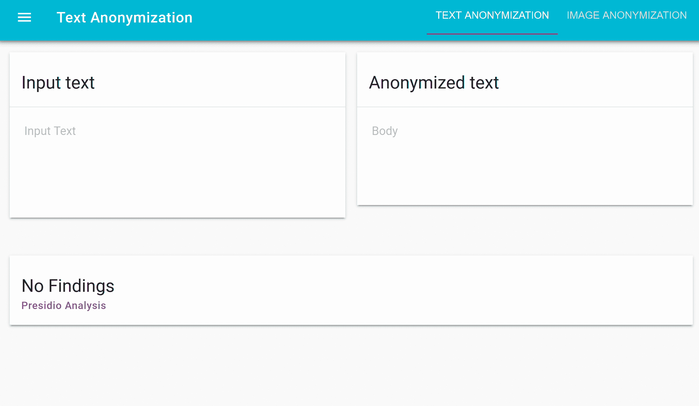
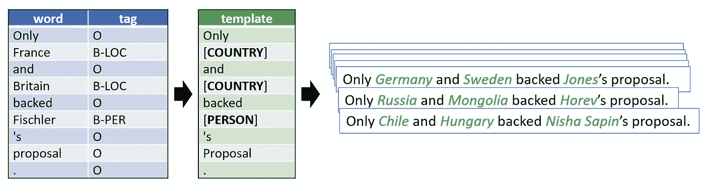
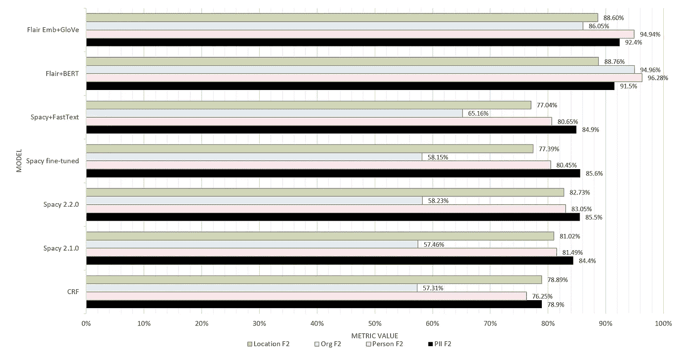
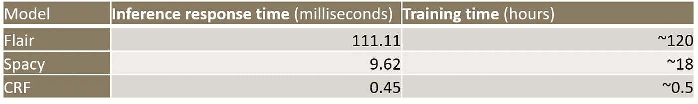

# 数据匿名化的定制 NLP 方法

> 原文：<https://towardsdatascience.com/nlp-approaches-to-data-anonymization-1fb5bde6b929?source=collection_archive---------6----------------------->

## 消除真实世界私人数据身份的实用方法

随着互联网服务变得无处不在，对互联网隐私的渴望持续增长。近年来，不同的法律，如 GDPR，开始规范服务收集私人信息的方式。这引起了每个公司对隐私方面的关注，并增加了在处理和匿名私人数据方面的投资。

我在微软商业软件工程(CSE)团队的工作是与微软最具战略意义的客户合作。我们共同开发人工智能、大规模数据、物联网等领域的新工作负载。在与这些客户打交道的过程中，我们意识到 PII(个人身份信息)问题是许多希望扩展其解决方案集(无论是内部部署还是在云中)的公司反复提到的话题和障碍。

因此，我们决定创建 [Presidio](https://aka.ms/presidio) ，这是一个生产就绪的开源服务，免费提供给任何希望解决数据隐私问题的人。

Presidio 允许任何用户创建标准且透明的流程，用于匿名化结构化和非结构化数据上的 PII 实体。为此，它公开了一组预定义的 PII 识别器(用于姓名、信用卡号和电话号码等常见实体)，以及一些工具，用于使用新的逻辑对其进行扩展，以识别更具体的 PII 实体。在这篇博文中，我们将关注如何利用自然语言处理来识别不同类型的私有实体。

# PII 探测过程

Presidio 利用了一组识别器，每个识别器都能够检测一种或多种语言中的一个或多个 PII 实体。图 1 中描述的过程通常包括 8 个不同的步骤:

1.  从用户处获取匿名化请求
2.  将请求传递给预识别分析器以识别 PII 实体
3.  提取自然语言处理特征(词条、命名实体、关键词、词性等。)，供各种识别器使用
4.  获取所有 PII 识别器(预定义+来自识别器存储服务的自定义)
5.  运行所有识别器
6.  汇总结果
7.  传递给预识别匿名器进行身份识别
8.  将去标识的文本返回给呼叫者

*图 1——presi dio*中识别过程的动画

图 2 中的动画演示了一个特定示例的相同过程。请注意，当我们将上下文从“电话号码”更改为“pool card number”时，电话号码识别器的可信度会降低。这是 Presidio 演示的截图。[看看这个](https://aka.ms/presidio-demo)。

*图 2 —输入和输出示例*

# 数据匿名的 NLP

需要 PII 识别器来检测自由文本中不同类型的实体。对于这样的任务，不同的 NLP 方法浮现在脑海中:

*   对于共享一个模式的实体，我们可以利用周围单词的**正则表达式**、**验证**(例如[校验和](https://en.wikipedia.org/wiki/Checksum))和**上下文**。例如，这种逻辑可以用来检测信用卡号或电话号码。
*   对于有限的选项列表，我们可以使用**黑名单。**它可以是静态黑名单(例如，所有头衔:*先生、女士、小姐、博士、教授……*)或动态黑名单(即，连接到数据库并查询所有可能的选项)。
*   对于可以使用特定逻辑识别的实体，我们可以编写基于**规则的**识别器。
*   对于需要自然语言理解输入的实体，我们可以训练**机器学习**模型，特别是针对**命名实体识别** (NER)，或者使用预先训练好的模型。

在下一节中，我们将重点介绍我们在提高人名、地点和组织的命名实体识别率方面所做的工作。

# 人名、地点和组织的 NER

为了提高这三个实体的检测率，我们用不同的模型进行了实验。以下部分描述了使用的数据集、评估的不同模型和结果。运行这个过程的代码可以在我们的 [GitHub repo for research](https://github.com/microsoft/presidio-research) 上找到。

## 数据集

虽然有一些标注数据集可用，但我们希望增加名称、组织和位置的覆盖范围。因此，我们从一个带标签的数据集开始(例如， [OntoNotes](https://catalog.ldc.upenn.edu/LDC2013T19) 或 [CoNLL-2003](https://www.aclweb.org/anthology/W03-0419.pdf) )，并对其进行处理以提取模板。这些例子后来被用来生成比原始数据集具有更广泛的实体值(名称、组织和位置)的新句子。

比如来自句子“谢谢你 ***乔治*** ！”，其中 George 被手动标记为 person，我们提取了以下模板:“谢谢[PERSON]！”。图 3 提供了另一个例子:

*图 3 —数据扩充示例*

我们使用了一个假的 PII 数据集和多个假的 PII 生成器来对实体进行采样并创建新的句子。这些句子在生成过程中被自动标记，因此训练新的 NER 模型很容易应用。

然而，这一过程要求我们对数据集进行一些预处理，并针对不同的问题提出创造性的解决方案。仅举几个例子:

*   如何看待*国家*vs*国籍*？在许多情况下,“位置”实体指的是国籍(或民族男子或民族女子)。例如，在句子“*萨尔瓦多[LOC]拳手赢得世界冠军*”中，我们不能用“*埃塞尔比亚*”替换“*萨尔瓦多*”，因为这会使句子不正确。因此，我们为国家、民族、民族-男人和民族-女人创造了新的中间实体。
*   *性别*应该如何处理？有些句子最初谈论的是男性或女性，但在数据生成过程中，我们可能会用异性的名字替换一个名字。
*   现实生活中的知识重要吗？如果原句描述的是两个国家之间的冲突，是不是就应该用任意的国名来代替这些国家？
*   数据集中的一些人名是机构或组织的名称，如“艾伦人工智能研究所”或“特朗普政府”。在这种情况下，我们是否应该用一个任意的名字来代替“特朗普”？

从 8000 个独特的模板中，我们提取了 80000 个不同的标记句子。我们还获得了比以前更干净的数据集，因为在这个过程中处理了许多未标记的实体。新数据集被分成训练/测试/验证集，来自同一模板的样本不会出现在多个集中。此外，我们将 10%的样本设为小写，因为这通常代表了部署模型时我们可能遇到的小写文本的比例。**据我们所知，这是迄今为止最大的 PII 数据集**。

## 模型

评估了不同的建模方法。具体来说，我们研究了条件随机场、基于空间的模型和基于天赋的模型。

**spaCy:** spaCy 是一个生产级的 NLP 库，用于标记化、词性标注、实体提取、文本分类等。它包含了一个卷积神经网络模型[，被认为是最快的深度学习 NLP 模型](https://spacy.io/usage/facts-figures#benchmarks)。虽然其他模型在公共数据集上具有更高的准确性，但它们可能需要更长的训练和推理时间。spaCy 还提供了快速标记化和词条化，用于 Presidio 中的上下文分析模块。我们评估了不同风格的空间:首先，我们查看了预训练空间模型(2.1.0 和 2.2.0)的结果，然后，我们查看了预训练空间模型的微调，最后，在利用预训练单词嵌入(FastText)的同时，从头开始训练空间模型。

**Flair:** Flair 是一个深度学习 NLP 工具包，在公共数据集上有很好的结果。它建立在 PyTorch 之上，具有特殊的嵌入技术(称为 [Flair 嵌入](https://drive.google.com/file/d/17yVpFA7MmXaQFTe-HDpZuqw9fJlmzg56/view))和预测模型。此外，它还提供了与其他嵌入模型(如 BERT、ELMo)的轻松集成，以及来自不同模型和来源的嵌入的堆叠。我们评估了两种不同的基于 Flair 的模型:具有 BERT 嵌入的 Flair 模型，以及具有 Flair 嵌入和手套嵌入的堆叠的 Flair 模型。

**条件随机场(CRF):**CRF 是一类用于序列标记的方法。这些有区别的图形模型学习预测之间的依赖性，并且是命名实体识别任务的自然适合。在引入递归和卷积神经网络之前，CRFs 在公共数据集上的 NER 任务上取得了最先进的性能。它们在训练和预测方面比基于神经网络的模型快得多，并且提供相对可解释的结果。我们使用 L-BGFS 优化，使用 [sklearn-crfsuite Python 包](https://sklearn-crfsuite.readthedocs.io/en/latest/)，只评估了普通的 CRF 模型。

总之，以下是我们试验过的模型:

1.  使用默认的预训练模型进行评估:

*   空间**2 . 1 . 0**
*   **spaCy** 2.2.0(其中[对小写实体](https://explosion.ai/blog/spacy-v2-2#models)有更好的支持)

2.从头开始训练:

*   **条件随机字段** (CRF)

3.使用预训练嵌入进行训练:

*   **带有**快速文本**嵌入的空间**
*   **天赋**与**伯特**嵌入
*   **天赋**带**手套**和**天赋**嵌入

4.微调现有的已训练模型:

*   版本 2.2.0

## 韵律学

我们关注 PII/诺-PII 二元决策的 F2(回忆比精确更重要)。我们还研究了特定的 F2 类和计算性能。最后，可解释性是需要考虑的另一个因素。

## 结果

如图 4 所示，所有模型都取得了不错的结果，但基于 Flair 的模型更胜一筹。

图 4 —各种模型和实体的 F2 结果

来自这些结果的一些见解:

*   基于 Flair 的模型比基于 spaCy 的模型获得了更高的结果，基于 spaCy 的模型在所有实体上获得了比 CRF 更高的结果。
*   我们可以看到 spaCy 2.2.0 比 2.1.0 提供了更好的结果，但并没有太多。
*   spaCy 和 CRF 模型与 Org 实体相冲突，Org 实体经常与人名相混淆。Flair 模型在 Org 上实现了更高的结果，这可能暗示对 Org 生成的假 PII 实体的过度拟合。
*   训练空间模型或对其进行微调无法提高模型的 F2 分数。这可能是由于训练集的性质，它是从 spaCy 最初训练的同一数据集(OntoNotes)中导出的。其他数据来源可能会从微调或训练这些模型中受益。

## 计算性能

虽然 Flair 模型获得了更高的 F2 分数，但是它们的训练和预测速度也慢得多。表 1 显示了使用各种评估方法的近似训练和推理时间。分析是在一台 GPU 机器[【1】](#_ftn1)上进行的。

*表 1 —不同模型的推理和训练时间*

[【1】](#_ftnref1)Azure 上的 NC6 实例:6 个 vCPU，56GiB 内存，半个 NVIDIA Tesla K80，GPU 内存 12GiB

# 结论

在这项工作中，我们评估了各种模型在 Presidio 中更好的检出率。我们考虑了检测率和计算性能之间的权衡，这在许多用例中是至关重要的。对于我们评估的数据集，我们发现没有实际的理由来替换我们在 Presidio 中使用的当前空间模型。然而，可以将数据扩充框架和不同的评估模型应用于新数据，并使 Presidio 面向更多特定领域的数据集。我们还看到，通过用 CRF 模型代替 spaCy，我们可以潜在地提高 Presidio 的运行时间。如果性能不是问题，例如对于离线作业，我们应该考虑使用基于 Flair 的方法，可能使用 Flair 嵌入+手套，以提高 Presidio 中的检测率。

Presidio 是完全开源的，对任何希望解决数据隐私问题的人都是免费的。我们也欢迎贡献者，拉请求或任何类型的反馈。[点击这里开始](https://github.com/microsoft/presidio)。

# 了解更多信息

1.  [Presidio 的 GitHub 回购](https://aka.ms/presidio)
2.  [通用 Presidio 文档](https://microsoft.github.io/presidio/)
3.  [研究、数据集创建和建模代码](https://github.com/microsoft/presidio-research)

# 其他参考文献

1.  [空间](https://spacy.io)
2.  [天赋](https://github.com/flairnlp/flair)
3.  [假名字生成器](https://www.fakenamegenerator.com/)
4.  [骗子](https://github.com/joke2k/faker)

# 关于作者

Omri Mendels 是微软的高级数据科学家。你可以在 [LinkedIn](https://www.linkedin.com/in/omrimendels/) 、 [GitHub](https://github.com/omri374/) 或者 [Quora](https://www.quora.com/profile/Omri-Mendels-1) 上和他联系。