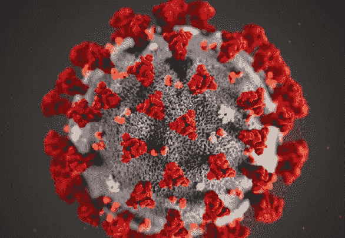
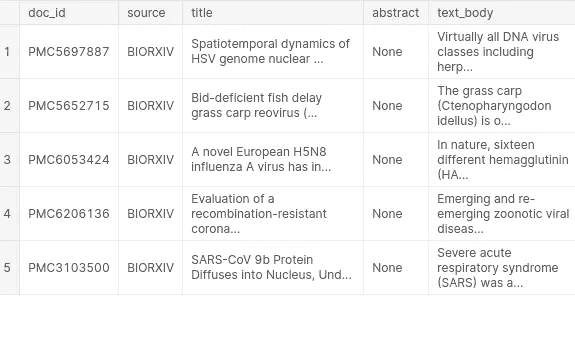
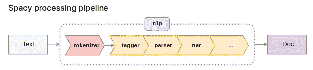
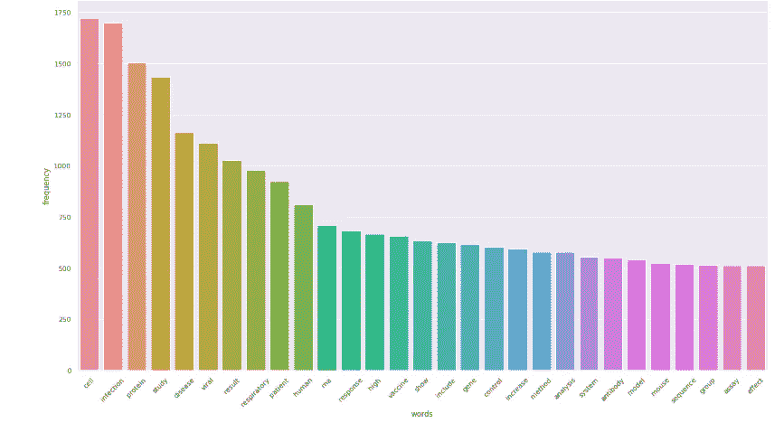
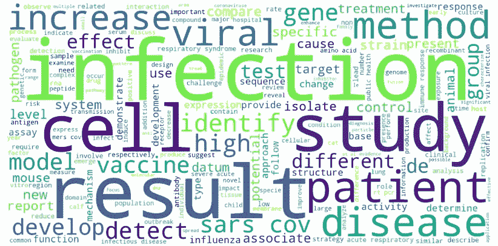
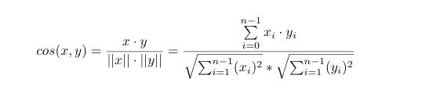

# 基于自然语言处理的信息检索系统

> 原文：<https://towardsdatascience.com/nlp-based-information-retrieval-system-answer-key-questions-from-the-scientific-literature-b8e5c3aa5a3e?source=collection_archive---------13----------------------->

## 回答科学文献中的关键问题



来源:[https://www . FDA . gov/food/food-safety-during-emergencies/food-safety-and-coronavirus-disease-2019-新冠肺炎](https://www.fda.gov/food/food-safety-during-emergencies/food-safety-and-coronavirus-disease-2019-covid-19)

*在这篇文章中，我们将了解如何用文本数据构建一个推荐系统。这里的文本数据由关于新冠肺炎、SARS-COV-2 和相关冠状病毒的学术文章组成。该数据集被称为 CORD-19，由白宫和一个领先的研究团体联盟准备。这个免费提供的数据集提供给全球研究界，以应用自然语言处理和其他人工智能技术的最新进展，产生新的见解，支持正在进行的抗击这种传染病的斗争。由于新型冠状病毒文献的快速增长，使得医学研究界难以跟上，因此对这些方法的需求越来越迫切。*

# 1.先决条件

对于这个帖子，我们将需要 [Python 3.6](https://www.python.org/downloads/release/python-360/) ， [spacy](https://spacy.io/) ， [Tensorflow](https://www.tensorflow.org/) ， [NLTK](https://www.nltk.org/) ， [Dask](https://dask.org/) ，我们将在需要时逐步安装它们。

# 2.数据集描述

这里使用的数据集来自 [Kaggle](https://www.kaggle.com/allen-institute-for-ai/CORD-19-research-challenge) 竞赛。数据集包含 doc_id、源、标题、摘要和正文。doc_id 是文档 id，source 是像 biorxiv 一样从哪里提取论文的地方，abstract 是论文的摘要，text body 是研究论文的正文或内容。

# 3.任务

我们的任务是基于以下问题检索信息。

## 任务 1(新冠肺炎开放研究数据集挑战(CORD-19))

*   **关于传播、潜伏期和环境稳定性有哪些已知信息？**
*   关于该病毒的自然史、传播和诊断，我们知道些什么？关于感染预防和控制，我们学到了什么？

具体来说，我们想知道文献报道的是什么:

*   该疾病在人类中的潜伏期范围(以及这如何随年龄和健康状况而变化)以及个体在多长时间内具有传染性，即使在康复后。
*   无症状传播的流行率(例如，特别是儿童)。
*   传播的季节性。
*   冠状病毒的物理科学(例如，电荷分布、对亲水/疏水表面的粘附、环境生存，以告知受影响区域的净化工作，并提供有关病毒脱落的信息)。
*   在多种底物和来源(如鼻涕、痰、尿、粪便、血液)上的持久性和稳定性。
*   病毒在不同材料(如铜、不锈钢、塑料)表面的持久性。
*   病毒的自然史和从感染者身上的传播
*   实施诊断和产品以改善临床流程
*   疾病模型，包括感染、疾病和传播的动物模型
*   监测病毒表型变化和潜在适应性的工具和研究
*   免疫反应和免疫
*   卫生保健和社区环境中预防二次传播的运动控制策略的有效性
*   个人防护设备(PPE)的有效性及其在卫生保健和社区环境中降低传播风险的有用性
*   环境在传播中的作用

# **4。流程**

## 4.1 导入所需的库

## 4.2 加载数据集



## **4.3 EDA**

探索性数据分析(EDA)是数据分析师熟悉其数据以推动直觉的过程。这个过程通常利用描述性统计和可视化。作为数据科学家或 NLP 专家，可视化地表示文本文档的内容是文本挖掘领域中最重要的任务之一。然而，在可视化非结构化(文本)数据和结构化数据之间存在一些差距。

首先理解数据并尝试从中收集尽可能多的见解是一个很好的做法。EDA 就是在数据被弄脏之前，理解手头的数据。

让我们安装一些必需的包并导入它们。我们将使用科学空间进行分析。 **scispaCy** 是一个 Python 包，包含用于处理生物医学、科学或临床文本的 spaCy 模型。

照常导入它们！！

## 空间语言处理流水线

当您在一个文本上调用`nlp`时，spaCy 首先对该文本进行标记以产生一个`Doc`对象。然后在几个不同的步骤中对`Doc`进行处理——这也被称为**处理流水线**。[默认模型](https://spacy.io/models)使用的管道由标记器、解析器和实体识别器组成。每个管道组件返回处理过的`Doc`，然后传递给下一个组件。



资料来源:https://spacy.io/usage/processing-pipelines/

*   **记号赋予器**:将文本分割成记号。
*   **标签**:分配词性标签。
*   **解析器**:分配依赖标签。
*   ner :检测并标记命名实体。

处理流水线总是**依赖于统计模型**及其能力。例如，如果模型包括对实体标签进行预测的数据，则管道只能包括实体识别器组件。

**注意**:您可以创建自己的管道组件，以便进一步处理

现在，创建一个函数来清理数据，这将删除所有的停用词，标点符号，多余的空格，网址，电子邮件和货币。有时动词、副词、代词不需要，可以去掉。这个函数将返回 word 的基本形式，这就是所谓的词汇化。

## 频率图



## 4.3.2 词云



# **4.4 预处理**

## 4.4.1 从文本中提取所有缩写和完整形式

文本包含许多缩写和完整形式，这个代码用于提取文本中的所有缩写和各自的完整形式，并将其放入字典中，其中键是缩写，值是完整形式。

现在，我们需要创建一个函数，将所有缩写替换为它们各自的完整形式。

同样，我们将创建删除电子邮件 id，网页链接，论文参考，多余的空格，不需要的字符等功能。

## 4.4.2 删除电子邮件 Id

## **4.4.3 移除网络链接**

## 删除引用

## 4.4.5 删除幽灵字符

## **4.4.6 拆除支架**

## **4.4.7 删除多余的空格**

## 4.4.8 实施 Dask 以实现快速处理和更好地利用 CPU

在这里，我们将使用 [Dask](https://dask.org/) 进行处理，Dask 是 python 中一个灵活的并行计算库，在大于内存的数据集上提供多核执行。

> *“Dask 为分析提供高级并行性，为您喜爱的工具提供规模化性能”——*[https://dask.pydata.org/en/latest/](https://dask.pydata.org/en/latest/)

现在，调用上面的函数来预处理文本

# 4.5 使用 USE 进行单词嵌入

该模型针对大于单词长度的文本进行训练和优化，例如句子、短语或短段落。它在各种数据源和各种任务上接受训练，目的是动态适应各种各样的自然语言理解任务。输入是可变长度的英文文本，输出是一个 128 维的向量。[通用语句编码器](https://ai.googleblog.com/2019/07/multilingual-universal-sentence-encoder.html)模型用**深度平均网络** (DAN)编码器训练。

让我们安装需要使用的软件包

从模型的 URL 加载模型

现在，把研究论文的正文用新的一行分割成单独的段落，这样我们可以为每个段落创建嵌入。例如，如果一个文本有 100 个段落，那么我们将得到这 100 个元素的列表。

将每行文本的不同段落列表转换为一个列表

# 4.5.1 创建嵌入(深度学习)

现在创建嵌入

这将返回 nx128 形状的张量对象，其中 n 是段落或句子的数量，因为句子的数量是 1052935，因此张量的形状将是 1052935x128

```
TensorShape([1052935, 128])
```

# 4.6 余弦相似性

在数学上，它测量的是在多维空间中投影的两个向量之间的角度余弦。在这个上下文中，我所说的两个向量是包含两个文档嵌入的数组。

设 ***x*** 和 ***y*** 为两个向量进行比较。使用余弦度量作为相似性函数，我们有



其中| |**|*x***| |是向量 x=(x1，x2，…，xn)的[欧氏范数](https://www.sciencedirect.com/topics/computer-science/euclidean-norm)，定义为 x1^2+x2^2+⋯+xn^2.从概念上讲，它是向量的长度。同样，| |**|*y***| |是向量 ***y*** 的欧氏范数。该度量计算向量 ***x*** 和 ***y*** 之间的角度余弦。余弦值为 0 表示这两个向量互成 90 度(正交)且不匹配。余弦值越接近 1，角度越小，向量之间的匹配度越大。

余弦相似性是有利的，因为即使两个相似的文档由于大小而相距欧几里德距离很远，它们之间仍然可以有较小的角度。角度越小，相似度越高。

请参考[链接](https://www.sciencedirect.com/topics/computer-science/cosine-similarity)查看更多关于余弦相似度的信息。

# 4.7 推荐文本

这个函数基于查询从语料库中提取信息。它计算查询与所有段落或句子的余弦相似度，将其标准化以固定其范围 b/w 0 到 1，并基于阈值返回句子。

# 4.8 任务结果

**4.8.1 潜伏期**

输出:

```
['statements of incubation period and sources of original incubation period data for', ' the incubation period of yellow fever is around 3-6 days. the incubation period of dengue fever is around 8-10 days.', ' the incubation period of lassa fever ranges from 3 to 21 days. symptoms of new world haemorrhagic fever typically develop over 7-14 days.',
 ]
```

## 传输

输出:

```
 ' determination of the dynamics of disease transmission in geographically widespread areas global spread of foot-and-mouth disease; spread of newcastle disease virus in asia distinction between pathovars and nonpathovars pathogenic and nonpathogenic escherichia coli in petting zoos addressing hospital and institutional infectious disease problems',' respiratory viruses detected in outbreaks in institutions reflect those known to be major causes of acute respiratory disease in the community; prevalence varies based on geographic location, season, and detection methods . free access to such institutions by members of the community , in conjunction with communal close quarters of residents, creates an ideal environment for propagation of viral respiratory outbreaks .', ' incidence of infection within a community social economic status of the community season per capita water use time of day age distribution within the community chronic infections table 2 concentration of enteric viruses in feces.']
```

**4.8.3 环境在传播中的作用**

输出:

```
[' disease control efforts can also make it challenging to determine effects of climate change on disease. for instance, if climate change causes range shifts of parasites from tropical to temperate countries, this might result in an overall reduction, rather than increase, in human diseases because temperate countries often have superior health infrastructures . regardless of the outcome of climate change on diseases, integrating control efforts into projections should improve predictions of future disease risk for humans and wildlife. furthermore, given that control measures could obscure increases in transmission, incorporating control measures into models could reveal underlying increases in disease risk that might otherwise be missed.', ' environmental variables can affect responses of mice in experimental situations. changes in respiratory epithelial physiology and function from elevated levels of ammonia, effects of temperature and humidity on metabolism, effects of light on eye lesions and retinal function, and effects of noise on neurophysiology are examples of complications that can vary with the form of insult and the strain of mouse employed. ', ' effects of meteorological factors on transmission. climate change can influence the occurrence and spread of infectious diseases through its effect on transmission. for example, climate change can cause air pollution and shortages of food and clean water , leading to changes of high-incidence areas and outbreak patterns, thereby affecting the occurrence and spread of infectious disease.', ' future studies that focused on other components of air pollution and environmental factors are necessary to more fully understand the possible impact on infectious disease transmission . studies are in need to establish the relationships between particle attachment and survival of influenza virus, and also methods should be developed to quantify airborne influenza virus and measure the concentration of influenza virus in ambient air especially for extremely low virus concentrations . we set the number of cases to zero on hot days due to there being no significant effect of pm 2.5 on influenza incidence on hot days .']
```

## 4.8.4 传播的季节性

输出:

```
[' seasonal patterns were observed for hmpv, rhinovirus, enterovirus and influenza viruses with peak prevalence in late winter and spring . in addition, a seasonal pattern was detected for tuberculosis . no distinct seasonal patterns were observed for other microbes.',
 'not disperse low pathogenic avian influenza virus during autumn migration .', 'the severity of seasonal influenza epidemics is unpredictable and influenced by the predominant circulating virus strains and level of immunity in the population . during peak community influenza activity, hospitals and emergency rooms may be overwhelmed by patients presenting with influenza-like illness and more severe disease , . illness attack rates may be higher among most age groups during pandemics than observed for seasonal influenza due to limited immunity among exposed populations . the re-emergence of highly pathogenic avian influenza a virus among poultry with sporadic transmission to exposed persons and the resulting high mortality has stimulated global influenza pandemic preparedness .',' the two gastrointestinal viruses in the study both also presented with winter seasonality, often with norovirus preceding rotavirus epidemics . norovirus and influenza a virus epidemics usually overlapped, but the norovirus epidemics had broader peaks, and numbers tended to start increasing earlier than influenza a virus diagnoses levels and decreased after the disappearance of influenza a virus. also, rotavirus outbreaks usually occurred before influenza a outbreaks started.','influenza viruses circulate in temperate climates from early autumn to late spring, and in tropical climates throughout the year with unpredictable peaks, usually occurring during the wet season and cooler months. routine surveillance for influenza and influenzalike illness can provide estimates of the relative severity of influenza seasons, and can also provide clinical specimens from which influenza viruses can be detected. this allows comparison of circulating influenza strains with vaccine strains in the current influenza season, and may provide potential vaccine strains for future seasons.]
```

## 4.8.5 冠状病毒的物理学

(例如，电荷分布、对亲水/疏水表面的粘附、环境存活，以通知受影响区域的净化工作并提供关于病毒脱落的信息)。

输出:

```
[' antiadhesive surfaces target microbial adhesion usually by the interaction of antagonist physicochemical properties. easy-clean surfaces that are hydrophobic repel bacteria better than glass-coated controls , while hydrophilic surfaces favour water sheeting and subsequent cleaning. similarly, polyethylene glycol coated surfaces promote a hydrophilic interaction against bacteria, preventing attachment . the use of diamond-like carbon films has already been tried for medical implanted devices such as joint prostheses and stents in order to repel microbial adhesion . despite being non-toxic and appealing, the lack of biocidal properties may turn discouraging a more generalized implementation of such easy-clean technologies.', ' in vitro testing compared the adhesion of representative proteins, prokaryotes, and eukaryotes on nanostructured and flat si3n4 surfaces with lysine-coated glass slides as positive controls. flat si3n4 is moderately hydrophilic and known to vigorously promote cell adhesion and proliferation due to increased adsorption of proteins when compared to more hydrophilic surfaces 33,34\. hence, we further increased the hydrophilicity of the si3n4 surface by varying the aspect-ratios of the nanostructures from 0.15 to 0.90 and systematically controlled surface hydrophilicity . once strong hydrophilicity is achieved , a nanostructure-mediated aqueous barrier forms on the surface and limits protein adsorption and cell adhesion to provide an anti-adhesion property 6,35,36.', ' for htcc nanofibers to become an adsorptive membrane material, the fibers must not dissolve in water. crosslinking of polymer structures is a common method to impart membrane stability in water soluble polymers. 21 pva fibers were crosslinked with maleic anhydride to create a filtration membrane. 22 htcc blended with polyvinyl alcohol was photo-crosslinked to impart antimicrobial resistance to the fibers. 10 glutaraldehyde vapor was used to crosslink htcc-pva fibers to create an antimicrobial surface. 7 here, we demonstrate that htcc nanofibers can be crosslinked while retaining their nonwoven structure and their ability to bind to negatively-charged viruses. we have explored the crosslinking conditions that give the greatest water stability. these conditions allowed for high virus removal. our model viruses include the non-enveloped porcine parvovirus , one of the smallest known mammalian viruses and the enveloped virus, sindbis virus. this nanofiber material has the potential to become an inexpensive defense against water-borne diseases.',
```

## 4.8.6 实施诊断和产品以改善临床流程

输出:

```
[" therefore, china's advancements in research and development, technical and scientific capacity transferring can support african next generation of proactive scientists to develop more sensitive simplified diagnostic tools and reduce the costs of laboratory diagnosis and medical equipment. furthermore, research and development is needed in examining the biological mechanisms of stressors or risk factors exposure and health effects, assessing evidence-based mitigation or adaptation interventions and benefits . innovative solutions and breakthroughs in human-animal-environment fields would not only enable africa to meet its own growing needs, but also support integrating health systems, including strengthening the capacities of laboratory diagnostics and medical care, as well as establishing the china-africa platforms that could generate evidence-based low-cost, available and easy-to-use health packages and solutions for the reduction of public health burden.", ' 1\. access to data and samples to enable and accelerate research, which would involve rapid sharing of epidemiological surveillance and clinical data to inform outbreak control strategies; incentives and platforms for open sharing and access to genomic sequencing data; access to specimen samples . 2\. appropriate conduct of research, including improved ethical standards for research and development ; previous agreement about experimental protocols, such as trial design, to speed clinical trials when outbreaks strike; 80 access to clinical trial data, such as publication of negative and positive results; clear pathways for approval by stringent regulatory authorities and in countries of use; and building on and investing in research capacities in epidemicaff ected countries. 3\. equitable access to the benefi ts of research, including priority, aff ordable access to newly developed health technologies for aff ected populations, including health workers; and ethical guidelines for rationing products with limited availability. an overarching framework is needed to bring coherence and fi ll gaps in the fragmented system of international rules shaping outbreak-related research (including the international health regulations, pandemic',' clinical laboratories are highly regulated, and general laboratory and testing requirements apply to all molecular diagnostic assays reported for patient care90\. quality control is paramount, and methods must be developed to ensure analytic accuracy throughout the assay workflow. important quality control steps can include initial sample quality checks, library parameters , sequence data generation , recovery of internal controls and performance of external controls. validation data generated during assay development and implementation should be recorded and made available to laboratory inspectors or submitted to regulatory agencies, such as the fda in the usa or the european medicines agency in europe, for approval.', ' future applications of advanced molecular diagnostics in clinical laboratories will enhance significantly capabilities to diagnose bacterial, parasitic, and viral agents in the early course of disease through enhanced assay sensitivities and specificities and improved turnaround times, theoretically leading to more timely and directed therapeutic intervention. until such time, clinicians must continue to rely on clinical judgment and the diverse battery of traditional culture techniques, direct examination , and immunoassays that are available. cost considerations and the ever-increasing array of infectious agents responsible for infectious gastroenteritis will continue to drive the development of practice guidelines to assist practitioners with reasoned and reasonable approaches to management of diarrheal illnesses. ']
```

## 4.8.7 疾病模型，包括感染、疾病和传播的动物模型

输出:

```
[' this paper reviews animal models currently in use for the study of influenza pathogenesis and immune responses to influenza virus infections and to assess vaccine and antiviral drug efficacy. models that will be reviewed will include: models of benign influenza, typical severe seasonal influenza and pneumonia, influenza-associated sepsis, models using h5n1 viruses, models in which acute respiratory distress syndrome is induced, models of influenzaassociated neurologic disease, models for virus transmission studies, immunocompromised models, and models of host resistance.', ' pregnancy poses an increased risk of severe maternal illness due to a number of acute and chronic viral infections; the common rhinovirus, influenza virus, sars coronavirus and varicella zoster, hepatitis e/b, hiv and cytomegalovirus . viral infections can also lead to pre-term birth and other pregnancy complications . however, few murine models are available to study pathogenesis of viral infections.', ' coronaviruses can cause a variety of diseases in animals and humans . of economical importance are coronaviruses such as porcine transmissible gastroenteritis virus, bovine coronavirus, feline infectious peritonitis virus, and avian infectious bronchitis virus. mhv, a natural mouse pathogen, has been extensively studied in the context of host immune responses and pathogenesis . there are many different and well-characterized strains of mhv which, depending on organ tropism, virulence and host strain, can cause a wide array of diseases ranging from hepatitis, respiratory symptoms and gastroenteritis to cns infection, demyelination, and acute meningitis [2, 17, . therefore, by using appropriate combinations of virus and mouse strains, mhv infections provide suitable models for a number of diseases that are of medical importance, such as encephalitis, immune-mediated demyelination , hepatitis and acute respiratory infections .', ' although in most host-virus interaction studies typically protein-coding genes have been the center of attention, there are few examples of virus and host lncrna interactions in human and mouse models . for instance, hepatitis b virus infection altered lncrna profiles in patients, with about 4% of human lncrnas showing more than 2-fold changes in hbv infected liver tissue . winterling et al. identified a virus inducible lncrna, which is induced by vesicular stomatitis virus and several strains of influenza a virus .']
```

同样，我们可以为其他查询检索信息，您只需键入 query 并调用" **recommend_text** "函数。

**参考文献:**

[1]韩家伟，简佩，米凯琳·坎伯，[数据挖掘:概念和技术提供了概念和技术](https://www.sciencedirect.com/book/9780123814791/data-mining-concepts-and-techniques#book-description) (2012)，爱思唯尔公司

[2]丹尼尔·瑟尔、·杨、孔胜义、南华、尼科尔·利姆蒂亚科、罗慕尼·圣约翰、诺亚·康斯坦、马里奥·瓜哈尔多-塞斯佩德斯、史蒂夫·袁、克里斯·塔尔、宋云轩、布赖恩·斯特罗普、雷·库兹韦尔、[通用句子编码器](https://arxiv.org/abs/1803.11175) (2018)、[arXiv.org](https://arxiv.org/)