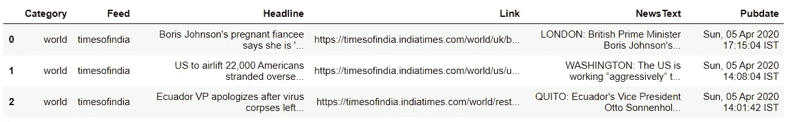

# NLP:使用全局向量构建文本摘要

> 原文：<https://towardsdatascience.com/nlp-building-a-summariser-68e0c19e3a93?source=collection_archive---------40----------------------->


蒂姆·莫斯霍尔德在 [Unsplash](https://unsplash.com?utm_source=medium&utm_medium=referral) 上的照片

一篇文章的摘要是一个简短的版本，它包含了文章的关键点，目的是把文章浓缩成几个要点，并且用文章本身的语言来表达。主要地，只有那些我们认为最重要的元素/句子被提取出来，通常，这些元素/句子传达了主要思想，或者基本的支持点。

总结不是对文章的分析。两者是不同的东西。摘要在很多情况下是有用的，例如，获得一篇大文章的要点，用热门词汇介绍一个复杂的想法，从大文章中获得意义等等。

在学术上，提取摘要是一项有点挑战性的任务。谢天谢地，机器学习来拯救我们了。机器学习的自然语言处理(NLP)模块提供了许多可用于文本摘要的算法。有两种主要的文本摘要方法:

> **抽象摘要:**
> 这种技术使用先进的自然语言处理方法来产生一个摘要，它在所使用的单词/句子方面是全新的。也就是说，摘要是用文章中没有用到的词写成的。
> 
> E **提取摘要:**
> 在这种技术中，最重要的单词/句子被提取出来并组合在一起以创建摘要。因此，摘要中使用的单词/句子来自文章本身。

在本文中，我们将使用抽取技术构建一个新闻摘要，从一篇大型新闻文章中抽取 4-5 个主要的重要句子。我们将检查一些流行和有效的策略来处理大量的文本，并从中提取 4-5 个有意义的句子。

我们将使用全局向量，也称为手套算法，这是单词的向量表示。用外行人的话来说，我们将使用手套算法生成句子向量，并将选择每页排名最高的句子算法。事不宜迟，让我们深入研究代码。我在这个练习中使用了 python。

# **流程新闻 RSS 提要**

我选择在印度最受欢迎的新闻服务之一 TimeOfIndia 的 RSS feed 上工作。在这个练习中，我选择了新闻的“世界”部分。但是它足够灵活，可以处理各种新闻服务多个 RSS 提要。

让我们读取 RSS 提要，并将新闻条目链接传递给 BeautifulSoup 进行 HTML 解析。注意，这里我只取了一个 RSS 提要，并一步一步地进行解析。后来，我将这些步骤结合在一起，无缝地处理多个提要。

```
# import basic required libraries
import pandas as pd
import numpy as np
import os# for web and HTML
import requests
from bs4 import BeautifulSoup# create a dict of various rss feed link and their categories. Will iterate them one by one.
# Have mentioned only one feed for demo purposes
timesofindia = {'world':'[http://timesofindia.indiatimes.com/rssfeeds/296589292.cms'](http://timesofindia.indiatimes.com/rssfeeds/296589292.cms')}
for category, rsslink in timesofindia.items():
    print('Processing for category: {0}. \nRSS link: {1}'.format(category,rsslink))
    # get the webpage URL and read the html
    rssdata = requests.get(rsslink)
    #print(rssdata.content)
    soup = BeautifulSoup(rssdata.content)
    print(soup.prettify())
```

在 BeautifulSoup 解析之后，应该彻底检查网页 HTML 内容(如上所述，通过使用 prettify 函数)以找到标签/模式或标签序列，从而导航到所需的新闻标题、链接和发布日期。在我们的例子中，这些元素在“item”标签中。所以让我们提取它来遍历每个“item”标签并提取每个单独的元素。

```
# get all news items. It has title, description, link, guid, pubdate for each news items. 
# Lets call this items and we will iterate thru it
allitems = soup.find_all('item')# print one news item/healine to check
for item in range(len(allitems)):
    print('Processing news-item #:',item)
    title = allitems[item].title.text
    link = allitems[item].guid.text
    pubdate = allitems[item].pubdate.text
    print('TITLE:',title)
    print('LINK:',link)
    print('PUBDATE:',pubdate)
```

输出:

```
Total news items found: 20
TITLE: Boris Johnson's pregnant fiancee says she is 'on the mend' from coronavirus
LINK: [https://timesofindia.indiatimes.com/world/.](https://timesofindia.indiatimes.com/world/uk/boris-johnsons-pregnant-fiancee-says-she-is-on-the-mend-from-coronavirus/articleshow/74994200.cms)...
PUBDATE: Sun, 05 Apr 2020 17:15:04 IST
TITLE: US to airlift 22,000 Americans stranded overseas; many in India
LINK: [https://timesofindia.indiatimes.com/world/.](https://timesofindia.indiatimes.com/world/us/us-to-airlift-22000-americans-stranded-overseas-many-in-india/articleshow/74992196.cms)...
PUBDATE: Sun, 05 Apr 2020 14:08:04 IST
TITLE: Ecuador VP apologizes after virus corpses left on streets
LINK: [https://timesofindia.indiatimes.com/world/.](https://timesofindia.indiatimes.com/world/rest-of-world/ecuador-vice-president-apologizes-after-virus-corpses-left-on-streets/articleshow/74992101.cms)...
PUBDATE: Sun, 05 Apr 2020 14:01:42 IST
```

要求的元素，即标题，链接，发布日期期待。让我们转到下一节，我们将创建一个从链接中获取新闻文章文本的基本函数。

# **摘录新闻文章**

在本节中，我们将通过解析网页的 HTML 链接来提取新闻文章文本。从 RSS feed 收到的链接中，我们将获取网页并使用 BeautifulSoup 解析它。

应该对网页 HTML 进行彻底的分析，以识别其中包含所需新闻文本的标签。我创建了一个从链接中获取新闻文本的基本函数。使用 BeautifulSoup，将提取特定 html 标签中可用的新闻文本。

```
# Function to fetch each news link to get news essay 
def fetch_news_text(link):
    # read the html webpage and parse it
    soup = BeautifulSoup(requests.get(link).content, 'html.parser') # fetch the news article text box
    # these are with element <div class="_3WlLe clearfix">
    text_box = soup.find_all('div', attrs={'class':'_3WlLe clearfix'})
    # extract text and combine
    news_text = str(". ".join(t.text.strip() for t in text_box))
    return news_text# using the above function, process text
news_articles = [{'Feed':'timesofindia',
                  'Category':category, 
                  'Headline':allitems[item].title.text, 
                  'Link':allitems[item].guid.text, 
                  'Pubdate':allitems[item].pubdate.text,
                  'NewsText': fetch_news_text(allitems[item].guid.text)} 
                     for item in range(len(allitems))]news_articles = pd.DataFrame(news_articles)
news_articles.head(3)
```



获取新闻文本后的新闻文章详细信息

以上数据看起来符合预期。注意，新闻文本的提取依赖于指定的 HTML 标签，所以如果新闻提供者碰巧改变/修改标签，上述提取可能不起作用。为了解决这个问题，我们可以在新闻文本为空时放置一个通知警报/标志，指示修改代码/标签的时间。

# **文本预处理**

对于文字清理，我使用了 [*这篇*](/nlp-building-text-cleanup-and-preprocessing-pipeline-eba4095245a0?source=email-2e5d9ff5c77e-1586110771153-layerCake.autoLayerCakeWriterNotification-------------------------7c347700_4379_4710_9431_826fc777de45&sk=646f1b75f932d40d9567767965ff8833.) 文章中详述的预处理步骤。这些步骤是删除 HTML 标签、特殊字符、数字、标点符号、停用词、处理重音字符、扩展缩写、词干化等。这些步骤在 [*这篇*](/nlp-building-text-cleanup-and-preprocessing-pipeline-eba4095245a0?source=email-2e5d9ff5c77e-1586110771153-layerCake.autoLayerCakeWriterNotification-------------------------7c347700_4379_4710_9431_826fc777de45&sk=646f1b75f932d40d9567767965ff8833.) 文章中有详细阐述，所以一定要查看一下细节。

在这里，我将这些预处理步骤放在一个函数中，该函数将返回一个干净且规范化的语料库。

```
# test normalize cleanup on one article
# clean_sentences = normalize_corpus([news_articles['NewsText'][0]])
clean_sentences = normalize_corpus(news_articles['NewsText'])
```

# 生成句子向量

使用手套单词嵌入，我们将生成句子的向量表示。对于这个练习，我使用的是预先训练好的维基百科 2014 + Gigaword 5 手套矢量可用 [*这里*](https://nlp.stanford.edu/projects/glove/) 。

```
# define dict to hold a word and its vector
word_embeddings = {}# read the word embeddings file ~820MB
f = open('.\\GloVe\\glove.6B\\glove.6B.100d.txt', encoding='utf-8')
for line in f:
    values = line.split()
    word = values[0]
    coefs = np.asarray(values[1:], dtype='float32')
    word_embeddings[word] = coefs
f.close()# check the length
len(word_embeddings) # 400000
```

在这个集合中，我们有 400K 的单词嵌入。这些单词嵌入的大小是 822 MB。大小可能因嵌入的令牌而异。嵌入越多，精确度越高。使用这些单词嵌入，让我们为规范化的句子创建向量。对于一个句子，我们将首先获取每个单词的向量。然后将取所有句子单词向量分数的平均分数，以得到一个句子的综合向量分数。

```
# create vector for each sentences
# list to hold vector 
sentence_vectors = []# create vector for each clean normalized sentence
for i in clean_sentences:
    if len(i) != 0:
        v = sum([word_embeddings.get(w, np.zeros((100,))) for w in i.split()])/(len(i.split())+0.001)
    else:
        v = np.zeros((100,))
    sentence_vectors.append(v)print('Total vectors created:',len(sentence_vectors)) 
```

# 取前 N 个句子

向量只是平面上的一个指针。使用余弦相似度方法，会发现句子之间的相似之处。向量将低余弦角将被计数器视为更相似。文章中每隔一个句子计算一个句子的余弦值。这里，也可以使用像欧几里德距离这样的其他方法，并且它们之间的距离越小的向量越相似。

```
from sklearn.metrics.pairwise import cosine_similarity# define matrix with all zero values
sim_mat = np.zeros([len(sentences),len(sentences)])# will populate it with cosine_similarity values 
# for each sentences compared to other
for i in range(len(sentences)):
    for j in range(len(sentences)):
        if i != j:
            sim_mat[i][j] = cosine_similarity(sentence_vectors[i].reshape(1,100), sentence_vectors[j].reshape(1,100))[0,0]
```

接下来，让我们将这个余弦相似性矩阵转换成一个图，其中节点代表句子，边代表句子之间的相似性得分。在这个图表上，将应用 PageRank 算法来得出每个句子的排名。

```
import networkx as nx# build graph and get pagerank
nx_graph = nx.from_numpy_array(sim_mat)
scores = nx.pagerank(nx_graph)# print final values of sentences
scores
```

*输出:*

```
{0: 0.0651816121717921,
 1: 0.0642861521750098,
 2: 0.06399116048715114,
 3: 0.06432009432128397,
 4: 0.06385988469675835,
 5: 0.06400525631019922,
 6: 0.06520921510891638,
 7: 0.06320537732857809,
 8: 0.06298228524215846,
 9: 0.06399491863786076,
 10: 0.0640726538022174,
 11: 0.06349704017361839,
 12: 0.06357060319536506,
 13: 0.057627597033478764,
 14: 0.058463972076477785,
 15: 0.05173217723913434}
```

因为我们在最初的文章中有 16 个句子，所以我们得到了 16 个分数，即每个句子一个分数。是时候根据上面计算的排名选出前 N 个句子了。

# 最后的步骤和结论

如上所述，最终文本需要一些处理才能呈现。这些处理可以是大写每个句子的第一个字符，从每篇文章的开头删除位置名称，删除多余的空格/制表符/标点符号，纠正换行符等。

最后，我们可以将所有这些步骤放在一起，创建一个摘要引擎/脚本。这个脚本可以被安排在每天早上选择的 RSS 提要上运行，并将新闻摘要发送到您的收件箱。这样你就不需要浏览所有文章来获取最新信息。或者您可以创建一个漂亮的 HTML 页面/小部件来显示主要出版物的新闻摘要。注意，在上面，我使用了单个 RSS 提要，但是在创建管道时，可以指定的 RSS 提要很少。此外，我使用了一些打印语句来显示中间值，可以删除这些中间值以获得无缝体验。

希望你喜欢这篇文章。如果你想分享关于任何方法的任何建议，请在评论中畅所欲言。读者的反馈/评论总是给作家带来灵感。