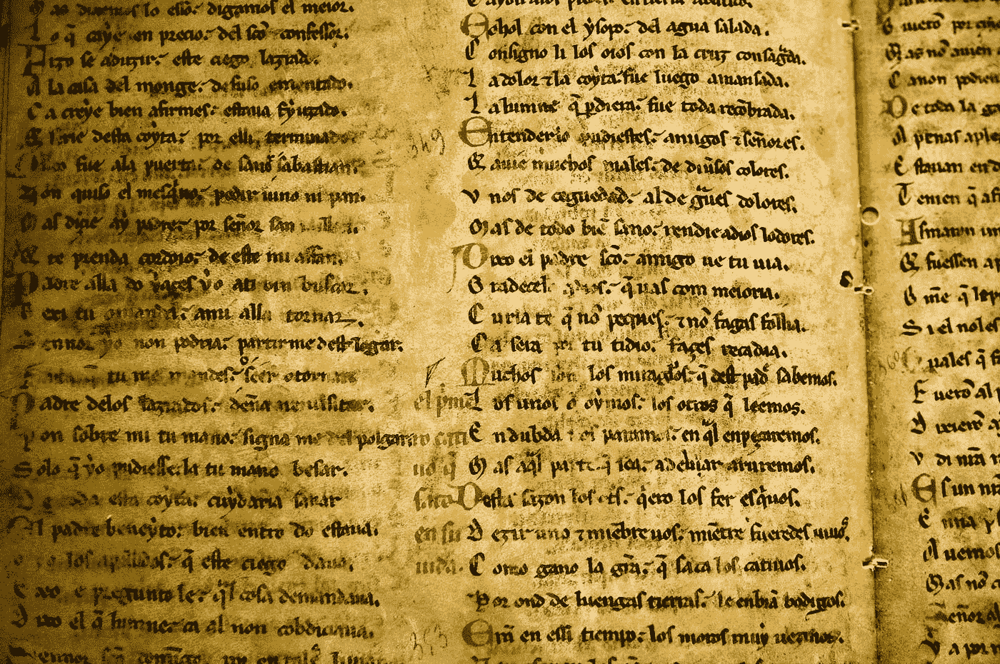

# NLP:构建文本清理和预处理管道

> 原文：<https://towardsdatascience.com/nlp-building-text-cleanup-and-preprocessing-pipeline-eba4095245a0?source=collection_archive---------8----------------------->



马克·拉斯姆森在 [Unsplash](https://unsplash.com?utm_source=medium&utm_medium=referral) 上拍摄的照片

自然语言处理，简称 NLP，是研究语言学和人类语言的机器学习/人工智能的子领域。NLP 处理计算机和人类语言之间的交互。换句话说，它使计算机能够理解人类语言，并对计算机进行编程，处理和分析大量的自然语言数据。

但在计算机程序能够理解和解释人类语言之前，大量的预处理工作都是在幕后进行的。你有没有想过情感分析、文本分类、推文分析等等的幕后发生了什么？？由于预处理，程序可以很容易地将语言或文本转换成更易于吸收的形式，以便机器学习算法可以更好地执行。

这些最常用于情感分析、反馈分类、翻译、摘要等。在许多情况下，预处理步骤提高了算法的准确性。通常，输入数据以自然形式呈现，即文本、句子、评论、段落、推文等格式。在这种输入可以被传递给机器学习算法之前，它需要一些清理或预处理，以便算法可以专注于主要/重要的单词，而不是增加最小价值或没有价值的单词。
说够了，让我们深入探讨 NLP 预处理技术。在这个例子中，我使用 python 作为编程语言。

# **移除 HTML 标签**

通常，非结构化的文本包含许多噪音，尤其是当您使用 web 或屏幕抓取等技术时。HTML 标签通常是对理解和分析文本没有太大价值的组件之一，因此应该删除。我们将使用 *BeautifulSoup* 库来清理 HTML 标签。

```
# imports
from bs4 import BeautifulSoup# function to remove HTML tags
def remove_html_tags(text):
    return BeautifulSoup(text, 'html.parser').get_text()# call function
remove_html_tags( ‘<html> \
 <h1>Article Heading</h1> \
 <p>First sentence of some important article. And another one. And then the last one</p></html>’)
```

*输出:*

```
' Article Heading First sentence of some important article. And another one. And then the last one'
```

# 删除重音字符

重音字符是重要的元素，用于在发音或理解过程中表示对特定单词的强调。在某些情况下，重音符号还可以澄清单词的意思，如果没有重音符号，单词的意思可能会有所不同。虽然它们在英语中的使用很有限，但是你很有可能在自由文本语料库中遇到带重音的字符/字母。诸如简历、咖啡、测试、离婚、协调、曝光、latt 等词。

口音可能是由某人的键盘默认设置或打字风格引起的。处理带重音的字符变得更加重要，尤其是如果你只想分析英语的话。因此，我们需要确保这些字符被转换并标准化为 ASCII 字符。一个简单的例子——把é转换成 e。

```
# imports
import unicodedata# function to remove accented characters
def remove_accented_chars(text):
    new_text = unicodedata.normalize('NFKD', text).encode('ascii', 'ignore').decode('utf-8', 'ignore')
    return new_text# call function
remove_accented_chars('Sómě Áccěntěd těxt. Some words such as résumé, café, prótest, divorcé, coördinate, exposé, latté.')
```

*输出:*

```
'Some Accented text. Some words such as resume, cafe, protest, divorce, coordinate, expose, latte.'
```

# 扩张收缩

缩写是单词或音节的缩写。它们是通过从单词中去掉特定的一个或多个字母而产生的。通常不止一个单词组合成一个缩略词。在书写中，撇号被用来表示遗漏字母的位置。在英语语言/文本中，缩写经常以书面或口头形式存在。

现在很多编辑都会默认诱导收缩。比如说*不要*要*不要，我要*要*我要，你要*要*你要*。将每个缩写转换为其扩展的原始形式有助于文本标准化。

为了消除缩写，我利用了缩写库中可用的一组标准缩写。

```
# imports
from contractions import CONTRACTION_MAP # from contractions.py
import re # function to expand contractions
def expand_contractions(text, map=CONTRACTION_MAP):
    pattern = re.compile('({})'.format('|'.join(map.keys())), flags=re.IGNORECASE|re.DOTALL)
    def get_match(contraction):
        match = contraction.group(0)
        first_char = match[0]
        expanded = map.get(match) if map.get(match) else map.get(match.lower())
        expanded = first_char+expanded[1:]
        return expanded     new_text = pattern.sub(get_match, text)
    new_text = re.sub("'", "", new_text)
    return new_text# call function 
expand_contractions(“Y’all i’d contractions you’re expanded don’t think.”)
```

*输出:*

```
'You all i would contractions you are expanded do not think.'
```

另一种方式可以是:

```
# imports
from pycontractions import Contractions
cont = Contractions(kv_model=model)
cont.load_models()# function to expand contractions
def expand_contractions(text):
    text = list(cont.expand_texts([text], precise=True))[0]
    return text
```

# 删除特殊字符

众所周知，特殊字符是非字母数字字符。这些字符最常见于评论、参考文献、货币数字等。这些字符对文本理解没有任何价值，而且会给算法带来干扰。幸运的是，正则表达式( *regex* )可以用来去掉这些字符和数字。

```
# imports
import re# function to remove special characters
def remove_special_characters(text):
    # define the pattern to keep
    pat = r'[^a-zA-z0-9.,!?/:;\"\'\s]' 
    return re.sub(pat, '', text)

# call function
remove_special_characters(“007 Not sure@ if this % was #fun! 558923 What do# you think** of it.? $500USD!”)
```

*输出:*

```
'007 Not sure if this  was fun! 558923 What do you think of it.? 500USD!'
```

# 移除数字

正如您在上面看到的，文本被保留了下来。但是有时这些可能不是必需的。由于我们处理的是文本，所以数字可能不会给文本处理增加多少信息。所以，数字可以从文本中删除。我们可以使用正则表达式( *regex* )来去掉数字。这一步可以与上一步结合，一步完成。

```
# imports
import re# function to remove numbers
def remove_numbers(text):
    # define the pattern to keep
    pattern = r'[^a-zA-z.,!?/:;\"\'\s]' 
    return re.sub(pattern, '', text)

# call function
remove_numbers(“007 Not sure@ if this % was #fun! 558923 What do# you think** of it.? $500USD!”)
```

*输出:*

```
' Not sure if this  was fun!  What do you think of it.? USD!'
```

# 删除标点符号

这可以通过删除特殊字符的步骤来实现。去掉标点符号相当容易。这可以通过使用字符串、标点符号和保留列表中没有的内容来实现。

```
# imports
import string# function to remove punctuation
def remove_punctuation(text):
    text = ''.join([c for c in text if c not in string.punctuation])
    return text# call function
remove_punctuation('Article: [@First](http://twitter.com/First) sentence of some, {important} article having lot of ~ punctuations. And another one;!')
```

*输出:*

```
'Article First sentence of some important article having lot of  punctuations And another one'
```

# 堵塞物

词干化是将词尾变化/派生的单词简化为词干、词根或词根形式的过程。词干不必与原词相同。有许多方法来执行词干提取，如查找表、后缀剥离算法等。这些主要依赖于从单词的末尾截掉*s、【es】、【ed】、【ing】、【ly】*等，有时这种转换是不可取的。但是尽管如此，词干帮助我们标准化文本。

```
# imports
import nltk# function for stemming
def get_stem(text):
    stemmer = nltk.porter.PorterStemmer()
    text = ' '.join([stemmer.stem(word) for word in text.split()])
    return text# call function
get_stem("we are eating and swimming ; we have been eating and swimming ; he eats and swims ; he ate and swam ")
```

*输出:*

```
'we are eat and swim ; we have been eat and swim ; he eat and swim ; he ate and swam'
```

# 词汇化

虽然词干化和词元化都生成词根形式的词形变化/所需单词，但词元化是词干化的高级形式。词干化可能不会产生实际的单词，而词汇化会通过使用词汇进行适当的转换，通常旨在仅删除屈折词尾，并返回单词的基本形式或词典形式，这就是所谓的词汇。

在使用词干化之前，我们应该意识到它比词干化慢得多，所以在选择词干化或词干化之前，应该考虑性能。

```
# imports
import spacy
nlp = spacy.load('en',parse=True,tag=True, entity=True)# function to remove special characters
def get_lem(text):
    text = nlp(text)
    text = ' '.join([word.lemma_ if word.lemma_ != '-PRON-' else word.text for word in text])
    return text# call function
get_lem("we are eating and swimming ; we have been eating and swimming ; he eats and swims ; he ate and swam ")
```

*输出:*

```
'we be eat and swim ; we have be eat and swim ; he eat and swim ; he eat and swam'
```

# 删除停用词

停用词经常被添加到句子中以使其语法正确，例如， *a、is、an、the 和*等词。这些停用词不太重要，在公开文本、文章、评论等中随处可见。这些应该被删除，以便机器学习算法可以更好地专注于定义文本含义/想法的单词。我们使用来自 *nltk.corpus* 的列表，并且可以根据手头的情况通过添加或删除自定义单词来进一步增强该列表。

```
# imports
import nltk
from nltk.tokenize import ToktokTokenizer
tokenizer = ToktokTokenizer()
stopword_list = nltk.corpus.stopwords.words('english')
# custom: removing words from list
stopword_list.remove('not')# function to remove stopwords
def remove_stopwords(text):
    # convert sentence into token of words
    tokens = tokenizer.tokenize(text)
    tokens = [token.strip() for token in tokens]
    # check in lowercase 
    t = [token for token in tokens if token.lower() not in stopword_list]
    text = ' '.join(t)    
    return text# call function
remove_stopwords("i am myself you the stopwords list and this article is not should removed")
```

输出:

```
'stopwords list article not removed'
```

# 删除多余的空格和制表符

额外的空格和制表符不会给文本处理添加任何信息。处理这些应该相当容易。

```
# imports
import re# function to remove special characters
def remove_extra_whitespace_tabs(text):
    #pattern = r'^\s+$|\s+$'
    pattern = r'^\s*|\s\s*'
    return re.sub(pattern, ' ', text).strip()# call function
remove_extra_whitespace_tabs('  This web line  has \t some extra  \t   tabs and whitespaces  ')
```

输出:

```
'This web line has some extra tabs and whitespaces'
```

# 小写字母

使用 lower 函数可以将大小写改为小写。

```
# function to remove special characters
def to_lowercase(text):
    return text.lower()# call function
to_lowercase('ConVert THIS string to LOWER cASe.')
```

输出:

```
'convert this string to lower case.'
```

# 结论

这些步骤中的一些可以合并在一个步骤中。此外，请注意，根据上下文和要求，其中一些可能不是必需的。此外，我们可以定义一个新的函数来封装所有上述预处理函数，以形成一个文本规范化器管道。这些步骤应该能让您很好地了解如何构建清理和预处理策略。经过这些预处理步骤后，文本集就可以用于 NLP 算法，如 *Word2Vec、GloVe* 等。这些预处理步骤肯定会提高模型的准确性。

希望你喜欢这篇文章，如果是的话，请在评论中说出来。如果你想分享关于任何方法的任何建议，请在评论中畅所欲言，我会马上回复。