# Python 中的 NLP 文本分类:PyCaret 方法与传统方法的比较

> 原文：<https://towardsdatascience.com/nlp-classification-in-python-pycaret-approach-vs-the-traditional-approach-602d38d29f06?source=collection_archive---------16----------------------->

## 传统教学法与 PyCaret 教学法的对比分析

# 一.导言

在本帖中，我们将看到用 python 中的两种不同方法演示 NLP 分类问题:

**1-传统方法**:在这种方法中，我们将:
-使用不同的 NLP 技术预处理给定的文本数据
-使用不同的嵌入技术嵌入处理过的文本数据
-在嵌入的文本数据上从一个以上的 ML 族构建分类模型
-查看不同模型的性能，然后调整一些选择的模型的超参数
-最后，查看调整后的模型的性能。很明显，用 python 来做意味着要写数百行代码，这至少要花你两到三个小时的时间。

**2-PyCaret 方法**:一种新方法，其中我们使用一个低代码 Python 库 py caret 来完成上述传统方法中的所有工作，但我们只需编写不到 30 行代码，几分钟就能获得结果和见解。

为了让您了解这两种方法之间的区别，请查看下面的粗略对照表:

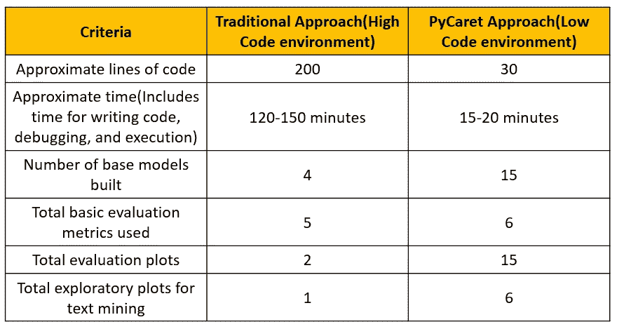

您可以看到 PyCaret 方法提供了更多的解决方案和功能，而且花费的时间和精力更少！

# 二。自然语言处理分类问题

这里的任务是识别给定的短信是垃圾短信还是火腿。这里是原始数据的一瞥，你可以从这个 [*链接*](https://github.com/prateek025/SMS_Spam_Ham/blob/master/SMS_Spam_Ham_Raw.csv) *找到原始数据。*数据集有 5574 条短信待分类。

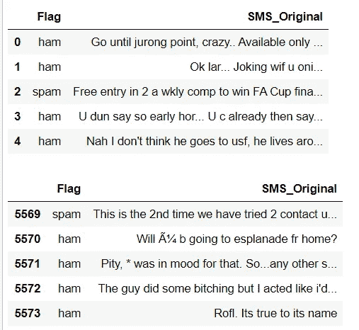

**原始数据集的头部和尾部**

您可能已经发现，这个问题分两个阶段:对原始文本数据进行 NLP，然后对处理后的文本数据进行分类。

让我们现在开始，看看这两种方法！我会在这篇文章的底部分享我在 Github 上的代码链接。

# 三。传统方法

## 第一阶段。文本数据的数据设置和预处理

在预处理之前，我们将把*标志*列从分类数据类型转换为数字数据类型。生成的数据集如下所示:

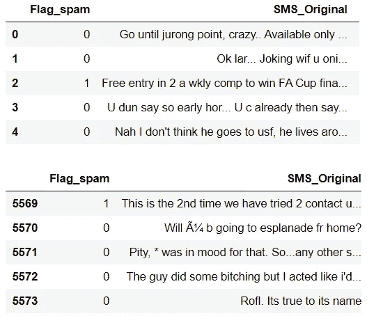

**带有标志列的数据集的头部和尾部被转换成数值/虚拟值**

接下来，在预处理步骤中，我对文本数据执行了以下操作:
-移除 HTTP 标签
-降低大小写
-移除所有标点符号和 Unicode
-移除停用词
-词汇化(考虑到与单词相关的相关词性，将单词转换为其根形式)

执行完上述所有 5 个操作后，数据集看起来如下:

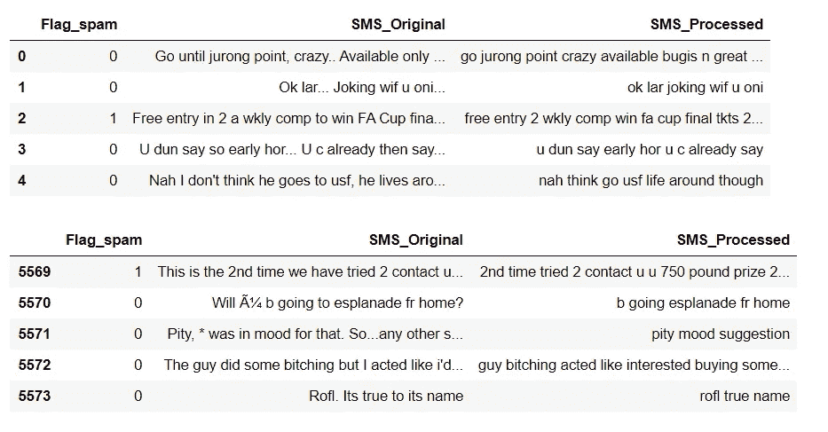

**预处理操作后数据集的头部和尾部**

在我们开始嵌入之前，对最常见的单词和最罕见的单词进行快速的探索性分析可能会让我们了解垃圾短信和业余短信之间的区别。

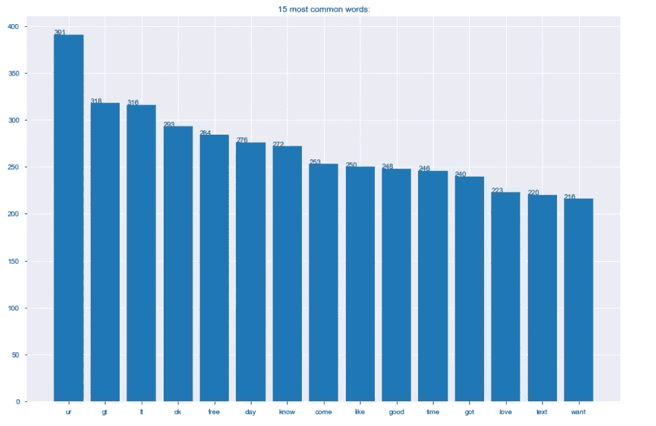

15 个最常见的单词:它们似乎最常出现在火腿短信中

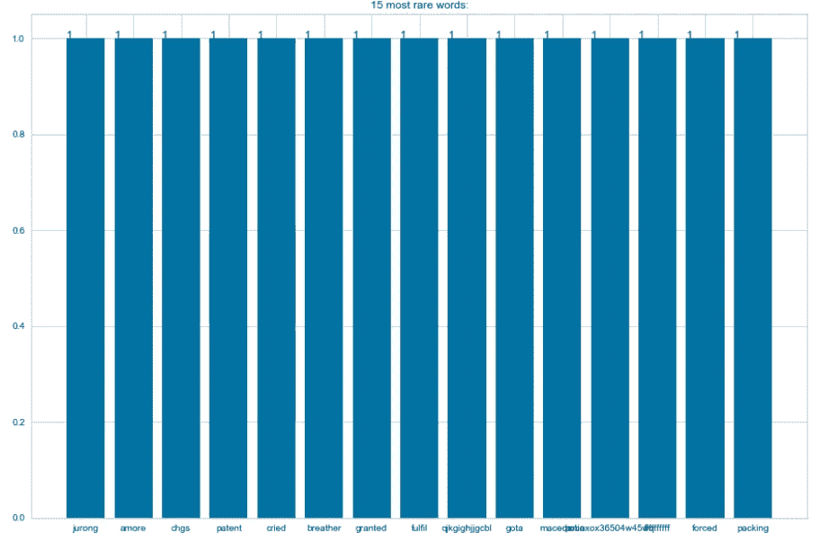

**15 个最罕见的词:它们似乎大多出现在垃圾短信中**

一般来说，这种探索性分析有助于我们识别和去除预测能力非常低的单词(因为这种单词大量出现)或可能在模型中引起噪声的单词(因为这种单词出现得非常少)。但是，我没有从处理过的文本数据中删除更多的单词，并且已经进入了嵌入阶段。

## 第二阶段。在处理后的文本数据上嵌入

我在这里使用了两种嵌入技术。
a. *单词包*方法:该方法创建一个术语文档矩阵，其中每个唯一的单词/术语成为一列。在 Python 中，我们对 *BoW 嵌入*使用 *CountVectorizer()* 函数。

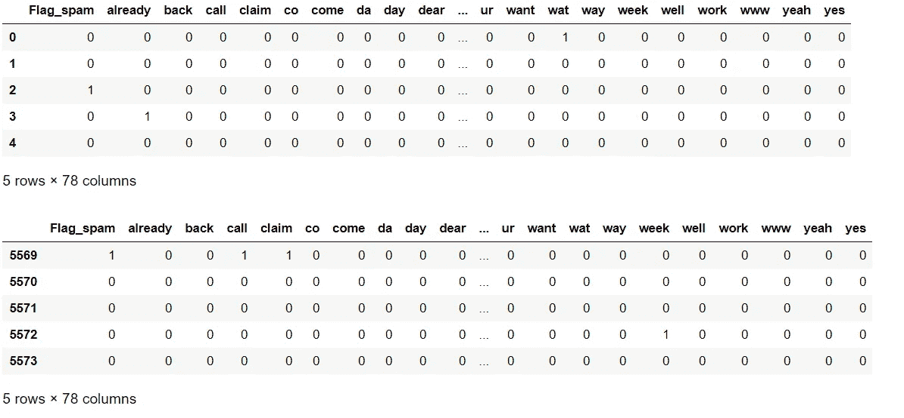

**嵌入 BoW 的变换数据集**

b.*术语频率-逆文档频率*方法:该方法创建一个术语文档矩阵，其中将一些权重应用于矩阵中的每个术语。权重取决于单词在文档和整个语料库中出现的频率。在 Python 中，我们使用 *TfidfVectorizer()* 函数进行 TF-IDF 嵌入。

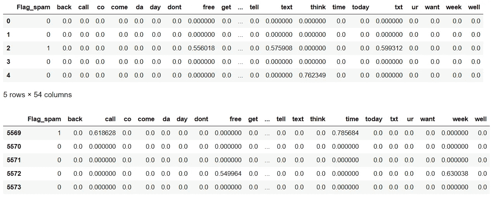

**嵌入 TF-IDF 的变换数据集**

## 第三阶段。模型结构

在决定构建什么模型之前，我已经将数据分成了 85%的数据(4737 行)在*训练数据集*中，剩下的 15%(837 行)在*测试数据集*中。
测试数据集允许我们在看不见的数据上评估模型性能

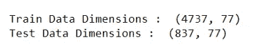

**数据的训练/测试分割的输出**

*   这里，我从四个随机决定的 ML 家族建立了分类模型:*随机森林分类器、Adaboost 分类器、梯度推进分类器、朴素贝叶斯分类器。*
*   我首先在 *BoW embedded* 数据集上构建了上述模型，然后在 *TF-IDF embedded* 数据集上构建了上述模型。
*   使用的模型性能指标有:*混淆矩阵、准确度分数、精确度分数、召回分数和 ROC-AUC 分数*。
*   我在这里只分享在嵌入了*BoW*的数据集上构建的基础模型的结果(未调整*超参数*)。我已经在我的 Github 存储库中与*TF-IDF embedded*ing 共享了数据集上的模型性能结果。您可以在下面提供的链接上查看:

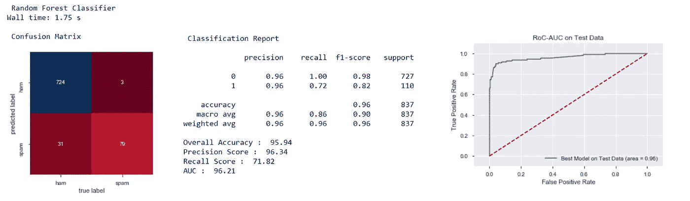

**1。随机森林分类器的结果**

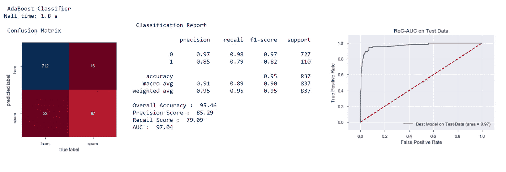

**2。AdaBoost 分类器的结果**

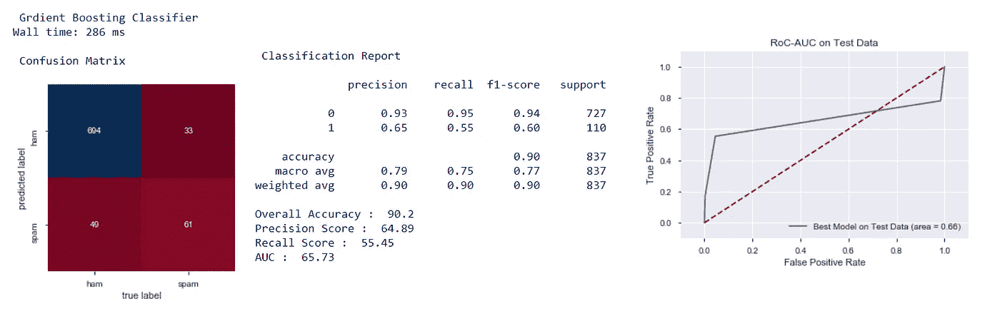

**3。梯度推进分类器的结果**

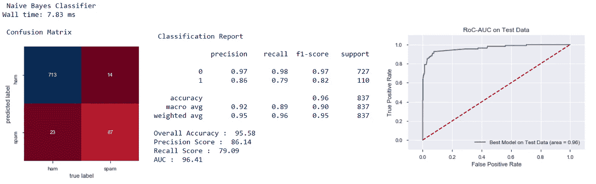

**4。朴素贝叶斯分类器的结果**

## 第四阶段。超参数调谐

为了方便起见，我用嵌入了的 *BoW 对建立在数据集上的模型进行了超参数调优。对 *TF-IDF* 嵌入式数据集上的模型做同样的事情将需要重复和添加大约 30–40*行代码。**

*我进一步决定继续调整*随机森林分类器*和 *Adaboost 分类器*模型的超参数，因为这两个模型似乎比其他两个模型表现得更好。对于超参数调整，我使用了网格搜索方法。*

*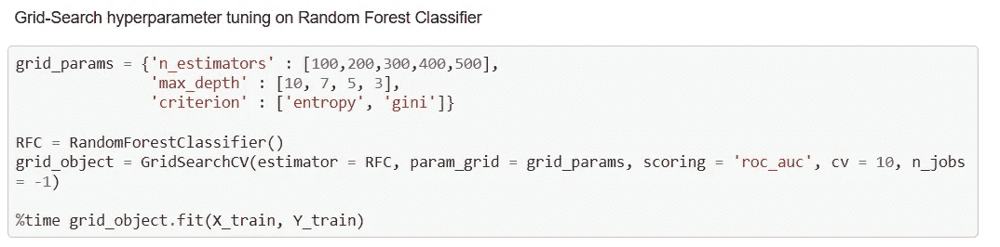*

***这里是 hyperparameter 调优的代码片段，完整代码请见本文底部链接的 Github 代码库链接。***

*使用与之前相同的模型性能度量:*混淆矩阵、准确度分数、精确度分数、召回分数、ROC-AUC 分数。* 结果还显示*调整后的超参数*值，以及调整后模型的*准确度得分*的 10 倍交叉验证值。*

*以下是调整后模型的性能结果:*

*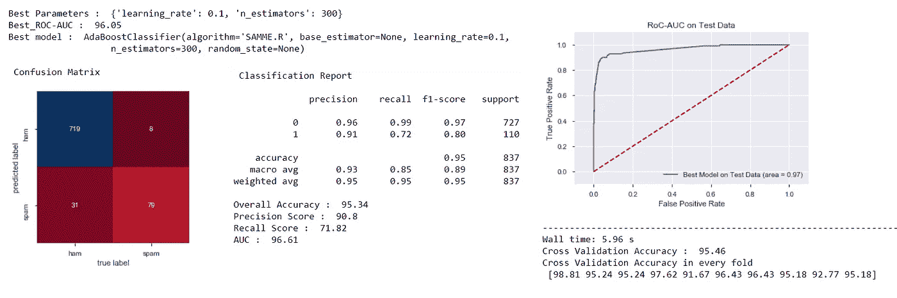*

***1。调整后的 AdaBoost 分类器模型的结果***

*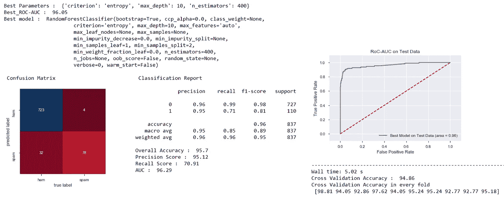*

***2。调整后的随机森林分类器模型的结果***

*比较两个调整后的模型， *AdaBoost 分类器*在*交叉验证准确度*得分上表现更好。*

*现在让我们探索 PyCaret 方法..！*

# *四。PyCaret 方法*

*我们将重复传统方法下执行的所有步骤，但是您会注意到这种方法是多么快速和简单。*

## *第一阶段。文本数据的数据设置和预处理*

*在 PyCaret 中执行任何 ML 实验之前，您必须设置一个 PyCaret 模块环境。这允许多次进行的 ML 实验的可再现性、可扩展性和部署。您可以看到，这样做只需要 2 行命令。*

*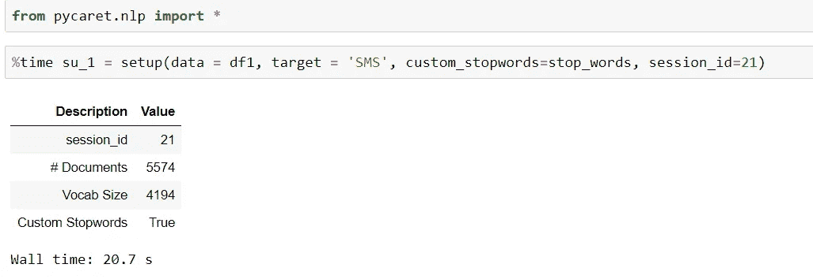*

***设置 PyCaret 的 NLP 模块的输出***

*这个函数的伟大之处在于，它自动对原始文本数据执行所有的 NLP 预处理操作(降低大小写、删除所有标点符号和停用词、词干、词汇化和其他操作)。这整个步骤在 21 秒内完成！*

## *第二阶段。在处理后的文本数据上嵌入*

*PyCaret 目前只支持主题建模嵌入技术。在本例中，我们将使用*潜在狄利克雷分配(LDA)* 技术和*非负矩阵分解(NMF)* 技术进行嵌入。因此，这不是苹果对苹果的比较，因为我们在传统方法中使用了 *BoW 嵌入和 TF-IDF 嵌入**

*PyCaret 中的嵌入过程要简单得多。您可以在下面的代码片段中看到，我们只需要 2 行代码来嵌入处理过的数据。默认情况下 *nlp 模块的 create_model()* 创建 4 个主题。您可以通过在此函数中传递所需的数值来更改主题编号。*

*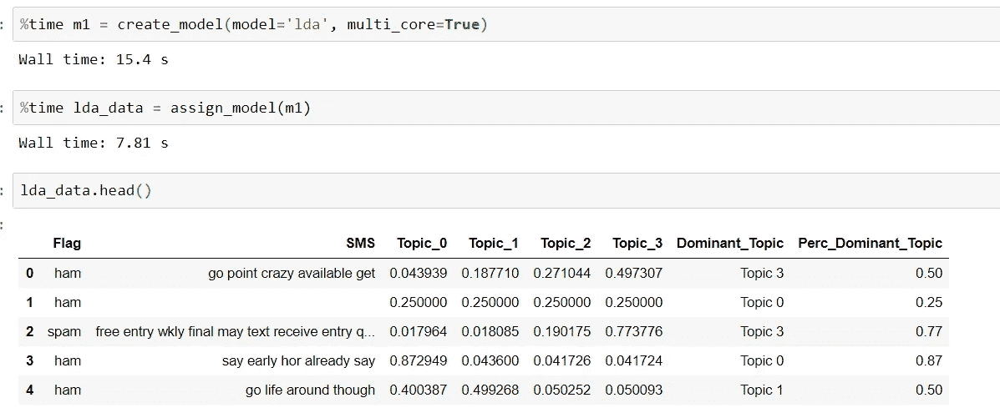*

***用于 LDA 嵌入和结果数据集的片段***

*使用同样的 2 行代码，但是改变*模型参数*，您可以创建一个嵌入了 *NMF* 的数据集。*

*此外，PyCaret 还提供了带有多个图表的选项，用于此阶段的探索性数据分析。同样，你只需要一行代码就可以做到。但是，必须注意，探索性数据分析基于嵌入阶段创建的*主题*。*

**

****evaluate _ model()命令的输出。*单击 5 个选项卡中的任何一个，并从下拉菜单中选择 4 个主题中的任何一个，以获得更多探索性分析和见解。***

## *第三阶段。模型结构*

*NLP 之后，整体问题的第二部分是分类。因此，我们需要不同的设置环境来执行分类实验。*

*我们将在嵌入 *LDA 的*数据集和嵌入 *NMF 的*数据集上构建模型。然而，我们将不得不放弃不必要的变量(*短信，主导话题*等)。)从两个嵌入的数据集中提取，以便可以在其上建立分类模型。*

*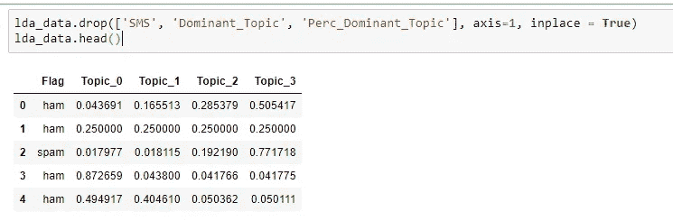*

***删除三个不必要变量后的 LDA 嵌入数据集***

*我们使用 PyCaret 的 *nlp* 模块进行 nlp 操作，同样，我们使用 PyCaret 的*分类*模块进行问题的分类部分。设置分类模块只需要 2 行代码。此外，我们还必须指定*目标变量*和*试车分流*比率。*

*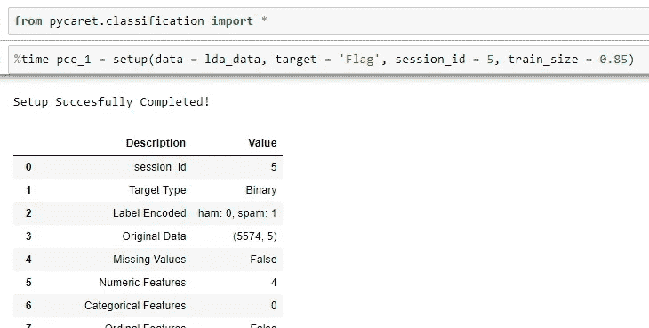*

***分类设置命令的输出。***

*就像在自动执行预处理操作的 *nlp* 设置中一样，在*分类*设置中，根据数据，PyCaret 自动创建新特征并执行其他预处理步骤！*

*如果您认为设置 PyCaret 环境和获得自动化特征工程很容易，那么模型构建就更容易了！你所要做的就是只写一个命令，然后看看结果！*

*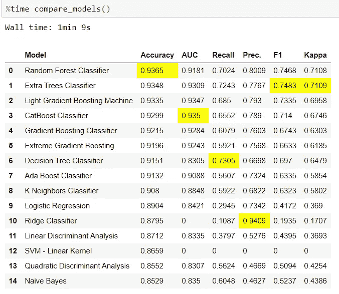*

***比较模型命令的输出。此处使用了 LDA 嵌入式数据集***

*您可以看到 PyCaret 从 18 个不同的 ML 分类家族中自动构建基础模型，并按照*准确度得分*的降序排列 15 个最佳模型。它进一步指出，对于特定的性能指标，哪种模型表现最好(指标得分以黄色突出显示)。*

*所有这些只需一个命令就能完成，结果在大约 1 分钟内就能显示出来！*

*我们看到*随机森林分类器模型*在*准确性方面表现最好。*我们来调一下*随机森林分类器模型。**

## *第四阶段。超参数调谐*

*这是 PyCaret 中的一个 3 步过程:创建一个模型，调整它，评估它的性能。每个步骤只需要一行代码！*

*调优*T8*随机森林分类器*建立在 *LDA 嵌入* datase *t:***

*   *在下面的输入输出片段中，每个步骤只需要 1 行代码。*
*   *为了创建一个*随机森林分类器*模型，你必须传递*‘RF’*值*
*   **您可以观察到调整后的模型指标优于基础模型指标**
*   *PyCaret 提供 15 个评估图。单击 15 个选项卡中的任何一个，选择您想要用来获得进一步见解的评估图。*

*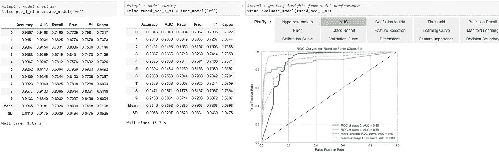*

***调整模型和评估其性能结果的 3 个步骤***

*我重复了同样的过程来调整建立在 *NMF 嵌入*数据上的模型。我这次调整了一个*额外树分类器*模型，做了一些改动。*

*   *建立新环境后， *compare_models* ()的结果显示 *Extra Trees Classifier* 模型表现最佳，因此我决定对其进行调优。*

**

***从 *setup()和 compare_model()命令输出 NMF 嵌入数据****

*   *在这里，我重复了与 LDA 嵌入数据相同的步骤: *create_model()，*然后是 *tune_model()，*然后是 *evaluate_model()。*
    您可以看到，要创建和调整一个*额外树分类器*模型，您必须传递*‘et’*值。
    这次我决定优化 *AUC 值*而不是*准确度分数*，同时调整超参数。为此，我必须传递*‘AUC’*值。*

*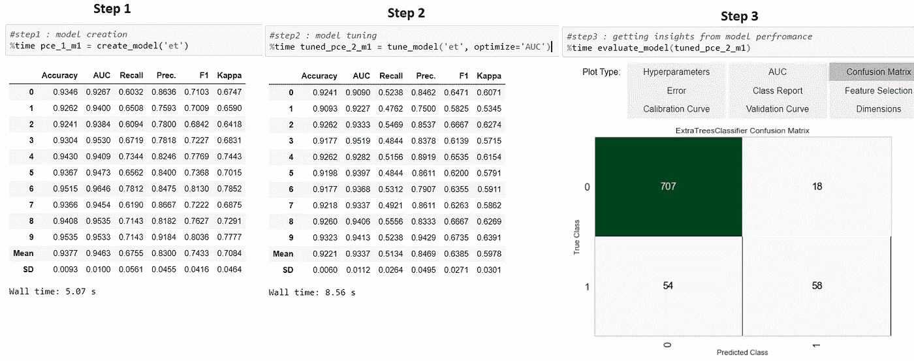*

***在嵌入 NMF 的数据上创建、调整和评估额外树分类器模型***

# *动词 （verb 的缩写）两种方法的比较*

*可以看出，与传统方法相比，PyCaret 以更少的代码行和更少的执行时间提供了具有更多选项和功能的解决方案。*

*我想进一步指出，将传统方法的模型性能结果与 PyCaret 方法的模型性能结果进行比较并不是苹果与苹果之间的比较，因为这两种方法对文本数据使用不同的嵌入技术。我们必须等待 PyCaret 的 *nlp 模块*的更新版本，它支持传统方法中使用的嵌入技术。*

*然而，根据业务问题，重要的是要看到节省的时间和精力，以及在 PyCaret 方法下获得的洞察力选项远比在传统方法下获得增加了一些十进制值的评估指标值更有价值。*

*下面是粗略的比较表，再次强调了这两种方法之间的主要区别。*

**

# *不及物动词重要链接*

*   *[完成此次比较的代码库](https://github.com/prateek025/SMS_Spam_Ham/blob/master/Spam-Ham.ipynb)*
*   *[PyCaret:用户指南和文档](https://pycaret.org/guide/)*
*   *[PyCaret:教程](https://pycaret.org/tutorial/)*

*感谢你阅读这篇文章。快乐学习！*