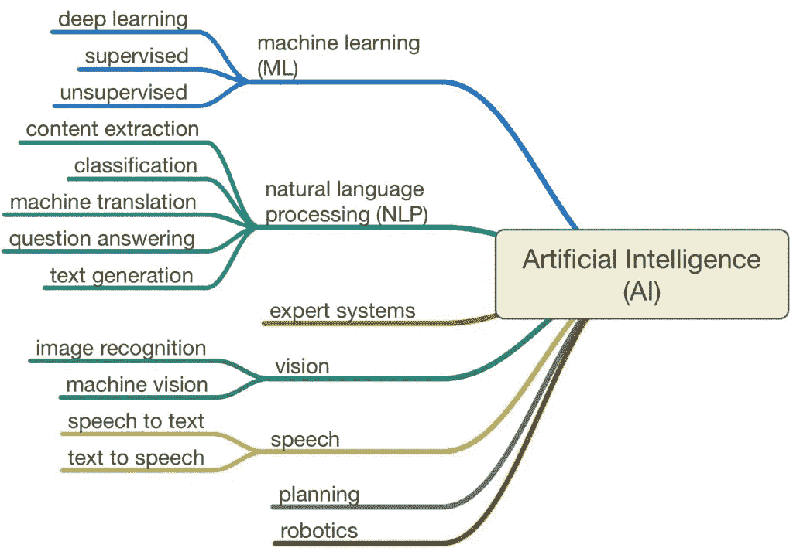
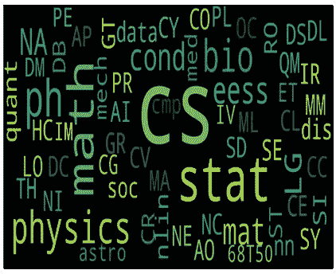
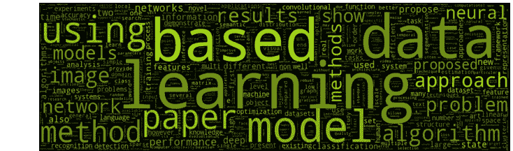
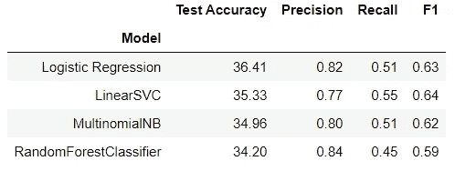
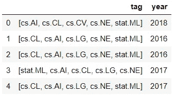
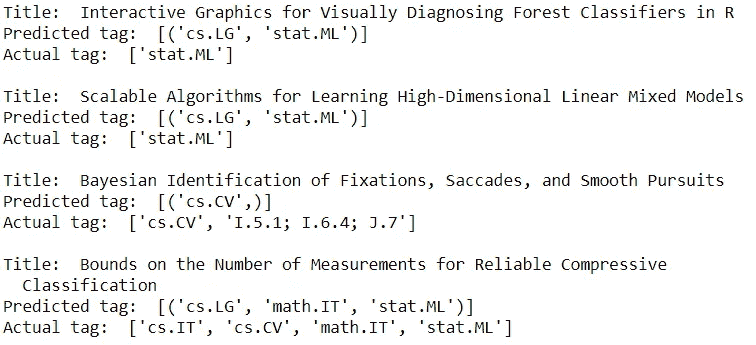
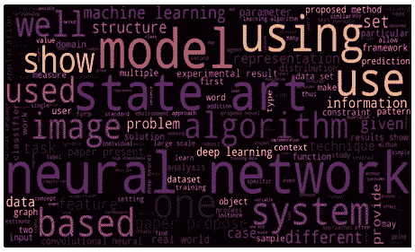

# NLP:分类和推荐项目

> 原文：<https://towardsdatascience.com/nlp-classification-recommendation-project-cae5623ccaae?source=collection_archive---------34----------------------->

## 使用 arxiv 数据的逐步 NLP 项目


由 [Unsplash](https://unsplash.com/?utm_source=unsplash&utm_medium=referral&utm_content=creditCopyText) 上的[Cup 先生/杨奇煜·巴拉](https://unsplash.com/@iammrcup?utm_source=unsplash&utm_medium=referral&utm_content=creditCopyText)拍摄的照片

NLP 是从文本数据中提取意义和学习的科学，它是数据科学项目中使用最多的算法之一。文本数据无处不在，总之，NLP 有许多应用领域，如下图所示。



在这种背景下，我决定做一个覆盖 arxiv 数据的 NLP 项目。通过这个项目，我的目标是对文章的标签进行分类，并通过文章的摘要、标题、作者和体裁特征建立一个推荐系统。

# 第一步:数据知识



为了实现我的目标，我提取了一个包含 41000 行和 6 列的 arxiv 数据集:作者、链接、摘要、标签、标题和年份。我的数据集包含 1998 年至 2018 年之间的文章。如左图所示，它包含了大部分计算机科学领域的文章。

# 步骤 2:文本清理

我的一些特性是字典类型的，所以我将这些列转换成列表类型，以便有一个可用的数据结构。

```
from ast import literal_eval
# convert 'stringfield' lists to usable structure
features = ['author', 'link', 'tag']
for feature in features:
    arxivData[feature] = arxivData[feature].apply(literal_eval)
```

在执行 literal_eval 之后，我为列表转换编写了三个函数:

```
def get_names(x):
    if isinstance(x, list):
        names = [i['name'] for i in x]
        #Check if more than 3 elements exist. If yes, return only first three. If no, return entire list.
        if len(names) > 3:
            names = names[:3]
        return namesdef get_link(x):
    for i in x:
        return i['href']

def get_tag(x):
    if isinstance(x, list):
        terms = [i['term'] for i in x]
        #Check if more than 5 elements exist. If yes, return only first five. If no, return entire list.
        if len(terms) > 5:
            terms = terms[:5]
        return terms
```

好了，我现在准备写一个文本清理函数。这些是 NLP 项目中构建健壮模型结构的最重要的部分之一。为此，我们需要删除大写字母、标点和数字:

```
# Data Cleaning & Preprocessing techniques
def clean_text(text):
    # remove everything except alphabets
    text = re.sub("[^a-zA-Z]", " ", text)
    # remove whitespaces
    text = ' '.join(text.split())
    text = text.lower()
    return text
```



没有停用词的 25 个最常用词

# 步骤 3:文本挖掘算法

现在是时候从文本数据中提取特征了。文本文件最初只是一系列的单词。为了运行机器学习算法，我们必须将文本文件转换成数字特征向量。有两种常用的方法:CountVectorizer 和 Tfidf。

*   count vectorizer:[count vectorizer](http://scikit-learn.org/stable/modules/generated/sklearn.feature_extraction.text.CountVectorizer.html)提供了一种简单的方法，既可以标记一组文本文档，构建已知单词的词汇表，还可以使用这个词汇表对新文档进行编码。
*   Tfidf: TF-IDF 是一种统计度量，用于评估一个单词与文档集合中的一个文档的相关程度。这是通过将两个度量相乘来实现的:一个单词在一个文档中出现的次数，以及该单词在一组文档中的逆文档频率。

它们之间的区别基本上是，一个统计所有的单词来矢量化，另一个使用统计方法来代替。

为了在我的数据集上执行文本挖掘，我首先编写了一个 lemmatize 函数，然后执行矢量化。

```
# Lemmatization process
'''
Words in the third person are changed to first person and verbs in past and future tenses are changed into the present by the 
lemmatization process. 
'''
lemmatizer = WordNetLemmatizer()def tokenize_and_lemmatize(text):
    # tokenization to ensure that punctuation is caught as its own token
    tokens = [word.lower() for sent in nltk.sent_tokenize(text) for word in nltk.word_tokenize(sent)]
    filtered_tokens = []

    for token in tokens:
        if re.search('[a-zA-Z]', token):
            filtered_tokens.append(token)
    lem = [lemmatizer.lemmatize(t) for t in filtered_tokens]
    return lem
```

有了这个矩阵，我们现在可以建立一个机器学习模型。

```
# Defining a Count Vectorizer object
count_vec = CountVectorizer(stop_words='english', max_features=10000)# Defining a TF-IDF Vectorizer
tfidf_vec = TfidfVectorizer(stop_words='english', ngram_range=(1, 2), tokenizer=tokenize_and_lemmatize, max_features=10000, use_idf=True)
```

# 第四步:分类

有各种算法可用于文本分类。嗯，我从探索这些模型开始:逻辑回归、朴素贝叶斯、线性 SVC 和随机森林。我的方法是，在运行完本节中的所有模型后，选择最佳模型进行优化。因此，我用默认参数运行了所有的模型，以查看结果。



这是我的分类模型的结果。准确性和 f1 分数之间冲突的原因是一篇文章有多个标签。



机器学习模型未能预测一篇文章的所有标签。尽管如此，f1 分数还是高于准确度，因为我把 f1 的平均参数设置为‘微’。

我跳到了模型评估之后的优化部分。为此，我使用了 GridSearchCV:

```
param = {'estimator__penalty':['l1', 'l2'], 'estimator__C':[0.001, 0.01, 1, 10]}# GridSearchCV
kf=KFold(n_splits=10, shuffle=True, random_state=55)
lr_grid = GridSearchCV(oneVsRest, param_grid = param, cv = kf, scoring='f1_micro', n_jobs=-1)
lr_grid.fit(xtrain_tfidf, y_train)
```

由于准确性得分，我选择了逻辑回归进行网格搜索，结果，我得到的 F1 得分增加到了%64，1。以下是优化回归模型的一些结果:



# 第五步:推荐引擎

我做了两个推荐系统，第一个基于摘要，另一个基于标题、标签和作者。为了建立一个推荐器，首先我计算了矢量化文本数据的余弦相似度。

```
# TfIdf matrix transformation on clean_summary column
tfidf_matrix = tfidf_vec.fit_transform(arxivData['clean_summary'])
# Compute the cosine similarity
cosine_sim = linear_kernel(tfidf_matrix, tfidf_matrix)
```

根据计算结果，我编写了推荐函数:

```
def get_recommendations(title, similarity):
    idx = indices[title]
    # pairwsie similarity scores
    sim_scores = list(enumerate(similarity[idx]))
    # sorting
    sim_scores = sorted(sim_scores, key=lambda x: x[1],  reverse=True)
    sim_scores = sim_scores[1:11]
    article_indices = [i[0] for i in sim_scores]
    # Return the top 10 most related articles
    return arxivData[['link', 'title']].iloc[article_indices]
```

它获得两个参数，然后通过余弦相似值对文章进行排序。最后，它返回 10 篇最相关的文章作为结果。

# 步骤 6:结论和进一步的工作

*   我们已经了解了 NLP 项目基本级别的一般方法。
*   我们已经知道有两种常见的方法来预处理我们的文本数据:计数和 Tfidf 矢量器。
*   我们看到，我们的分类模型在多类问题上失败了，但当我们将 f1 分数作为成功指标进行评估时，我们并没有那么糟糕。
*   写得最多的文章来自计算机科学研究，最常用的词是“神经网络”。
*   最后，我们学习了如何使用余弦相似度来构建推荐器。
*   作为进一步的工作，我计划做一个 Flask 应用程序，使我的推荐者在线。



最常用的词

好了，暂时就这些了。下一篇文章再见！

另外，如果你想了解更多，也可以看看我的 Github 简介！