# 通用语言模型微调的自然语言处理分类

> 原文：<https://towardsdatascience.com/nlp-classification-with-universal-language-model-fine-tuning-ulmfit-4e1d5077372b?source=collection_archive---------17----------------------->

## 在本文中，我们将看到如何使用优于以前文本分类方法的 ULMFiT 建立一个 NLP 分类模型。

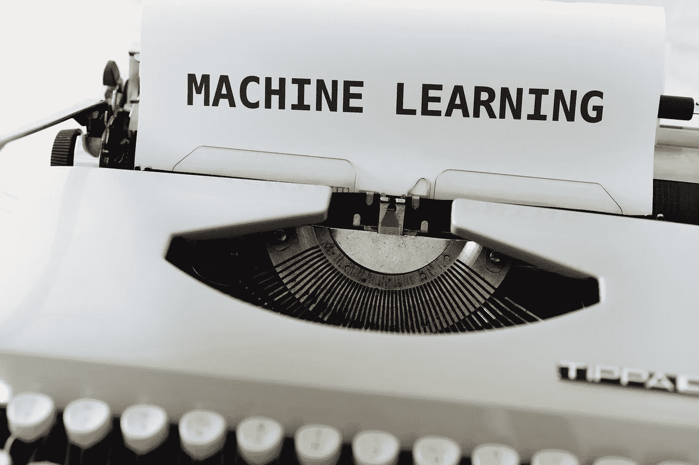

马库斯·温克勒在 [Unsplash](https://unsplash.com/s/photos/machine-learning?utm_source=unsplash&utm_medium=referral&utm_content=creditCopyText) 上的照片

文本分类是自然语言处理的重要应用之一。诸如情感分析和识别垃圾邮件、机器人和攻击性评论等应用属于**文本分类**。到目前为止，用于解决这些问题的方法包括从头开始建立机器学习或深度学习模型，在你的文本数据上训练它们，并用超参数进行微调。尽管这种模型对于像分类电影评论是正面还是负面这样的应用程序来说给出了不错的结果，但如果事情变得更加模糊，它们可能会表现得非常糟糕，因为大多数时候没有足够多的标记数据可供学习。

> 但是等一下？Imagenet 不是用同样的方法对图像进行分类吗？那么，它是如何用同样的方法取得巨大成功的呢？如果我们不是从零开始建立一个模型，而是使用一个经过训练可以解决一个问题(对 Imagenet 中的图像进行分类)的模型作为基础来解决其他一些有点类似的问题(文本分类)，会怎么样呢？由于微调后的模型不必从头开始学习，因此它不需要大量数据就能提供更高的准确性。这就是**迁移学习**的原理，通用语言模型微调(ULMFiT)就是建立在这个原理上的。

今天，我们将了解如何利用这种方法进行情感分析。您可以在此阅读更多关于 ULMFiT、其优势以及与其他方法的比较[的信息。](http://nlp.fast.ai/classification/2018/05/15/introducing-ulmfit.html)

**fastai** 库提供了训练和使用 ULMFiT 模型所需的模块。你可以在这里查看库[。](https://github.com/fastai/fastai)

我们要解决的问题是美国航空公司的情绪分析。你可以从[这里](https://www.kaggle.com/crowdflower/twitter-airline-sentiment#Tweets.csv)下载数据集。所以事不宜迟，我们开始吧！

首先，让我们导入所有的库。

现在，我们将把数据的 CSV 文件转换成 Pandas Dataframe 并查看数据。

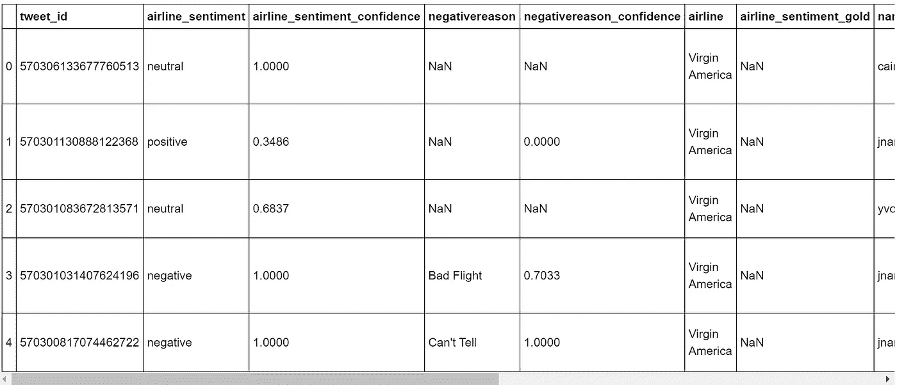

现在我们检查数据帧中是否有空值。我们观察到在 negative_reason 列中有 5462 个空值。这些空属于积极+中性的情绪有道理。我们通过统计所有非负面推文来验证这一点。两个号码都匹配。negativereason_confidence 计数与 *negativereason* 计数不匹配的原因是 negativereason_confidence 列中的 0 值对应于 *negativereason* 列中的空白。

如果我们看看数据样本的总数，它是 14640。列 airline _ 情操 _ 黄金，negativereason _ 黄金& tweet_coord 有大量空白，即在 13000–14000 范围内。因此可以得出结论，这些列不会提供任何重要的信息&因此可以被丢弃。

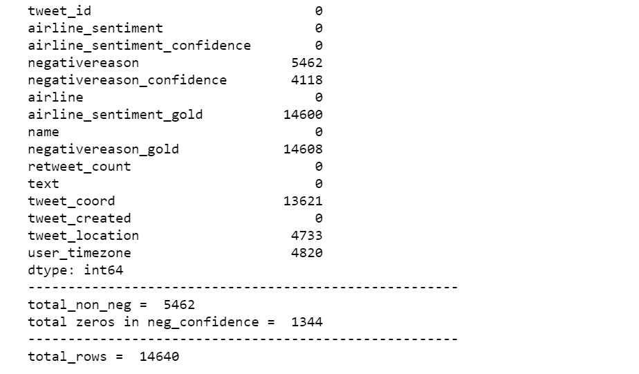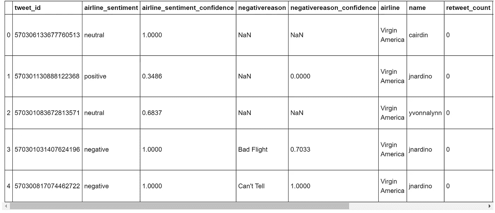

现在我们有了相关的数据，让我们开始构建我们的模型。

当我们用 Fastai 制作 NLP 模型时，有两个阶段:

*   创建 LM 模型并使用预先训练的模型对其进行微调
*   使用微调模型作为分类器

这里我使用的是数据块的一部分 ***TextList*** ，而不是使用工厂方法***TextClasDataBunch***和***TextLMDataBunch***，因为 TextList 是 API 的一部分，更加灵活和强大。

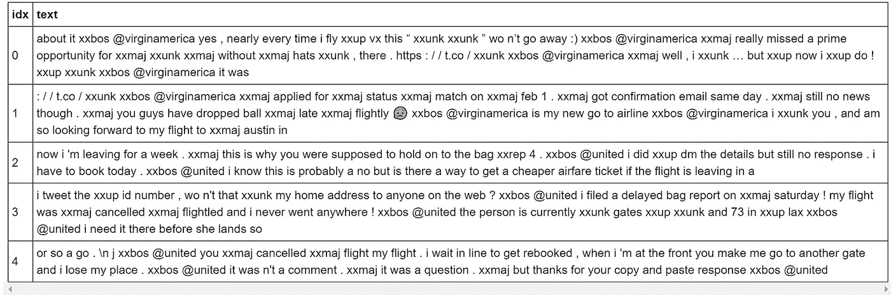

我们可以看到，由于我们正在训练一个语言模型，所有的文本都连接在一起(在每个新的时期，它们之间有一个随机的洗牌)。

现在，我们将使用在更大的语料库 Wikitext 103 上预先训练的模型的权重来微调我们的模型。这个模型已经被训练来预测作为输入提供给它的句子中的下一个单词。由于推文的语言并不总是语法上完美的，我们将不得不调整我们模型的参数。接下来，我们将找到最佳的学习速度，并将其可视化。可视化将帮助我们发现学习率的范围，并在训练我们的模型时从中进行选择。

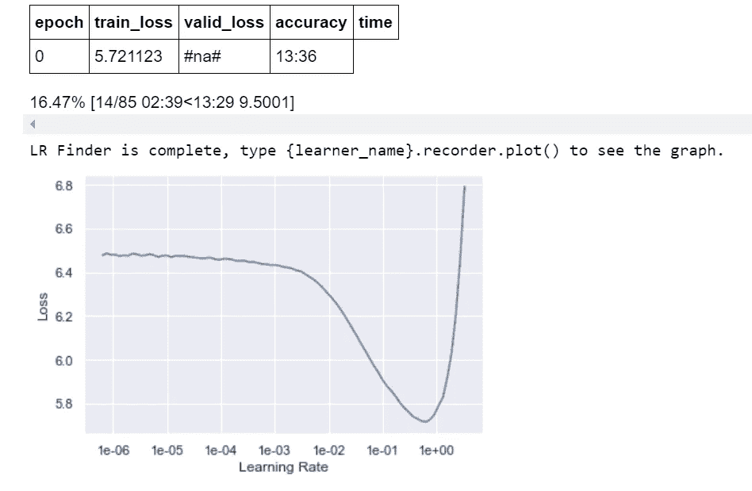

默认情况下，学习者对象是冻结的，因此我们需要首先训练嵌入。这里，我不是运行一个时期的循环，而是运行 6 个时期，看看精度如何变化。我挑选的学习率是借助于我们上面得到的图。

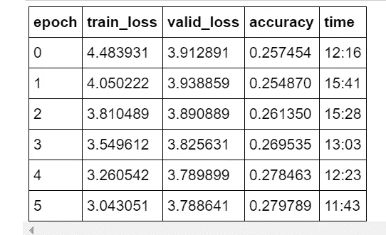

我们得到了非常低的精度，这是预料中的，我们模型的其余部分仍然是冻结的，但我们可以看到精度正在增加。

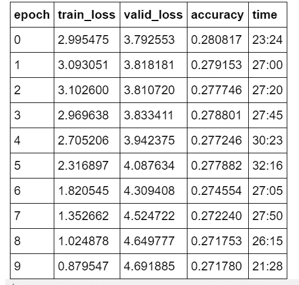

我们看到精度略有提高，但仍在相同范围内。这是因为，首先，模型是在一个预先训练好的模型上用不同的词汇训练的&其次，没有标签，我们在没有指定标签的情况下传递了数据。

现在我们将用随机输入来测试我们的模型&看看它是否能准确地完成句子。

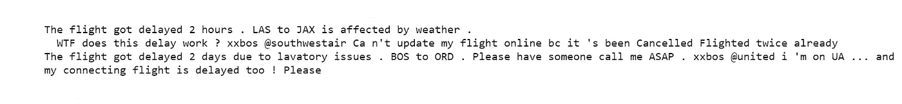

现在，我们将创建一个新的数据对象，它只获取带标签的数据并保留这些标签。

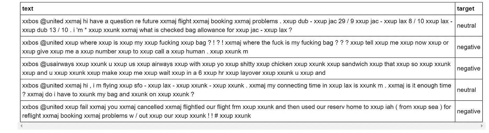

分类器需要稍微少一点的漏失，所以我们传递 drop_mult=0.5，将所有漏失乘以这个量。我们不加载预先训练好的模型，而是加载前一节中经过微调的编码器。

我们再次执行与语言模式相似的步骤。这里我跳过了最后 15 个数据点，因为我只对 1e-1 感兴趣。

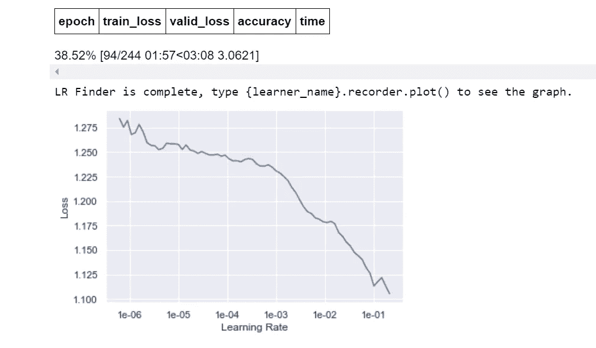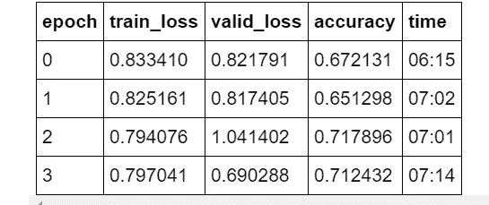

在这里，我们看到，如果我们与步骤 1 中提供标签时的语言模型进行比较，准确性有了很大的提高。

现在我们将通过一次解冻一层来部分训练模型&差分学习率。这里我使用了 slice 属性，它将在 3 组模型中划分指定的学习率。

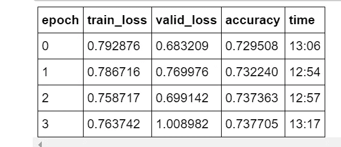

我们看到，随着我们逐渐解冻各层，精确度正在逐步提高。更多的层提供更多的深度。

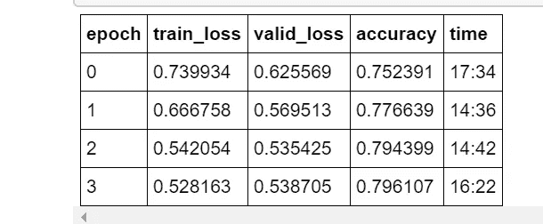

最后，我们将解冻整个模型并可视化学习率，以选择并用于最终训练。

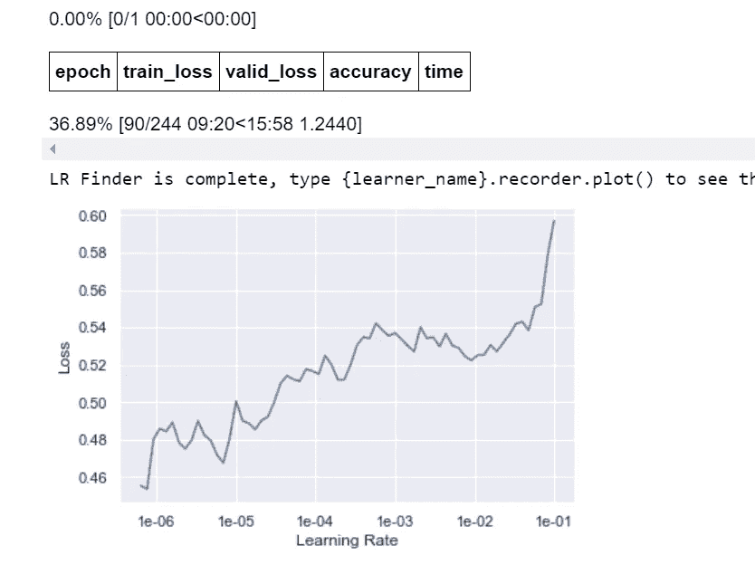

我们看到，在这个模型结束时，我们已经达到了 80%的最高准确率。

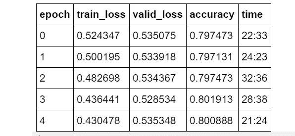

对于我们的最终结果，我们将取模型预测的平均值。由于样本是按文本长度排序进行批处理的，因此我们传递参数 ordered=True 来按照文本的顺序获得预测。

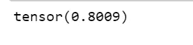

我们得到了 80.09%的准确率

现在是时候用新的文本输入来测试我们的模型了&看看它的表现如何！

databunch 已将文本标签转换为数字标签。它们如下:

*   0 = >负数
*   1 = >空档
*   2 = >正

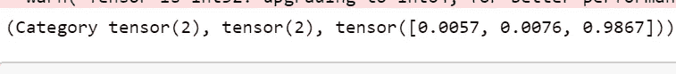

我们看到我们的模型表现得相当好！！

您可以使用负面以及混合情感文本来测试模型，并验证结果。

希望这篇文章对你有所帮助，:D

此外，欢迎任何建议/更正。

编码快乐！！