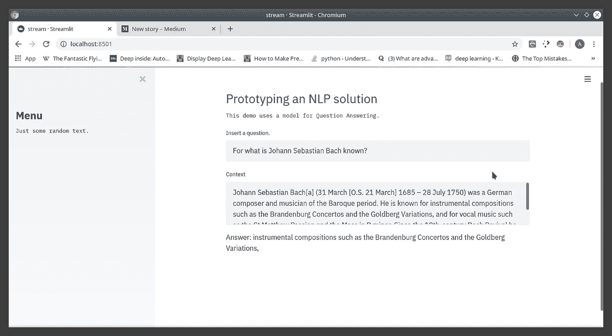

# NLP 数据应用:Streamlit 和 HuggingFace 附带的电池

> 原文：<https://towardsdatascience.com/nlp-data-apps-batteries-included-with-streamlit-and-huggingface-828083a89bb2?source=collection_archive---------26----------------------->

## 了解数据科学前端的运行速度有多快！

在构建数据科学项目时，需要完成的最后一项任务(但不是最重要的)是前端的**实现，它使模型对最终用户可用，并从用户界面下的所有机器中抽象出来。**

这样做的常见方法有:

1.  **用 Angular/React 或你选择的其他框架构建用户界面**
2.  **依托 Tableau、Power Bi、Qlik 等仪表盘工具…**

如果你真的不喜欢摆弄 JS 框架(像我一样)，或者希望能够构建一个真正的端到端管道，那么你必须至少使用一次 Streamlit。

正如网站所说，Streamlit 是构建数据应用的最快方式。虽然这听起来有些傲慢，但这绝对是事实。

为了展示弄脏手有多快，我用 Streamlit 和 HuggingFace 的变形金刚建立了一个原型，使用了一个预先训练好的问答模型。

# 先决条件:安装变压器和简化

是的，我说“包括电池”，但你必须先买！

打开终端(或 Anaconda 提示符，取决于您的选择)并运行:

```
pip install transformers
pip install streamlit
```

# 代码和结果

安装完成后，获取您的编辑器并首先导入必要的包:

```
import streamlit as st
from transformers import AutoTokenizer,AutoModelForQuestionAnswering
from transformers.pipelines import pipeline
```

这允许你使用预先训练的拥抱脸模型，因为我不想从头开始训练。然后，您可以构建一个函数来加载模型；注意，我使用了 **@st.cache()** decorator 来避免每次都重新加载模型(至少它应该有助于减少一些开销，但是我必须更深入地研究 Streamlit 漂亮的文档):

```
st.cache(show_spinner=False)
def load_model():
    tokenizer = AutoTokenizer.from_pretrained("twmkn9/distilbert-  base-uncased-squad2")
    model = AutoModelForQuestionAnswering.from_pretrained("twmkn9/distilbert-base-uncased-squad2")
    nlp_pipe = pipeline('question-answering',model=model,tokenizer=tokenizer) return nlp_pipenpl_pipe = load_model()
```

添加一个标题和一些文本来填补空白，并添加一个侧边栏:

```
t.header("Prototyping an NLP solution")
st.text("This demo uses a model for Question Answering.")add_text_sidebar = st.sidebar.title("Menu")
add_text_sidebar = st.sidebar.text("Just some random text.")
```

考虑到我选择了一个问题回答模型，我必须提供一个用于写问题的文本单元格和一个用于复制文本的文本区域，作为查找答案的上下文。这可以通过两行来完成:

```
question = st.text_input(label='Insert a question.')
text = st.text_area(label="Context")
```

现在你可以调用模型来回答宇宙中最深最难的问题。为了避免第一次加载应用程序时出现错误，我将推理代码包装在一个 if 语句中(必须承认，这完全是糟糕的代码):

```
if (not len(text)==0) and (not len(question)==0):
    x_dict = npl_pipe(context=text,question=question)
    st.text('Answer: ',x_dict['answer'])
```

这将输出您在提供的文本中提出的问题的答案。
完整代码在此:

```
import streamlit as stfrom transformers import AutoTokenizer, AutoModelForQuestionAnswering
from transformers.pipelines import pipelinest.cache(show_spinner=False)
def load_model():
    tokenizer = AutoTokenizer.from_pretrained("twmkn9/distilbert-base-uncased-squad2") model = AutoModelForQuestionAnswering.from_pretrained("twmkn9/distilbert-base-uncased-squad2") nlp_pipe = pipeline('question-answering',model=model,tokenizer=tokenizer) return nlp_pipenpl_pipe = load_model()st.header("Prototyping an NLP solution")
st.text("This demo uses a model for Question Answering.")add_text_sidebar = st.sidebar.title("Menu")
add_text_sidebar = st.sidebar.text("Just some random text.")question = st.text_input(label='Insert a question.')
text = st.text_area(label="Context")if (not len(text)==0) and not (len(question)==0):
    x_dict = npl_pipe(context=text,question=question
    st.text('Answer: ',x_dict['answer'])
```

要运行该脚本，只需键入:**streamlit run script _ _ name . py**，它将默认在 **localhost:8501，**上运行，因此在浏览器中打开它。
这里是输出的截图:



代码的输出。

当然，这并不意味着为 Streamlit 的每个特性提供详尽的指南，而只是一种让其他人像我一样通过实验来了解这个伟大工具的方式。

谢谢，下次再见！