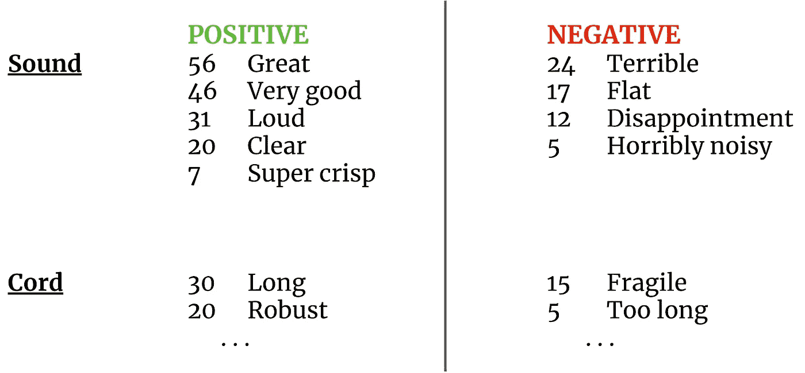
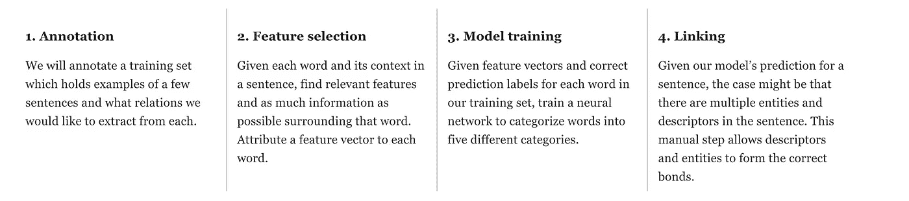
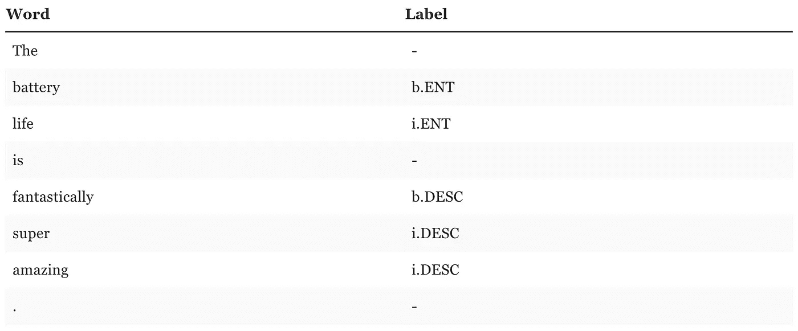
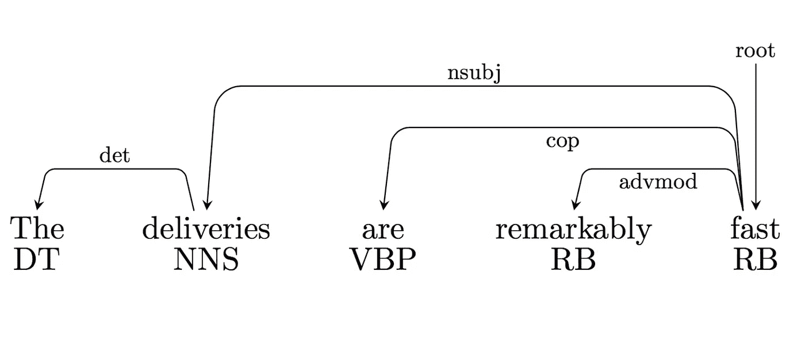
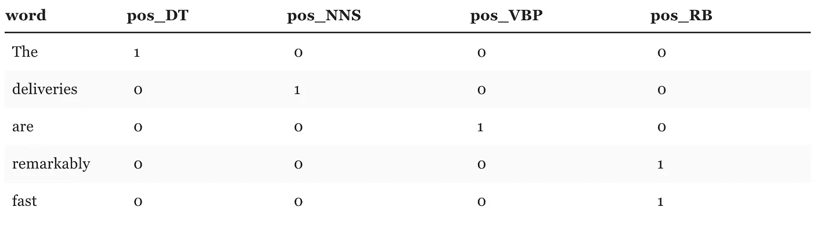
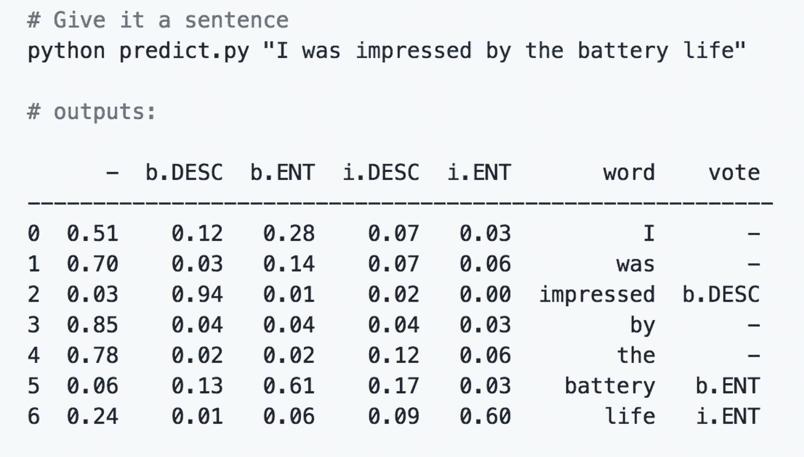
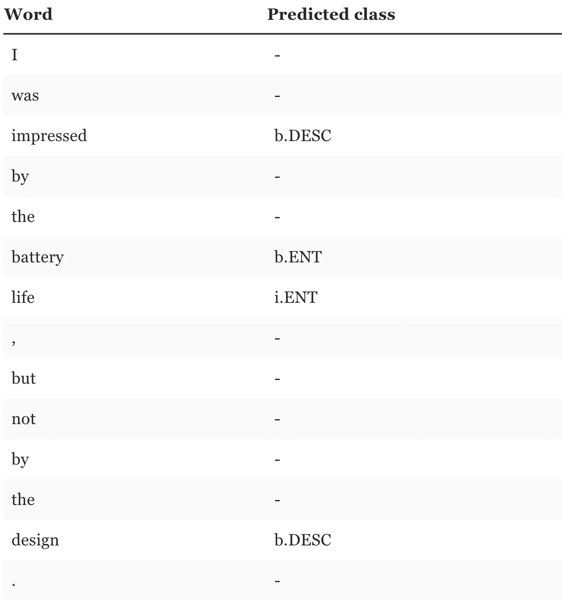
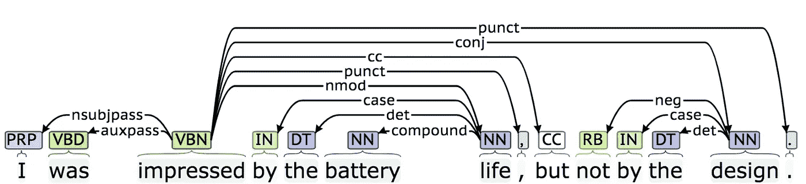

# NLP:使用关系抽取理解评论数据

> 原文：<https://towardsdatascience.com/nlp-deep-learning-for-relation-extraction-9c5d13110afa?source=collection_archive---------10----------------------->

## 注释、依存解析树和链接指南

在这篇文章中，我们将关注文本挖掘和评论分析。我们将推出自己的关系提取深度学习实现。假设你有一大堆关于你的公司或产品的评论，你想快速浏览一下关于你的公司或产品的某些部分或特征的描述符或形容词。最终目标大概是这样的:

*假设耳机评论的汇总结果*

对成千上万的评论进行这样的操作，并将其汇总在一起，可以构建一个非常强大的摘要工具，用于快速、全面地了解关于特定公司或产品的评论。此外，我们可以放大我们特别感兴趣的领域，如交付时间或服务质量。既然已经有这么多好的情感分析工具，我们的重点将放在实现关系抽取上。这里有一些例子，我们想提取，鉴于审查句子。

> *“X 有最便宜的价格和超级快速的交货”*

**价格**——最便宜

**交货** —超快

> *“我对电池寿命印象深刻”*

**电池寿命**:令人印象深刻

我们将使用一些与信息抽取相关的 NLP 技术来解决这个问题。大致来说，我们将给出几个例子，说明我们希望它如何与我们句子中每个单词的相关数据一起工作，并让神经网络找出其中可能隐藏的模式。我想强调的事实是，我们不会将实际的单词本身作为一个特性，否则这是一种非常常见的方法。这意味着该模型将更好地概括在其训练集中没有见过的单词。

下面列出了我们将采取的实施步骤。

**1。注释**

机器学习的强大之处在于，当你不确定如何用算法解决一个问题时，只要你提供一些你希望它如何工作的例子，以及你的数据中的相关内容，你就可以得到一个非常接近的估计。

我们将为我们的模型创建一些例子。我们将使用**分块**策略来表示实体或描述符组。例如，如果**电池寿命**是**超级惊人，**我们会希望确保所有这些词作为一组出现在那里。我们将使用一个版本的 [BIO](https://en.wikipedia.org/wiki/Inside%E2%80%93outside%E2%80%93beginning_(tagging)) (开始、内部、外部)标签标准来标记单词组的开始和结束时间:

使用 BIO 的注释示例

我们希望包含尽可能多的例子，在你自己写了几个之后，你会意识到这可能不是你在生活中要做的事情。考虑把这个外包给[机甲土耳其人](https://www.mturk.com/)。

这一步是手动的，但是不要被它琐碎的外表所迷惑。非常重要的是，使用持久的方法一丝不苟地进行标记。如果您在整个训练集中没有遵循相同的方法，您将在训练过程中混淆您的模型。

**2。功能选择**

现在我们已经有了一些标记数据，我们需要的只是模型的特性。特征是关于您的一个训练示例的单个可测量的属性。您的每个培训示例都有多个特征。在我们的例子中，特征是关于每个单词的信息，它们如何与其他单词相关，以及它们有什么属性。有不少从文本中提取特征的库和服务，比如 [SpaCy](https://spacy.io/) 、 [TextRazor](https://www.textrazor.com/) 和 [NLTK](https://www.nltk.org/) 。我们将使用斯坦福 CoreNLP，因为它拥有世界上最好的依赖解析器之一。

**依存解析树**

我们可以使用依存解析树来提取句子的句法结构。这将很有帮助，因为它为我们提供了关于单词的[词性](https://en.wikipedia.org/wiki/Part_of_speech) (POS)标签的信息。词性标签是一个词类，它描述了这个词的语法性质，一些例子是名词、动词和形容词。依存解析树还为我们提供了单词在结构上如何与其他单词相关的信息。这表现为句子中单词的进出链接。斯坦福 CoreNLP 使用[通用依赖关系](http://universaldependencies.org/en/dep/index.html)标准来表示依赖关系。

*一个依赖关系解析树。“显著”一词有一个传入的 advmod 链接，其定义为:“一个词的状语是一个(非从句)副词(rb)或状语短语(ADVP)，用于修饰该词的意思。”*

依存解析树在内部是一个使用经过训练的模型的预测过程，即使准确度很高，我们也有可能得到不正确的解析树，这取决于句子。我们将基于该树创建一些特征。每个单词将具有以下特征:

*   词类(POS)-单词的标签
*   前面两个和后面两个词的词性标记。
*   一个布尔指示器(0 或 1 ),用于每个输出链接类型，例如‘out _ adv mod’= 1
*   一个布尔指示符(0 或 1 ),用于每一个输入链接类型，例如‘in _ nsubj’= 1

*交货*将具有如下特征向量:

句子“deliveries 非常快”中单词“deliveries”的特征向量

**3。模特培训**

为了将我们的特征向量作为神经网络的输入，我们需要将当前的特征向量转换成浮点值。注意，我们当前的特征向量包括字符串类型的值。如何将字符串转换成浮点数？*你没有。*

我们将为此使用一种标准方法:*一种热编码。*对于每个可能的位置标签，我们将创建一个新的二元特征。然后，我们将通过在代表该标签的子特性中放置 1 来标记当前特性的值。像这样:

为什么叫一热编码？因为其中一个特征是热的，并且标记为 1。你可以把这个步骤想象成把一个单词放入一个分类箱，这个分类箱的名字就是单词本身，而不是把它放入任何其他分类箱。

这种方法通常在您使用实际单词作为特征时使用，但是会将特征的维度提高到几千个维度(这通常是好的，因为矩阵是稀疏的)。在我们的例子中，我们没有将实际的单词作为一个特性，但是我们仍然必须这样做，因为 POS 标签是字符串。

观察力敏锐的读者可能已经注意到，我们已经为 in 和 out-links 特性做了一个稍微类似但不同的版本。因为我们将我们的特性定义为二进制，并将其命名为‘in _ nsubj’等，所以我们基本上为我们的链接特性创建了一个类似的编码。我们会将 1 分别放入所有有输入或输出链接的容器中。这里唯一的区别是，一个单词可能有多个 in 链接和多个 out 链接，因此要分开。

给定我们的 27 个训练句子，我们总共有 253 个使用过的特征(编码后)，导致大小为 253 的输入层。我们将使用几个不同大小的隐藏层和一个大小为 5 的输出层，每个类别一个。

训练模型非常简单，只需将所有训练示例的特征向量和正确标签输入到我们定义的神经网络模型中。然后，我们可以交叉验证(或使用单独的测试集)来衡量我们模型的性能(我的示例代码包含 27 个训练句子，准确率约为 81%)。

由于我们已经用分类输出训练了这个模型(我们的最后一层有 5 个输出)，所以我们可以在预测期间获得分配给给定单词的每个输出的概率:

**4。链接**

这是一个后预测步骤，其中我们将实体和描述符链接在一起。在模型做出预测后，我们将再次查看依赖关系解析树，并遵循以下简单的启发式规则:

如果实体组中的任何单词与描述符组中的任何单词之间存在链接，我们就说它们是相连的。如果描述符多于实体，我们允许多个描述符链接到同一个实体，反之亦然。

我们还将寻找否定，并将单词转换成它们的词条形式(例如，impressed → impressive)。例如，想象这样一句话:

> “我对电池寿命印象深刻，但不是设计。”

我们的分类器产生了正确的分类:

遵循所有原始相关性分析树链接(针对预测组):

印象深刻→[**nmod**→生活

设计→

**设计→ **【否定】** →不**

**要产生结果:**

****电池寿命:**令人印象深刻**

**设计:没什么印象**

**一切就绪后。对许多句子运行这个，然后汇总结果，这就是有用的地方。可以容易地对描述符执行情感分析。想象一下，你的一个产品有几百或几千条评论(看看你的亚马逊..)，你会有一个该产品的优点和缺点的总结，就像介绍图片建议的那样:**

****

**在 [Github](https://github.com/OskarHandmark/nlp-deep-learning) 上有一些不完整的源代码。**