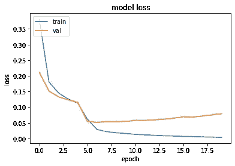
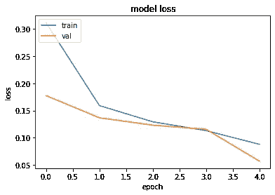

# NLP:用 TensorFlow 检测垃圾邮件(第一部分)

> 原文：<https://towardsdatascience.com/nlp-detecting-spam-messages-with-tensorflow-b12195b8cf0e?source=collection_archive---------9----------------------->

## 训练递归神经网络进行文本分类


来源:来自 [Pixabay](https://pixabay.com/photos/cell-phone-phone-cell-mobile-690192/) 的[免费照片](https://pixabay.com/users/free-photos-242387/)

下面是一个如何使用递归神经网络来检测垃圾邮件的示例。本例中使用的数据集来自 [Kaggle](https://www.kaggle.com/team-ai/spam-text-message-classification) (原作者 [Almeida 和 Hidalgo，2011](http://www.dt.fee.unicamp.br/~tiago/smsspamcollection/) )。

在训练集中，某些邮件被标记为“垃圾邮件”(为此已用 1 替换)。非垃圾邮件被标记为“ham”(为此用 0 替换)。

递归神经网络是使用 TensorFlow 作者的原始单词嵌入和情感笔记本构建的——原始笔记本可在[此处](https://colab.research.google.com/github/tensorflow/examples/blob/master/courses/udacity_intro_to_tensorflow_for_deep_learning/l09c04_nlp_embeddings_and_sentiment.ipynb)获得。

该分析通过以下步骤进行:

1.  数据被加载，句子被分成训练集和测试集。

```
dataset = pd.read_csv('spam.csv')
datasetsentences = dataset['Message'].tolist()
labels = dataset['Category'].tolist()# Separate out the sentences and labels into training and test sets
training_size = int(len(sentences) * 0.8)training_sentences = sentences[0:training_size]
testing_sentences = sentences[training_size:]
training_labels = labels[0:training_size]
testing_labels = labels[training_size:]# Make labels into numpy arrays for use with the network later
training_labels_final = np.array(training_labels)
testing_labels_final = np.array(testing_labels)
```

2.数据集被标记化。换句话说，每个单词都被分配了一个唯一的数字——这是神经网络解释输入所必需的。

```
vocab_size = 1000
embedding_dim = 16
max_length = 100
trunc_type='post'
padding_type='post'
oov_tok = "<OOV>"from tensorflow.keras.preprocessing.text import Tokenizer
from tensorflow.keras.preprocessing.sequence import pad_sequencestokenizer = Tokenizer(num_words = vocab_size, oov_token=oov_tok)
tokenizer.fit_on_texts(training_sentences)
word_index = tokenizer.word_index
```

3.然后将这些记号分类成序列，以确保每个单词的记号遵循每个句子所规定的正确顺序。

```
sequences = tokenizer.texts_to_sequences(training_sentences)
```

4.然后引入填充——在每句话尾引入 0。当一个句子比另一个句子长时，这是必要的，因为出于 RNN 分析的目的，每个句子必须具有相同的长度。

```
padded = pad_sequences(sequences,maxlen=max_length, padding=padding_type, 
                       truncating=trunc_type)testing_sequences = tokenizer.texts_to_sequences(testing_sentences)
testing_padded = pad_sequences(testing_sequences,maxlen=max_length, 
                               padding=padding_type, truncating=trunc_type)
```

5.递归神经网络在 20 个时期内建立和训练——输入层由一个**嵌入层**组成，该层用[密集向量表示法](https://machinelearningmastery.com/use-word-embedding-layers-deep-learning-keras/)表示句子。

# 递归神经网络(RNN)

以下是递归神经网络配置:

```
model = tf.keras.Sequential([
    tf.keras.layers.Embedding(vocab_size, embedding_dim, input_length=max_length),
    tf.keras.layers.Flatten(),
    tf.keras.layers.Dense(6, activation='relu'),
    tf.keras.layers.Dense(1, activation='sigmoid')
])
model.compile(loss='binary_crossentropy',optimizer='adam',metrics=['accuracy'])
model.summary()
```

下面是对模型参数的详细介绍:

```
Model: "sequential"
_________________________________________________________________
Layer (type)                 Output Shape              Param #   
=================================================================
embedding (Embedding)        (None, 100, 16)           16000     
_________________________________________________________________
flatten (Flatten)            (None, 1600)              0         
_________________________________________________________________
dense (Dense)                (None, 6)                 9606      
_________________________________________________________________
dense_1 (Dense)              (None, 1)                 7         
=================================================================
Total params: 25,613
Trainable params: 25,613
Non-trainable params: 0
```

该模型产生以下训练和验证损失:

```
num_epochs = 20
history=model.fit(padded, training_labels_final, epochs=num_epochs, validation_data=(testing_padded, testing_labels_final))
```



来源:Jupyter 笔记本输出

在这种情况下，我们看到验证损失在 5 个时期后达到最低点。在这点上，选择 5 个时期再次运行模型。



来源:Jupyter 笔记本输出

# 对看不见的数据进行测试

现在模型已经建立，让我们看看分类器如何识别以下邮件中的垃圾邮件(我随机发明的):

*   格雷格，你听到留言后能给我回个电话吗？(意图为正版)
*   恭喜你有了新的 iPhone！点击此处领取您的奖品……'(意为垃圾邮件)
*   真的很喜欢你的新照片(有意为之)
*   你今天听到新闻了吗？‘发生了什么可怕的事情……’(本意是真诚的)
*   立即参加免费的 COVID 网络研讨会:立即预订您的会议…’(意为垃圾邮件)

以下是生成的分数(分数越接近 1，该句子是垃圾邮件的概率越高:

```
['Greg, can you call me back once you get this?', 'Congrats on your new iPhone! Click here to claim your prize...', 'Really like that new photo of you', 'Did you hear the news today? Terrible what has happened...', 'Attend this free COVID webinar today: Book your session now...']
Greg, can you call me back once you get this?
[0.0735679]

Congrats on your new iPhone! Click here to claim your prize...
[0.91035014]

Really like that new photo of you
[0.01672107]

Did you hear the news today? Terrible what has happened...
[0.02904579]

Attend this free COVID webinar today: Book your session now...
[0.54472804]
```

我们看到，对于两个旨在作为垃圾邮件的消息，分类器显示两者都有很大的可能性。在句子的情况下，**“今天参加这个免费的 COVID 网络研讨会:现在就预订您的会议……”**-分类器在标记高于 50%的垃圾邮件概率方面表现相当好-即使在构建训练集时 COVID 不是一个术语。

在这方面，很明显，分类器依赖于使用单词的上下文，而不是简单地将单个单词标记为垃圾邮件。

鉴于递归神经网络在模拟序列数据和识别单词之间的模式方面是有效的，这个使用 TensorFlow 构建的简单垃圾邮件检测器已经被证明在我们用于测试目的的有限数据上是非常有效的。

# 结论

在本例中，我们看到:

*   递归神经网络如何用于文本分类
*   使用标记化、序列和填充为分析准备文本数据
*   用于分析文本数据的神经网络模型的配置

此外，我们还看到了如何使用该模型来预测看不见的数据(或本例中的消息),以确定该模型在真实场景中的潜在工作方式。

非常感谢阅读，这个例子的相关 GitHub 库可以在[这里](https://github.com/MGCodesandStats/tensorflow-nlp)找到。

**更新:**您还可以在本文的第二部分中找到对这个模型的更新，[可以在这里找到](https://medium.com/@mgcodesandstats/nlp-detecting-spam-messages-with-tensorflow-part-ii-77826c8f1abf)。

*免责声明:本文是在“原样”的基础上编写的，没有任何担保。本文旨在提供数据科学概念的概述，不应被解释为任何形式的专业建议。作者与本文中提到的任何一方都没有关系，本文或其调查结果也没有得到同样的认可。*