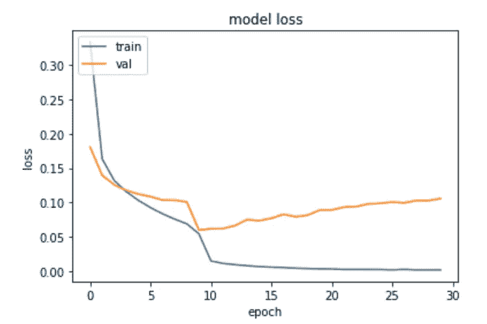
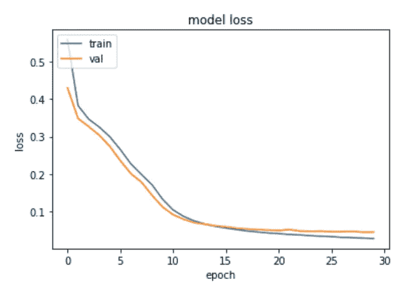
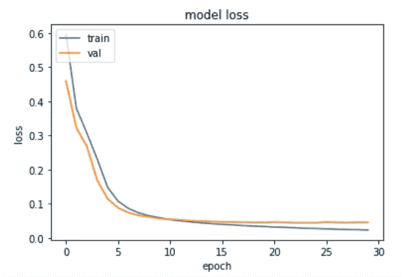

# NLP:用 TensorFlow 检测垃圾邮件(第二部分)

> 原文：<https://towardsdatascience.com/nlp-detecting-spam-messages-with-tensorflow-part-ii-77826c8f1abf?source=collection_archive---------65----------------------->

## 构建垃圾邮件检测模型时防止过度拟合


来源:图片来自 [Pixabay](https://pixabay.com/photos/iphone-smartphone-apps-apple-inc-410324/)

在我的[上一篇文章](/nlp-detecting-spam-messages-with-tensorflow-b12195b8cf0e)中，TensorFlow 中的递归神经网络被用来检测垃圾短信。

这是通过以下方式实现的:首先通过标记化、文本排序和填充等方法以正确的方式操纵文本数据，然后最终训练模型来检测消息是垃圾邮件= 1 还是不是垃圾邮件= 0。

如果您不熟悉 NLP，我建议您先阅读我以前的文章——因为这篇文章的细节会更有意义:)

# 原始分析

示例中使用的数据集来自 [Kaggle](https://www.kaggle.com/team-ai/spam-text-message-classification) (原始作者 [Almeida 和 Hidalgo，2011](http://www.dt.fee.unicamp.br/~tiago/smsspamcollection/) )。

此外，递归神经网络是使用 TensorFlow 作者的原始单词嵌入和情感笔记本构建的——原始笔记本可在此处[获得](https://colab.research.google.com/github/tensorflow/examples/blob/master/courses/udacity_intro_to_tensorflow_for_deep_learning/l09c04_nlp_embeddings_and_sentiment.ipynb)。

尽管之前的模型被证明可以有效地为垃圾邮件分配更高的概率，但是仍然有改进的空间。

作为参考，使用以下神经网络配置:

```
Model: "sequential"
_________________________________________________________________
Layer (type)                 Output Shape              Param #   
=================================================================
embedding (Embedding)        (None, 100, 16)           16000     
_________________________________________________________________
flatten (Flatten)            (None, 1600)              0         
_________________________________________________________________
dense (Dense)                (None, 6)                 9606      
_________________________________________________________________
dense_1 (Dense)              (None, 1)                 7         
=================================================================
Total params: 25,613
Trainable params: 25,613
Non-trainable params: 0
```

此外，使用了最大长度为 100 的 1000 个词汇:

```
vocab_size = 1000
embedding_dim = 16
max_length = 100
trunc_type='post'
padding_type='post'
oov_tok = "<OOV>"
```

然而，当训练网络超过 30 个时期时，我们可以看到，随着验证损失在某个点之后开始增加，网络出现过拟合的迹象，而训练损失继续减少。



来源:Jupyter 笔记本输出

这表明该模型在训练数据的基础上过于一般化，因此该模型在预测现有消息方面表现良好，但在预测新消息方面表现不佳。

例如，我们可以看到，虽然该模型在为句子“恭喜您的新 iPhone！单击此处领取您的奖品……”，该模型只产生了以下可能是垃圾邮件的消息的 **37%** 概率:“立即参加免费的 COVID 网络研讨会:立即预订您的会议……”。

```
['Greg, can you call me back once you get this?', 'Congrats on your new iPhone! Click here to claim your prize...', 'Really like that new photo of you', 'Did you hear the news today? Terrible what has happened...', 'Attend this free COVID webinar today: Book your session now...']
Greg, can you call me back once you get this?
[9.670509e-06]

Congrats on your new iPhone! Click here to claim your prize...
[0.91056645]

Really like that new photo of you
[3.0444193e-05]

Did you hear the news today? Terrible what has happened...
[0.00360294]

Attend this free COVID webinar today: Book your session now...
[0.37343866]
```

在这方面，模型参数将被稍微调整，以查看模型的拟合度是否可以提高，即**和**训练和验证损失都在减少的情况。

# 扁平化与全球平均池

在最后一个例子中，你会注意到使用了一个[展平](https://stackoverflow.com/questions/49295311/what-is-the-difference-between-flatten-and-globalaveragepooling2d-in-keras)层。这样做的目的是为了将多维张量简化为一维张量，以便进行分析。

然而，全局平均池可以通过对数据进行平均来更好地表示向量，而[扁平化](https://github.com/keras-team/keras/issues/8470)可能会导致过度拟合的风险，这取决于数据量。

对此，我们再来训练一下模型。这一次，使用了一个 **GlobalAveragePooling1D()** 层来代替 Flatten。

```
Model: "sequential"
_________________________________________________________________
Layer (type)                 Output Shape              Param #   
=================================================================
embedding (Embedding)        (None, 100, 16)           16000     
_________________________________________________________________
global_average_pooling1d (Gl (None, 16)                0         
_________________________________________________________________
dense (Dense)                (None, 6)                 102       
_________________________________________________________________
dense_1 (Dense)              (None, 1)                 7         
=================================================================
Total params: 16,109
Trainable params: 16,109
Non-trainable params: 0
```



来源:Jupyter 笔记本输出

在训练时，我们可以看到训练和验证损失都显著下降，这表明模型没有过度拟合。

以下是尝试检测大量句子中的垃圾邮件的概率:

```
['Greg, can you call me back once you get this?', 'Congrats on your new iPhone! Click here to claim your prize...', 'Really like that new photo of you', 'Did you hear the news today? Terrible what has happened...', 'Attend this free COVID webinar today: Book your session now...']
Greg, can you call me back once you get this?
[0.02485983]

Congrats on your new iPhone! Click here to claim your prize...
[0.9198217]

Really like that new photo of you
[0.00754593]

Did you hear the news today? Terrible what has happened...
[0.00529179]

Attend this free COVID webinar today: Book your session now...
[0.42277685]
```

对于最后一句话，概率增加到 42%。然而，不清楚(甚至肉眼也不清楚)免费的 COVID 网络研讨会上的句子是否会被视为垃圾邮件。这将取决于其他因素，例如文本消息是否被请求、发送者的号码以及其他因素。在这方面，分配的概率似乎是合理的。

也就是说，在训练模型时，假设验证损失较低，我们可以更有信心认为每条短信的指示概率是可信的。

如上所述，使用了最大长度为 100 的 1000 个词汇。用 30 个时期训练，在时期 30 的验证损失为 0.0642，验证准确度为 0.9848。假设验证精度已经相当高，那么如果这些参数减少，模型还会产生准确的结果吗？

为了测试这一点，让我们将词汇量设置为 600，最大长度为 60。



来源:Jupyter 笔记本输出

在这种情况下，验证准确度为 0.9865，验证损失为 0.0455。在这种情况下，模型实际上表现得稍好一些，这表明模型中的词汇大小可以在不影响性能的情况下减少。

下面是我们在上面看到的一系列假设消息的更新概率:

```
['Greg, can you call me back once you get this?', 'Congrats on your new iPhone! Click here to claim your prize...', 'Really like that new photo of you', 'Did you hear the news today? Terrible what has happened...', 'Attend this free COVID webinar today: Book your session now...']
Greg, can you call me back once you get this?
[0.01641327]

Congrats on your new iPhone! Click here to claim your prize...
[0.9475718]

Really like that new photo of you
[0.00675001]

Did you hear the news today? Terrible what has happened...
[0.00826639]

Attend this free COVID webinar today: Book your session now...
[0.3014569]
```

# 结论

这个例子是上一个教程使用递归神经网络检测垃圾短信的后续。

具体来说，我们看到了扁平化和全局平均池在训练模型时的不同之处——在较小的训练集上使用扁平化有过度拟合的风险，这里似乎就是这种情况。此外，我们还看到了正确的模型配置如何在较小的词汇表中产生出色的结果。

TensorFlow 作者(版权 2020)在[这里](https://colab.research.google.com/github/tensorflow/examples/blob/master/courses/udacity_intro_to_tensorflow_for_deep_learning/l09c05_nlp_tweaking_the_model.ipynb)提供了这个例子的原始模板。此外，我推荐 Udacity 提供的深度学习 TensorFlow 的[简介](https://www.udacity.com/course/intro-to-tensorflow-for-deep-learning--ud187)课程，以便更深入地理解这个主题。

上面例子的 GitHub 库可以在[这里](https://github.com/MGCodesandStats/tensorflow-nlp)找到。

*免责声明:本文是在“原样”的基础上编写的，没有任何担保。本文旨在提供数据科学概念的概述，不应被解释为任何形式的专业建议。作者与本文中提到的任何一方都没有关系，本文或其调查结果也没有得到同样的认可。*