# python 中常见术语的 NLP 简易解释

> 原文：<https://towardsdatascience.com/nlp-easy-explanation-of-common-terms-with-python-dc7c323a4691?source=collection_archive---------49----------------------->

***自然语言处理*** ( ***NLP*** )是数据科学处理语言学的领域，人工智能涉及计算机系统与人类*语言的交互，以解释和分析系统中的自然语言，这是数据科学中一个不断扩展的领域，其中各种技术被应用于分析大量的*自然语言数据。**

**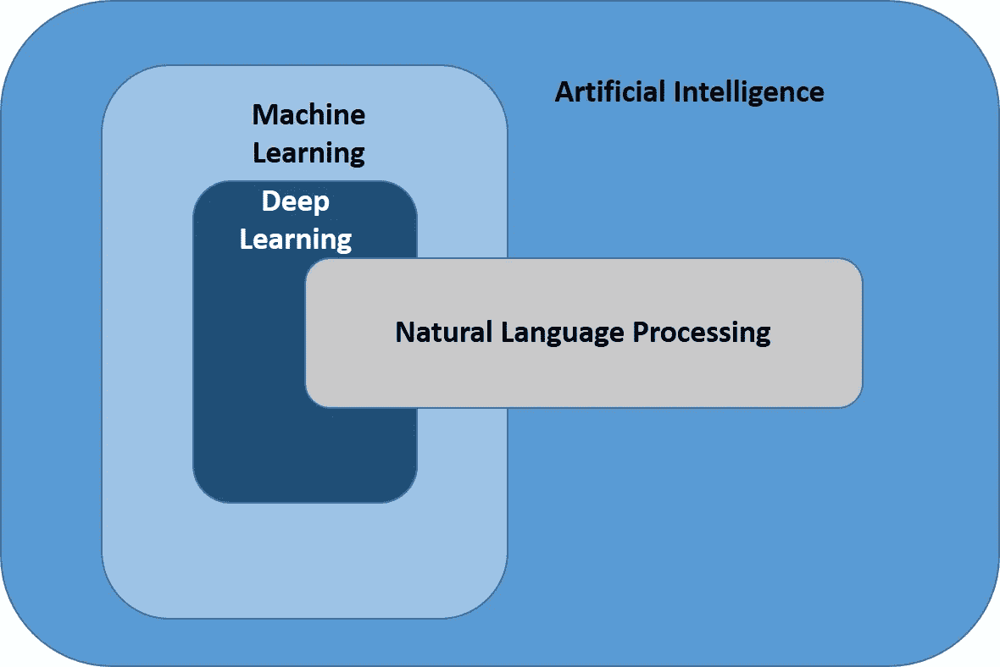**

**NLP[作者图片]**

**用于这项工作的最流行的库是 nltk，它可以通过下面的代码行导入。**

```
**import nltk**
```

****下面给出了我们在讨论 NLP 模型时使用的几个常用术语及其含义和实现。****

1.  ****标记化:**将文本分解成更小的部分称为标记化。它可以把段落分成句子，把句子分成单词。**

```
**# Tokenizing sentences
sentences = nltk.sent_tokenize(paragraph)

# Tokenizing words
word = nltk.word_tokenize(paragraph)**
```

**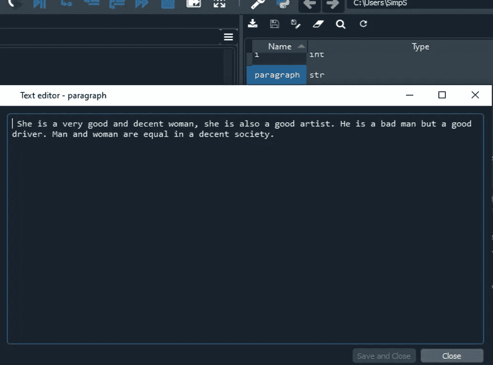**

**段落[图片由作者提供]**

**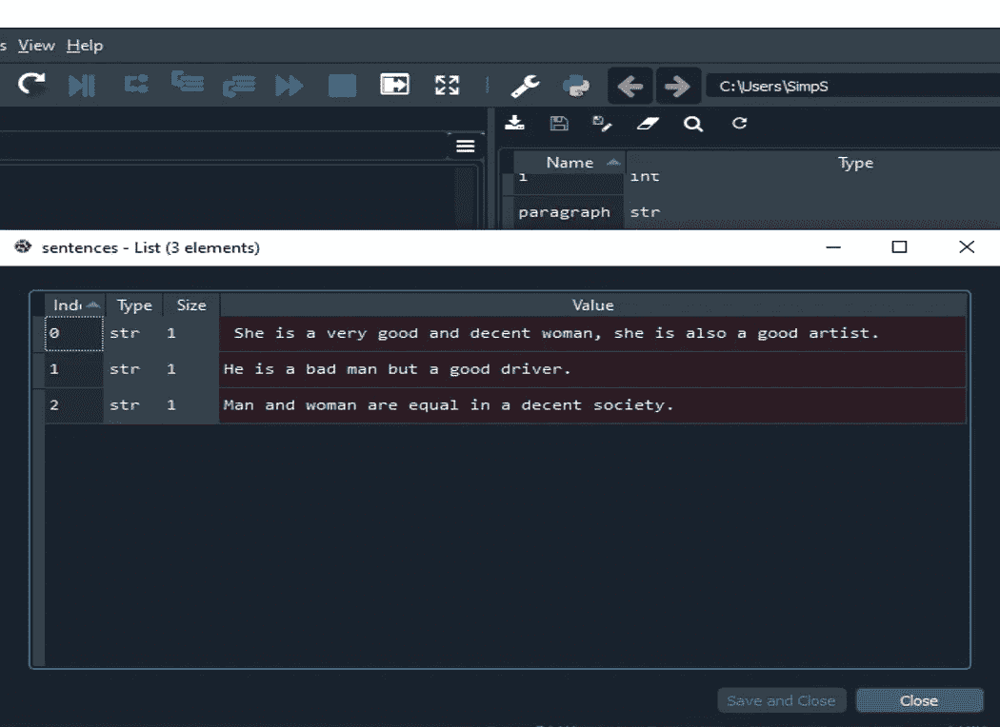**

**段落被分割成句子[图片由作者提供]**

**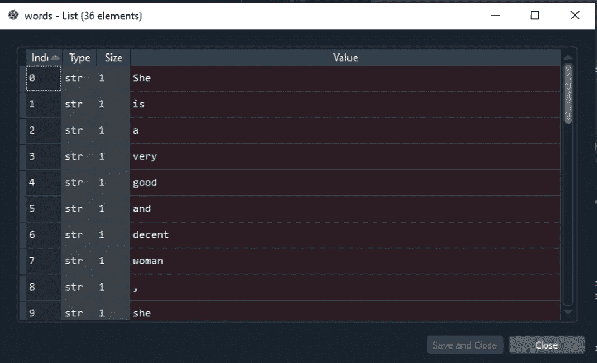**

**段落被拆分成单词[图片由作者提供]**

****2)**词干化:将许多相似的词化简为一个词干或基词，称为词干化。**

**英语中最流行的词干分析器叫做波特斯特梅尔，它是 nltk 的一个库。**

**斯特梅尔函数的例子如下:**

****

**词干[作者图片]**

*****优点:*** 这是快速算法，可以用在需要速度的模型中。**

*****缺点:*** 没有考虑到 stem 函数的意义，只是把它简化为 stem。**

**在 python 中，它是这样完成的:**

```
**#import
from nltk.stem.porter import PorterStemmer
ps = PorterStemmer()
review = [ps.stem(word) for word in review if not word in set(stopwords.words('english'))]**
```

*****示例如下:*****

****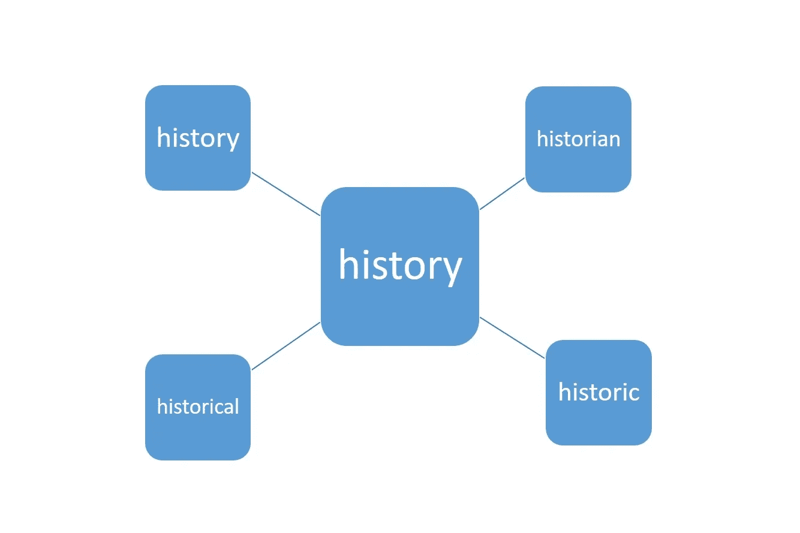****

****词汇化[图片由作者提供]****

*******优点:*** 它主要用于聊天机器人，因为给出有意义的回应是它的主要思想。****

*******缺点:*** 比炮泥慢，时间是主要考虑的地方就是时间。****

```
*****#import*
from nltk.stem import WordNetLemmatizer
wordnet=WordNetLemmatizer()
review = [wordnet.lemmatize(word) for word in review if not word in set(stopwords.words('english'))]****
```

*******4)*** ***停用词:*** 在语言处理中不是很重要的词，可以在对其应用任何模型之前，或者在对其进行情感处理之前去除。像 is，an，you，the 这些词可以称为停用词，可以从 nltk.corpus 导入为' nltk.corpus 导入停用词'。****

****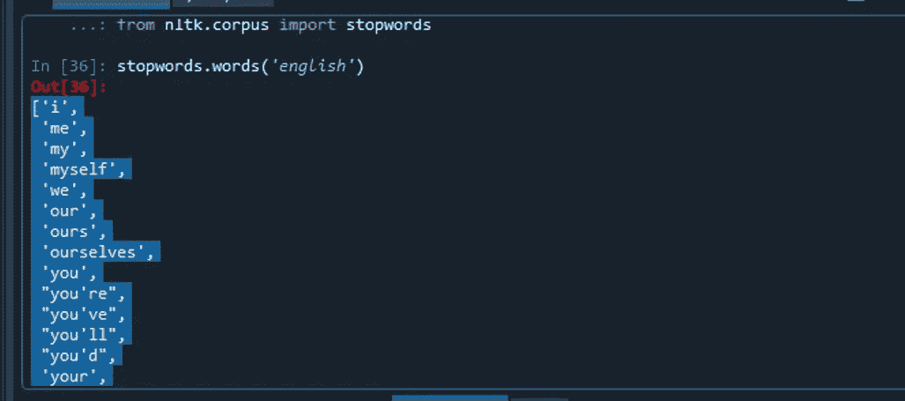****

****停用词[图片由作者提供]****

****在 Python 中:****

```
****#import
from nltk.corpus import stopwords
review = [wordnet.lemmatize(word) for word in review if not word in set(stopwords.words('english'))]****
```

******5)** **单词包**这是机器学习算法中一种表示和处理单词的方式。它代表单词的出现和频率。它是在**自然语言处理**中使用的模型，表示为其**单词**的**包** (multiset)，不考虑语法甚至**单词**的顺序，而是保持其出现的次数。****

*******优点:*******

****考虑了它的速度和频率。容易实现。****

*******缺点:*******

****它没有将数据表示成信息，也就是说，在这样做的时候，单词的含义丢失了。它假设所有的**单词**都是相互独立的。****

****仅适用于小数据。****

******例如:******

> ****她是一个非常好和体面的女人，她也是一个很好的艺术家。****
> 
> ****他是个坏人，但却是个好司机。****
> 
> ******第三句:体面社会男女平等。******

****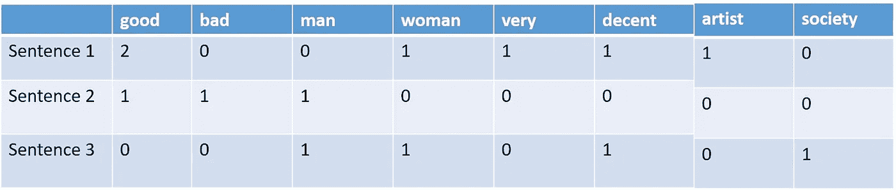****

****单词包[图片由作者提供]****

```
****# Creating the Bag of Words model
from sklearn.feature_extraction.text import CountVectorizer
cv = CountVectorizer(max_features = 1500)
X = cv.fit_transform(paragraph).toarray()****
```

******6)** TFIDF: **词频-逆文档频率，**是一个统计公式，在该公式中评估一个词在文本集合中的文本中的相关程度。它是通过两个指标的乘积获得的，即术语频率和逆文档频率。****

******词频** =一句话中的重复字数/一句话中的字数。****

******逆文档频率** =log(句子数量/包含单词的句子数量)****

******例如:******

****她是一个非常好和体面的女人，她也是一个很好的艺术家。****

******第二句:他是个坏人，但却是个好司机。******

******第三句:体面社会男女平等。******

****把停用词去掉，句子就可以变得更简洁。****

> ******第一句:很好很正派的女人好艺术家。******
> 
> ******第二句:坏人好司机。******
> 
> ******第三句:男女平等体面社会。******

****其计算方法如下:****

****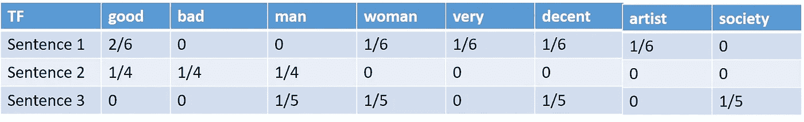****

****TF[作者图片]****

****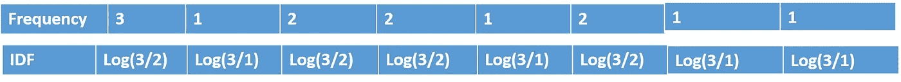****

****IDF[图片由作者提供]****

****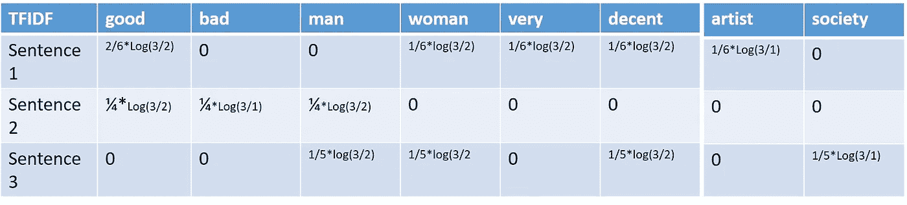****

****tfi df[作者图片]****

*******优点:*** 易于计算和实现。它可以给出一些基本的度量来提取文本中最具描述性的术语。使用它可以很容易地计算两个文本之间的相似度。搜索引擎可以使用它。****

*******缺点:*** TF-IDF 不能捕获文本中单词的语义或出现位置。****

****在 Python 中，这可以通过以下方式实现:****

```
******# Creating the TF-IDF 
from sklearn.feature_extraction.text import TfidfVectorizer
cv=TfidfVectorizer()
X=cv.fit_transform(paragraph).toarray()******
```

******7)** **Word2Vec** 是一种自然语言处理(NLP)的技术。word2vec 算法使用神经网络模型从大型文本语料库中学习单词语义及其关联。一旦经过训练，这种模型可以检测相似的单词，或者让我们知道部分句子的附加单词。顾名思义，word2vec 用称为向量的特定数字列表来表示每个不同的单词。****

****仔细选择向量，使得向量之间的简单数学余弦表示由这些向量表示的单词之间的语义相似度。****

****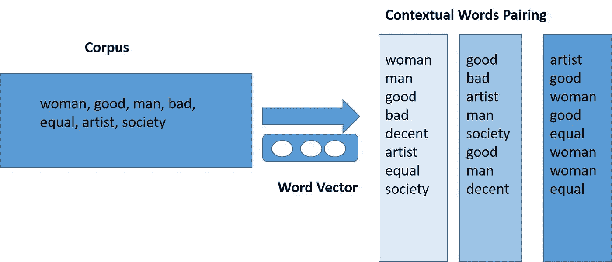****

****word 2 vec[图片由作者提供]****

*******优点:*******

****这通过将目标词映射到与其有上下文关系的词来将未标记的原始语料库转换成标记的数据，从而学习词在分类模型中的表示。****

****目标词与其上下文关系词之间的映射将次线性关系嵌入到词的向量空间中，从而可以通过词向量来推断类似于“*国王:男人*作为*王后:女人*的关系。****

****易于理解和实施。****

*******缺点:*******

****单词序列丢失，因此子线性关系没有被很好地定义。****

****数据必须在线提供给模型，并且可能需要预处理，这需要存储空间。****

****如果类别的数量太大，即语料库太大并且词汇太多，则该模型可能非常难以训练。****

****在 Python 中，它可以实现为:****

```
****from gensim.models import Word2Vec
from gensim.models import KeyedVectorssentences = nltk.sent_tokenize(paragraph)
sentences = [nltk.word_tokenize(sentence) for sentence in sentences]# Training the Word2Vec model
model=Word2Vec(sentences, min_count=1)
words=model.wv.vocab

# Most similar words
similar=model.wv.most_similar('woman')#Output[ ('driver', 0.15176300704479218),
 ('artist', 0.06272515654563904),
 ('good', 0.0425836481153965),
 ('man', -0.0059792473912239075)]****
```

******结论:******

****值得注意的是，每种技术都是在发现它的缺点之后发展起来的，比如词汇化比词干化更好，因为它可以将相似的单词转换成一些有意义的单词。TFIDF 比单词袋更好，因为它可以包含比单词袋更好的信息。Word2Vec 比 TFIDF 更好，因为它可以预测单词之间的上下文关系。****

****同样，在所有这些技术中，语义或单词顺序丢失，为此 RNN 或递归神经网络出现，其中按照单词顺序的所有重要信息保持完整，并且情感分析以惊人的方式完成。****

****希望通过阅读这篇博客，许多术语必须清楚，NLP 可能看起来更容易。****

****感谢阅读！****

*****原载于 2020 年 10 月 26 日 https://www.numpyninja.com**T21*[。](https://www.numpyninja.com/post/nlp-easy-explanation-of-common-terms-with-python)****