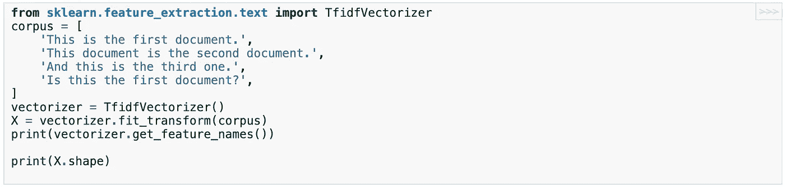
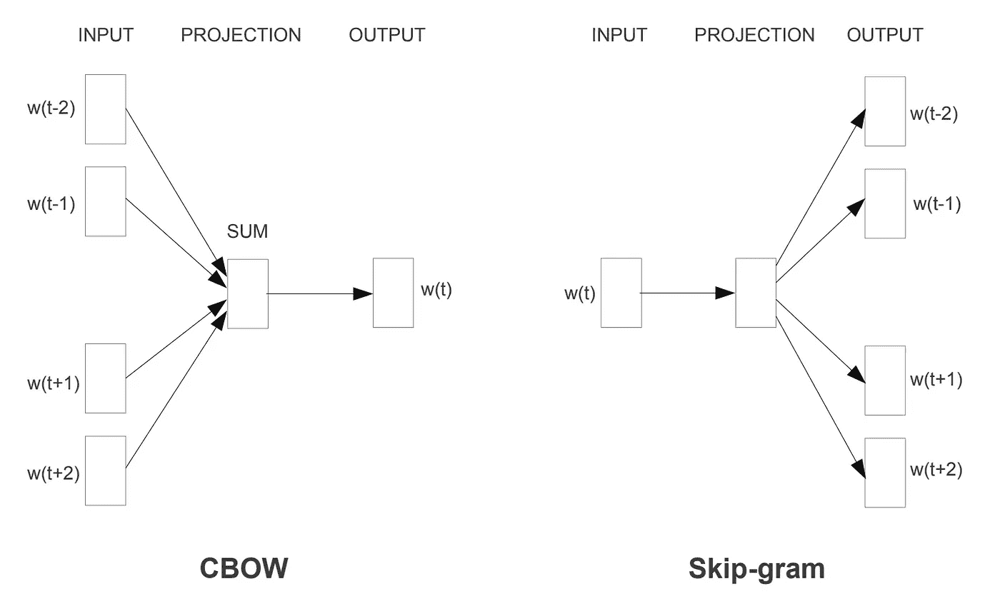
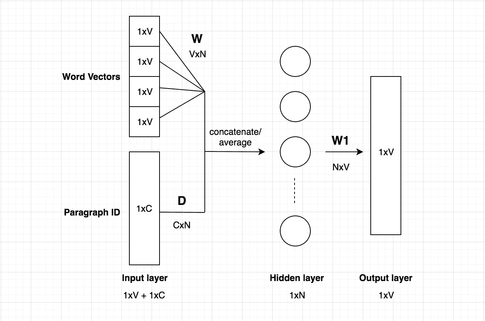
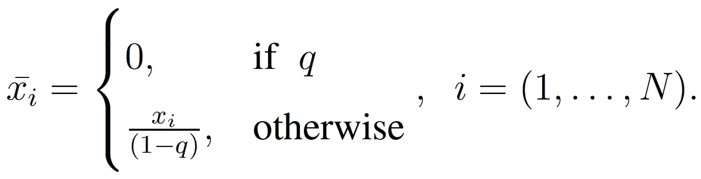
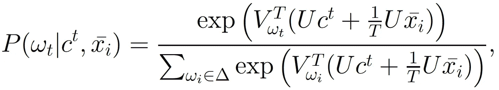
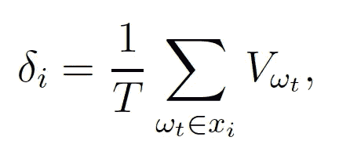

# NLP:单词嵌入技术去神秘化

> 原文：<https://towardsdatascience.com/nlp-embedding-techniques-51b7e6ec9f92?source=collection_archive---------9----------------------->

## 词袋 vs TF-IDF vs word 2 vec vs doc 2 vec vs doc 2 vec

乔纳斯·雅各布森在 [Unsplash](https://unsplash.com?utm_source=medium&utm_medium=referral) 上拍摄的照片

单词嵌入是一种单词表示技术，允许具有相似含义的单词被机器学习算法理解。从技术上讲，它是使用神经网络、概率模型或对单词共现矩阵进行降维，将单词映射到实数向量。

可以使用各种语言模型来学习单词嵌入。比如一只 **' *狗'*** 会用向量***【0.75，0.22，0.66，0.97】***来表示。如果字典中的所有单词都以这种方式编码，就有可能相互比较单词的矢量，例如通过测量矢量之间的*余弦距离或*欧几里德距离。单词的良好表示将使得有可能发现单词 **' *宠物'*** 比单词 **' *足球'*** 或**'引擎 *'*** 更接近单词 **' *狗'*** 。所以这些表象让我们希望，在嵌入的向量空间里，我们会有方程 ***国王-男人+女人=王后*** 甚至方程 ***伦敦-英格兰+意大利=罗马*** 。

单词嵌入在减轻维数灾难方面也非常有用，维数灾难是人工智能中经常出现的问题。如果没有单词嵌入，表示单词的唯一标识符会生成分散的数据，即大量稀疏表示中的孤立点。另一方面，使用单词嵌入，空间在维度方面变得更加有限，语义信息量更加丰富。有了这些数字特征，计算机更容易执行不同的数学运算，如矩阵分解、点积等。这是强制使用浅层和深层学习技术。有许多技术可供我们使用来实现这种转变。在本文中，我们将涉及:B *ag-Of-Words、TF-IDF、Word2Vec、Doc2vec 和 doc 2 vec。*

# 1.词汇袋

词袋( *a.k.a.* BOW)是一种流行的生成文档表示的基本方法。文本被表示为包含大量单词的包。语法和词序被忽略，而频率保持不变。词袋生成的特征是一个向量，其中 ***n*** 是输入文档词汇中的字数。

例如，有两个文档:

*   doc_1: ***“我喜欢意大利菜和突尼斯菜。”***
*   doc_2: ***“我喜欢这里的食物。”***

这两份文件的词汇是:

***【“我”、“爱”、“意大利”、“美食”、“和”、“突尼斯”、“这里”】***

这个词汇将产生长度为 **8** ( *即*词汇基数)的特征向量。给定这样的词汇表，这两个文档的词袋特征表示为:

*   BOW(doc _ 1):***【1，1，1，2，1，1，0，0】***
*   BOW(doc _ 2):***【1，1，0，1，0，0，1，1】***

使用这种技术，我们为数据集中的每个文档创建单词包表示。如果我们的数据集包含大量独特的单词，其中一些并不经常使用，这是通常的情况。因此，在这些词中，我们选择了 N 个最频繁出现的词，并创建了一个维度为 ***Nx1*** 的特征向量。这些特征向量然后被用于任何机器学习任务。

# 2.术语频率-逆文档频率

术语频率-逆文档频率( *a.k.a.* TF-IDF)是基于单词表示文档的另一种方式。利用 TF-IDF，通过 TF-IDF 重要性而不仅仅是频率来给单词赋予权重。TF-IDF 提供了一种统计度量，用于评估单词相对于集合或语料库中的文档的重要性。每个数据集都有许多常用词，它们在文档中多次出现，但并不提供任何重要信息。权重与该单词在文档中出现的次数成比例增加。它还根据该词在语料库中的出现频率而变化。原始公式的变体经常在搜索引擎中使用，以基于用户的搜索标准来评估文档的相关性。

根据定义，TF-IDF 嵌入由两项组成:第一项计算归一化词频(TF)，*也称为*一个单词在文档中出现的次数，除以该文档中的单词总数；第二项是逆文档频率(IDF ),它计算语料库中文档数量的对数除以特定术语出现的文档数量。

如下图所示， [*scikit-learn*](https://scikit-learn.org/stable/index.html) 库在子模块`[**sklearn.feature_extraction.text**](https://scikit-learn.org/stable/modules/classes.html#module-sklearn.feature_extraction.text)`中包含了从文本文档构建特征向量的收集工具，在其中我们会发现`[**CountVectorizer**](https://scikit-learn.org/stable/modules/generated/sklearn.feature_extraction.text.CountVectorizer.html#sklearn.feature_extraction.text.CountVectorizer)**.**` `[**CountVectorizer**](https://scikit-learn.org/stable/modules/generated/sklearn.feature_extraction.text.CountVectorizer.html#sklearn.feature_extraction.text.CountVectorizer)`可以轻松地将一组原始文档转换成 TF-IDF 数字特征矩阵。

[使用 Sklearn 的 tfidf 矢量器](https://scikit-learn.org/stable/modules/generated/sklearn.feature_extraction.text.TfidfVectorizer.html#sklearn.feature_extraction.text.TfidfVectorizer)

# 3.Word2Vec

表示单词的最有效的技术之一是 Word2Vec。Word2vec 是一个计算效率高的预测模型，用于从原始文本中学习单词嵌入。它在多维向量空间中绘制单词，其中相似的单词倾向于彼此接近。一个单词的周围单词提供了该单词的上下文。

让我们从一个高层次的视角来看我们要去哪里。Word2Vec 在深度学习中使用了一个众所周知的技巧。在这个技巧中，我们训练了一个具有单个隐藏层的简单神经网络来执行一个*假任务*，而不需要我们训练它的任务的结果。相反，主要目标包括学习输入数据的表示，其实际上是从学习的隐藏层的权重收集的 ***【字向量】*** 。这种方法可能会让我们想起我们训练自动编码器进行降维的方式。

Word2Vec 可以依赖两种模型架构中的任何一种来生成输入单词的分布式表示: ***连续单词包(CBoW)*** 或**连续跳格**，如下图所示。向量表示基于数据集中单词的共现来提取语义关系。

使用二元分类来训练 CBoW 和 skip-gram 模型，以区分真实的目标单词和相同上下文中的其他单词。模型预测单词的准确性取决于模型在整个数据集中的相同上下文中看到这些单词的次数。在训练过程中，通过更多的单词和上下文共现来改变隐藏表示，这允许模型具有更多的未来成功预测，从而导致单词和上下文在向量空间中的更好表示。Skip gram 比 CBOW 慢得多，但是对于不常用的单词执行得更准确。

[Word2Vec 训练模型架构](http://@misc{mikolov2013efficient,     title={Efficient Estimation of Word Representations in Vector Space},     author={Tomas Mikolov and Kai Chen and Greg Corrado and Jeffrey Dean},     year={2013},     eprint={1301.3781},     archivePrefix={arXiv},     primaryClass={cs.CL} })

让我们更深入地了解 CBOW 体系结构和连续跳转程序之间的区别。

*   第一个选项中，***CBOW***；该模型从周围上下文单词的窗口中预测当前单词。上下文单词的顺序不影响预测(单词袋假设)。例如，如果你给训练好的网络输入单词*、【NBA】、【游戏】、*和*、【网球】、*，那么像*、*、*、【网球】、*这样的单词的输出概率要比像*、*、*、【选举】、*这样的不相关单词的输出概率高得多。
*   而在使用 ***连续跳格架构的第二选项中；*** 该模型使用当前单词来预测周围窗口中的上下文单词。跳格结构比更远的上下文单词更重视附近的上下文单词。输出概率将与在我们的输入单词附近找到每个词汇单词的可能性有关。例如，如果你给训练好的网络输入单词*"欧洲"*，那么像*"比利时"*和*"大陆"*这样的单词的输出概率要比像*"水果"*和*"猫"*这样的不相关单词的输出概率高得多。

在这两个模型中，当我们说 ***【环绕】*** 时，实际上有一个 ***【窗口大小】*** 参数给算法。上下文窗口的大小限制了给定单词前后有多少单词将被包括作为给定单词的上下文单词。例如， *3* 的窗口大小将包括句子中每个观察到的单词左边的 *3* 单词和右边的 *3* 单词作为上下文。增加窗口大小会增加训练时间，因为需要训练更多的单词上下文对。它还可以捕获与当前单词不相关的上下文单词。减少上下文单词可以捕获单词和停用单词之间的关系，这不是优选的。

# 4.Doc2Vec

Doc2Vec 是另一种广泛使用的技术，它创建文档的嵌入，而不考虑其长度。Word2Vec 为语料库中的每个**单词**计算特征向量，Doc2Vec 为语料库中的每个**文档**计算特征向量。Doc2vec 模型基于 Word2Vec，只是在输入中增加了另一个向量*(段落 ID)* 。与 Word2Vec 类似，Doc2Vec 模型可以依赖于两种模型架构中的一种:段落向量的分布式存储器版本 **(PV-DM)** 和段落向量的分布式单词包版本 **(PV-DBOW)。**

在下图中，我们展示了 PV-DM 的模型架构:

[Doc2Vec 模型架构](https://shuzhanfan.github.io/2018/08/understanding-word2vec-and-doc2vec/)

上图是基于 CBOW 模型的，但是我们没有使用邻近的单词来预测单词，而是添加了另一个特征向量，它是文档特有的。因此，当训练单词向量 *W* 时，文档向量 *D* 也被训练，并且在训练结束时，它保存文档的数字表示。

输入由单词向量和文档 Id 向量组成。单词 vector 是一个一维的 hot vector`1xV`。文档 Id 向量的维数为`1xC`，其中 C 是文档总数。隐藏层的权重矩阵 W 的维数为`NxV`。隐藏层的权重矩阵 D 的维数为`CxN`。

# 5.Doc2vecC

Doc2vec 通过捕获文档的语义来包含全局上下文，从而解决了 doc 2 vec 的问题。架构与 Word2vec 非常相似。在 Doc2VecC 中，使用文档中单词嵌入的平均值来表示全局上下文。但是，与 Word2vec 不同，在每次迭代中，单词都是从文档中随机抽取的(文档损坏)。然后，对这些单词的向量进行平均，以获得文档向量。该文档向量然后被用于使用局部上下文单词以及全局上下文来预测当前单词。全球环境是通过无偏见的辍学腐败产生的。此损坏的文档表示为:

然后，给定局部上下文 *c_t* 和全局上下文 *x_i* ，观察到单词 *w_t* 的概率被给出为:

一旦我们使用神经网络学习了 *U* ，每个文档就可以简单地表示为嵌入在该文档中的单词的平均值。因此，文档向量 I 被给定为:

模型的输出共享数据集的全局和局部语义。平均还帮助我们获得看不见的文档的向量，因此解决了 Doc2vec 提出的问题。因为只有一小部分单词用于训练，所以与 Doc2vec 相比，训练时间要少得多。在任何文档中，单词都从其相邻单词中获得上下文。因此，为了提供更多的上下文，我们将公开可用的数据集附加到我们的数据集，这些数据集是用于商业、评论的文本数据以及用于个人、教育和学术目的的用户数据的子集。

## 了解你的作者

拉贝赫·阿亚里是首席数据科学家，致力于信用风险建模和欺诈分析的应用人工智能问题，并在机器学习方面进行原创研究。我的专业领域包括使用深度神经网络的数据分析、机器学习、数据可视化、特征工程、线性/非线性回归、分类、离散优化、运筹学、进化算法和线性编程。随时给我留言[这里](http://rabeh.ayari@polymtl.ca)！