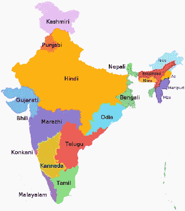
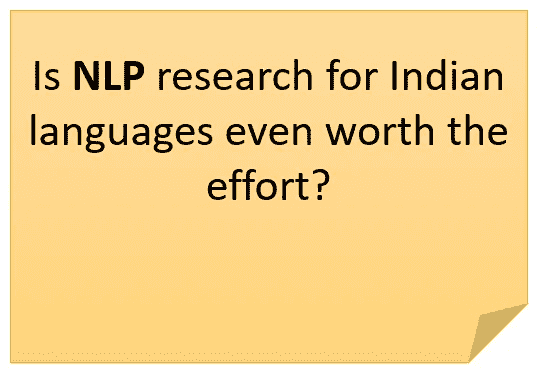
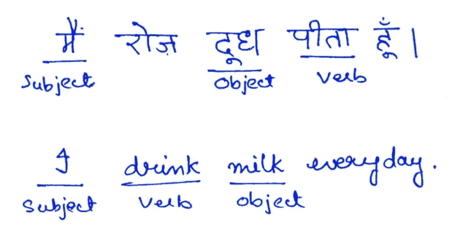
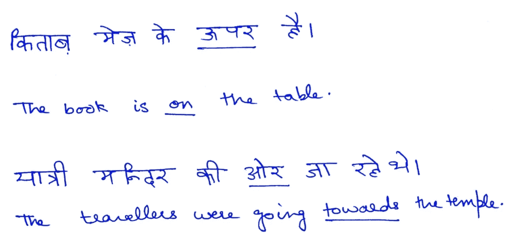
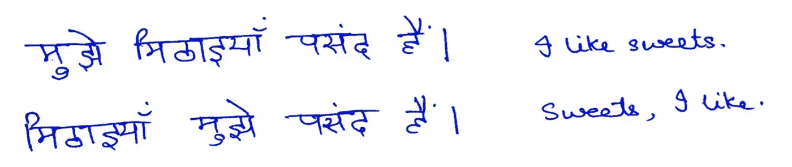
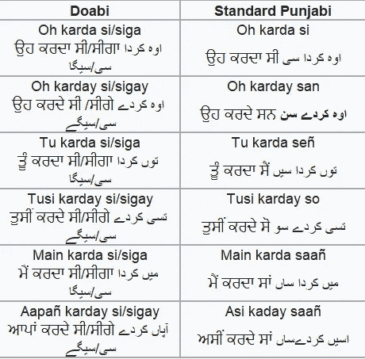
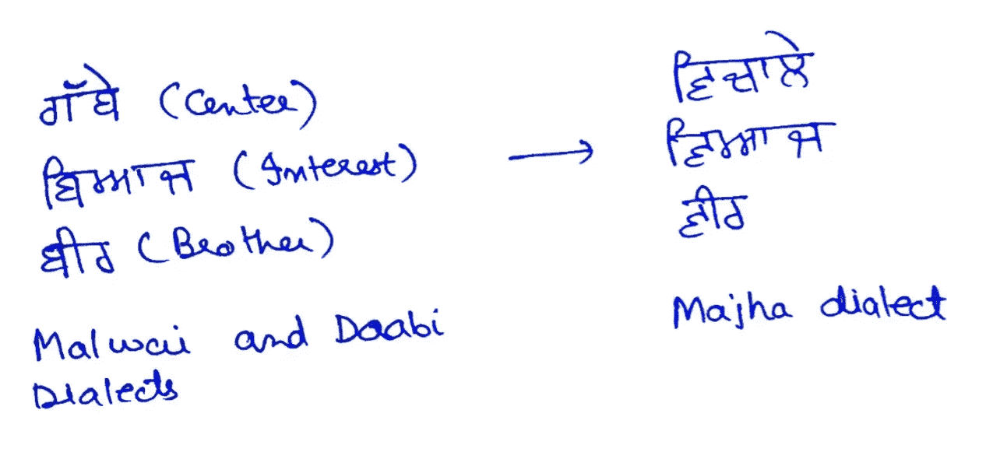
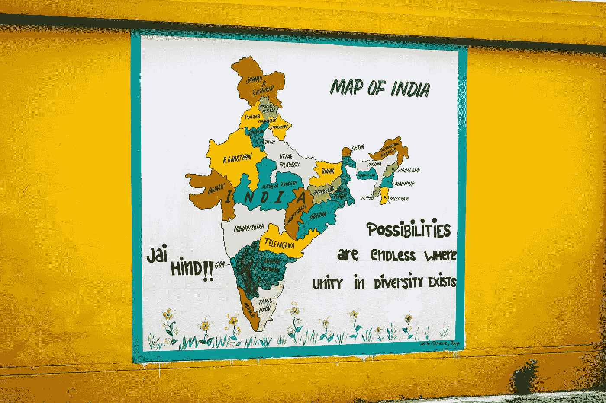

# 印度语言的自然语言处理

> 原文：<https://towardsdatascience.com/nlp-for-indian-languages-310d1d8a10b6?source=collection_archive---------11----------------------->

## 和我一起探索在印度本土语言环境中自然语言处理的需求、挑战和工具

# 需求

如果你正在阅读这篇文章，你很有可能已经掌握了相当不错的英语。如果你来自印度，也有可能英语不是你唯一知道的语言。大多数印度人会说多种语言💬在学校里学习不止一种语言。


由[杰基山·帕特尔](https://unsplash.com/@magictype?utm_source=medium&utm_medium=referral)在 [Unsplash](https://unsplash.com?utm_source=medium&utm_medium=referral) 上拍摄的照片

然而，你能猜出这个国家说英语的人的百分比吗？答案可能会让你大吃一惊。试一试！🏃



**图 1:** 印度母语人数的语言。信用: [Filpro](https://commons.wikimedia.org/wiki/User:Filpro) ，[维基百科](https://en.wikipedia.org/wiki/List_of_languages_by_number_of_native_speakers_in_India#/media/File:Language_region_maps_of_India.svg)

*印度说英语的比例是…* ***刚好 10%****【1】。那是十几亿人口的 10%！*

大多数印度人以印地语为第一语言，其次是马拉地语、泰卢固语、旁遮普语等。对于生活在农村社区的许多人来说，英语甚至不是他们能理解或说的语言。

*顺便提一下，要了解印度说英语的人口统计概况，请参考[2]。*

> 自然语言处理，通常简称为 NLP，是一个跨学科领域，处理计算机和人类之间使用自然语言的交互。
> 
> NLP 是一种让计算机以智能和有用的方式从人类语言中分析、理解和推导含义的方法。

既然印度的语言背景和 NLP 的目的已经很清楚了，让我们更深入地了解一下为什么这很重要。



有人可能认为熟悉计算机的人已经熟悉了英语界面。然而，值得注意的是，在印度的大多数印度人仍然生活在农村地区，那里的教学和学习将使用当地语言，那里的社区有文化，但仍然不熟悉英语。所以，是的，在印度提升 NLP 研究是值得的。[3]

如果不把印度的自然语言处理研究和应用提升到与英语等语言同等的水平，就无法实现无所不包的数字印度的梦想。

当使用智能手机时，语言障碍对许多人来说是一个巨大的障碍。

以长期以来被视为印度支柱的农民和农业为例。农民在养活这个国家方面显然起着重要的作用。帮助这些农民改进他们的方法(通过精准农业、农民帮助热线、聊天机器人等)一直是发展项目的目标，也是抗击全球饥饿的重要组成部分。但是许多小农场主不懂英语，这意味着他们很难分享和学习新的农业实践，因为大部分信息都是英语的。


即使我们的农民可以使用互联网或工具，如果他不能用母语与他们交流，他可能不知道如何使用它们。(照片由[南杜·库马尔](https://unsplash.com/@nandhukumarndd?utm_source=medium&utm_medium=referral)在 [Unsplash](https://unsplash.com?utm_source=medium&utm_medium=referral) 上拍摄)。)

*你能想象一个像谷歌助手一样，但却是为印度农民量身定制的移动应用吗？这将允许他们用自己的母语提问，系统将理解他们的查询并给出来自全球的相关信息🌏。*

您认为没有印度地区语言的自然语言处理，这可能吗？

这只是一个可能的使用案例。从*让信息更容易获取* **到** *了解农民自杀*【4】，NLP 扮演着巨大的角色。

***因此，很明显需要加强对印度语言的自然语言处理研究，这样那些不懂英语的人就可以真正意义上的“在线”，用他们的母语提问并得到答案。***

事实上， [AI4Bharat(一个加速印度人工智能创新的平台)的人非常恰当地总结了这种情况:](https://ai4bharat.org/articles/fonts-for-indian-scripts)

> 虽然印度有丰富的语言，但却缺乏这些语言的资源。

当我们看到 NLP 在印度的一些应用时，这种需求也变得很明显。

# 应用程序

它们是:

1.  印度智能手机用户在 2019 年突破 5 亿。企业感到有必要增加当地用户的参与度。NLP 在实现这一点上还有很长的路要走——通过提高搜索准确度(谷歌助手现在支持多种印度语言)、聊天机器人和虚拟代理等。
2.  NLP 在帮助残疾人方面有着巨大的应用——手语翻译、文本到语音、语音到文本等。
3.  印度手稿的数字化保存其中包含的知识。
4.  [从本地语言翻译招牌](https://ai4bharat.org/articles/sign-board)让旅行更便捷。
5.  [印度文字字体](https://ai4bharat.org/articles/fonts-for-indian-scripts)用于提高广告、招牌、演示、报告等的影响力/可读性。

还有很多。理想的情况是拥有和英语一样高质量的语料库和工具来支持这些领域的工作。

顺便说一下，人工智能(自然语言处理)越来越多地被用于像讲故事这样的创造性任务。已经有[人工智能故事生成器](https://nerdynav.com/sudowrite-review/)可以生成令人信服的英文故事情节。想象有一天，印度的孩子们可以玩这样的人工智能发电机，用印度方言创作故事！如今，我们还可以使用人工智能将文本的画外音添加到我们的视频中。

# 挑战

总的来说，有些问题会影响到自然语言处理，

*   不同层次的歧义——句法、语义、语音歧义等。
*   处理习语和隐喻。
*   处理情绪。
*   寻找[回指和下指](https://en.wikipedia.org/wiki/Anaphora_(linguistics))的指称对象。
*   [语用学](https://www.quora.com/What-is-pragmatic-analysis-in-NLP)中的理解话语与挑战。

但是，由于英语和印度语之间的差异，出现了一些问题。因此，它们是印度语言特有的。

```
Below an attempt has been made to gather information about work in NLP for specific regional languages. If you feel something is amiss or some work has not been properly credited, contact me via [email](mailto:singh.navkiran1515@gmail.com) and I'll fix it.
```

## **以印地语为例。它在几个方面不同于英语。**

这些差异包括:

1.在句子结构上，英语使用主语-动词-宾语语序，而印地语使用主语-宾语-动词。



**图 2:英文版 SOV** 订单 vs **SVO** 订单。

2.存在后置格标记而不是介词。



**图 2:** 印地语的后置格标记。

3.在许多印度语言中，单词可以自由移动而不改变意思。



**图 3:** 印地语句子中的动名词。

**处理印地语的问题:**

1.缺少带注释的语料库和工具。

2.缺乏教育和培训机构。

3.大量的形态变异。

与英语相比，学习印度语言 NLP 的在线资源是有限的。

## **旁遮普语特有的一些问题:**

1.大量的形态变体和词根复杂性。

2.旁遮普在旁遮普的不同地区有不同的方言，略有不同。这增加了预处理工作。

*   **Maajhi**——在阿姆利则、古尔达斯普尔和塔恩-塔恩地区使用
*   **马尔瓦伊** —巴丁达、帕蒂亚拉、菲罗兹布尔和莫加
*   Doabi——Jalandhar、Hoshiarpur 和 Nakodar



**图 3:** 不同的旁遮普方言。([来源](https://www.quora.com/What-are-some-differences-between-Doabi-and-Majhi-dialects-of-Punjabi))



**图 4:** 马尔瓦伊语、多比语和马杰哈语中不同的几个词的例子。有关详细信息，请参考[4]。

3.很难找到与特定地区相关的数据集。

4.理解旁遮普语中的讽刺。

5.理解诗歌。

像 Kaggle，UCI 机器学习库等可靠来源提供的许多数据集都是英文的。

有限的数据集、语料库和其他资源是一个巨大的障碍。只有一个停用词列表，总共有 184 个词，早在 2016 年就向公众发布了。更多细节参见[5]。

## 其他一些观察结果:

有趣的是，当我搜索泰卢固语 NLP 的资源时，我找到的最上面的 GitHub 结果是 [this](https://github.com/chsasank/telugu-nlp) ，并且在撰写本文时它已经 4 年了，没有更新。

然而，泰卢固语在 Kaggle 上确实有一个[数据集。还有一个泰米尔语的数据集。尽管如此，讨论和内核很少，似乎没有引起印度数据科学界的关注。](https://www.kaggle.com/sudalairajkumar/telugu-nlp)

## 许多问题是所有地区语言共有的，例如:

*   缺乏数据集/语料库。
*   缺乏统一的努力。
*   大量的形态变异。
*   缺乏标准。

更多细节参见[6]。

# **工具**

下面列出了我能找到的一些工具及其官方描述和文档链接。

```
My purpose is to include these for completeness. Their documentation is pretty informative and detailed with relevant usage examples. For api usage examples, it's best to refer to the source documentation, since it will always be up-to-date.Nonetheless, if more examples are needed, I’ll add them in a future update or a future post. Let me know if there's any other tool that should be mentioned here.
```

1.  [印度文自然语言程序库](https://github.com/anoopkunchukuttan/indic_nlp_library)

从官方描述来看:

```
The goal of the Indic NLP Library is to build Python based libraries for common text processing and Natural Language Processing in Indian languages. Indian languages share a lot of similarity in terms of script, phonology, language syntax, etc. and this library is an attempt to provide a general solution to very commonly required toolsets for Indian language text.The library provides the following functionalities:1\. Text Normalization
2\. Script Information
3\. Tokenization
4\. Word Segmentation
5\. Script Conversion
6\. Romanization
7\. Indicization
8\. Transliteration
9\. Translation
```

api 用法和示例请参考[官方文档](http://anoopkunchukuttan.github.io/indic_nlp_library/)。

2. [iNLTK](https://inltk.readthedocs.io/en/latest/)

```
iNLTK aims to provide out of the box support for various NLP tasks that an application developer might need.Supported languages at the time of writing:1\. Hindi  
2\. Punjabi 
3\. Sanskrit   
4\. Gujarati   
5\. Kannada  
6\. Malayalam   
7\. Nepali   
8\. Odia   
9\. Marathi   
10\. Bengali   
11\. Tamil  
12\. Urdu   
13\. English 
```

api 用法和示例请参考[官方文档](https://inltk.readthedocs.io/en/latest/index.html)。

3.Stanford NLP——尽管我在 Stanford CoreNLP(网站[链接](https://stanfordnlp.github.io/CoreNLP/human-languages.html#models-for-other-languages))上找不到印度语言的语言包，但我确实找到了一种可能的方法来使用它，请参考这里的。我个人没试过。

# **结论**

NLP 在印度的旅程似乎漫长而令人生畏，但正如一句著名的谚语所说:

> 千里之行始于足下！

好消息是，由于数百名研究人员、行业专家和学生的努力，我们在很短的时间内取得了重大进展。**NLP 在印度的前景似乎一片光明，应用前景无限。**



照片由 [Gayatri Malhotra](https://unsplash.com/@gmalhotra?utm_source=medium&utm_medium=referral) 在 [Unsplash](https://unsplash.com?utm_source=medium&utm_medium=referral) 上拍摄

但是，正如罗伯特·弗罗斯特在他的诗《雪夜林边驻足》中所写的，我们在睡觉前还有很长的路要走。

## 参考

[1] [印度的多语制，](https://en.wikipedia.org/wiki/Multilingualism_in_India)维基百科上根据[印度人口普查数据](https://web.archive.org/web/20191113211224/http://www.censusindia.gov.in/2011census/C-17.html) (2011)等来源汇编的统计数据。(2020 年 3 月 20 日访问)

[2] Rukmini S (2019)，[在印度，谁说英语，在哪里？](https://www.livemint.com/news/india/in-india-who-speaks-in-english-and-where-1557814101428.html)，Livemint。(2020 年 3 月 20 日访问)

[3]马达利、德维卡&帕特尔、酒窝。(2009).印度语言计算中的问题，特别是泰卢固语的搜索和检索。图书馆高科技。27.450–459.10.1108/07378830910988568.

[4]辛格，贾斯普里特&辛格，古尔文德&辛格，拉金德&辛格，普里特维帕尔。(2018).[使用深度学习分类的旁遮普语文本的形态评价和情感分析。沙特国王大学学报-计算机与信息科学。10.1016/j.jksuci.2018.04.003](https://www.researchgate.net/publication/324299203_Morphological_Evaluation_and_Sentiment_Analysis_of_Punjabi_Text_using_Deep_Learning_Classification)

[5] Kaur，Jasleen & Saini，Jatinderkumar。(2016).[旁遮普语停止词:一部古尔姆基语、沙赫姆基语和罗马脚本编年史。](https://www.researchgate.net/publication/305997227_Punjabi_Stop_Words_A_Gurmukhi_Shahmukhi_and_Roman_Scripted_Chronicle)32–37 岁。10.1145/2909067.2909073.

[6]c . Kurian 和 k . Kannan Balakrishnan，2008 年。印度自然语言处理的前景和挑战。在*关于“计算科学的最新趋势*的国际会议记录中。

您已到达终点！感谢您的阅读，祝您度过愉快的一天。😄我希望这些内容对你有用。

如果你有任何反馈💭或者注意到了错误，请留下评论。我想❤️to 听听你的想法。