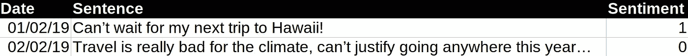
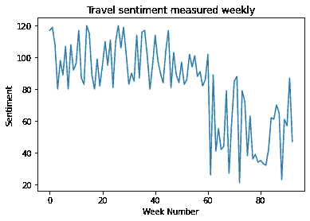

# 从时间序列的角度看 NLP

> 原文：<https://towardsdatascience.com/nlp-from-a-time-series-perspective-39c37bc18156?source=collection_archive---------24----------------------->

## 时间序列分析如何补充自然语言处理

来源:来自 [Pixabay](https://pixabay.com/photos/dictionary-focus-book-word-text-1149723/) 的[免费照片](https://pixabay.com/users/free-photos-242387/)

从表面上看，自然语言处理(NLP)和时间序列分析似乎没有太多的共同点。

在数据科学的背景下，分析文本的主要原因通常如下:

1.  **文本摘要**(即对文本进行摘要以便更好地理解)
2.  **文本分类**(例如，根据某些特征对文本进行分类，如检测垃圾邮件)
3.  **情感分析**(使用文本分类来确定特定群体对某个主题的情感，例如书评)
4.  **文本生成**(即使用机器学习技术生成特定主题的新文本)

# 当文本分类模型失败时

在这方面，我特别希望解决文本分类和情感分析的领域。

让我们考虑一个例子。假设有人在 2019 年建立了一个情绪分析模型，以衡量旅行情绪。数据可能来自各种社交网络，如 Twitter、Reddit 等。

尽管由于旅游对气候变化的影响存在一定程度的担忧，但人们对旅游的情绪可能仍然相当积极。

然而，2020 年对于旅行来说是一个非常不同的场景(或者说没有)，由于新冠肺炎疫情，航空乘客数量急剧下降。

因此，如果今天运行，任何根据 2019 年数据训练的情绪模型都可能表现很差。旅行限制、对病毒的恐惧和经济问题可能在任何用于训练文本分类模型以衡量旅行情绪的语料库中都没有得到充分的体现。此外，术语“新冠肺炎”在今年之前并不存在，并且文本分类模型不知道在旅行的上下文中将负面情绪分配给该术语。

# 时间序列分析的潜力

文本分类和情感分析技术是最近的创新。

因此，在很长一段时间内，即几年内，没有太多的空间来制定一个跟踪情绪的时间序列。然而，随着 NLP 技术现在变得越来越普遍，这种技术很可能从这里开始变得越来越普遍。

回到旅行的例子，假设我们有一个随时间整理的训练集，其中包含按日期排序的句子，这些句子表达了对旅行的特定情感。仅举两个例子:

来源:作者创建的图像和数据

现在，假设一个情绪分数是通过每周的所有个人分数相加计算出来的。以下时间序列仅仅是假设性的，但出于所有意图和目的，让我们假设从 2019 年初到现在的旅行情绪看起来像这样:

来源:作者创建的数据

在这个假设的例子中，在新冠肺炎到来之前，市场情绪总体上是积极的，尽管时间序列往往会伴随着不可避免的“波动和低谷”。

如上图所示，COVID 之后，旅游人气可能会比之前更加不稳定。有些人发誓在疫情完全被控制之前不进行任何形式的旅行，而有些人则选择在任何限制取消后立即旅行。

在现实世界中，用于情感模型的训练数据需要不断更新，以确保在所有单独的文本条目中准确地衡量情感。

然而，情感数据时间序列的公式不仅允许随着时间的推移跟踪这种情感，而且还可以与时间序列建模技术一起使用，以与预测常规时间序列相同的方式预测未来的情感。这可以通过传统的时间序列技术(如 ARIMA)或基于机器学习的技术(如 LSTM、CNN 等)来完成。

在旅游环境中，如果有足够的情绪数据，预测情绪趋势以确定旅游情绪何时会上升是可能的。这不一定是万无一失的，因为这个特殊的例子更依赖于新冠肺炎的结果，而不是从过去的趋势推断，但很可能是一种有用的分析形式。

事实上，考虑到 NLP 是一个相当新的研究领域，关于情感分析是否可能在某些时间序列领域中作为领先指标的问题仍然存在。

例如，假设在某个时间点，在社交媒体帖子中检测到股市的异常负面情绪。根据主要股票指数(如标准普尔 500)的价格变化，人们可以使用时间序列来验证情绪在股票价格波动中的作用。

股价是在负面情绪表达的那一刻下跌的——还是有一个小时左右的滞后？另一方面，在任何负面情绪通过社交媒体表达出来之前，市场调整了吗？

结合时间序列分析和 NLP 来回答这些问题，可以在确定情绪分析在金融市场中扮演的角色方面产生巨大的洞察力。

# 结论

作为一名时间序列专家，我的观点是 NLP 是一种很好的分析形式——但是当与时间序列技术结合时，它的潜力可以被完全释放。

为了充分理解情绪分析对某些业务领域的影响，我们还必须了解情绪如何随着时间的推移而变化，以及支撑这种变化的催化剂。

到目前为止，NLP 还是一个相当新的领域，这个领域还没有被充分开发。然而，我认为，如果正确使用，自然语言处理和时间序列分析可以证明是向前发展的杀手组合。

非常感谢您的阅读，您也可以在[michael-grogan.com](https://www.michael-grogan.com/)找到更多我的数据科学内容。

*免责声明:本文是在“原样”的基础上编写的，没有担保。它旨在提供数据科学概念的概述，不应以任何方式解释为专业、医疗或投资建议。*