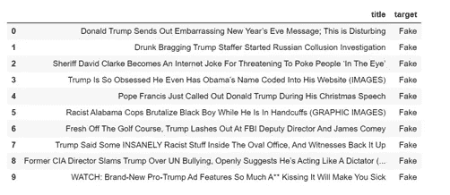
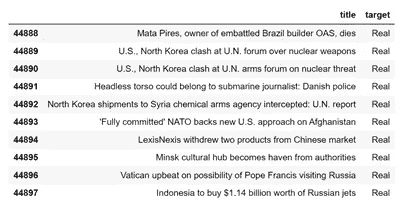
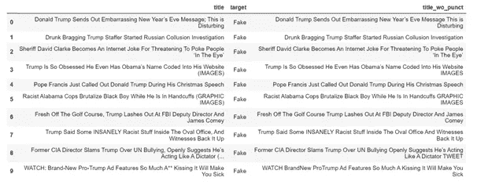
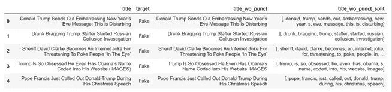
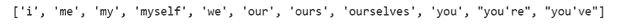
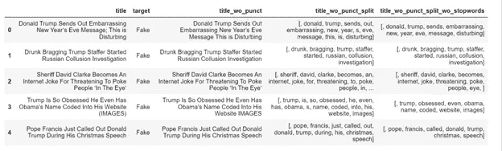
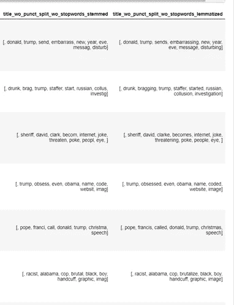

# Python 中的 NLP 数据清理

> 原文：<https://towardsdatascience.com/nlp-in-python-data-cleaning-6313a404a470?source=collection_archive---------6----------------------->

## 使用 Kaggle 的真实或虚假新闻数据集的典型 NLP 机器学习模型管道中涉及的数据清洗步骤。


来自 [Unsplash](https://unsplash.com/) 的 [Roman Kraft](https://unsplash.com/@romankraft) 的照片

在任何机器学习模型中，数据清洗都是非常关键的一步，但对于 NLP 来说更是如此。如果没有清理过程，数据集通常是计算机无法理解的一串单词。在这里，我们将回顾在典型的机器学习文本管道中完成的清理数据的步骤。

我们将使用一个将新闻分为真假的数据集。数据集可以在 Kaggle 上找到，数据集的链接在下面，

> [https://www . ka ggle . com/clmentbisaillon/fake-and-real-news-dataset](https://www.kaggle.com/clmentbisaillon/fake-and-real-news-dataset)

有两个数据集 Kaggle 数据集中的假新闻和真新闻。我把假新闻和真实新闻的数据集连接起来。十大真假新闻如下:

```
news.head(10)
```



10 条假新闻

```
news.tail(10)
```



10 条真实新闻

我们将通过几个步骤来清理新闻数据集，删除不必要的内容，并突出适合 ML 模型的关键属性。

**第一步:标点**

标题文本有几个标点符号。标点符号通常是不必要的，因为它不会增加 NLP 模型的价值或意义。“字符串”库有 32 个标点符号。标点符号是:

```
import string
string.punctuation
```


字符串库中的标点符号

要删除数据集中的标点符号，让我们创建一个函数并将该函数应用于数据集:

```
def remove_punctuation(text):
    no_punct=[words for words in text if words not in string.punctation]
    words_wo_punct=''.join(no_punct)
    return words_wo_punctnews['title_wo_punct']=news['title'].apply(lambda x: remove_punctuation(x))
news.head()
```



新闻数据集(包括标题，不带标点符号)

步骤 1 之后的列已经从标题文本中删除了标点符号。

**步骤 2:标记化**

标记化是将字符串拆分成单词列表的过程。我们将利用正则表达式或正则表达式来进行拆分。正则表达式可以用来描述一个搜索模式。

```
def tokenize(text):
    split=re.split("\W+",text) 
    return split
news['title_wo_punct_split']=news['title_wo_punct'].apply(lambda x: tokenize(x.lower()))
news.head()
```

这里，“\W+”拆分一个或多个非单词字符



新闻数据集(包括标题，不带标点和拆分)

步骤 2 之后的列通过拆分所有非单词字符创建了一个列表。

**第三步:停用词**

现在，我们有一个没有任何标点符号的单词列表。让我们继续并删除停用词。停用词是不相关的词，无助于识别文本的真伪。我们将对停用词使用“nltk”库，该库中的停用词包括:

```
stopword = nltk.corpus.stopwords.words('english')
print(stopword[:11])
```



这个库中有 179 个停用词。

```
def remove_stopwords(text):
    text=[word for word in text if word not in stopword]
    return text
news['title_wo_punct_split_wo_stopwords'] = news['title_wo_punct_split'].apply(lambda x: remove_stopwords(x))
news.head()
```



新闻数据集(包括标题，不带标点，不带停用词和拆分)

步骤 3 之后的列已经删除了不必要的停用词。

**第四步:词尾/词干**

词干化和词尾化是将一个单词简化为其词根形式的过程。主要目的是减少同一个单词的变化，从而减少模型中包含的单词集。词干化和词汇化的区别在于，词干化会去掉单词的末尾，而不考虑单词的上下文。然而，词汇化考虑单词的上下文，并根据字典定义将单词缩短为其词根形式。与词干化相比，词干化是一个更快的过程。因此，这是速度和准确性之间的权衡。

让我们以“信念”这个词为例。相信的不同变体可以是相信、被相信、相信和相信。

```
print(ps.stem('believe'))
print(ps.stem('believing'))
print(ps.stem('believed'))
print(ps.stem('believes'))
```

以上所有的 stem 结果是**相信**

```
print(wn.lemmatize(“believe”))
print(wn.lemmatize(“believing”))
print(wn.lemmatize(“believed”))
print(wn.lemmatize(“believes”))
```

按照书面陈述的顺序，词汇化结果是——相信、相信、相信和相信。

如果单词不在语料库中，Lemmatize 会产生相同的结果。Believe 被词条化为 belief(词根)



新闻数据集(词汇化与词干化)

如上图所示，lemmatize 和 stem 产生不同的结果。我们可以为我们的最终模型选择任何一个。

**第五步:其他步骤**

可以基于该数据执行其他清洁步骤。我在下面列出了其中的一些，

1.  删除 URL
2.  删除 HTML 标签
3.  移除表情符号
4.  删除号码

…

我很想听听你对我的文章的想法和反馈。请在下面的评论区留下它们。