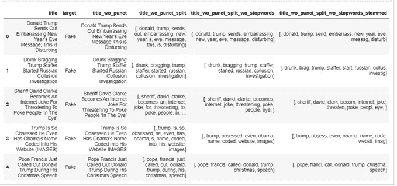
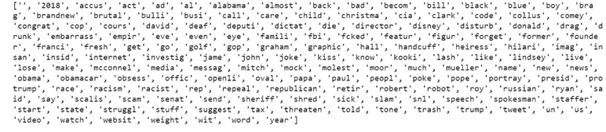
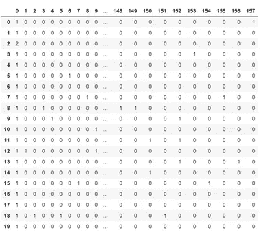
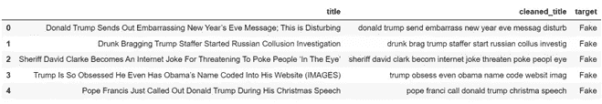
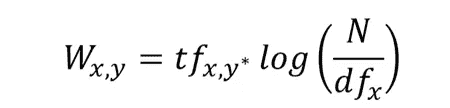

# Python 中的 NLP 矢量化

> 原文：<https://towardsdatascience.com/nlp-in-python-vectorizing-a2b4fc1a339e?source=collection_archive---------20----------------------->

## 在典型的 NLP 机器学习模型管道中使用的常见矢量化技术，使用来自 Kaggle 的真实假新闻数据集。


来自 [Unsplash](https://unsplash.com/) 的 [Roman Kraft](https://unsplash.com/@romankraft) 的照片

在本文中，我们将学习矢量化以及 NLP 模型中采用的不同矢量化技术。然后，我们将把这些概念应用到一个问题的上下文中。

我们将使用一个将新闻分为真假的数据集。该数据集可在 Kaggle 上获得，数据集的链接如下:

> [https://www . ka ggle . com/clmentbisaillon/fake-and-real-news-dataset](https://www.kaggle.com/clmentbisaillon/fake-and-real-news-dataset)

典型的机器学习文本管道的第一步是数据清理。这一步在以前的文章中有详细介绍，链接如下:

[](/nlp-in-python-data-cleaning-6313a404a470) [## Python 中的 NLP 数据清理

### 使用真实或虚假新闻数据集的典型 NLP 机器学习模型管道中涉及的数据清洗步骤…

towardsdatascience.com](/nlp-in-python-data-cleaning-6313a404a470) 

数据清理后的数据集

原始新闻标题被转换成一种干净的格式，只包含基本信息(上图的最后一栏)。下一步是将清洗后的文本进一步转化为机器学习模型可以理解的形式。这个过程被称为向量化。在我们的上下文中，每个新闻标题都被转换成一个代表该特定标题的数字向量。有许多矢量化技术，但在本文中，我们将重点介绍三种广泛使用的矢量化技术——计数矢量化、N-Grams、TF-IDF，以及它们在 Python 中的实现。

1.  **计数矢量化**

如上所述，矢量化是将文本转换为矩阵形式的数字条目的过程。在计数矢量化技术中，生成文档术语矩阵，其中每个单元是对应于新闻标题的计数，指示单词在文档中出现的次数，也称为术语频率。**文档术语矩阵**是一组虚拟变量，指示特定单词是否出现在文档中。语料库中的每个单词都有一个专栏。该计数与新闻标题类别的相关性成正比。这意味着，如果一个特定的词在假新闻标题或真实新闻标题中出现多次，那么该特定的词具有确定该新闻标题是假还是真的高预测能力。

```
def clean_title(text):
   text = "".join([word.lower() for word in text if word not in            string.punctuation])
   title = re.split('\W+', text)
   text = [ps.stem(word) for word in title if word not in nltk.corpus.stopwords.words('english')]
   return text
count_vectorize = CountVectorizer(analyzer=clean_title) 
vectorized = count_vectorize.fit_transform(news['title'])
```

剖析上面的代码，函数“clean _ title”——连接小写的新闻标题，不加标点。然后，在任何非单词字符上拆分文本。最后，对不间断单词进行词干分析，并以列表的形式呈现出来。这篇[文章](https://medium.com/@divyar2630)中给出了清洁过程的详细描述。

接下来，我们使用了 sklearn 库中 sk learn . feature _ extraction . text 下的“计数矢量器”包。默认值和定义可在 scikit-learn — [计数矢量器](https://scikit-learn.org/stable/modules/generated/sklearn.feature_extraction.text.CountVectorizer.html)文档中找到。在上面的代码中，我们实例化了计数矢量器并定义了一个参数— **分析器**。其他参数是它的默认值。分析器参数调用一个字符串，我们传递了一个函数，它接收原始文本并返回一个干净的字符串。

文档术语矩阵的形状是 44898，15824。共有 44898 个新闻标题，所有标题中有 15824 个独特的词。



新闻标题中 15824 个唯一单词的子集

矢量器产生稀疏矩阵输出，如图所示。为了节省空间，只存储非零值的位置。因此，矢量化的输出如下所示:

```
<20x158 sparse matrix of type '<class 'numpy.int64'>'
	with 206 stored elements in Compressed Sparse Row format>
```

但是，将上述内容转换为数组形式会产生以下结果:



如图所示，大多数单元格包含 0 值，这被称为**稀疏矩阵**。许多矢量化输出看起来与此类似，因为许多标题自然不会包含特定的单词。

2. **N-Grams**

与计数向量化技术类似，在 N 元语法方法中，生成一个文档术语矩阵，每个单元代表一个计数。N-grams 方法的区别在于，计数表示标题中长度为 N 的相邻单词的组合。计数矢量化是 N 元语法，其中 n=1。比如“我爱这篇文章”有四个字，n=4。

如果 n=2，即 bigram，那么列将是— [“我爱”，“爱这个”，“这篇文章”]

如果 n=3，即三元组，那么列将是— [“我喜欢这个”，“喜欢这篇文章”]

如果 n=4，即 4 克，那么列应该是-['“我喜欢这篇文章”]

基于性能选择 n 值。

对于 python 代码，清理过程的执行类似于计数矢量化技术，但单词不是以标记化列表的形式。将标记化的单词连接起来形成一个字符串，因此可以将相邻的单词聚集在一起以有效地执行 N 元语法。

清理后的标题文本如下所示:



剩下的矢量化技术与我们上面使用的计数矢量化方法相同。

权衡是在 N 个值之间进行的。选择较小的 N 值可能不足以提供最有用的信息。而选择一个高的 N 值，将产生一个具有大量特征的巨大矩阵。N-gram 可能很强大，但是需要多一点小心。

**3。术语频率-逆文档频率(TF-IDF)**

与计数矢量化方法类似，在 TF-IDF 方法中，生成一个文档术语矩阵，每一列代表一个唯一的单词。TF-IDF 方法的不同之处在于，每个单元格都不表示词频，但是单元格值表示一个权重，它突出了特定单词对文档的重要性。

TF-IDF 公式:



等式的第二项有助于抽出生僻字。那是什么意思？如果一个单词在许多文档中多次出现，那么分母 df 将增加，从而减少第二个词的值。词频或 tf 是一个词(x)在文档(y)中出现的次数除以 y 中总字数的百分比。

对于 python 代码，我们将使用与计数矢量器方法相同的清理过程。Sklearn 的 TfidfVectorizer 可以用于 Python 中的矢量化部分。


该方法的稀疏矩阵输出显示代表文档中单词权重的小数。高权重意味着该单词在几个文档中出现多次，低权重意味着该单词在许多文档中出现的次数较少或者在多个文档中重复出现。

**总结思路**

选择矢量化方法没有经验法则。我经常根据手头的业务问题做出决定。如果没有限制，我经常从最简单的方法开始(通常是最快的)。

…

我很想听听你对我的文章的想法和反馈。请在下面的评论区留下它们。